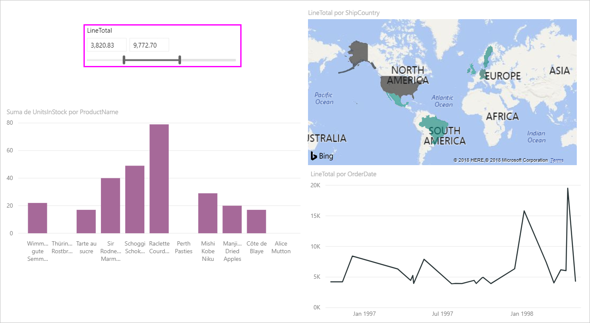
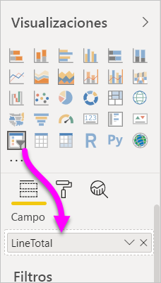
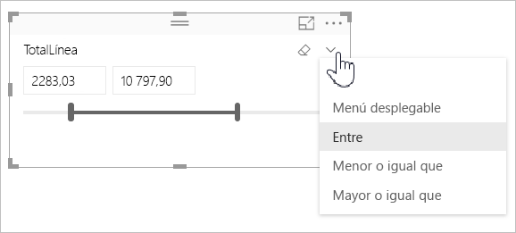
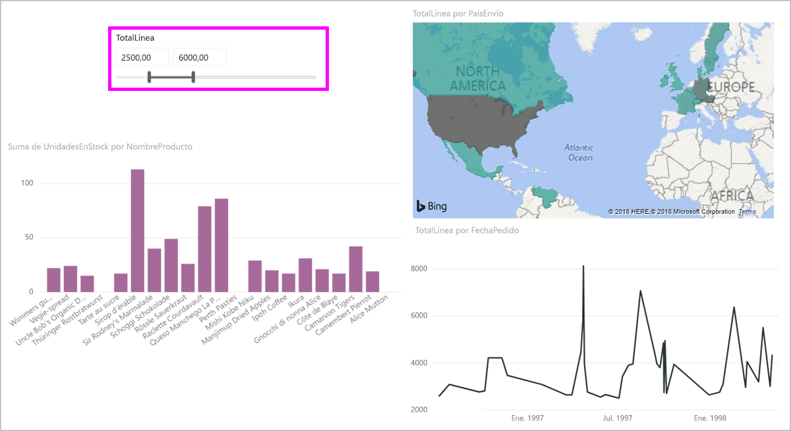
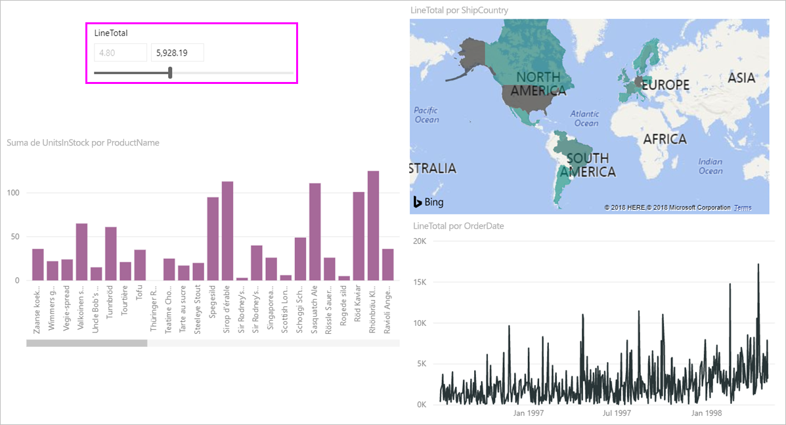
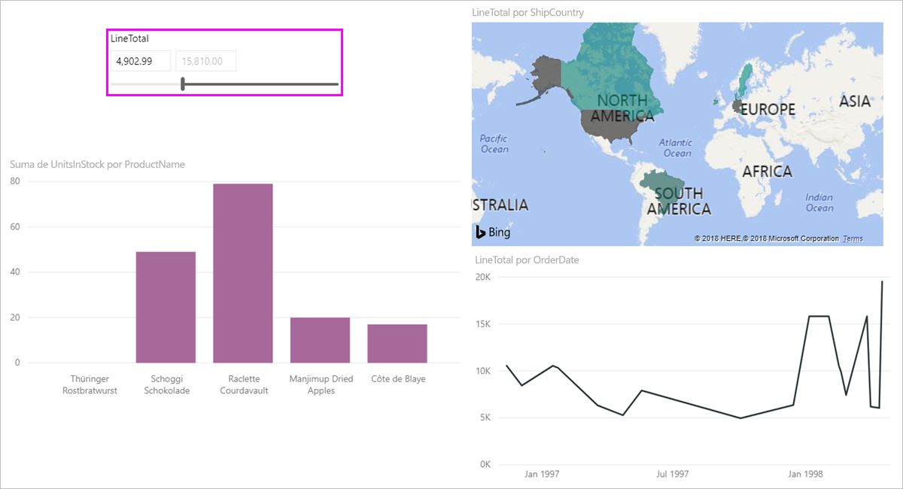

# Uso de la segmentación de intervalos numéricos en Power BI Desktop
Gracias a la **segmentación de intervalos numéricos**, puede aplicar todo tipo de filtros a cualquier columna numérica del modelo de datos. Puede filtrar **entre** números, o por un número **menor o igual que** o **mayor o igual que** otro número. Aunque esto puede parecer demasiado simple, es una manera muy eficaz de filtrar los datos.

## Uso de la segmentación de intervalos numéricos
Puede usar la segmentación de intervalos numéricos igual que cualquier otra segmentación de datos. Solo tiene que crear un objeto visual de **segmentación** para el informe y, a continuación, seleccionar un valor numérico para el valor **Campo**. En la imagen siguiente, se ha seleccionado el campo *LineTotal*.

Seleccione el vínculo de flecha abajo en la esquina superior derecha de la **segmentación de intervalos numéricos** y aparecerá un menú.

Para el intervalo numérico, puede seleccionar entre las siguientes tres opciones:

* Entre
* Menor o igual que
* Mayor o igual que

Cuando se selecciona **Entre** en el menú, aparece un control deslizante y puede filtrar por los valores numéricos que se encuentran entre los números seleccionados. Además de utilizar la propia barra deslizante, también puede hacer clic en cualquiera de los cuadros y escribir los valores. Esto resulta útil cuando quiere segmentar en números específicos, pero la precisión a la hora de mover la barra de segmentación de datos hace que sea difícil elegir exactamente el número deseado.

En la imagen siguiente, la página de informe se filtra por los valores *LineTotal* comprendidos entre 2500,00 y 6000,00.

Cuando se selecciona **Menor o igual que**, desaparece el controlador de la izquierda (el valor inferior) de la barra deslizante y podemos ajustar solo el límite superior de la barra. En la imagen siguiente, la barra deslizante se establece en un máximo de 5928,19.

Por último, si se selecciona **Mayor o igual que**, desaparecerá el control de la barra deslizante de la derecha (el del valor más alto) y solo podremos ajustar el valor inferior, tal como se muestra en la siguiente imagen. Ahora solo aquellos elementos con un valor de *LineTotal* mayor o igual que 4902,99 aparecerán en los objetos visuales de la página de informe.

## Ajuste a números enteros con la segmentación de intervalos numéricos

Una segmentación de intervalos numéricos se ajustará a números enteros, a menos que sea un intervalo decimal. Esto permite que la segmentación se alinee limpiamente con números enteros. 

## Limitaciones y consideraciones
Las siguientes limitaciones y consideraciones se aplican actualmente a la **segmentación de intervalos numéricos**:

* Actualmente, la **segmentación de intervalos numéricos** filtra todas las filas subyacentes de los datos, pero no los valores agregados. Por ejemplo, si se usa un campo *Sales Amount*, se podría filtrar cada transacción basada en *Sales Amount* pero no la suma de *Sales Amount* de cada punto de datos de un objeto visual.
* Actualmente no funciona con medidas.
