# Ordenar por columnas en Power BI Desktop
En **Power BI Desktop** y en el **servicio Power BI**, puede cambiar el aspecto de un objeto visual al ordenar por campos de datos diferentes. Al cambiar cómo se ordena un objeto visual, puede resaltar la información que quiere transmitir y asegurarse de que el objeto visual refleja la tendencia (o énfasis).

Independientemente de si usa datos numéricos (como cifras de ventas) o datos de texto (como nombres de estado), puede ordenar sus visualizaciones de la forma que quiera y proporcionarles el aspecto que quiere que tengan.  **Power BI** proporciona mucha flexibilidad para la ordenación y menús rápidos para que se puedan usar. En cualquier objeto visual, seleccione el menú del botón de puntos suspensivos (...) y, después, seleccione el campo por el que quiere ordenar, tal como se muestra en la siguiente imagen.

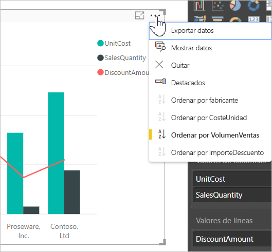

## Mayor profundidad y un ejemplo
Tomemos un ejemplo que tiene más de profundidad y veamos cómo funciona en **Power BI Desktop**.

En esta visualización se muestran los costos, las cantidades y los importes por nombre de fabricante. Este es el aspecto de la visualización antes de realizar cualquier tipo de ordenación.

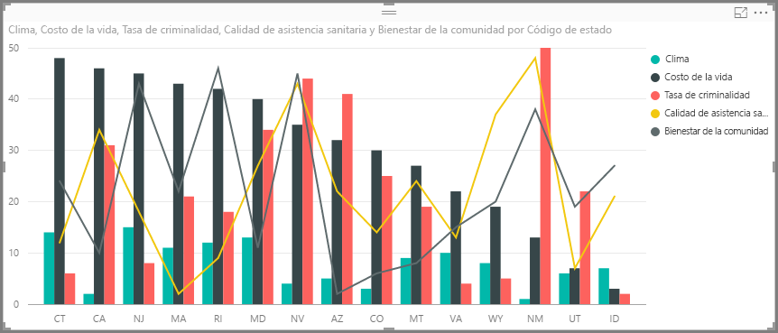

Actualmente, el objeto visual se ordena por **SalesQuantity**. Podemos explicarlo haciendo coincidir el color de las barras descendentes con la leyenda, pero existe una forma mejor de determinar la columna de ordenación actual: el menú de puntos suspensivos (...) de la esquina superior derecha del objeto visual. Al seleccionar los puntos suspensivos, vemos lo siguiente:

* El campo de ordenación actual es **SalesQuantity**, indicado por el hecho de que **Ordenar por SalesQuantity** está en negrita y tiene una barra amarilla. 

* La dirección de ordenación actual es de menor a mayor, como se muestra en el pequeño icono **A/Z** (de la A a la Z) y una flecha hacia abajo.

Trataremos el campo de ordenación y la dirección de forma independiente en las dos secciones siguientes.

## Selección de la columna que se va a usar para la ordenación
La barra amarilla junto a **Ordenar por SalesQuantity** en el menú **Más opciones** indica que el objeto visual se ordena por la columna **SalesQuantity**. Ordenar por otra columna es fácil (solo tiene que seleccionar los puntos suspensivos para mostrar el menú y, después, seleccionar otra columna).

En esta imagen hemos seleccionado *DiscountAmount* para ordenar por esta columna. Esa columna resulta ser una de las líneas en el objeto visual, en lugar de una de las barras. Este es su aspecto una vez que hemos seleccionado **Ordenar por DiscountAmount**.

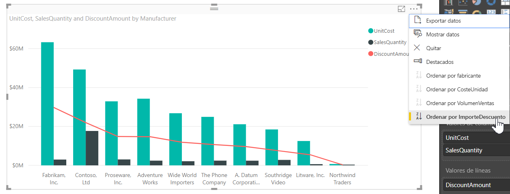

Observe cómo ha cambiado el objeto visual. Ahora, los valores se ordenan del valor más alto de DiscountAmount, que en este objeto visual es Fabrikam Inc., hasta el valor más bajo, Northwind Traders. 

Pero, ¿qué ocurre si queremos ordenar de forma ascendente en lugar de hacerlo de forma descendente? En la sección siguiente se muestra lo fácil que es.

## Selección del criterio de ordenación (de menor a mayor y viceversa)
Si analizamos detenidamente el menú **Opciones** de la imagen anterior, vemos que el icono situado junto a **Ordenar por DiscountAmount** muestra **Z/A** (de la Z a la A). Eche un vistazo:

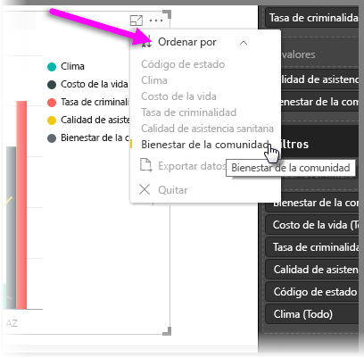

Cuando aparece **Z/A**, significa que el objeto visual se ordena por la columna seleccionada de valor mayor a valor menor. ¿Quiere cambiar esto? No hay problema, solo tiene que pulsar o hacer clic en ese icono **Z/A** y el criterio de ordenación cambia a **A/Z** y se ordena el objeto visual (en función de la columna seleccionada) de valor menor a valor mayor.

Este es el mismo objeto visual, esta vez después de pulsar en el icono **Z/A** del menú **Ordenar por DiscountAmount** para cambiar su ordenación. Observe que Northwind Traders es ahora el primer fabricante de la lista y Fabrikam Inc. es el último (el orden opuesto al anterior).

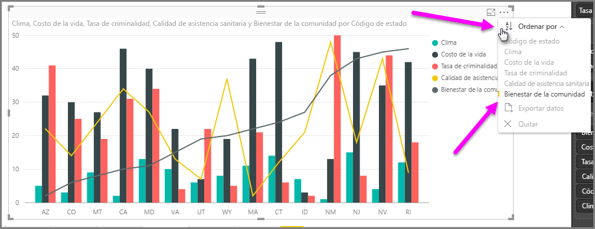

Puede ordenar por cualquier columna incluida en el objeto visual. Podríamos seleccionar SalesQuantity como la columna por la que queremos ordenar y seleccionar **Ordenar por SalesQuantity** para mostrar primero los fabricantes con más ventas y seguir conservando las otras columnas en el objeto visual, independientemente de cómo se apliquen a ese fabricante. A continuación, se muestra el objeto visual con esa configuración.

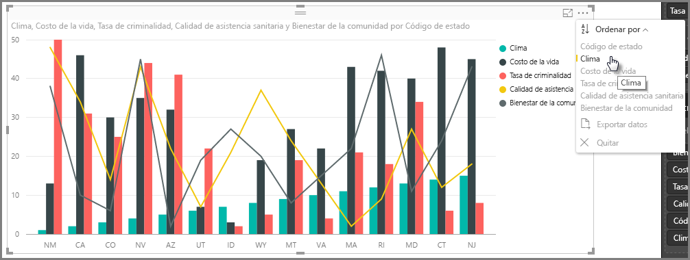

## Ordenación con el botón Ordenar por columna
Hay otra forma de ordenar los datos, y es con el botón **Ordenar por columna** de la cinta de opciones **Modelado**.

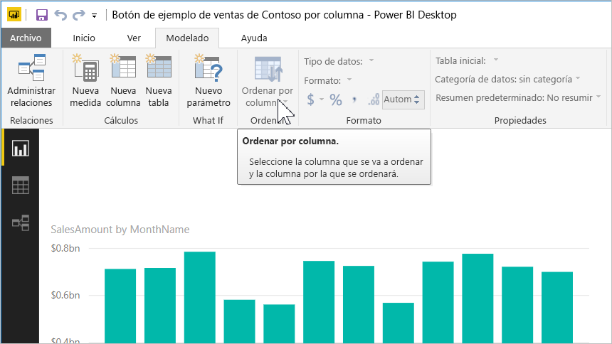

En este método de ordenación se debe seleccionar una columna en el panel **Campos** y, a continuación, seleccionar el botón **Ordenar por columna** para elegir cómo (por qué columna) desea ordenar el objeto visual. Debe seleccionar la columna (campo) por la que desea ordenar en el panel **Campos** para habilitar el botón **Ordenar por columna**; en caso contrario, el botón está inactivo.

Veamos un ejemplo habitual: tiene datos de cada mes del año y quiere ordenarlos cronológicamente. Los pasos siguientes muestran cómo.

1. En primer lugar, tenga en cuenta que el objeto visual está seleccionado pero no hay ninguna columna seleccionada en el panel **Campos** y el botón **Ordenar por columna** está inactivo (atenuado).
   
   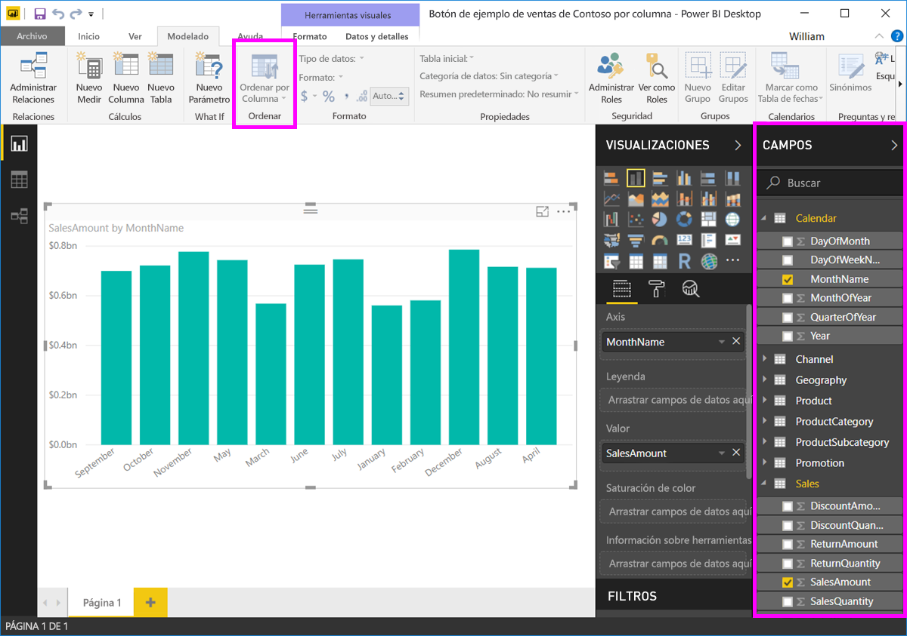

2. Cuando se selecciona la columna por la que se desea ordenar, en el panel **Campos**, el botón **Ordenar por columna** se activa.
   
   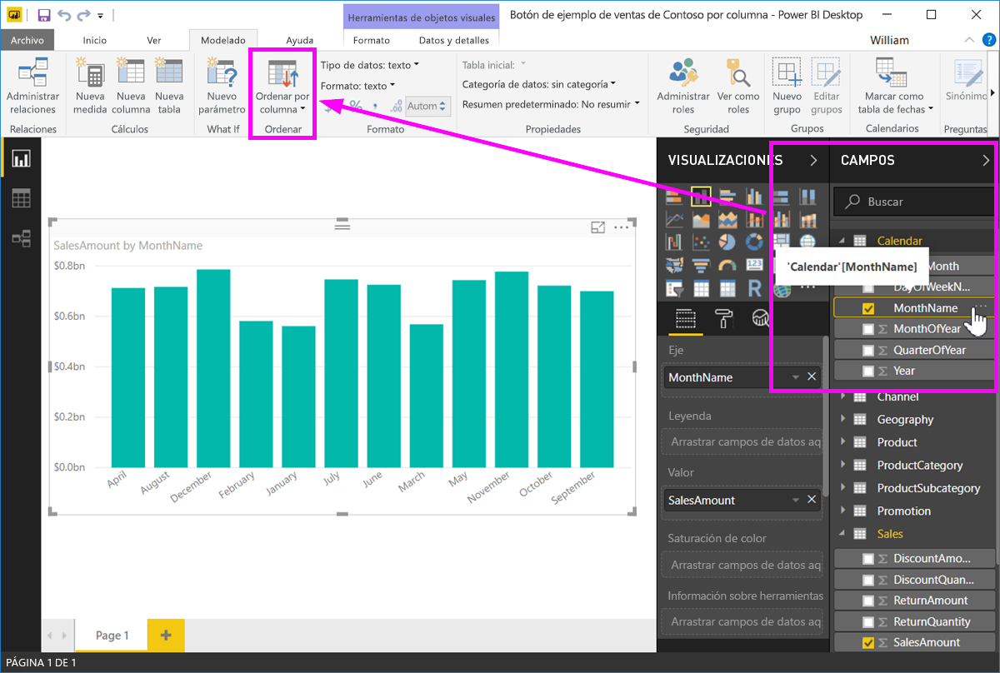
3. Con el objeto visual seleccionado, podemos seleccionar *MonthOfYear*, en lugar del valor predeterminado (*MonthName*), y el objeto visual se ordena en el orden que queremos: por mes del año.
   
   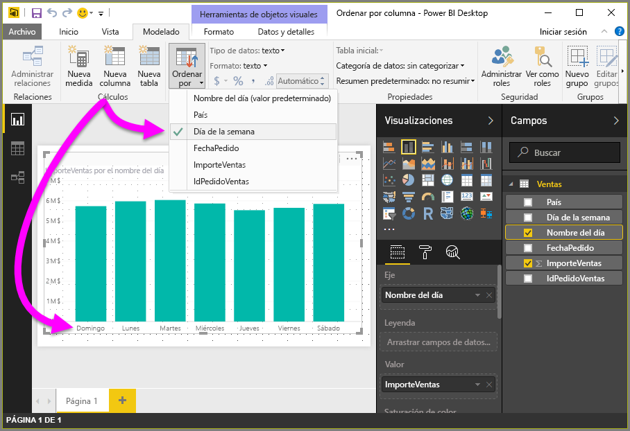

Y ya está. Recuerde que debe seleccionar una columna en el panel **Campos** para que el botón **Ordenar por columna** se active.

## Vuelta a la columna predeterminada para la ordenación
Puede ordenar por cualquier columna que desee, pero puede haber ocasiones en las que quiera que el objeto visual vuelva a su columna de ordenación predeterminada. No hay problema. Para un objeto visual con una columna de ordenación seleccionada (una columna de ordenación seleccionada tiene a su lado una barra amarilla en el menú de puntos suspensivos, como hemos visto), basta con que abra el menú **Más opciones** y seleccione esa columna de nuevo para que la visualización vuelva a su columna de ordenación predeterminada.

Por ejemplo, este es nuestro gráfico anterior:

Al volver al menú y seleccionar **SalesQuantity** de nuevo, el objeto visual se ordena alfabéticamente por **Fabricante** de forma predeterminada, como se muestra en esta siguiente.

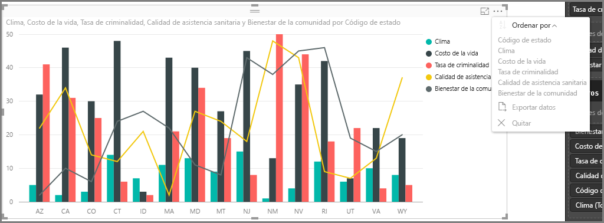

Con tantas opciones para ordenar sus objetos visuales, es fácil crear justo el gráfico o la imagen que quiere.

