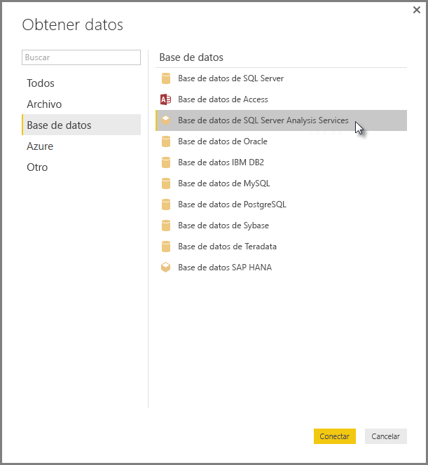

# Conexión a modelos SSAS multidimensionales en Power BI Desktop

Con Power BI Desktop, ahora puede acceder a *modelos SSAS multidimensionales*, que suelen denominarse *SSAS MD*.

Para conectarse a una base de datos SSAS MD, seleccione **Obtener datos**, elija **Base de datos** > **Base de datos de SQL Server Analysis Services** y, después, seleccione **Conectar**:

Los servicios Power BI y Power BI Desktop admiten modelos SSAS multidimensionales en modo de conexión dinámica. Puede publicar y cargar informes que empleen **modelos SSAS multidimensionales** en el modo de conexión dinámica en el servicio Power BI.

## Funcionalidades y características de SSAS MD

Las secciones siguientes describen las características y funcionalidades de las conexiones de Power BI y SSAS MD.

### Metadatos tabulares de modelos multidimensionales

La siguiente tabla muestra la correspondencia entre los objetos multidimensionales y los metadatos tabulares que se devuelven a Power BI Desktop. Power BI consulta el modelo en busca de metadatos tabulares. En función de los metadatos devueltos, Power BI Desktop ejecuta las consultas DAX adecuadas en SSAS al crear una visualización, como una tabla, una matriz, un gráfico o una segmentación de datos.

| Objeto multidimensional BISM | Metadatos tabulares |
| --- | --- |
| Cubo |Modelo |
| Dimensión de cubo |Tabla |
| Atributos de dimensión (Claves), nombre |Columnas |
| Grupo de medida |Tabla |
| Medida |Medida |
| Medidas sin grupo de medida asociado |En la tabla llamada *Medidas* |
| Grupo de medida -> Relación de dimensión de cubo |Relación |
| Perspectiva |Perspectiva |
| KPI |KPI |
| Jerarquías de usuarios, elementos primarios y secundarios |Jerarquías |

### Medidas, grupos de medida y KPI

Los grupos de medida de un cubo multidimensional se exponen como tablas con la letra griega sigma (∑) junto a ellos en el panel **Campos**. La medidas calculadas sin un grupo de medida asociado se agrupan en una tabla especial llamada *Medidas* en los metadatos tabulares.

Para ayudar a simplificar modelos complejos, en un modelo multidimensional, puede definir un conjunto de medidas o KPI en un cubo que se ubicará dentro de una *Carpeta para mostrar*. Power BI reconoce las carpetas para mostrar en los metadatos tabulares y muestra las medidas y los KPI dentro de las carpetas para mostrar. En las bases de datos multidimensionales, los KPI admiten los atributos *Value*, *Goal*, *Status Graphic* y *Trend Graphic*.

### Tipos de atributos de dimensión

Los modelos multidimensionales también permiten asociar atributos de dimensión con tipos de atributo de dimensión específicos. Por ejemplo, una dimensión **Geography** cuyos atributos de dimensión *City*, *State-Province*, *Country* y *Postal Code* tienen asociados los tipos de geografía adecuados, se exponen en los metadatos tabulares. Power BI reconoce los metadatos, lo que permite crear visualizaciones de mapas. Reconocerá estas asociaciones por el icono *mapa* situado junto al elemento en el panel **Campo** en Power BI.

Power BI también puede representar imágenes cuando se proporciona un campo que contiene las direcciones URL (localizador uniforme de recursos) de las imágenes. Se pueden especificar estos campos como tipos de *ImageURL* en SQL Server Data Tools (o, después, en Power BI). A continuación, se proporciona su información de tipo a Power BI en los metadatos tabulares. Seguidamente, Power BI puede recuperar las imágenes de la dirección URL y mostrarlas en objetos visuales.

### Jerarquías de elementos primarios y secundarios

Los modelos multidimensionales admiten jerarquías de elementos primarios y secundarios, que se presentan como una *jerarquía* en los metadatos tabulares. Cada nivel de la jerarquía de elementos primarios y secundarios se expone como una columna oculta en los metadatos tabulares. El atributo clave de la dimensión de los elementos primarios y secundarios no se expone en los metadatos tabulares.

### Miembros calculados de dimensión

Los modelos multidimensionales permiten crear varios tipos de *miembros calculados*. Los dos tipos de miembros calculados más comunes son los siguientes:

* Miembros calculados en jerarquías de atributos que no son del mismo nivel que *Todos*
* Miembros calculados en jerarquías de usuarios

Los modelos multidimensionales exponen *miembros calculados en jerarquías de atributos* como valores de una columna. Existen algunas opciones y restricciones adicionales si se expone este tipo de miembro calculado:

* El atributo de dimensión puede tener un valor *UnknownMember* opcional.

* Un atributo que contenga miembros calculados no puede ser el atributo clave de la dimensión, a menos que sea el único atributo de la dimensión.

* Un atributo que contenga miembros calculados no puede ser un atributo de los elementos primarios y secundarios.

Los miembros calculados de las jerarquías de usuarios no se exponen en Power BI. En lugar de eso, puede conectarse a un cubo que contenga miembros calculados en jerarquías de usuarios. Sin embargo, no podrá ver los miembros calculados si no cumplen las restricciones mencionadas en la lista con viñetas anterior.

### Seguridad

Los modelos multidimensionales admiten la seguridad en el nivel de celdas y dimensiones mediante *roles*. Cuando se conecte a un cubo con Power BI, se autenticarán y evaluarán los permisos adecuados. Si un usuario tiene aplicada *seguridad de dimensión*, este no verá los miembros de dimensión correspondientes en Power BI. Sin embargo, si un usuario tiene definido un permiso de *seguridad de celda*, que restringe ciertas celdas, no podrá conectarse al cubo mediante Power BI.

## Consideraciones y limitaciones

Existen ciertas limitaciones en el uso de SSAS MD:

* Solo las ediciones Enterprise y BI de SQL Server 2014 admiten las conexiones dinámicas. En el caso de la edición estándar de SQL Server, se necesita SQL Server 2016 u otra posterior para las conexiones dinámicas.

* Las *acciones* y los *conjuntos con nombre* no se exponen en Power BI. Para crear objetos visuales e informes, puede conectarse a los cubos que también contengan acciones o conjuntos con nombre.

* Cuando Power BI muestra los metadatos de un modelo SSAS, en ocasiones no se pueden recuperar los datos del modelo. Este escenario puede producirse si se ha instalado la versión de 32 bits del proveedor MSOLAP, pero no la de 64 bits. El problema debería resolverse instalando la versión de 64 bits.

* No puede crear medidas de *nivel de informe* al crear un informe conectado en directo a un modelo multidimensional SSAS. Las únicas medidas que están disponibles son las que se definen en el modelo MD.

## Características de SSAS MD admitidas en Power BI Desktop

En esta versión de SSAS MD se admite el consumo de los siguientes elementos. Para obtener más información sobre estas características, vea [Descripción de Power View para modelos multidimensionales](/sql/analysis-services/multidimensional-models/understanding-power-view-for-multidimensional-models?view=sql-server-2014).

* Miembros predeterminados
* Atributos de dimensión
* Tipos de atributos de dimensión
* Miembros calculados de dimensión, los cuales:
  * Deben ser un solo miembro real cuando la dimensión tenga más de un atributo.
  * No pueden ser el atributo clave de la dimensión a menos que sea el único atributo.
  * No pueden ser un atributo de un elemento primario y secundario.
* Seguridad de dimensión
* Carpetas para mostrar
* Jerarquías
* Direcciones URL de imagen
* KPI
* Tendencias KPI
* Medidas (con o sin grupos de medida)
* Medidas como variante

## Solución de problemas

En la lista siguiente se describen todos los problemas conocidos al conectarse a SQL Server Analysis Services (SSAS).

* **Error: No se ha podido cargar el esquema de modelo**. Este error suele producirse si el usuario que intenta conectarse a Analysis Services no tiene acceso a la base de datos o al cubo.
