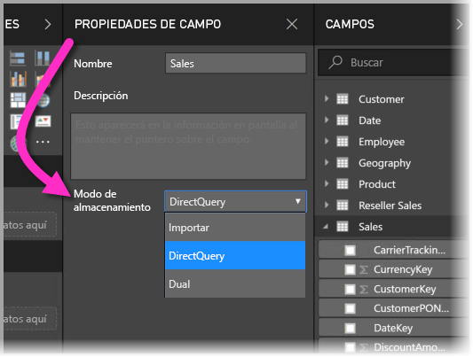
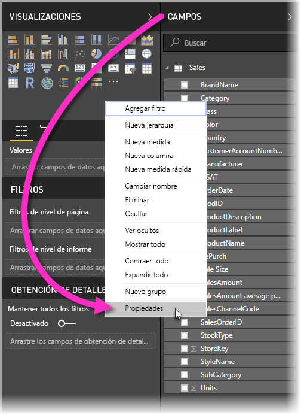
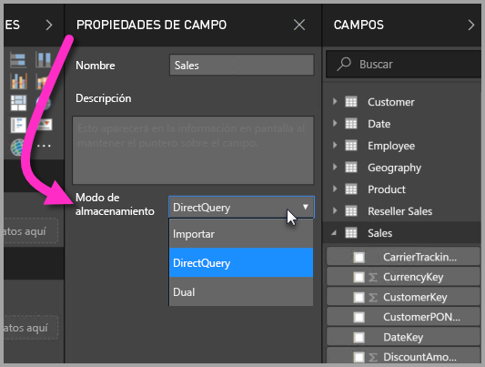
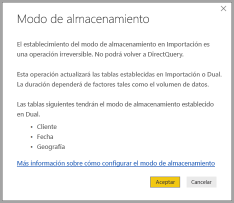

# Modo de almacenamiento en Power BI Desktop (versión preliminar)

En Microsoft Power BI Desktop, puede especificar el *modo de almacenamiento* de las tablas. El *modo de almacenamiento* le permite controlar si Power BI Desktop almacena datos en caché en memoria para los informes. 

El hecho de establecer el modo de almacenamiento proporciona varias ventajas. Puede establecer el modo de almacenamiento para cada tabla individualmente en el modelo. Esta acción permite un único conjunto de datos, lo cual proporciona las siguientes ventajas:

* **Rendimiento de las consultas**: cuando los usuarios interactúan con objetos visuales en los informes de Power BI, las consultas de expresiones de análisis de datos (DAX) se envían al conjunto de datos. Si almacena datos en caché en memoria establecimiento correctamente el modo de almacenamiento, puede mejorar el rendimiento de consulta y la interactividad de los informes.

* **Conjuntos de datos de gran tamaño**: las tablas que no se almacenan en caché no consumen memoria para el almacenamiento en caché. Puede habilitar el análisis interactivo de conjuntos de datos de gran tamaño que son demasiado grandes o costos para almacenar completamente en caché en la memoria. Puede elegir las tablas que merezca la pena almacenar en caché y las que no.

* **Optimización de la actualización de datos**: no es necesario actualizar las tablas que no se almacenan en caché. Puede reducir los tiempos de actualización mediante el almacenamiento en caché solo de los datos necesarios para cumplir los acuerdos de nivel de servicio y los requisitos del negocio.

* **Requisitos casi en tiempo real**: las tablas con requisitos casi en tiempo real se pueden beneficiar de que no se almacenan en caché con el fin de reducir la latencia de los datos.

* **Escritura diferida**: la escritura diferida permite que los usuarios profesionales exploren escenarios hipotéticos cambiando los valores de las celdas. Las aplicaciones personalizadas pueden aplicar cambios al origen de datos. Las tablas que no se almacenan en caché pueden mostrar los cambios de inmediato, lo que permite analizar los efectos de manera instantánea.

La configuración del modo de almacenamiento de Power BI Desktop es una de tres características relacionadas:

* **Modelos compuestos**: esta característica permite que un informe tenga dos o varias conexiones de datos, incluidas conexiones DirectQuery o Importación, en cualquier combinación. Para obtener más información, vea [Modelos compuestos en Power BI Desktop (versión preliminar)](desktop-composite-models.md).

* **Relaciones de varios a varios**: mediante el uso de *modelos compuestos*, puede establecer *relaciones de varios a varios* entre las tablas. Las *relaciones varios a varios* eliminan los requisitos de valores únicos en tablas. También permite descartar las soluciones alternativas anteriores, como la presentación de nuevas tablas solo para establecer relaciones. Para obtener más información, vea [Relaciones de varios a varios en Power BI Desktop (versión preliminar)](desktop-many-to-many-relationships.md).

* **Modo de almacenamiento**: ahora puede especificar los objetos visuales que requieren una consulta a los orígenes de datos back-end. Los objetos visuales que no requieran una consulta se importarán incluso aunque estén basados en DirectQuery. Esta característica permite mejorar el rendimiento y reducir la carga de back-end. Anteriormente, incluso los objetos visuales simples, como las segmentaciones, iniciaban consultas que se enviaban a los orígenes de back-end. El modo de almacenamiento se describe más detalladamente en este artículo.

## Activación de la característica del modo de almacenamiento en versión preliminar

La característica del modo de almacenamiento está en versión preliminar y se debe habilitar en Power BI Desktop. Para habilitar el modo de almacenamiento, seleccione **Archivo** > **Opciones y configuración** > **Opciones** > **Características en versión preliminar** y active la casilla de verificación **Modelos compuestos**. 

Para habilitar la característica es necesario reiniciar Power BI Desktop.

## Uso de la propiedad de modo de almacenamiento

El modo de almacenamiento es una propiedad que puede establecer en cada tabla del modelo. Para establecer el modo de almacenamiento, en el panel **Campos**, haga clic con el botón derecho en la tabla cuyas propiedades quiera establecer y, después, seleccione **Propiedades**.

La propiedad actual se muestra en la lista desplegable **Modo de almacenamiento**, en el panel **Propiedades de campo** de la tabla. Puede ver el modo de almacenamiento actual o modificarlo ahí.

Existen tres valores para el modo de almacenamiento:

* **Importación**: cuando el valor se establece en **Importación**, las tablas importadas se almacenan en caché. Las consultas enviadas al conjunto de datos de Power BI que devuelven datos desde las tablas de importación solo se pueden satisfacer desde los datos en caché.

* **DirectQuery**: con esta configuración, las tablas DirectQuery no se almacenan en caché. Las consultas que envíe al conjunto de datos de Power BI, por ejemplo, las consultas de expresiones de análisis de datos (DAX), y que devuelvan datos desde las tablas DirectQuery solo se podrán satisfacer mediante la ejecución de consultas a petición al origen de datos. Las consultas que envíe al origen de datos usarán el lenguaje de la consulta para ese origen de datos (por ejemplo, SQL).

* **Dual**: las tablas duales pueden actuar como tablas almacenadas en caché o como no almacenadas en caché, en función del contexto de la consulta enviada al conjunto de datos de Power BI. En algunos casos, puede satisfacer las consultas a partir de datos en caché. Sin embargo, en otros casos puede hacerlo ejecutando una consulta a petición al origen de datos.

El hecho de cambiar una tabla a **Importación** es una operación *irreversible*. Esta propiedad no se puede cambiar a DirectQuery o Dual.

## Restricciones en las tablas de DirectQuery y las tablas duales

Las tablas duales tienen las mismas restricciones que las tablas DirectQuery. Estas restricciones pueden incluir transformaciones M limitadas y funciones DAX restringidas en las columnas calculadas. Para obtener más información, vea [Implicaciones de usar DirectQuery](desktop-directquery-about.md#implications-of-using-directquery).

## Reglas de relación en tablas con distintos modos de almacenamiento

Las relaciones deben cumplir con las reglas en función del modo de almacenamiento de las tablas relacionadas. En esta sección se proporcionan ejemplos de combinaciones válidas. Para obtener más información, vea [Relaciones de varios a varios en Power BI Desktop (versión preliminar)](desktop-many-to-many-relationships.md).

En un conjunto de datos con un solo origen de datos, son válidas las combinaciones de relaciones de *uno a varios* siguientes:

| Tabla en el lado de *varios* | Tabla en el lado de *uno* |
| ------------- |----------------------| 
| Dual          | Dual                 | 
| Importar        | Importación o dual       | 
| DirectQuery   | DirectQuery o dual  | 

## Propagación de dual
Considere el modelo sencillo siguiente, donde todas las tablas provienen de un solo origen que admite la importación y DirectQuery.

Para empezar, supongamos que todas las tablas de este modelo son DirectQuery. Si se cambia el **modo de almacenamiento** de la tabla *SurveyResponse* a Importación, aparecerá la siguiente ventana de advertencia:

Las tablas de dimensiones (*Customer* [Cliente], *Date* [Fecha] y *Geography* [Geografía]) se deben establecer en **Dual** para cumplir con las reglas de relaciones anteriormente descritas. En lugar de tener que establecer estas tablas en **Dual** antes de tiempo, puede establecerlas en una sola operación.

La lógica de propagación está diseñada para ayudar con los modelos que contienen muchas tablas. Supongamos que tiene un modelo con 50 tablas y solo se deben almacenar en caché ciertas tablas de hechos (transaccionales). La lógica de Power BI Desktop calcula el conjunto mínimo de tablas de dimensiones que se deben establecer en **Dual** para que no tenga que hacerlo el usuario.

La lógica de propagación solo recorre en dirección al lado de uno de las relaciones de **uno a varios**.

* No se permite cambiar la tabla *Customer* (Cliente) a **Import** (Importación), en lugar de cambiar *SurveyResponse*, debido a sus relaciones con las tablas *Sales* (Ventas) y *SurveyResponse* de DirectQuery.
* Sí se permite cambiar la tabla *Customer* (Cliente) a **Dual**, en lugar de cambiar *SurveyResponse*. La lógica de propagación también establece que la tabla *Geography* (Geografía) sea **Dual**.

## Ejemplo de uso del modo de almacenamiento
Continuemos con el ejemplo de la sección anterior e imaginemos que se aplica la configuración de la propiedad de modo de almacenamiento siguiente:

| Tabla                   | Modo de almacenamiento         |
| ----------------------- |----------------------| 
| *Sales*                 | DirectQuery          | 
| *SurveyResponse*        | Importar               | 
| *Date*                  | Dual                 | 
| *Customer*              | Dual                 | 
| *Geography*             | Dual                 | 

Al establecer estas configuraciones de la propiedad de modo de almacenamiento, se producen los comportamientos siguientes, suponiendo que la tabla *Sales* (Ventas) tenga un volumen de datos considerable.
* Power BI Desktop almacena en caché las tablas de dimensiones (*Date* [Fecha], *Customer* [Cliente] y *Geography* [Geografía]), por lo que los tiempos de carga de informes iniciales deben ser rápidos al recuperar los valores de segmentación que se van a mostrar.
* Si la tabla *Sales* (Ventas) no se almacena en caché, Power BI Desktop proporciona los siguientes resultados:
    * Se mejoran los tiempos de actualización de los datos y se reduce el consumo de memoria.
    * Las consultas de informes que se basan en la tabla *Sales* (Ventas) se ejecutan en el modo DirectQuery. Estas consultas pueden tardar más tiempo, pero están más cerca de realizarse en tiempo real, ya que no se ha introducido ninguna latencia de almacenamiento en caché.

* Las consultas de informes que se basan en la tabla *SurveyResponse* se devuelven desde la caché en memoria y, por tanto, suelen ser relativamente rápidas.

## Consultas que aciertan o pierden la memoria caché

Mediante la conexión de **SQL Profiler** con el puerto de diagnóstico de Power BI Desktop, puede ver las consultas que alcanzan o no la caché en memoria mediante un seguimiento basado en los eventos siguientes:

* Eventos de consultas\Inicio de consulta
* Procesamiento de consulta\Inicio de consulta de Vertipaq SE
* Procesamiento de consulta\Inicio de consulta DirectQuery

Para cada evento de *Inicio de consulta*, compruebe otros eventos con el mismo *ActivityID*. Por ejemplo, si no hay ningún evento *Inicio de consulta DirectQuery*, pero sí un evento *Inicio de consulta de Vertipaq SE*, significa que la consulta se ha respondido desde la caché.

Las consultas que hacen referencia a las tablas del modo **Dual** devuelven datos de la caché si es posible; de lo contrario, se revierten a DirectQuery.

Siguiendo con el ejemplo anterior, la consulta siguiente solo hace referencia a una columna de la tabla *Date* (Fecha) que está en el modo **Dual**. Por tanto, la consulta debe alcanzar la caché.

La consulta siguiente solo hace referencia a una columna de la tabla *Sales* (Ventas), que está en el modo **DirectQuery**. Por tanto, *no* debe acertar la caché.

La consulta siguiente resulta interesante porque combina ambas columnas. Esta consulta no alcanza la caché. Inicialmente podría esperar que recuperase los valores de *CalendarYear* desde la caché y los valores de *SalesAmount* desde el origen y, luego, combinase los resultados, pero este enfoque sería menos eficaz que enviar la operación SUM/GROUP BY al sistema de origen. Si la operación se transfiere al origen, la cantidad de filas devueltas probablemente será mucho menor. 

> [!NOTE]
> Este comportamiento es distinto del que se describe en las [relaciones de varios a varios en Power BI Desktop (versión preliminar)](desktop-many-to-many-relationships.md) al combinar tablas en caché y no en caché.

## Las cachés se deben mantener sincronizadas

Las consultas que aparecen en la sección anterior muestran que las tablas de tipo **Dual** a veces alcanzan la caché y, otras, no. Como resultado, si la caché está obsoleta, se pueden devolver distintos valores. La ejecución de consultas no intentará enmascarar los problemas de datos mediante, por ejemplo, el filtrado de los resultados de DirectQuery para coincidir con los valores en caché. Es su responsabilidad conocer los flujos de datos y debe diseñar en consecuencia. En caso de ser necesario, hay técnicas establecidas para controlar este tipo de casos en el origen.

El modo de almacenamiento *dual* es una optimización del rendimiento. Solo se debe usar de maneras que no pongan en peligro la capacidad de cumplir con los requisitos empresariales. Para el comportamiento alternativo, considere usar las técnicas que se describen en el artículo [Relaciones de varios a varios en Power BI Desktop (versión preliminar)](desktop-many-to-many-relationships.md).

## Vista de datos
Si al menos una tabla del conjunto de datos tiene el **modo de almacenamiento** establecido en Importación o en **Dual**, aparece la pestaña **Vista de datos**.

Cuando se seleccionan en **Vista de datos**, las tablas **Dual** e **Importación** muestran los datos en caché. Las tablas DirectQuery no muestran datos, y se muestra un mensaje en el que se establece que no se pueden mostrar las tablas DirectQuery.

## Limitaciones y consideraciones

Existen algunas limitaciones para esta versión del modo de almacenamiento y su correlación con los modelos compuestos.

Los orígenes de Live Connect (multidimensionales) siguientes no se pueden usar con los modelos compuestos:

* SAP HANA
* SAP Business Warehouse
* SQL Server Analysis Services
* Conjuntos de datos de Power BI
* Azure Analysis Services

Al conectarse a esos orígenes multidimensionales mediante DirectQuery, no se puede conectar a otro origen de DirectQuery ni combinar con los datos importados.

Las limitaciones existentes del uso de DirectQuery siguen aplicándose cuando se usan los modelos compuestos. Muchas de esas limitaciones son ahora por tabla, en función del modo de almacenamiento de la tabla. Por ejemplo, una columna calculada en una tabla importada puede hacer referencia a otras tablas, pero una columna calculada en una tabla de DirectQuery sigue restringida para hacer referencia solo a columnas de la misma tabla. Otras limitaciones se aplican al modelo como un todo, si cualquiera de las tablas dentro del modelo son DirectQuery. Por ejemplo, las características Conclusiones rápidas y Preguntas y respuestas no están disponibles en un modelo si cualquiera de las tablas dentro del mismo tiene un modo de almacenamiento de DirectQuery. 

## Pasos siguientes

Para obtener más información sobre los modelos compuestos y DirectQuery, consulte los siguientes artículos:
* [Modelos compuestos en Power BI Desktop (versión preliminar)](desktop-composite-models.md)
* [Relaciones de varios a varios en Power BI Desktop (versión preliminar)](desktop-many-to-many-relationships.md)
* [Uso de DirectQuery en Power BI](desktop-directquery-about.md)
* [Orígenes de datos admitidos por DirectQuery en Power BI](desktop-directquery-data-sources.md)

