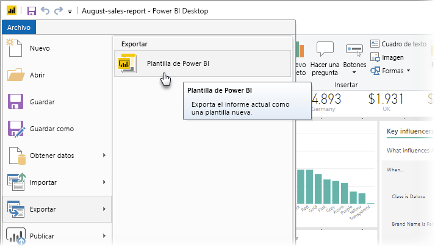
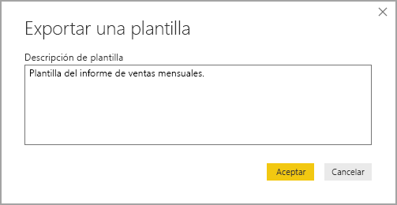
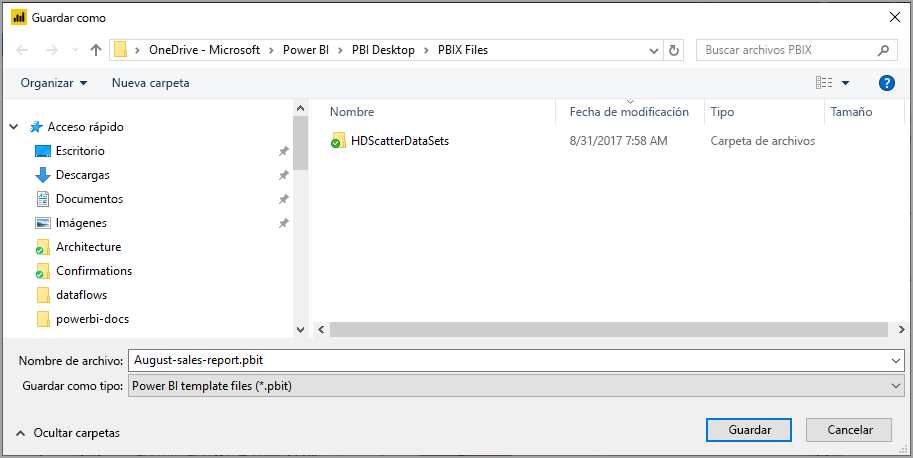
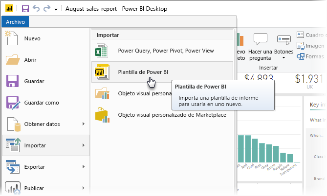
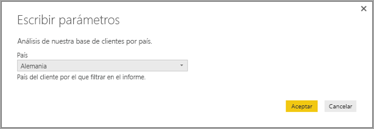
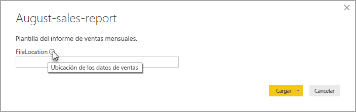

# Creación de plantillas de informe para Power BI Desktop

Con **Power BI Desktop**, puede crear informes atractivos para compartir información en toda la organización. Con las **plantillas** de Power BI Desktop, puede simplificar el trabajo al crear una plantilla de informe basada en una existente que usted o los demás usuarios de la organización pueden usar como punto de partida para el diseño, el modelo de datos y las consultas de un nuevo informe. Las plantillas de **Power BI Desktop** ayudan a iniciar y estandarizar la creación de informes.

## Creación de plantillas

Las plantillas de informe de Power BI contienen la siguiente información del informe a partir del que se han generado:

* **Páginas** de informe, objetos visuales y otros elementos visuales
* La **definición del modelo de datos**, lo que incluye el esquema, las relaciones, las medidas y otros artefactos de definición del modelo
* Todas las **definiciones de consulta**, como consultas, parámetros de consulta y otros elementos de consulta

Lo que *no* se incluye en las plantillas son los datos del informe. 

Las plantillas de informe usan la extensión de archivo .PBIT (en comparación con los informes de Power BI Desktop, que usan la extensión .PBIX). 

Para crear una plantilla de informe, seleccione **Archivo > Exportar > Plantilla de Power BI** en el menú, lo que abre la siguiente ventana, que le pide que proporcione una descripción para la plantilla. En este ejemplo, la descripción de la plantilla es *Plantilla de informe de ventas mensuales*.

Seleccione **Aceptar** y se le pide una ubicación de archivo para almacenar el archivo de plantilla .PBIT.

Eso es todo, la plantilla de informe de Power BI se crea en la ubicación de archivo especificada, con la extensión .PBIT.

> [!NOTE]
> Los archivos de plantilla de informe de Power BI suelen ser mucho más pequeños que un informe de Power BI Desktop, porque las plantillas no contienen ningún dato, solo las propias definiciones de informe. 

## Uso de plantillas

Para usar una plantilla de informe de Power BI, basta con abrirla en Power BI Desktop y empezar a usarla. Puede abrir plantillas de informe de Power BI de dos maneras:

* Haga doble clic en cualquier archivo .PBIT para iniciar automáticamente Power BI Desktop y cargar la plantilla
* Seleccione **Archivo > Importar > Plantilla de Power BI** en Power BI Desktop

Al abrir una plantilla de informe, aparece un cuadro de diálogo con los valores de los parámetros definidos en el informe en el que se basa la plantilla. Por ejemplo, si un informe analiza los clientes según el país o la región y tiene un parámetro *País* para especificar la base de clientes, aparece un mensaje para que seleccione un valor *País* en la lista de valores especificados al definir el parámetro. 

Una vez que se proporcionan los parámetros necesarios, se le pide la ubicación de los datos subyacentes asociados al informe. Luego el creador del informe actual puede conectarse a los datos en función de sus credenciales.

Una vez especificados los parámetros y los datos, se crea un informe que contiene todas las páginas, los objetos visuales, los artefactos del modelo de datos y las consultas que formaban parte del informe en el que se basa la plantilla. 

Ya está. Crear y usar plantillas de informe en Power BI Desktop es fácil, lo que permite reproducir fácilmente diseños atractivos y otros aspectos del informe y compartirlos con otros usuarios.

## Pasos siguientes
También podría interesarle obtener información sobre los **parámetros de consulta**:
* [¿Usa parámetros de consulta en Power BI Desktop?](https://docs.microsoft.com/power-query/power-query-query-parameters)

Además, con Power BI Desktop puede hacer todo tipo de cosas. Para obtener más información sobre sus capacidades, consulte los siguientes recursos:

* [¿Qué es Power BI Desktop?](desktop-what-is-desktop.md)
* [Información general sobre consultas con Power BI Desktop](desktop-query-overview.md)
* [Tipos de datos en Power BI Desktop](desktop-data-types.md)
* [Combinar datos y darles forma con Power BI Desktop](desktop-shape-and-combine-data.md)
* [Tareas de consultas comunes en Power BI Desktop](desktop-common-query-tasks.md)    
