# Tutorial: Creación de columnas calculadas en Power BI Desktop

A veces los datos que está analizando no contienen un determinado campo necesario para obtener los resultados buscados. Aquí es donde entran en escena las *columnas calculadas*. Las columnas calculadas utilizan fórmulas de expresiones de análisis de datos (DAX) para definir los valores de una columna, cualquier cosa desde poner juntos valores de texto de un par de columnas diferentes hasta calcular un valor numérico a partir de otros valores. Por ejemplo, supongamos que sus datos tienen los campos **Ciudad** y **Estado**, pero desea un único campo **Ubicación** que tenga ambos, como "Miami, Florida". Para esto es precisamente que sirven las columnas calculadas.

Las columnas calculadas son similares a las [medidas](desktop-tutorial-create-measures.md) en que ambas se basan en fórmulas DAX, pero difieren en cómo se usan. A menudo se usan medidas en el área **Valores** de una visualización para calcular los resultados en función de otros campos. Las columnas calculadas se usan como nuevos **Campos** en filas, ejes, leyendas y áreas de grupos de visualizaciones.

Este tutorial le ayudará a entender y crear algunas columnas calculadas y a usarlas en visualizaciones de informe en Power BI Desktop. 

### Requisitos previos
- Este tutorial está destinado a usuarios de Power BI que ya están familiarizados con el uso de Power BI Desktop para crear modelos más avanzados. Ya debería saber cómo usar la **obtención de datos** y el **Editor de Power Query** para importar datos, trabajar con varias tablas relacionadas y agregar campos al lienzo de informe. Si no está familiarizado con Power BI Desktop, asegúrese de revisar [Introducción a Power BI Desktop](desktop-getting-started.md).
  
- El tutorial utiliza el [ejemplo de ventas de Contoso para Power BI Desktop](https://download.microsoft.com/download/4/6/A/46AB5E74-50F6-4761-8EDB-5AE077FD603C/Contoso%20Sales%20Sample%20for%20Power%20BI%20Desktop.zip), el mismo ejemplo usado para el tutorial [Crear medidas propias en Power BI Desktop](desktop-tutorial-create-measures.md). Estos datos de ventas de la compañía ficticia Contoso, Inc. se importaron desde una base de datos, por lo que no podrá conectarse al origen de datos ni verlos en el Editor de Power Query. Descargue y extraiga el archivo en su propio equipo y luego ábralo en Power BI Desktop.

## Creación de una columna calculada con valores de tablas relacionadas

En su informe de ventas, desea mostrar categorías y subcategorías de producto como valores únicos, por ejemplo: "Teléfonos móviles – Accesorios", "Teléfonos móviles – Smartphones y PDA", y así sucesivamente. No hay ningún campo en la lista **Campos** que le proporcione esos datos, pero hay un campo **ProductCategory** y un campo **ProductSubcategory**, cada uno en su propia tabla. Puede crear una columna calculada que combine los valores de estas dos columnas. Las fórmulas DAX pueden aprovechar toda la funcionalidad del modelo que ya tiene, incluidas las relaciones entre las diferentes tablas que ya existen. 

 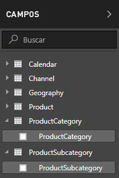

1.  Seleccione **Más opciones** (...) o haga clic con el botón derecho en la tabla **ProductSubcategory** de la lista de campos y seleccione **Nueva columna**. Esto crea la nueva columna en la tabla ProductSubcategory.
    
    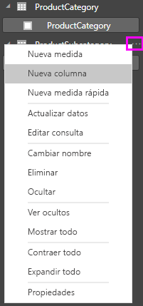
    
    La barra de fórmulas aparece en la parte superior del lienzo de informe, donde puede asignar un nombre a la columna y escribir una fórmula DAX.
    
    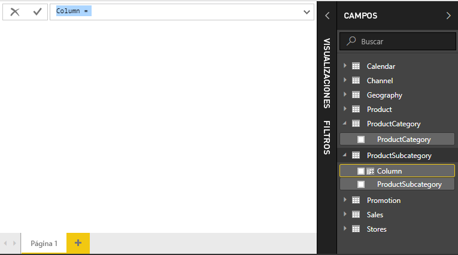
    
2.  De forma predeterminada, a una nueva columna calculada se le denomina simplemente Columna. Si no cambia su nombre, las nuevas columnas adicionales se denominarán Columna 2, Columna 3 y así sucesivamente. Desea que la columna sea más fácil de identificar, por lo que el nombre **Columna** ya está resaltado en la barra de fórmulas; cambie su nombre escribiendo **ProductFullCategory** y luego escriba un signo igual ( **=** ).
    
3.  Quiere que los valores de la nueva columna empiecen con el nombre ProductCategory. Dado que esta columna está en una tabla diferente pero relacionada, vamos a usar la función [RELATED](https://msdn.microsoft.com/library/ee634202.aspx) para ayudarle a conseguir su objetivo.
    
    Después del signo igual escriba **r**. Una lista desplegable de sugerencias muestra todas las funciones DAX que empiezan por la letra R. Al seleccionar cada función, se muestra una descripción de su efecto. A medida que escribe, la lista de sugerencias se aproxima más a la función que necesita. Seleccione **RELATED** y presione **Intro**.
    
    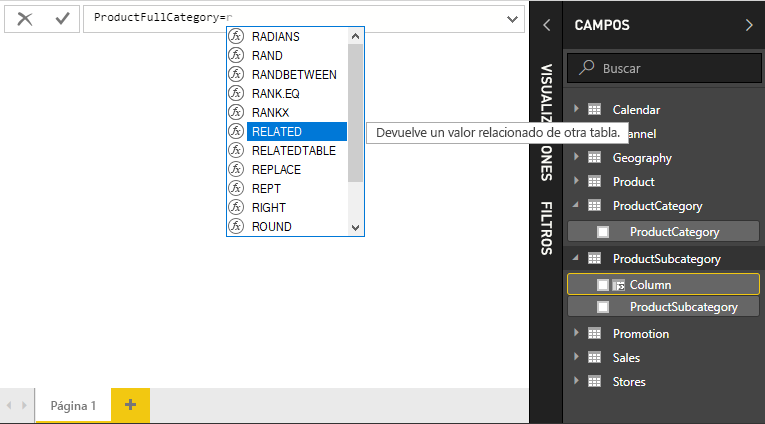
    
    Aparece un paréntesis de apertura, junto con otra lista de sugerencias de las columnas relacionadas que puede pasar a la función RELATED, con descripciones y detalles sobre los parámetros esperados. 
    
    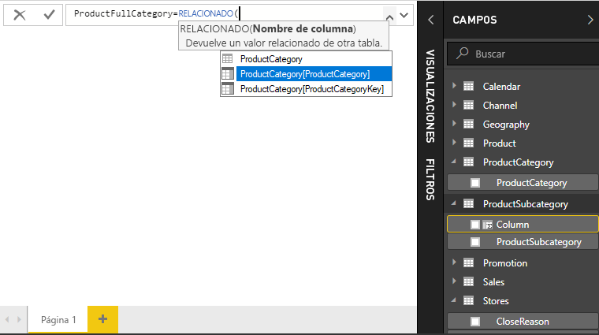
    
4.  Desea la columna **ProductCategory** de la tabla **ProductCategory**. Seleccione **ProductCategory[ProductCategory]** , presione **Intro** y escriba un paréntesis de cierre.
    
    > [!TIP]
    > Los errores de sintaxis suelen producirse por un paréntesis de cierre ausente o que no viene al caso, aunque a veces Power BI Desktop lo agregará automáticamente.
    
4. Desea guiones y espacios para separar ProductCategories y ProductSubcategories en los nuevos valores, así que después del paréntesis de cierre de la primera expresión, escriba un espacio, una Y comercial ( **&** ), comillas dobles ( **"** ), espacio, guion ( **-** ), otro espacio, otras comillas dobles y otra Y comercial. La fórmula debe tener el siguiente aspecto:
    
    `ProductFullCategory = RELATED(ProductCategory[ProductCategory]) & " - " &`
    
    > [!TIP]
    > Si necesita más espacio, seleccione el botón de contenido adicional hacia abajo situado en el lado derecho de la barra de fórmulas para expandir el editor de fórmulas. En el editor, presione **Alt + Intro** para bajar una línea y el **tabulador** para mover cosas.
    
5.  Por último, escriba otro corchete de apertura ( **[** ) y luego seleccione la columna **[ProductSubcategory]** para terminar la fórmula. 
    
    
    
    No necesitaba usar otra función RELATED para llamar a la tabla ProductSubcategory en la segunda expresión, ya que está creando la columna calculada en esta tabla. Puede escribir [ProductSubcategory] con el prefijo de nombre de tabla (completo) o sin él (incompleto).
    
6.  Complete la fórmula. Para ello presione **Intro** o seleccione la marca de verificación en la barra de fórmulas. La fórmula se valida y el nombre de la columna **ProductFullCategory** aparece en la tabla **ProductSubcategory** en la lista Campos. 
    
    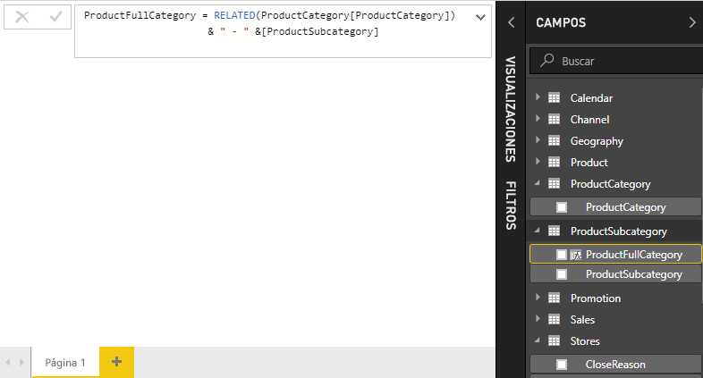
    
    >[!NOTE]
    >En Power BI Desktop, las columnas calculadas tienen un icono especial en la lista de campos, que muestra que contienen fórmulas. En el servicio Power BI (sitio de Power BI), no hay forma de cambiar las fórmulas, por lo que las columnas calculadas no tienen iconos.
    
## Uso de la nueva columna en un informe

Ahora puede usar la nueva columna ProductFullCategory para ver SalesAmount por ProductFullCategory.

1. Seleccione o arrastre la columna **ProductFullCategory** desde la tabla **ProductSubcategory** al lienzo de informe para crear una tabla que muestre todos los nombres de ProductFullCategory.
   
   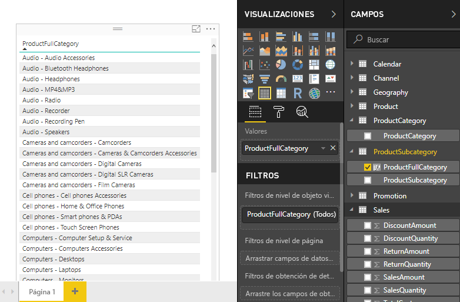
    
2. Seleccione o arrastre el campo **SalesAmount** desde la tabla **Sales** en la tabla para mostrar la cantidad de ventas para cada categoría completa de producto.
   
   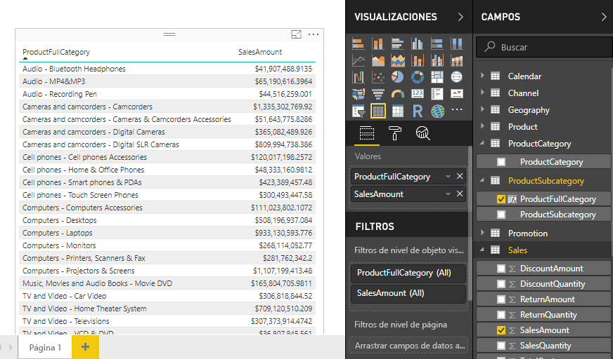
    
## Creación de una columna calculada que usa una función IF

El ejemplo de las ventas de Contoso contiene datos de ventas de tiendas activas e inactivas. Desea asegurarse de que las ventas de las tiendas activas están claramente separadas de las ventas de las tiendas inactivas en el informe mediante la creación de un campo Active StoreName. En la nueva columna calculada Active StoreName, cada tienda activa aparecerá con el nombre completo de la tienda, mientras que las tiendas inactivas se agruparán bajo "Inactive". 

Afortunadamente, la tabla Stores tiene una columna denominada **Status**, con valores de "On" para las tiendas activas y "Off" para las tiendas inactivas, que podemos usar para crear valores para nuestra nueva columna Active StoreName. La fórmula usará la función lógica [IF](https://msdn.microsoft.com/library/ee634824.aspx) para comprobar el estado de cada tienda y devolver un valor determinado dependiendo del resultado. La fórmula devolverá el nombre de la tienda si esta tiene un estado activo (On). Si el estado es inactivo ("Off"), la fórmula asignará un valor de Active StoreName de "Inactive". 

1.  Cree una nueva columna calculada en la tabla **Stores** y llámela **Active StoreName** en la barra de fórmulas.
    
2.  Después del signo **=** , comience a escribir **IF**. La lista de sugerencias mostrará qué puede agregar. Seleccione **IF**.
    
    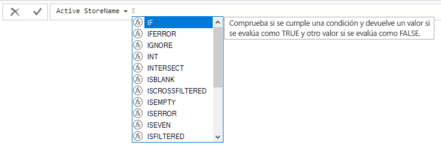
    
3.  El primer argumento para IF es una prueba lógica de si el estado de una tienda es "On". Escriba un corchete de apertura **[** , que enumera las columnas de la tabla Stores, y seleccione **[Status]** .
    
    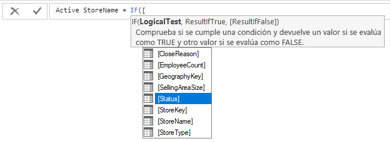
    
4.  Justo después de **[Status]** , escriba **= "On"** y luego escriba una coma ( **,** ) para finalizar el argumento. La información sobre herramientas sugiere que ahora debe agregar un valor que se devuelve cuando el resultado es TRUE.
    
    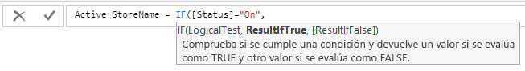
    
5.  Si el estado de la tienda es "On", quiere que aparezca el nombre de la misma. Escriba un corchete de apertura ( **[** ), la columna **[StoreName]** y luego escriba otra coma. La información sobre herramientas ahora indica que debe agregar un valor que se devuelve cuando el resultado es FALSE. 
    
    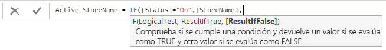
    
6.  Desea que el valor sea *Inactive*, así que escriba **"Inactive"** y luego complete la fórmula presionando **Intro** o seleccionando la marca de verificación de la barra de fórmulas. La fórmula se valida y el nombre de la nueva columna aparece en la tabla **Stores** en la lista Campos.
    
    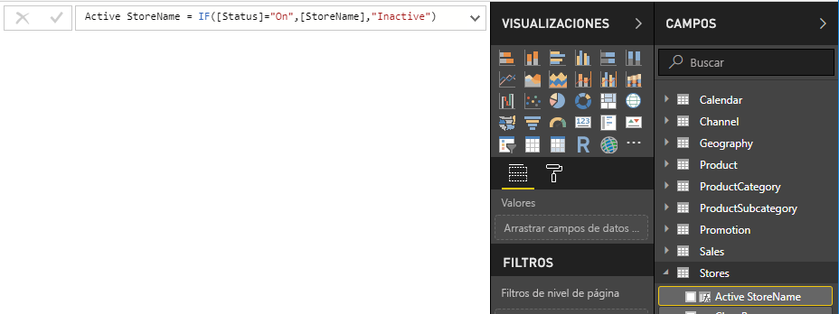
    
8.  Puede usar la nueva columna Active StoreName en las visualizaciones, igual que cualquier otro campo. Para mostrar SalesAmounts por Active StoreName, seleccione el campo **Active StoreName** o arrástrelo hasta el lienzo y luego seleccione el campo **SalesAmount** o arrástrelo a la tabla. En esta tabla, las tiendas activas aparecen de forma individual por nombre, pero las tiendas inactivas se agrupan al final como *Inactive*. 
    
    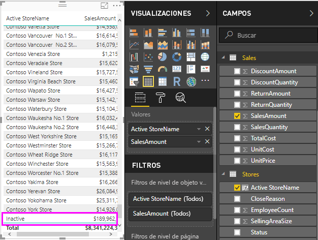
    
## Lo que ha aprendido
Las columnas calculadas pueden enriquecer los datos y proporcionar información más fácilmente. Ahora sabe cómo crear columnas calculadas en la lista de campos y la barra de fórmulas, usar listas de sugerencias e información sobre herramientas para ayudar a construir las fórmulas, llamar a funciones DAX como RELATED e IF con los argumentos apropiados y utilizar las columnas calculadas en visualizaciones de informe.

## Pasos siguientes
Si desea profundizar más en las fórmulas DAX y crear columnas calculadas con fórmulas DAX más avanzadas, consulte [Aspectos básicos de DAX en Power BI Desktop](desktop-quickstart-learn-dax-basics.md). Ese artículo se centra en los conceptos fundamentales en DAX, como la sintaxis, las funciones y una explicación más exhaustiva sobre el contexto.

Asegúrese de agregar la [Referencia de expresiones de análisis de datos (DAX)](https://msdn.microsoft.com/library/gg413422.aspx) a sus favoritos. Ahí encontrará información detallada sobre la sintaxis y los operadores de DAX, así como sus más de 200 funciones.

