# Tutorial: Creación de medidas propias en Power BI Desktop
Con las medidas, puede crear algunas de las soluciones de análisis de datos más eficaces en Power BI Desktop. Las medidas ayudan al realizar cálculos con los datos a medida que se interactúa con los informes. Este tutorial le ayudará a entender las medidas y a crear sus medidas básicas propias en Power BI Desktop.

## Requisitos previos

- Este tutorial está destinado a usuarios de Power BI que ya están familiarizados con el uso de Power BI Desktop para crear modelos más avanzados. Debe estar familiarizado con el uso de Obtener datos y el Editor de consultas para importar datos, trabajar con varias tablas relacionadas y agregar campos al lienzo del informe. Si no está familiarizado con Power BI Desktop, asegúrese de revisar [Introducción a Power BI Desktop](desktop-getting-started.md).
  
- En este tutorial se usa el archivo de [ejemplo de ventas de Contoso para Power BI Desktop](https://download.microsoft.com/download/4/6/A/46AB5E74-50F6-4761-8EDB-5AE077FD603C/Contoso%20Sales%20Sample%20for%20Power%20BI%20Desktop.zip), que incluye datos de ventas en línea de la compañía ficticia Contoso. Como estos datos se han importado desde una base de datos, no se puede conectar al origen de datos ni verlos en el Editor de consultas. Descargue y extraiga el archivo en el equipo.

## Medidas automáticas

Cuando Power BI Desktop crea una medida, normalmente se crea de forma automática. Para ver cómo Power BI Desktop crea una medida, siga estos pasos:

1. En Power BI Desktop, seleccione **Archivo** > **Abrir**, vaya al archivo *Ejemplo de ventas de Contoso para Power BI Desktop.pbix* y, después, seleccione **Abrir**.

2. En el panel **Campos**, expanda la tabla **Sales**. Después, active la casilla situada junto al campo **SalesAmount** o arrastre **SalesAmount** al lienzo del informe.

    Aparece una nueva visualización de gráfico de columnas, en la que se muestra la suma total de todos los valores de la columna **SalesAmount** de la tabla **Sales**.

    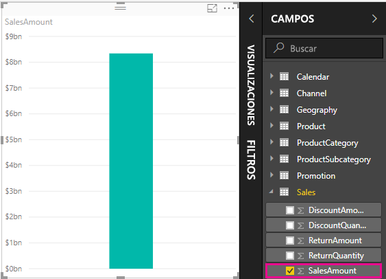

Cualquier campo (columna) del panel **Campos** con un icono sigma  es numérico y sus valores se pueden agregar. En lugar de mostrar una tabla con muchos valores (dos millones de filas para **SalesAmount**) Power BI Desktop crea y calcula de forma automática una medida para agregar los datos si detecta un tipo de datos numérico. La suma es la agregación predeterminada de un tipo de datos numérico, pero puede aplicar fácilmente otras agregaciones, como media o recuento. Comprender las agregaciones es fundamental para entender las medidas, porque cada medida realiza algún tipo de agregación. 

Para cambiar la agregación de gráfico, siga estos pasos:

1. Seleccione la visualización **SalesAmount** en el lienzo del informe.  

1. En el área **Valor** del panel **Visualizaciones**, seleccione la flecha hacia abajo situada a la derecha de **SalesAmount**. 

1. En el menú que aparece, seleccione **Promedio**. 

    La visualización cambia a una media de todos los valores de ventas del campo **SalesAmount**.

    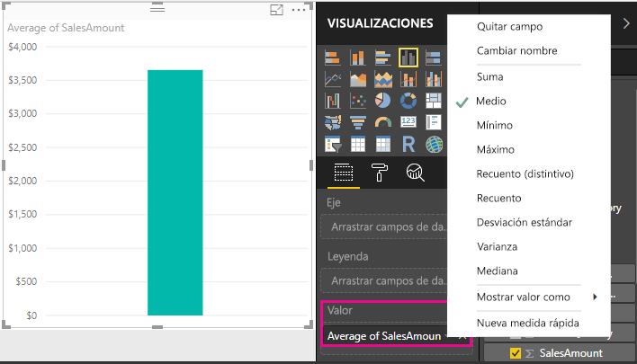

En función del resultado que quiera, puede cambiar el tipo de agregación. Pero no todos los tipos de agregación se aplican a todos los tipos de datos numéricos. Por ejemplo, para el campo **SalesAmount**, Suma y Promedio son útiles, y también se pueden usar Mínimo y Máximo. Pero Recuento no tiene mucho sentido para el campo **SalesAmount** porque, aunque sus valores sean numéricos, se trata de valores de moneda.

Los valores que se calculan a partir de medidas cambian en respuesta a interacciones con el informe. Por ejemplo, si arrastra el campo **RegionCountryName** desde la tabla **Geography** al gráfico **SalesAmount** existente, cambia para mostrar el promedio de importes de ventas de cada país.

Cuando el resultado de una medida cambia por una interacción con el informe, el *contexto* de la medida se ve afectado. Cada vez que se interactúa con las visualizaciones del informe, se cambia el contexto en el que una medida calcula y muestra los resultados.

## Creación y uso de sus propias medidas

En la mayoría de los casos, Power BI Desktop calcula y devuelve automáticamente valores en función de los tipos de campos y agregaciones que elija. Pero, es posible que en algunos casos quiera crear medidas propias para realizar cálculos más complejos y únicos. Con Power BI Desktop, puede crear sus propias medidas usando el lenguaje de fórmulas de expresiones de análisis de datos (DAX). 

Las fórmulas DAX usan muchas de las mismas funciones, operadores y sintaxis que las fórmulas de Excel. Sin embargo, las funciones DAX están diseñadas para trabajar con datos relacionales y realizar cálculos más dinámicos a medida que se interactúa con los informes. Hay más de 200 funciones DAX que realizan todo tipo de agregaciones simples, como sumas y medias, hasta funciones estadísticas y de filtrado más complejas. Hay muchos recursos que pueden ayudarle a obtener más información sobre DAX. Una vez que finalice este tutorial, vea [Aspectos básicos de DAX en Power BI Desktop](desktop-quickstart-learn-dax-basics.md).

Cuando se crea una medida propia, se denomina una medida *modelo* y se agrega a la lista **Campos** de la tabla que se seleccione. Algunas de las ventajas de las medidas modelo son que puede asignarles el nombre que prefiera, lo que facilita su identificación; puede usarlas como argumentos en otras expresiones DAX y puede hacer que realicen cálculos complejos rápidamente.

### Medidas rápidas

A partir de la versión de Power BI Desktop de febrero de 2018, muchos cálculos comunes están disponibles como *medidas rápidas*, que escriben de forma automática las fórmulas DAX en función de las entradas que escriba en una ventana. Estos cálculos rápidos y eficaces también son ideales para el aprendizaje de DAX o para inicializar sus propias medidas personalizadas. 

Cree una medida rápida mediante uno de estos métodos: 
 - Desde una tabla del panel **Campos**, haga clic con el botón derecho o seleccione **Más opciones** ( **...** ) y, después, seleccione **Nueva medida rápida** de la lista.

 - En **Cálculos** en la pestaña **Inicio** de la cinta de Power BI Desktop, seleccione **Nueva medida rápida**.

Para obtener más información sobre cómo crear y usar las medidas rápidas, vea [Uso de medidas rápidas](desktop-quick-measures.md).

### Creación de una medida

Imagine que quiere analizar las ventas netas mediante la resta de descuentos y devoluciones de los importes de ventas totales. Para el contexto que exista en la visualización, necesita una medida que reste la suma de DiscountAmount y ReturnAmount de la suma de SalesAmount. No hay ningún campo para las ventas netas en la lista **Campos**, pero tiene los bloques de creación para crear una medida propia y calcular las ventas netas. 

Para crear una medida, siga estos pasos:

1. En el panel **Campos**, haga clic con el botón derecho en la tabla **Sales**, o bien mantenga el mouse sobre la tabla y seleccione **Más opciones** ( **...** ). 

1. En el menú que aparece, seleccione **Nueva medida**. 

    Esta acción guarda la nueva medida en la tabla **Sales**, donde es fácil de encontrar.
    
    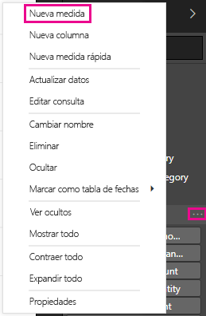
    
    También puede crear una medida si selecciona **Nueva medida** en el grupo **Cálculos** de la pestaña **Inicio** de la cinta de Power BI Desktop.
    
    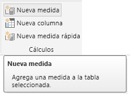
    
    >[!TIP]
    >Cuando se crea una medida desde la cinta, se puede crear en cualquiera de las tablas, pero será más fácil de encontrar si se crea donde planea usarla. En este caso, seleccione primero la tabla **Sales** para activarla y, luego, seleccione **Nueva medida**. 
    
    La barra de fórmulas aparece en la parte superior del lienzo del informe, donde puede cambiar el nombre de la medida y escribir una fórmula DAX.
    
    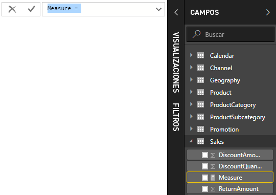
    
1. De manera predeterminada, cada nueva medida se denomina *Medida*. Si no le cambia el nombre, las medidas nuevas adicionales se denominarán *Medida 2*, *Medida 3*, etc. Para facilitar la identificación de esta medida, resalte *Medida* en la barra de fórmulas y, luego, cambie el nombre por *Ventas netas*.
    
1. Empiece a escribir la fórmula. Después del signo igual, empiece a escribir *Sum*. A medida que escribe, aparecerá una lista desplegable de sugerencias, con todas las funciones DAX que comienzan con las letras que escribe. Si es necesario, desplácese hacia abajo para seleccionar **SUM** en la lista y, luego, presione **Entrar**.
    
    
    
    Aparece un paréntesis de apertura, junto con una lista desplegable de sugerencias de las columnas disponibles que puede pasar a la función SUMA.
    
    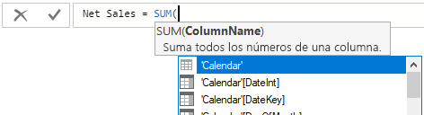
    
1. Las expresiones siempre aparecen entre paréntesis de apertura y cierre. Para este ejemplo, la expresión contiene un solo argumento para pasarlo a la función SUMA: la columna **SalesAmount**. Empiece a escribir *SalesAmount* hasta que **Sales(SalesAmount)** sea el único valor de la lista. 

    El nombre de la columna precedido por el nombre de la tabla se conoce como el nombre completo de la columna. Los nombres completos de columna facilitan la lectura de las fórmulas.
    
    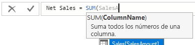
    
1. Seleccione **Sales[SalesAmount]** en la lista y, después, escriba un paréntesis de cierre.
    
    > [!TIP]
    > Los errores de sintaxis suelen deberse a paréntesis de cierre faltantes o en el lugar incorrecto.
    
    
    
1. Reste las otras dos columnas dentro de la fórmula:

    a. Después del paréntesis de cierre de la primera expresión, escriba un espacio, un operador de signo menos (-) y después otro espacio. 

    b. Escriba otra función SUMA y empiece a escribir *DiscountAmount* hasta que pueda elegir la columna **Sales[DiscountAmount]** como argumento. Agregue un paréntesis de cierre. 

    c. Escriba un espacio, un operador de signo menos, un espacio, otra función SUMA con **Sales[ReturnAmount]** como argumento y, después, otro paréntesis de cierre.
    
    
    
1. Presione **Entrar** o seleccione **Confirmar** (el icono de marca de verificación) en la barra de fórmulas para completar y validar la fórmula. 

    La medida **Net Sales** validada ya está lista para usarla en la tabla **Sales** del panel **Campos**.
    
    
    
1. Si necesita más espacio para escribir una fórmula o quiere que aparezca en líneas independientes, seleccione la flecha hacia abajo que aparece a la derecha de la barra de fórmulas para proporcionar más espacio. 

    La flecha hacia abajo se convierte en una flecha hacia arriba y aparece un cuadro grande.

    

1. Separe los elementos de la fórmula; para ello, presione **Alt** + **Entrar** para líneas independientes, o bien **Tabulación** para agregar espaciado de tabulación.

   

### Uso de una medida en el informe
Agregue la medida **Net Sales** al lienzo del informe y calcule las ventas netas para cualquier otro campo que agregue al informe. 

Para echar un vistazo a las ventas netas por país:

1. Seleccione la medida **Net Sales** en la tabla **Sales** o arrástrela al lienzo del informe.
    
1. Seleccione el campo **RegionCountryName** de la tabla **Geography**, o bien arrástrelo al gráfico **Net Sales**.
    
    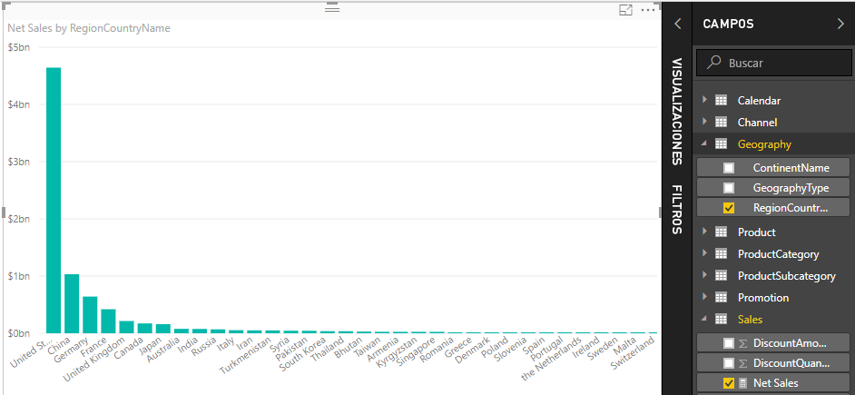
    
1. Para ver la diferencia entre las ventas netas y las ventas totales por país, seleccione el campo **SalesAmount** o arrástrelo al gráfico. 

    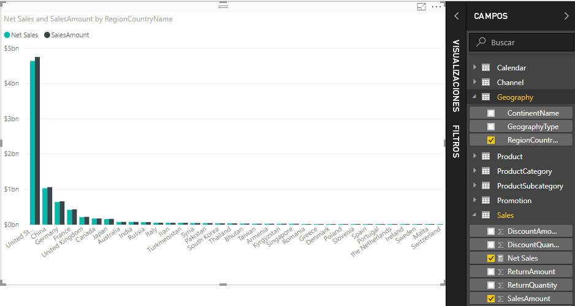

    El gráfico ahora usa dos medidas: **SalesAmount**, que Power BI ha sumado de forma automática, y la medida **Net Sales** que ha creado manualmente. Cada medida se ha calculado en el contexto de otro campo, **RegionCountryName**.
    
### Uso de la medida con una segmentación

Agregue una segmentación para filtrar aún más las ventas netas y los importes de ventas por año natural:
    
1. Seleccione un área en blanco junto al gráfico. En el panel **Visualizaciones**, seleccione la visualización **Tabla**. 

    Esta acción crea una visualización de tabla en blanco en el lienzo del informe.
    
    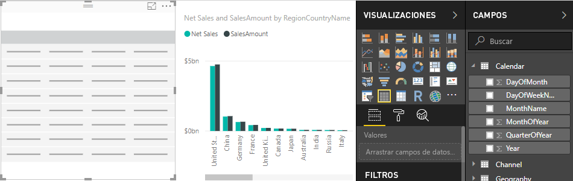
    
1. Arrastre el campo **Year** desde la tabla **Calendar** a la nueva visualización de tabla en blanco. 
    
    Como **Year** es un campo numérico, Power BI Desktop suma sus valores. Esta suma no funciona bien como agregación; se solucionará en el paso siguiente.

    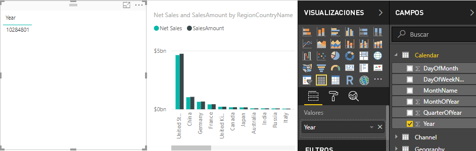
    
3. En el cuadro **Valores** del panel **Visualizaciones**, seleccione la flecha hacia abajo situada junto a **Year** y, después, seleccione **No resumir**. Ahora la tabla muestra años individuales.
    
    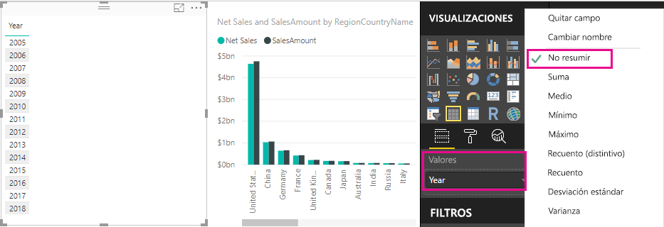
    
4.  Seleccione el icono **Segmentación** del panel **Visualizaciones** para convertir la tabla en una segmentación. Si la visualización muestra un control deslizante en lugar de una lista, seleccione **Lista** en la flecha hacia abajo del control deslizante.

    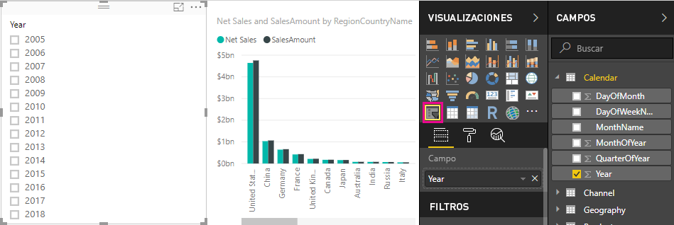
    
5.  Seleccione cualquier valor en la segmentación **Year** para filtrar el gráfico **Ventas netas e importe de ventas por RegionCountryName** según corresponda. Las medidas **Net Sales** y **SalesAmount** recalculan y muestran los resultados en el contexto del campo **Year** seleccionado. 
    
    

### Uso de una medida en otra medida

Imagine que quiere averiguar qué productos tienen el importe de ventas netas más alto por unidad vendida. Necesitará una medida que divida las ventas netas por la cantidad de unidades vendidas. Cree una medida que divida el resultado de la medida **Net Sales** por la suma de **Sales[SalesQuantity]** .

1.  En el panel **Campos**, cree una medida denominada **Net Sales per Unit** en la tabla **Sales**.
    
1. En la barra de fórmulas, empiece a escribir *Net Sales*. En la lista de sugerencias se muestra lo que puede agregar. Seleccione **[Net Sales]** .
    
    
    
1. También puede hacer referencia medidas si escribe un corchete de apertura ( **[** ). En la lista de sugerencias solo se muestran medidas para agregar a la fórmula.
    
    
    
1. Escriba un espacio, un operador de división (/), otro espacio, una función SUMA y, luego, escriba *Quantity*. En la lista de sugerencias se muestran todas las columnas que incluyan *Quantity* en el nombre. Seleccione **Sales[SalesQuantity]** , escriba el paréntesis de cierre y presione **ENTRAR** o seleccione **Confirmar** (el icono de marca de verificación) para validar la fórmula. 

    La fórmula resultante debe ser similar a esta:
    
    `Net Sales per Unit = [Net Sales] / SUM(Sales[SalesQuantity])`
    
1. Seleccione la medida **Net Sales per Unit** en la tabla **Sales**, o bien arrástrela a un área en blanco del lienzo del informe. 

    En el gráfico se muestra el importe de ventas netas por unidad sobre todos los productos vendidos. Este gráfico no es muy informativo; se solucionará en el paso siguiente.
    
    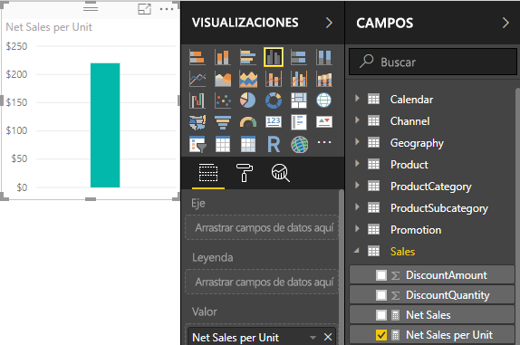
    
1. Para una mirada distinta, cambie el tipo de visualización del gráfico a **Gráfico de rectángulos**.
    
    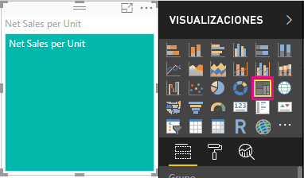
    
1. Seleccione el campo **Product Category**, o bien arrástrelo al gráfico de rectángulos o al campo **Grupo** del panel **Visualizaciones**. Ahora ya tiene información útil.
    
    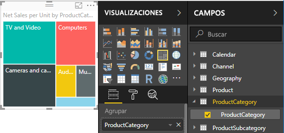
    
7. Intente quitar el campo **ProductCategory** y, en su lugar, arrastrar el campo **ProductName** al gráfico. 
    
    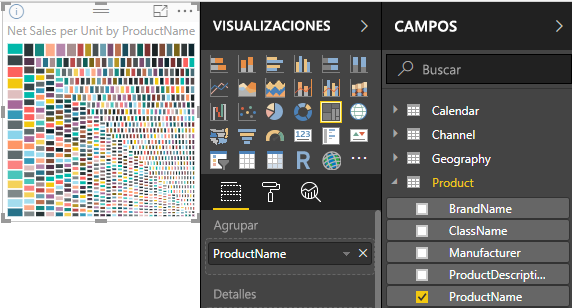
    
   Ahora solo estamos jugando, pero tiene que admitir que esto es genial. Experimente con otras formas de filtrar y dar formato a la visualización.

## Lo que ha aprendido
Las medidas le permiten obtener las conclusiones que busca de los datos. Aprendió a crear medidas con la barra de fórmulas, a asignarles el nombre que resulte más conveniente y a buscar y seleccionar los elementos de fórmula adecuados con las listas de sugerencias de DAX. También aprendió un poco sobre el contexto, donde el resultado de los cálculos en las medidas cambian en función de otros campos u otras expresiones en la fórmula.

## Pasos siguientes
- Para más información sobre las medidas rápidas de Power BI Desktop, que proporcionan muchos cálculos de medidas comunes para usted, consulte [Uso de medidas rápidas para realizar fácilmente cálculos eficaces y comunes](desktop-quick-measures.md).
  
- Si desea profundizar más en las fórmulas DAX y crear algunas medidas más avanzadas, consulte [Aspectos básicos sobre DAX en Power BI Desktop](desktop-quickstart-learn-dax-basics.md). Ese artículo se centra en los conceptos fundamentales en DAX, como la sintaxis, las funciones y una explicación más exhaustiva sobre el contexto.
  
- Asegúrese de agregar la [Referencia de expresiones de análisis de datos (DAX)](https://docs.microsoft.com/dax/index) a sus favoritos. En esta referencia encontrará información detallada sobre la sintaxis y los operadores de DAX, y más de 200 funciones.

