# Tutorial: Análisis de datos de Facebook mediante Power BI Desktop

En este tutorial aprenderá a importar datos desde Facebook y a usarlos en Power BI Desktop. Se conectará a la página de Power BI en Facebook e importará datos desde ahí, aplicará transformaciones a los datos importados y los usará en las visualizaciones de informe.

> [!WARNING]
> Debido a las restricciones de los permisos de aplicación de Facebook, las funcionalidades del conector que se describen en este artículo no funcionan actualmente. Estamos trabajando con Facebook para devolver esta funcionalidad lo antes posible.

## Conexión a una página de Facebook

En este tutorial se usan datos de la [página de Microsoft Power BI en Facebook](https://www.facebook.com/microsoftbi). No necesita ninguna credencial especial para conectarse e importar datos de esta página, excepto una cuenta personal de Facebook.

1. Abra Power BI Desktop y seleccione **Obtener datos** en el cuadro de diálogo **Introducción** o bien, en la pestaña de la cinta **Inicio**, seleccione **Obtener datos** y luego **Más**.
   
2. En el cuadro de diálogo **Obtener datos**, seleccione **Facebook** en el grupo **Servicios en línea** y, luego, seleccione **Conectar**.
   
   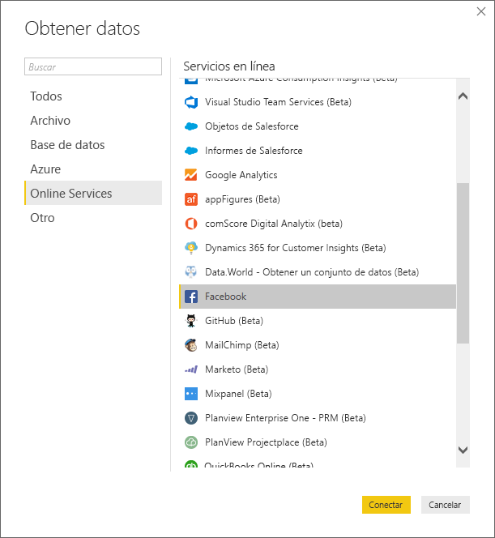
   
   Aparecerá un cuadro de diálogo para avisarle de los riesgos que implica usar un servicio de terceros.
   
   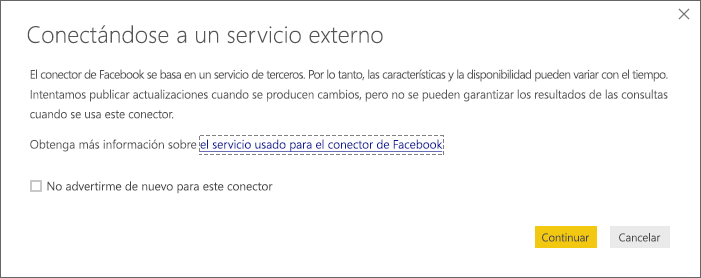
   
3. Seleccione **Continuar**. 
   
4. En el cuadro de diálogo **Facebook**, escriba el nombre de la página **microsoftbi** como **Nombre de usuario**, seleccione **Publicaciones** en el menú desplegable **Conexión** y, luego, seleccione **Aceptar**.
   
   
   
5. Cuando se le pidan credenciales, inicie sesión en la cuenta de Facebook y permita que Power BI acceda a ella.
   
   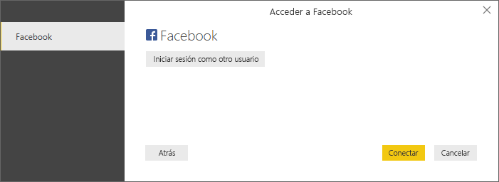

   Después de conectarse a la página de Facebook de Power BI, verá una vista previa de los datos de publicaciones de la página. 
   
   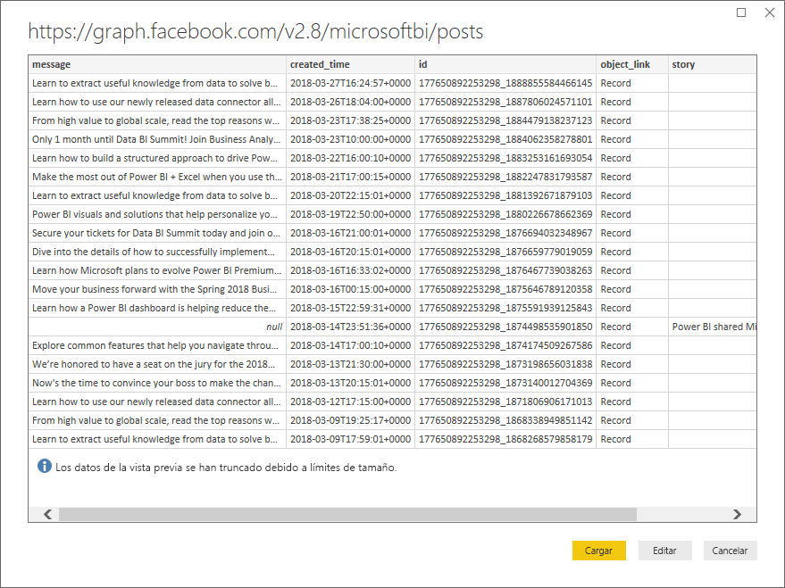
   
## Dar forma y transformar los datos importados

Imagine que quiere ver y mostrar las publicaciones que tienen más comentarios en el tiempo, pero en la vista previa de los datos de publicaciones observa que los datos **created_time** son difíciles de leer y comprender, y que no hay ningún dato de los comentarios. Para aprovechar los datos al máximo, debe darles forma y limpiarlos de alguna manera. Para ello, use el Editor de Power Query de Power BI Desktop para editar los datos, antes o después de importarlos a Power BI Desktop. 

### División de la columna de fecha y hora

En primer lugar, separe los valores de fecha y hora en la columna **created_time** para que sean más legibles. 

1. Seleccione **Editar** en la vista previa de los datos de Facebook. 
   
   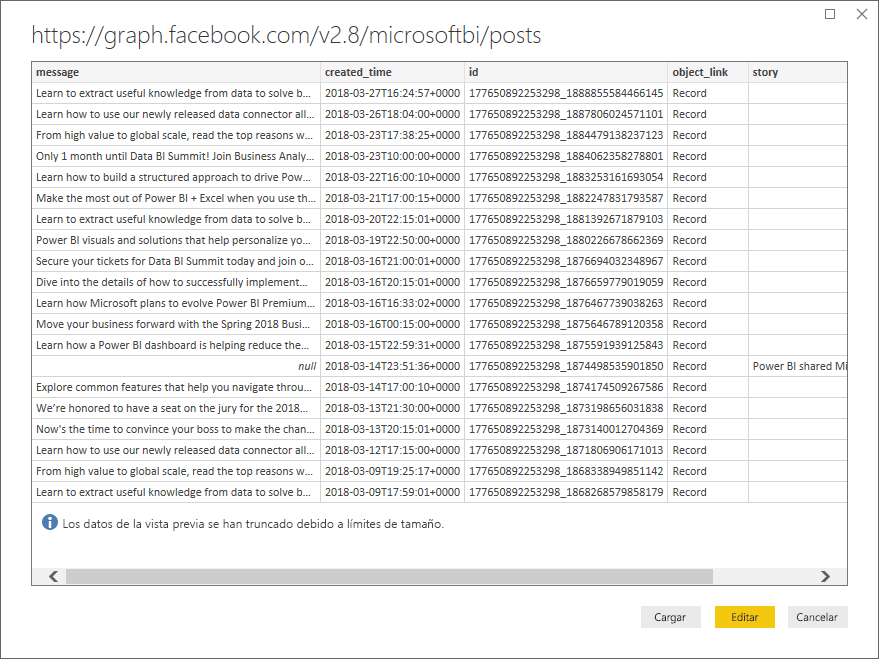
   
   El Editor de Power Query de Power BI Desktop se abre en una ventana nueva y muestra la vista previa de los datos de la página de Power BI en Facebook. 
   
   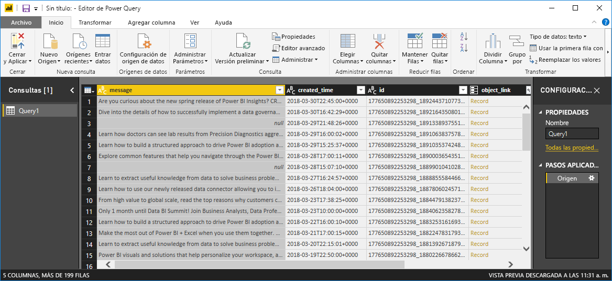
   
2. Seleccione la columna **created_time**. Observe que es un tipo de datos **Texto**, como indica un icono **ABC** en el encabezado de la columna. Haga clic con el botón derecho en el encabezado y seleccione **Dividir columna** > **Por delimitador** en la lista desplegable. O bien, seleccione **Dividir columna** > **Por delimitador** en el grupo **Transformar** de la pestaña **Inicio** de la cinta.  
   
   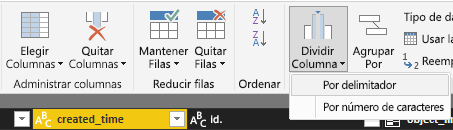
   
3. En el cuadro de diálogo **Dividir columna por delimitador**, seleccione **Personalizar** en la lista desplegable, escriba **T** (el carácter con que empieza la parte de la hora de los valores **created_time**) en el campo de entrada y, después, seleccione **Aceptar**. 
   
   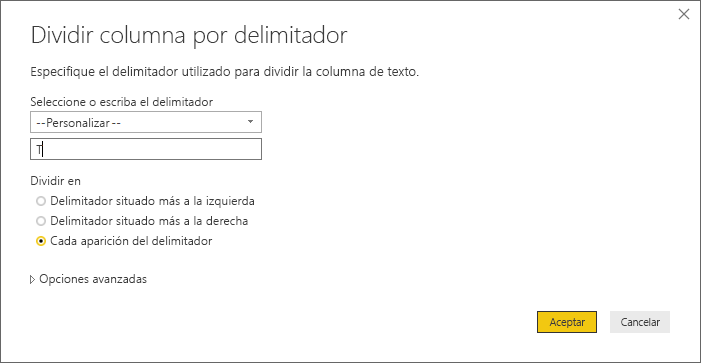
   
   La columna se divide en dos columnas que contienen las cadenas antes y después del delimitador *T*. Las nuevas columnas se denominan **created_time.1** y **created_time.2**, respectivamente. Power BI ha detectado y cambiado automáticamente los tipos de datos a **Date** para la primera columna y a **Time** para la segunda, y ha aplicado formato a los valores de fecha y hora para hacerlos más legibles.
   
4. Cambie el nombre de las dos columnas. Seleccione la columna **created_time.1** y después **Cambiar nombre** en el grupo **Cualquier columna** de la pestaña **Transformar** de la cinta. O bien, haga doble clic en el encabezado de columna y escriba el nuevo nombre de columna, **created_date**. Repita el procedimiento para la columna **created_time.2** y cambie el nombre por **created_time**.
   
   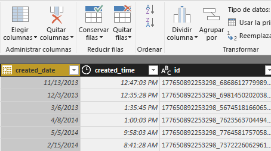
   
### Expansión de la columna anidada

Ahora que los datos de fecha y hora tienen el formato que quiere, puede exponer los datos de comentarios mediante la expansión de una columna anidada. 

1. Seleccione el icono  situado obre la columna **object_link** para abrir el cuadro de diálogo **Expandir/agregar**. Seleccione **connections** (conexiones) y, luego, **Aceptar**. 
   
   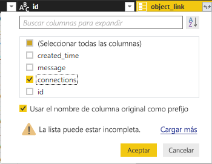
   
   El encabezado de columna cambia a **object_link.connections**.
2. Seleccione el icono  de la parte superior de la columna **object_link.connections**, seleccione **comments** (comentarios) y, luego, **Aceptar**. El encabezado de columna cambia a **object_link.connections.comments**.
   
3. Seleccione el icono  de la parte superior de la columna **object_link.connections.comments** y, esta vez, seleccione **Aggregate** (Agregar) en lugar de **Expand** (Expandir) en el cuadro de diálogo. Seleccione **# Count of id** (Recuento de identificador) y seleccione **Aceptar**. 
   
   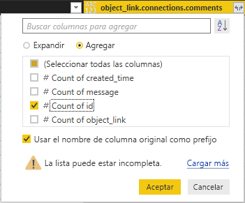
   
   Ahora la columna muestra el número de comentarios para cada mensaje. 
   
4. Cambie el nombre de la columna **Count of object_link.connections.comments.id** (Recuento de object_link.connections.comments.id) a **Number of comments** (Número de comentarios).
   
5. Seleccione la flecha hacia abajo que se encuentra junto al encabezado de columna **Número de comentarios** y seleccione **Orden descendente** para ver primero las publicaciones que tienen más comentarios. 
   
   
   
### Revisión de los pasos de la consulta

A medida que da forma a los datos y los transforma en el Editor de Power Query, cada paso se registra en el área **Pasos aplicados** del panel **Configuración de la consulta** situado a la derecha de la ventana del **Editor de Power Query**. Puede retroceder por los **Pasos aplicados** para ver exactamente qué cambios ha realizado y modificarlos, eliminarlos o reorganizarlos si es necesario. Tenga cuidado al modificar estos pasos, ya que cambiar los pasos anteriores puede interrumpir los siguientes. 

Después de aplicar las transformaciones de los datos, los **Pasos aplicados** deben ser similares a los siguientes:
   
   
   
   >[!TIP]
   >Subyacentes a los **pasos aplicados** hay fórmulas escritas en el [lenguaje de fórmulas M de Power Query](https://docs.microsoft.com/powerquery-m/quick-tour-of-the-power-query-m-formula-language). Para ver y editar las fórmulas, seleccione **Editor avanzado** en el grupo de **consultas** de la pestaña **Inicio** de la cinta de opciones. 

### Importación de los datos transformados

Cuando esté satisfecho con los datos, seleccione **Cerrar y aplicar** > **Cerrar y aplicar** en la pestaña **Inicio** de la cinta para importarlos a Power BI Desktop. 
   
   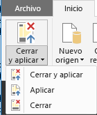
   
   Un cuadro de diálogo muestra el progreso de la carga de los datos en el modelo de datos de Power BI Desktop. 
   
   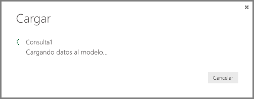
   
   Una vez que se han cargado los datos, aparecen en la vista **Informe** como una consulta nueva en el panel **Campos**.
   
   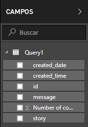
   
## Uso de los datos en visualizaciones de informe 

Ahora que importó datos desde la página de Facebook, puede obtener rápida y fácilmente conclusiones sobre los datos mediante las visualizaciones. La creación de una visualización es un proceso sencillo: solo debe seleccionar un campo o arrastrarlo desde el panel **Campos** al lienzo del informe.

### Creación de un gráfico de barras

1. En la vista **Informe** de Power BI Desktop, seleccione **message** en el panel **Campos**, o bien arrástrelo al lienzo del informe. Aparece una tabla que muestra todos los mensajes de publicaciones en el lienzo. 
   
   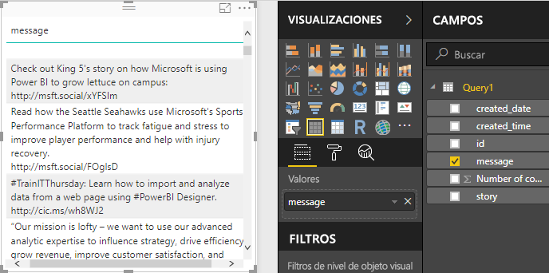
   
2. Con esa tabla seleccionada, seleccione también **Número de comentarios** en el panel **Campos** o arrástrelo a la tabla. 
   
3. Seleccione el icono **Gráfico de barras apiladas** en el panel **Visualizaciones**. La tabla cambia a un gráfico de barras que muestra el número de comentarios por publicación. 
   
   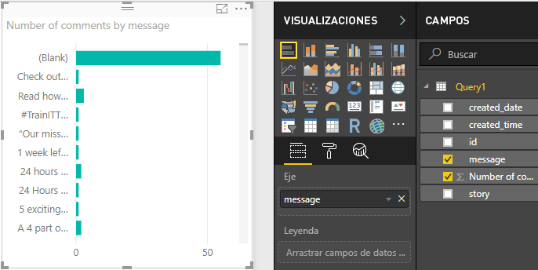
   
4. Seleccione **Más opciones** (…) junto a la visualización y, luego, seleccione **Ordenar por** > **Número de comentarios** para ordenar la tabla por número descendente de comentarios. 

   Observe que la mayoría de los comentarios estaban asociados con mensajes **(En blanco)** (estas publicaciones pueden haber sido historias, vínculos, vídeos u otro tipo de contenido no de texto). 
   
5. Para filtrar la fila en blanco, seleccione **message is (All)** en el panel **Filtros**, seleccione **Seleccionar todo** y después **(En blanco)** para anular la selección. 

   La entrada del panel **Filtros** cambia a **message is not (Blank)** (el mensaje no está en blanco) y la fila **(En blanco)** desaparece de la visualización del gráfico.
   
   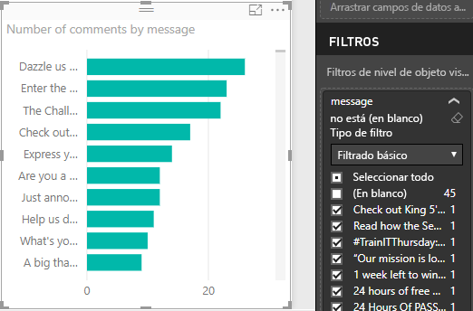
   
### Dar formato al gráfico

La visualización se vuelve cada vez más interesante, pero no puede ver gran parte del texto de las publicaciones en el gráfico. Para mostrar más del texto de las publicaciones:

1. Use los controladores de la visualización de gráfico para ajustar el gráfico al mayor tamaño posible. 
   
2. Con el gráfico seleccionado, seleccione el icono **Formato** (rodillo de pintura) en el panel **Visualizaciones**.
   
3. Seleccione la flecha hacia abajo situada junto al **Eje Y** y arrastre el control deslizante **Tamaño máximo** completamente a la derecha (**50 %** ). 
4. Reduzca también el **Tamaño del texto** a **10 pt** para que quepa más texto.
   
   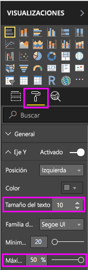
   
   Ahora el gráfico muestra más contenido de las publicaciones. 
   
   
   
En el eje X (número de comentarios) del gráfico no se muestran valores exactos y se ve perdido en la parte inferior del gráfico. En su lugar, se usarán etiquetas de datos: 

1. Seleccione el icono **Formato** y, luego, establezca el control deslizante del **Eje X** en **Desactivado**. 
   
2. Establezca el control deslizante **Etiquetas de datos** en **Activado**. 

   El gráfico ahora muestra el número exacto de comentarios de cada publicación.
   
   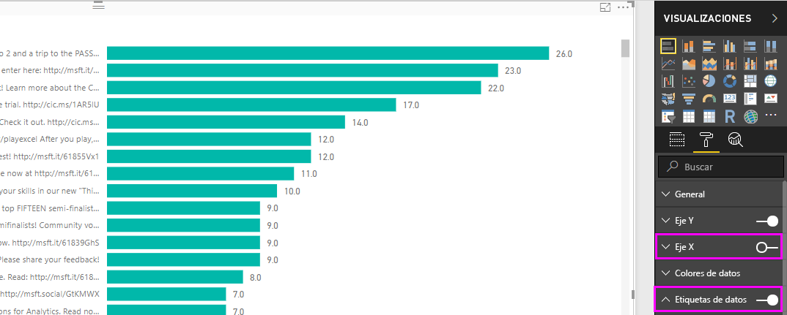
   
### Edición del tipo de datos

Así está mejor, pero todas las etiquetas de datos tienen una posición decimal **,0**, que es confusa y puede inducir a error, porque el **número de publicaciones** debe ser un número entero. Para corregirlas, tendrá que cambiar el tipo de datos de la columna **Number of posts** (Número de publicaciones) a **Número entero**:

1. Haga clic con el botón derecho en **Consulta1** en el panel **Campos**, o bien mantenga el mouse sobre él y seleccione **Más opciones** (...). 

2. En el menú contextual, seleccione **Editar consulta**. O bien, seleccione **Editar consultas** > **Editar consultas** en el grupo **Datos externos** de la pestaña **Inicio** de la cinta. 
   
3. En la ventana **Editor de Power Query**, seleccione la columna **Número de comentarios** y siga uno de estos pasos para cambiar el tipo de datos: 
   - Seleccione el icono **1.2** situado junto al encabezado de la columna **Número de comentarios** y seleccione **Número entero** en la lista desplegable
   - Haga clic con el botón derecho en el encabezado de columna y, después, seleccione **Cambiar tipo** > **Número entero**.
   - Seleccione **Tipo de datos: número decimal** en el grupo **Transformar** de la pestaña **Inicio** o bien, en el grupo **Cualquier columna** de la pestaña **Transformar** y luego seleccione **Número entero**.
   
   El icono del encabezado de columna cambia a **123**, lo que indica un tipo de datos **Número entero**.
   
   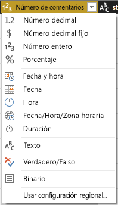
   
3. Para aplicar los cambios, seleccione **Archivo** > **Cerrar y aplicar**, o bien **Archivo** > **Aplicar** para mantener abierta la ventana **Editor de Power Query**. 

   Después de que se carguen los cambios, las etiquetas de datos del gráfico se convierten en números enteros.
   
   
   
### Creación de una segmentación de fecha

Imagine que quiere visualizar el número de comentarios en las publicaciones en el tiempo. Puede crear una visualización de segmentación para filtrar los datos de gráfico para distintos intervalos de tiempo. 

1. Seleccione un área en blanco del lienzo y, luego, seleccione el icono **Segmentación** del panel **Visualizaciones**. 

   Aparece una visualización de segmentación en blanco.
   
   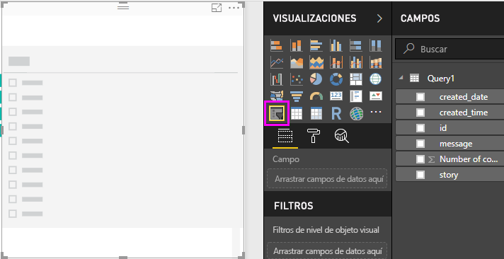
   
2. Seleccione el campo **created_date** en el panel **Campos**, o bien arrástrelo a la nueva segmentación. 

   La segmentación cambia a un control deslizante de intervalo de fecha, en función del tipo de datos **Fecha** del campo.
   
   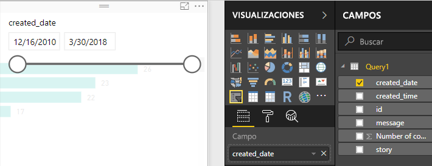
   
3. Mueva los manipuladores del control deslizante para seleccionar distintos intervalos de fecha y observe cómo los filtros de datos del gráfico cambian según corresponda. También puede seleccionar los campos de fecha en la segmentación y escribir fechas específicas o seleccionarlas en un calendario emergente.
    
   
   
### Formato de las visualizaciones

Asigne al gráfico un título más descriptivo y atractivo: 

1. Con el gráfico seleccionado, seleccione el icono **Formato** en el panel **Visualizaciones** y, después, seleccione la flecha desplegable situada junto a **Título** para expandirlo.

2. Cambie el **texto del título** a **Comentarios por publicación**. 

3. Seleccione la flecha desplegable situada junto a **Color de fuente** y un color verde que coincida con las barras verdes de la visualización.

4. Aumente el **Tamaño del texto** a **10 pt** y cambie la **Familia de fuentes** a **Segoe (negrita)** .

5. Experimente con otras configuraciones y opciones de formato para cambiar la apariencia de las visualizaciones. 

   

## Creación de más visualizaciones

Como puede ver, es fácil personalizar las visualizaciones del informe para mostrar los datos tal como quiera hacerlo. Por ejemplo, intente usar los datos importados de Facebook para crear este gráfico de líneas en el que se muestra el número de comentarios en el tiempo.

Power BI Desktop ofrece una experiencia perfectamente integrada que va desde la obtención de datos procedentes de una amplia gama de orígenes hasta su manipulación para adaptarlos a cualquier necesidad de análisis y su visualización de forma enriquecida e interactiva. Cuando el informe esté listo, puede [cargarlo en el servicio Power BI](desktop-upload-desktop-files.md) y crear paneles basados en él para compartirlos con otros usuarios de Power BI.

## Pasos siguientes
* [Lea otros tutoriales de Power BI Desktop](https://go.microsoft.com/fwlink/?LinkID=521937)
* [Vea vídeos de Power BI Desktop](https://go.microsoft.com/fwlink/?LinkID=519322)
* [Visite el foro de Power BI](https://go.microsoft.com/fwlink/?LinkID=519326)
* [Lea el blog de Power BI](https://go.microsoft.com/fwlink/?LinkID=519327)

