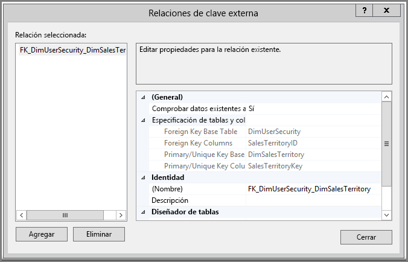
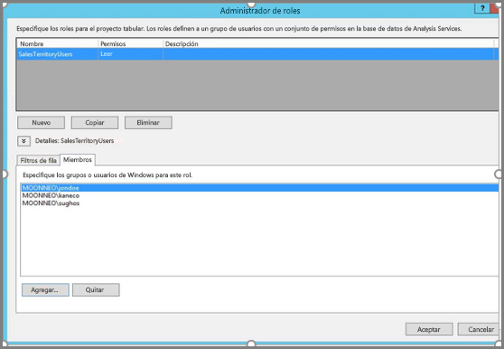
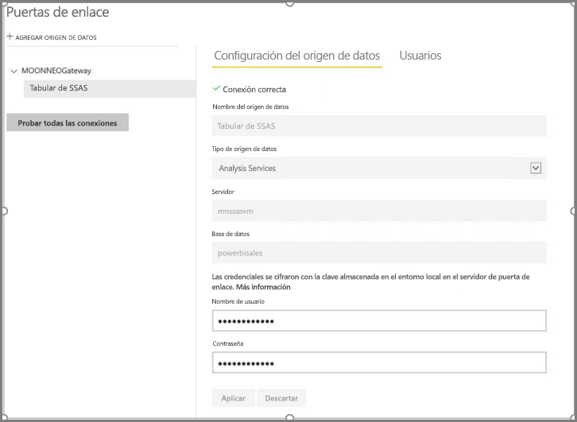
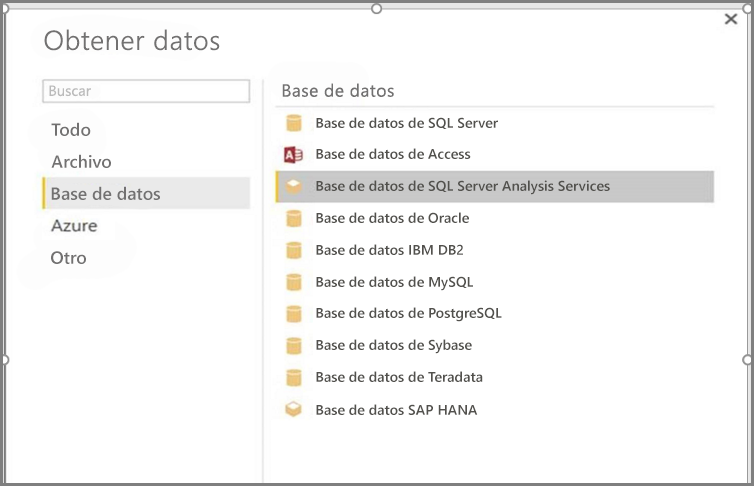
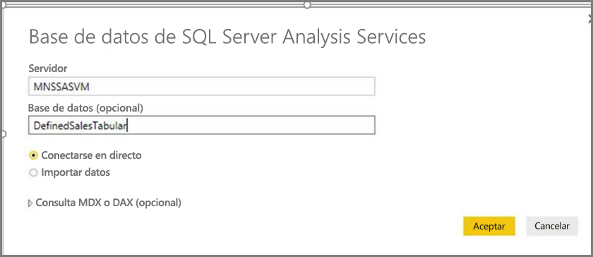
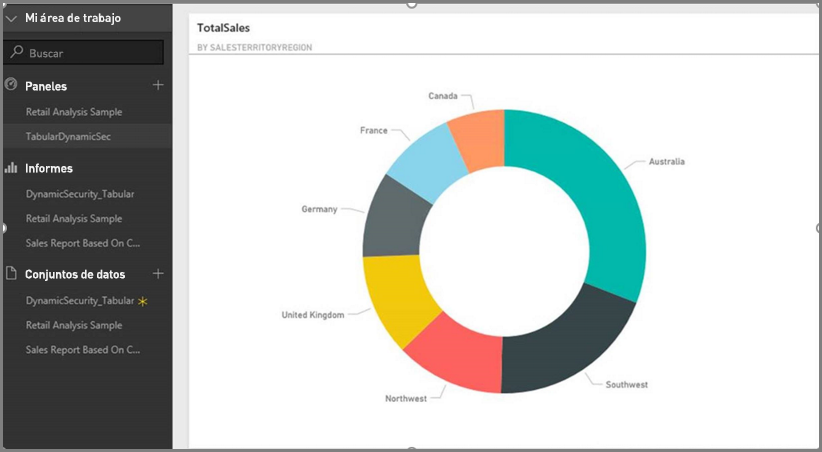
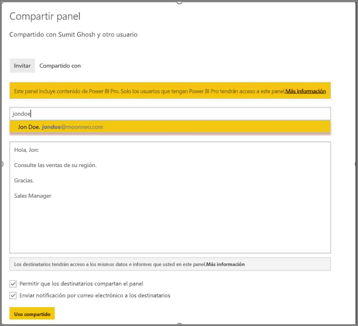

# <a name="implement-row-level-security-in-an-analysis-services-tabular-model"></a>Implementación de seguridad de nivel de fila en un modelo tabular de Analysis Services

Con un conjunto de datos de ejemplo con el que se trabaja en los pasos siguientes, este tutorial muestra cómo implementar la [**seguridad de nivel de fila**](service-admin-rls.md) en un *modelo Tabular de Analysis Services* y su uso en un informe de Power BI.

* Creación de una nueva tabla de seguridad en la [base de datos AdventureworksDW2012](https://github.com/Microsoft/sql-server-samples/releases/tag/adventureworks)
* Generar el modelo tabular con las tablas de hechos y dimensiones necesarias
* Definir los permisos y roles de usuario
* Implementar el modelo en una instancia *tabular de Analysis Services*
* Crear un informe de Power BI Desktop que muestre los datos correspondientes al usuario que accede al informe
* Implementar el informe en el *servicio Power BI*
* Crear un nuevo panel basado en el informe
* Compartir el panel con sus compañeros

Este tutorial requiere la [base de datos AdventureworksDW2012](https://github.com/Microsoft/sql-server-samples/releases/tag/adventureworks).

## <a name="task-1-create-the-user-security-table-and-define-data-relationship"></a>Tarea 1: Crear la tabla de seguridad del usuario y definir la relación de los datos

Puede encontrar muchos artículos en los que se describe cómo definir la seguridad de nivel de fila dinámica con el modelo *tabular de SQL Server Analysis Services (SSAS)* . Para nuestro ejemplo seguiremos el artículo [Implementar seguridad dinámica utilizando filtros de fila](/analysis-services/tutorial-tabular-1200/supplemental-lesson-implement-dynamic-security-by-using-row-filters).

Estos pasos requieren el uso de la base de datos relacional AdventureworksDW2012.

1. En AdventureworksDW2012, cree la tabla `DimUserSecurity`, tal como se muestra debajo. Puede usar [SQL Server Management Studio (SSMS)](/sql/ssms/download-sql-server-management-studio-ssms) para crear la tabla.

   

1. Una vez que cree y guarde la tabla, debe establecer la relación entre la columna `SalesTerritoryID` de la tabla `DimUserSecurity` y la columna `SalesTerritoryKey` de la tabla `DimSalesTerritory`, tal como se muestra debajo.

   En SSMS, haga clic con el botón derecho en **DimUserSecurity** y seleccione **Diseño**. Después, seleccione **Diseñador de tablas** > **Relaciones...** . Cuando haya terminado, guarde la tabla.

   

1. Agregue usuarios a la tabla. Haga clic con el botón derecho en **DimUserSecurity** y seleccione **Editar las primeras 200 filas**. Una vez agregados los usuarios, la tabla `DimUserSecurity` debe ser similar a la del ejemplo siguiente:

   

   Volveremos a estos usuarios en tareas futuras.

1. Después, debe realizar una *combinación interna* con la tabla `DimSalesTerritory`, que muestra los detalles de la región asociados con el usuario. Este código SQL realiza la combinación interna y la imagen muestra cómo aparece después la tabla.

    ```sql
    select b.SalesTerritoryCountry, b.SalesTerritoryRegion, a.EmployeeID, a.FirstName, a.LastName, a.UserName from [dbo].[DimUserSecurity] as a join [dbo].[DimSalesTerritory] as b on a.[SalesTerritoryID] = b.[SalesTerritoryKey]
    ```

   La tabla combinada muestra quién es responsable de cada región de ventas, gracias a la relación que se creó en el paso 2. Por ejemplo, puede ver que *Rita Santos* es responsable de *Australia*.

## <a name="task-2-create-the-tabular-model-with-facts-and-dimension-tables"></a>Tarea 2: Crear el modelo tabular con tablas de hechos y dimensiones

Una vez que el almacenamiento de datos relacionales está listo, es el momento de definir el modelo tabular. El modelo se puede crear con [SQL Server Data Tools](/sql/ssdt/sql-server-data-tools) (SSDT). Para más información, consulte [Crear un nuevo proyecto de modelo tabular](/sql/analysis-services/lesson-1-create-a-new-tabular-model-project).

1. Importe todas las tablas necesarias en el modelo tal y como se muestra a continuación.

    

1. Una vez que haya importado las tablas necesarias, debe definir un rol denominado *SalesTerritoryUsers* con permiso de lectura. Seleccione el menú **Modelo** en SQL Server Data Tools y, a continuación, seleccione **Roles**. En **Administrador de roles**, seleccione **Nuevo**.

1. En **Miembros**, en el **Administrador de roles**, agregue los usuarios que ha definido en la tabla `DimUserSecurity` de la [Tarea 1](#task-1-create-the-user-security-table-and-define-data-relationship).

    

1. Después, agregue las funciones adecuadas para las tablas `DimSalesTerritory` y `DimUserSecurity`, tal como se muestra debajo de la pestaña **Filtros de fila**.

    

1. La función `LOOKUPVALUE` devuelve valores para una columna en la que el nombre de usuario de Windows coincide con el valor que devuelve la función `USERNAME`. Después, puede restringir las consultas a aquellas en las que los valores que devuelve `LOOKUPVALUE` coincidan con los de la propia tabla o la relacionada. En la columna **Filtro DAX**, escriba la siguiente fórmula:

    ```dax
        =DimSalesTerritory[SalesTerritoryKey]=LOOKUPVALUE(DimUserSecurity[SalesTerritoryID], DimUserSecurity[UserName], USERNAME(), DimUserSecurity[SalesTerritoryID], DimSalesTerritory[SalesTerritoryKey])
    ```

    En esta fórmula, la función `LOOKUPVALUE` devuelve todos los valores de la columna `DimUserSecurity[SalesTerritoryID]`, donde `DimUserSecurity[UserName]` es equivale al nombre de usuario actual que ha iniciado sesión en Windows y `DimUserSecurity[SalesTerritoryID]` es igual que `DimSalesTerritory[SalesTerritoryKey]`.

    > [!IMPORTANT]
    > Al usar la seguridad de nivel de fila, no se admite la función DAX [USERELATIONSHIP](/dax/userelationship-function-dax).

   Después, se utiliza el conjunto de devoluciones `LOOKUPVALUE` de `SalesTerritoryKey` de ventas para restringir las filas que se muestran en `DimSalesTerritory`. Solo se muestran las filas en las que el valor de `SalesTerritoryKey` está entre los identificadores que devuelve la función `LOOKUPVALUE`.

1. En la tabla `DimUserSecurity`, en la columna **Filtro DAX**, agregue la siguiente fórmula:

    ```dax
        =FALSE()
    ```

    Esta fórmula especifica que todas las columnas se resuelven en `false`, lo que significa que no se pueden consultar las columnas de la tabla `DimUserSecurity`.

Ahora tiene que procesar e implementar el modelo. Para obtener más información, consulte [Implementación](/sql/analysis-services/lesson-13-deploy).

## <a name="task-3-add-data-sources-within-your-on-premises-data-gateway"></a>Tarea 3: Agregar orígenes de datos de la puerta de enlace de datos local

Una vez que el modelo tabular está implementado y listo para su uso, debe agregar una conexión de origen de datos al servidor tabular de Analysis Services local.

1. Para permitir que el servicio Power BI acceda a su servicio de análisis local, es preciso disponer de una [puerta de enlace de datos local](service-gateway-onprem.md) instalada y configurada en el entorno.

1. Una vez que la puerta de enlace esté configurada correctamente, debe crear una conexión de origen de datos para la instancia tabular de *Analysis Services*. Para más información, consulte [Administrar el origen de datos: Analysis Services](service-gateway-enterprise-manage-ssas.md).

   

Una vez concluido el procedimiento, la puerta de enlace estará configurada y lista para interactuar con el origen de datos local de Analysis Services.

## <a name="task-4-create-report-based-on-analysis-services-tabular-model-using-power-bi-desktop"></a>Tarea 4: Crear un informe basado en el modelo tabular de Analysis Services con Power BI Desktop

1. Inicie Power BI Desktop y seleccione **Obtener datos** > **Base de datos**.

1. En la lista de orígenes de datos, seleccione **Base de datos de SQL Server Analysis Services** y seleccione **Conectar**.

   

1. Rellene los detalles de la instancia tabular de Analysis Services y seleccione **Conectar en directo**. Después, seleccione **Aceptar**.
  
   

   Con Power BI, la seguridad dinámica solo funciona con una conexión dinámica.

1. Verá que el modelo implementado está en la instancia de Analysis Services. Seleccione el modelo correspondiente y seleccione **Aceptar**.

   Power BI Desktop ahora muestra todos los campos disponibles a la derecha del lienzo en el panel **Campos**.

1. En el panel **Campos**, seleccione la medida **SalesAmount** de la tabla **FactInternetSales** y la dimensión **SalesTerritoryRegion** de la tabla **SalesTerritory**.

1. Para simplificar este informe, no agregaremos más columnas ahora mismo. Para tener una representación más significativa de los datos, cambiamos la visualización a **Gráfico de anillos**.

   

1. Una vez que el informe esté listo, puede publicarlo directamente en el portal de Power BI. En la cinta de opciones **Inicio** de Power BI Desktop, seleccione **Publicar**.

## <a name="task-5-create-and-share-a-dashboard"></a>Tarea 5: Crear y compartir un panel

Ha creado el informe y lo ha publicado en el servicio **Power BI**. Ahora puede usar el ejemplo creado en los pasos anteriores para demostrar el escenario de seguridad del modelo.

En el rol *Director de ventas*, la usuaria Gracia puede ver los datos de todas las regiones de ventas. Gracia crea este informe y lo publica en el servicio Power BI. Este informe se ha creado en las tareas anteriores.

Una vez que Gracia publica el informe, el siguiente paso consiste en crear un panel en el servicio Power BI llamado *TabularDynamicSec* que se basa en ese informe. En la siguiente imagen, observe que Gracia puede ver los datos correspondientes a todas las regiones de ventas.

   

Ahora Gracia comparte el panel con su compañera, Rita, responsable de ventas de la región de Australia.

   

Cuando Rita inicia sesión en el servicio Power BI y ve el panel compartido que ha creado Gracia, solo deberían ser visibles las ventas de la región de Australia.

¡Enhorabuena! El servicio Power BI muestra la seguridad de nivel de fila dinámica definida en el modelo tabular de Analysis Services local. Power BI usa la propiedad `EffectiveUserName` para enviar las credenciales de usuario de Power BI actuales al origen de datos local para ejecutar las consultas.

## <a name="task-6-understand-what-happens-behind-the-scenes"></a>Tarea 6: Comprender lo que sucede en segundo plano

En esta tarea se supone que está familiarizado con [SQL Server Profiler](/sql/tools/sql-server-profiler/sql-server-profiler), ya que tiene que capturar un seguimiento de SQL Server Profiler en la instancia tabular de SSAS local.

La sesión se inicializa en cuanto la usuaria (Rita) accede al panel en el servicio Power BI. Puede ver que el rol **salesterritoryusers** tiene efecto inmediato con el nombre de usuario vigente como **<EffectiveUserName>rita@contoso.com</EffectiveUserName>** .

       <PropertyList><Catalog>DefinedSalesTabular</Catalog><Timeout>600</Timeout><Content>SchemaData</Content><Format>Tabular</Format><AxisFormat>TupleFormat</AxisFormat><BeginRange>-1</BeginRange><EndRange>-1</EndRange><ShowHiddenCubes>false</ShowHiddenCubes><VisualMode>0</VisualMode><DbpropMsmdFlattened2>true</DbpropMsmdFlattened2><SspropInitAppName>PowerBI</SspropInitAppName><SecuredCellValue>0</SecuredCellValue><ImpactAnalysis>false</ImpactAnalysis><SQLQueryMode>Calculated</SQLQueryMode><ClientProcessID>6408</ClientProcessID><Cube>Model</Cube><ReturnCellProperties>true</ReturnCellProperties><CommitTimeout>0</CommitTimeout><ForceCommitTimeout>0</ForceCommitTimeout><ExecutionMode>Execute</ExecutionMode><RealTimeOlap>false</RealTimeOlap><MdxMissingMemberMode>Default</MdxMissingMemberMode><DisablePrefetchFacts>false</DisablePrefetchFacts><UpdateIsolationLevel>2</UpdateIsolationLevel><DbpropMsmdOptimizeResponse>0</DbpropMsmdOptimizeResponse><ResponseEncoding>Default</ResponseEncoding><DirectQueryMode>Default</DirectQueryMode><DbpropMsmdActivityID>4ea2a372-dd2f-4edd-a8ca-1b909b4165b5</DbpropMsmdActivityID><DbpropMsmdRequestID>2313cf77-b881-015d-e6da-eda9846d42db</DbpropMsmdRequestID><LocaleIdentifier>1033</LocaleIdentifier><EffectiveUserName>rita@contoso.com</EffectiveUserName></PropertyList>

Según la solicitud de nombre de usuario vigente, Analysis Services convierte la solicitud a la credencial real de `contoso\rita` después de consultar Active Directory local. Una vez que Analysis Services obtiene la credencial, Analysis Services devuelve los datos para los que el usuario tiene permiso de visualización y acceso.

Si se produce más actividad con el panel, con SQL Profiler verá una consulta específica que vuelve al modelo tabular de Analysis Services como una consulta DAX. Por ejemplo, si Rita va del panel al informe subyacente, se produce la siguiente consulta.

   

También puede ver a continuación la consulta DAX que se ejecuta para rellenar los datos para el informe.
   
   ```dax
   EVALUATE
     ROW(
       "SumEmployeeKey", CALCULATE(SUM(Employee[EmployeeKey]))
     )
   
   <PropertyList xmlns="urn:schemas-microsoft-com:xml-analysis">``
             <Catalog>DefinedSalesTabular</Catalog>
             <Cube>Model</Cube>
             <SspropInitAppName>PowerBI</SspropInitAppName>
             <EffectiveUserName>rita@contoso.com</EffectiveUserName>
             <LocaleIdentifier>1033</LocaleIdentifier>
             <ClientProcessID>6408</ClientProcessID>
             <Format>Tabular</Format>
             <Content>SchemaData</Content>
             <Timeout>600</Timeout>
             <DbpropMsmdRequestID>8510d758-f07b-a025-8fb3-a0540189ff79</DbpropMsmdRequestID>
             <DbPropMsmdActivityID>f2dbe8a3-ef51-4d70-a879-5f02a502b2c3</DbPropMsmdActivityID>
             <ReturnCellProperties>true</ReturnCellProperties>
             <DbpropMsmdFlattened2>true</DbpropMsmdFlattened2>
             <DbpropMsmdActivityID>f2dbe8a3-ef51-4d70-a879-5f02a502b2c3</DbpropMsmdActivityID>
           </PropertyList>
   ```

## <a name="considerations"></a>Consideraciones

* La seguridad de nivel de fila local con Power BI solo está disponible con conexión dinámica.

* Cualquier cambio efectuado en los datos después de procesar el modelo estaría inmediatamente disponible para los usuarios que accedieran al informe con Conexión dinámica desde el servicio Power BI.

