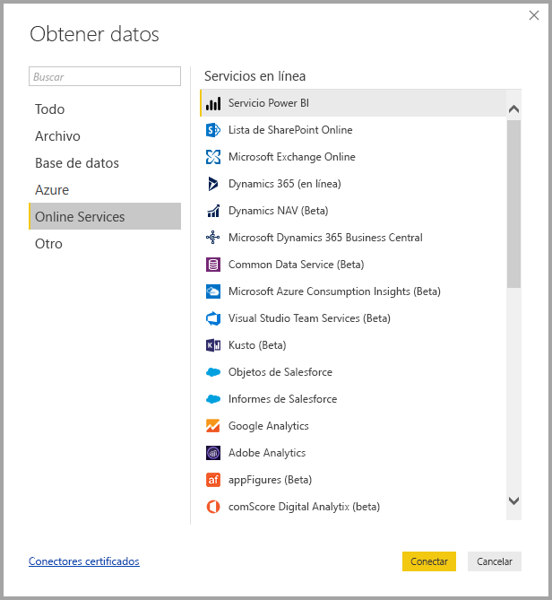
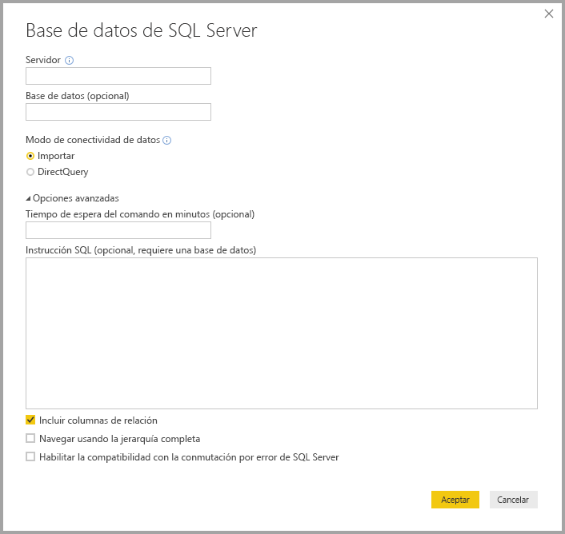
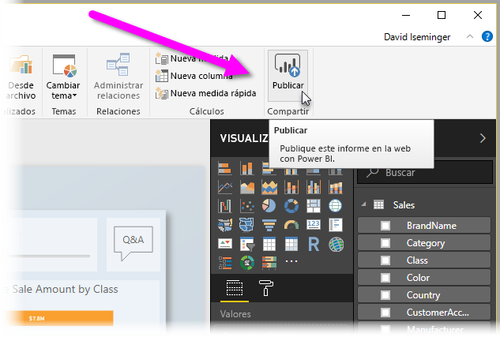

# ¿Qué es Power BI Desktop?

**Power BI Desktop** es una aplicación gratuita que se puede instalar en el equipo local y que le permite conectarse a los datos, transformarlos y visualizarlos. Con **Power BI Desktop**, puede conectarse a varios orígenes de datos diferentes y combinarlos (operación conocida también como modelado) en un modelo de datos que le permite crear objetos visuales y recopilaciones de objetos visuales que puede compartir como informes con otras personas dentro de la organización. La mayoría de los usuarios que trabajan con proyectos de inteligencia empresarial usan **Power BI Desktop** para crear informes y luego usan el **servicio Power BI** para compartir sus informes con los demás.

Los usos más comunes de **Power BI Desktop** son los siguientes:

* Conectar a datos
* Transformar y limpiar datos, para crear un modelo de datos
* Crear objetos visuales, como gráficos o grafos, que proporcionan representaciones visuales de los datos
* Crear informes que son colecciones de objetos visuales, en una o varias páginas de informes
* Compartir informes con otros usuarios mediante el **servicio Power BI**

A las personas que suelen hacerse responsables de tales tareas se les considera a menudo como *analistas de datos* (a los que a veces se hace referencia solo con el término *analistas*) o profesionales de inteligencia empresarial (a menudo conocidos como *creadores de informes*). Sin embargo, muchas personas que no se consideran analistas o creadores de informes usan **Power BI Desktop** para crear informes atractivos o para extraer datos de varios orígenes y crear modelos de datos, que pueden compartir con sus compañeros de trabajo y organizaciones.

Hay tres vistas en Power BI Desktop, que se muestran a lo largo del lado izquierdo del lienzo. Las vistas, que se muestran en el orden en que aparecen, son las siguientes:
* **Vista de informe**: es aquí donde crea informes y objetos visuales y donde pasa la mayor parte del tiempo de creación.
* **Vista de datos**: es aquí donde puede ver las tablas, las medidas y otros datos que se usan en el modelo de datos asociado con el informe y transformar los datos para usarlos de mejor manera en el modelo del informe.
* **Vista de modelo**: en esta vista, puede ver y administrar las relaciones entre las tablas del modelo de datos.

En la imagen siguiente se ven las tres vistas, tal como se muestran a lo largo del lado izquierdo del lienzo:

Con **Power BI Desktop**, puede crear informes complejos y enriquecidos visualmente, mediante los datos de varios orígenes, todo en un informe que se puede compartir con otras personas de su organización. 

## Conectar a datos
Para empezar a trabajar con **Power BI Desktop**, el primer paso es conectarse a los datos. Hay muchos orígenes de datos distintos a los que puede conectarse desde **Power BI Desktop**. Para conectarse a los datos, solo tiene que seleccionar la cinta **Inicio** y luego **Obtener datos > Más**. En la imagen siguiente se muestra la ventana **Obtener datos** que se abre, donde aparecen muchas categorías a las que Power BI Desktop puede conectarse.

Cuando se selecciona un tipo de datos, se le pide información, como la dirección URL y las credenciales, necesaria para que Power BI Desktop se conecte al origen de datos en su nombre.

Una vez que se conecte a uno o varios orígenes de datos, puede que desee transformar los datos para que le resulten útiles.

## Transformación y limpieza de datos y creación de un modelo

En Power BI Desktop, puede limpiar y transformar datos con el **Editor de consultas** integrado. Con el Editor de consultas puede realizar modificaciones en los datos, como cambiar un tipo de datos, quitar columnas o combinar datos de varios orígenes. Es algo parecido a cuando haces una escultura: puedes empezar con un bloque grande de barro o, en este caso, de datos, luego recortar las piezas o agregar otras según sea necesario, hasta conseguir que los datos tengan la forma deseada. 

Cada paso realizado para transformar los datos (como cambiar el nombre de una tabla, transformar un tipo de datos o eliminar columnas) se registra en el **Editor de consultas** y, cada vez que esta consulta se conecta al origen de datos, dichos pasos se vuelven a aplicar para que los datos siempre muestren la forma que especificó.

En la imagen siguiente se muestra el panel **Configuración de la consulta** para una consulta que se ha formado y se ha convertido en un modelo.

 

Una vez que los datos tienen la forma deseada, puede crear objetos viduales. 

## Creación de objetos visuales 

Una vez que tenga un modelo de datos, puede arrastrar *campos* al lienzo del informe para crear *objetos visuales*. Un *objeto visual* es una representación gráfica de los datos del modelo. En el siguiente objeto visual se muestra un gráfico de columna simple. 

Hay muchos tipos diferentes de objetos visuales entre los que elegir en Power BI Desktop. Para crear o cambiar un objeto visual, solo tiene que seleccionar el icono del objeto visual en el panel **Visualizaciones**. Si tiene un objeto visual seleccionado en el lienzo del informe, el objeto visual seleccionado cambia al tipo seleccionado. Si no se selecciona ningún objeto visual, se crea un objeto visual en función de la selección.

## Crear informes

Con mayor frecuencia, tendrá que crear una colección de objetos visuales que muestren diversos aspectos de los datos utilizados para crear el modelo en Power BI Desktop. A una colección de objetos visuales, en un archivo de Power BI Desktop, se le denomina *informe*. Un informe puede tener una o varias páginas, al igual que un archivo de Excel puede tener uno o varias hojas de cálculo. En la siguiente imagen, verá la primera página de un informe de Power BI Desktop, denominada Overview (puede ver la pestaña situada en la parte inferior de la imagen). En este informe, hay diez páginas.

## Compartir informes

Una vez que un informe esté listo para compartirlo con otras personas, puede **publicarlo** en el **servicio Power BI**, a fin de que esté disponible para cualquier persona de su organización que tenga una licencia de Power BI. Para publicar un informe de Power BI Desktop, seleccione el botón **Publicar** en la cinta de opciones **Inicio** en Power BI Desktop.

Una vez que seleccione **Publicar**, Power BI Desktop se conectará al **servicio Power BI** con su cuenta de Power BI y, a continuación, le pedirá que seleccione en qué lugar del servicio Power BI le gustaría compartir el informe; por ejemplo, el área de trabajo, un área de trabajo de equipo o alguna otra ubicación del servicio Power BI. Debe tener una licencia de Power BI para compartir informes en el servicio Power BI.

## Pasos siguientes

Para empezar a trabajar con **Power BI Desktop**, lo primero que necesita es descargar e instalar la aplicación. Hay dos maneras de obtener **Power BI Desktop**:

* [Descargar Power BI Desktop desde la Web](desktop-get-the-desktop.md)
* [Obtener Power BI Desktop de Microsoft Store](http://aka.ms/pbidesktopstore)
