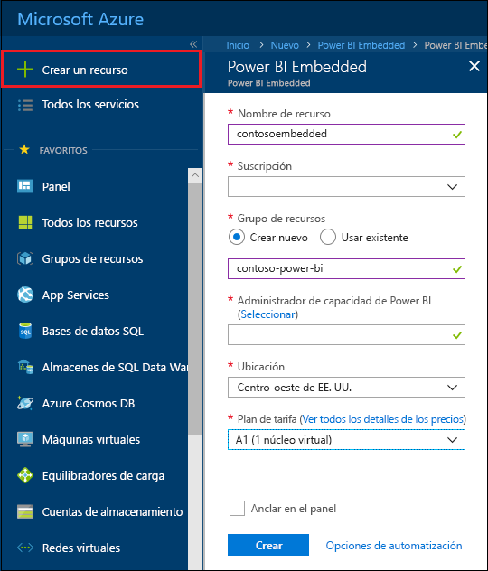
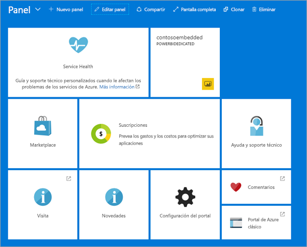

# Creación de una capacidad de Power BI Embedded en Azure Portal

En este artículo se explica cómo crear una capacidad de [Power BI Embedded](azure-pbie-what-is-power-bi-embedded.md) en Microsoft Azure. Power BI Embedded simplifica las capacidades de Power BI, al ayudar a agregar rápidamente objetos visuales, informes y paneles impactantes a las aplicaciones.

Si no tiene ninguna suscripción a Azure, cree una [cuenta gratuita](https://azure.microsoft.com/free/) antes de empezar.

> [!VIDEO https://www.youtube.com/embed/aXrvFfg_iSk]

## Antes de empezar

Para completar este inicio rápido, necesita:

* **Una suscripción a Azure:** visite la [evaluación gratuita de Azure](https://azure.microsoft.com/free/) para crear una cuenta.
* **Azure Active Directory:** la suscripción debe estar asociada con un inquilino de Azure Active Directory (AAD). Además, ***deberá haber iniciado sesión en Azure con una cuenta en ese inquilino***. No se admiten las cuentas de Microsoft. Para más información, vea [Autenticación y permisos de usuario](https://docs.microsoft.com/azure/analysis-services/analysis-services-manage-users).
* **Inquilino de Power BI:** al menos una cuenta del inquilino de AAD debe haberse registrado en Power BI.
* **Grupo de recursos:** use un grupo de recursos existente o [cree uno](https://docs.microsoft.com/azure/azure-resource-manager/resource-group-overview).

## Creación de una capacidad

1. Inicie sesión en [Azure Portal](https://portal.azure.com/).

2. En el cuadro de búsqueda, busque *Power BI Embedded*.

3. Dentro de Power BI Embedded, seleccione **Crear**.

4. Rellene la información necesaria y, después, seleccione **Crear**.

    

    |Configuración |Descripción |
    |---------|---------|
    |**Nombre de recurso**|Nombre que identifica la capacidad. El nombre de recurso se muestra en el portal de administración de Power BI y en Azure Portal.|
    |**Suscripción**|Suscripción con la que le gustaría crear la capacidad.|
    |**Grupo de recursos**|Grupo de recursos que contiene esta nueva capacidad. Elija un grupo de recursos existente o cree uno. Para más información, vea [Información general de Azure Resource Manager](https://docs.microsoft.com/azure/azure-resource-manager/resource-group-overview).|
    |**Administrador de capacidad de Power BI**|Los administradores de capacidad de Power BI pueden ver la capacidad en el portal de administración de Power BI y conceder permisos de asignación a otros usuarios. De forma predeterminada, el administrador de capacidad es su cuenta. El administrador de capacidad debe estar dentro del inquilino de Power BI.|
    |**Ubicación**|Ubicación donde se hospeda Power BI para el inquilino. La ubicación predeterminada es la región principal, pero puede cambiarlas mediante las [opciones de Multi-Geo](embedded-multi-geo.md).
    |**Plan de tarifa**|Seleccione la SKU (número de núcleos virtuales y tamaño de memoria) que satisfaga sus necesidades.  Para más información, vea [Precios de Power BI Embedded](https://azure.microsoft.com/pricing/details/power-bi-embedded/).|

También puede seleccionar **Todos los servicios** > **Power BI Embedded** para ver si la capacidad está lista. Como alternativa, puede hacer clic en **Anclar al panel** desde la sección de notificaciones o la hoja para navegar hasta el panel para ver la nueva capacidad.

## Pasos siguientes

Para usar la nueva capacidad de Power BI Embedded, vaya al portal de administración de Power BI para asignar áreas de trabajo. Para más información, vea [Administración de la capacidad en Power BI Premium y Power BI Embedded](https://powerbi.microsoft.com/documentation/powerbi-admin-premium-manage/).

Si no necesita usar esta capacidad, páusela para detener la facturación. Para más información, vea [Pausar e iniciar una capacidad de Power BI Embedded en Azure Portal](azure-pbie-pause-start.md).

Para empezar a insertar contenido de Power BI en la aplicación, vea [Inserción de un informe, un panel o un icono de Power BI](https://powerbi.microsoft.com/documentation/powerbi-developer-embedding-content/).

¿Tiene más preguntas? [Pruebe a preguntar a la comunidad de Power BI](https://community.powerbi.com/)