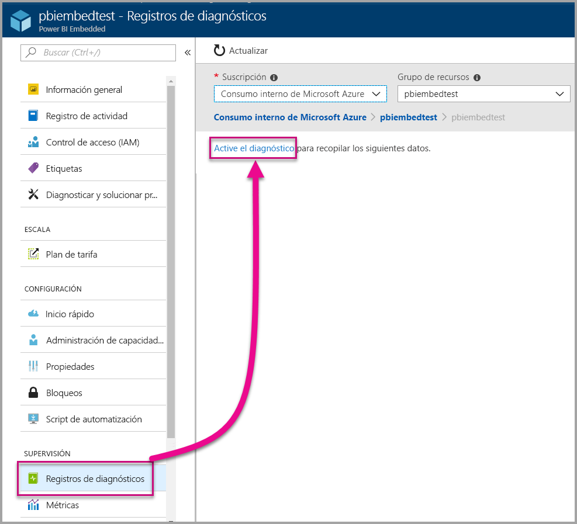
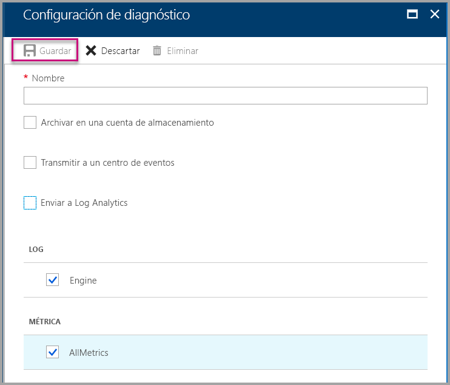
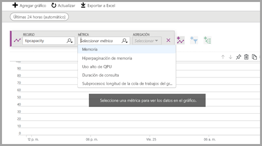
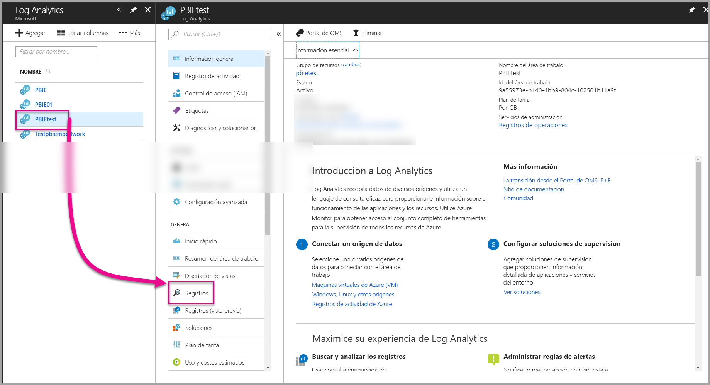
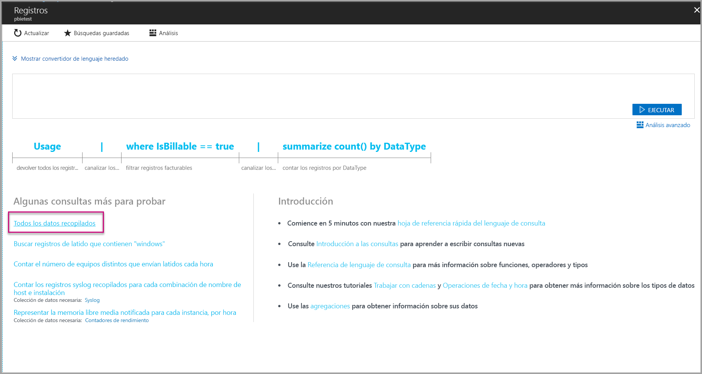
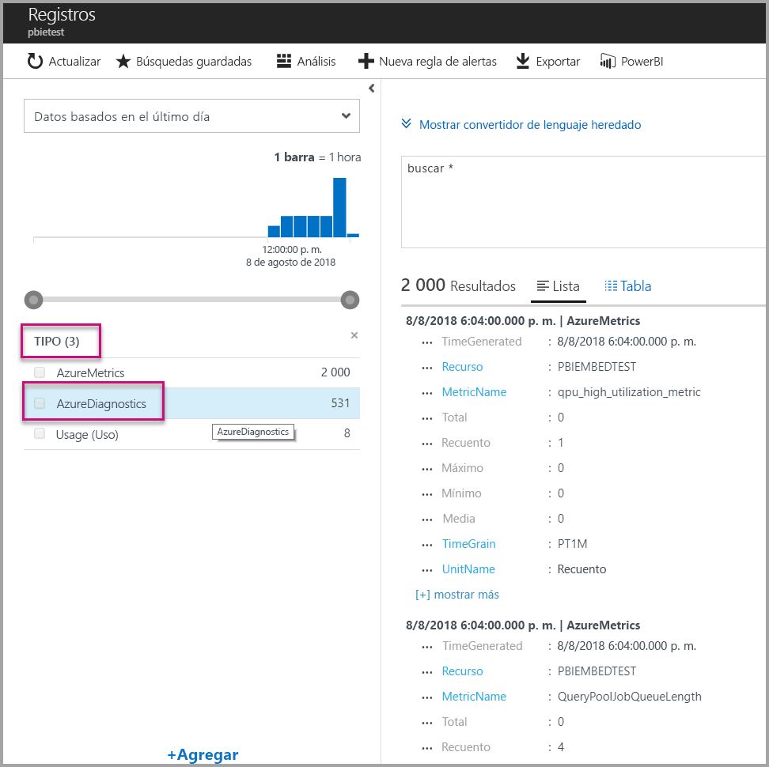
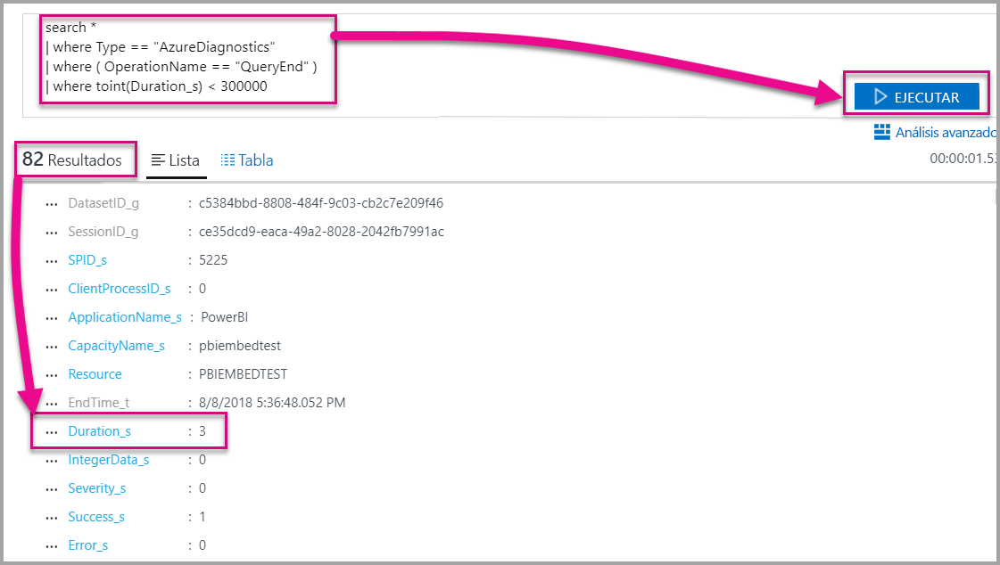
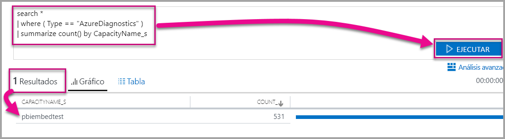

# <a name="diagnostic-logging-for-power-bi-embedded-in-azure"></a>Registro de diagnóstico para el servicio de Power BI Embedded en Azure

Con los [registros de diagnóstico de los recursos de Azure](https://docs.microsoft.com/azure/monitoring-and-diagnostics/monitoring-overview-of-diagnostic-logs), puede registrar muchos eventos de su capacidad, colocarlos en una herramienta de análisis y obtener información sobre el comportamiento del recurso.

Con los diagnósticos puede responder a ciertos escenarios, como:

* Detección de consultas problemáticas o de larga ejecución.
* Derivación de las [métricas de capacidad](https://powerbi.microsoft.com/blog/power-bi-developer-community-april-update/).
* Seguimiento del uso de conjuntos de datos específicos.

## <a name="set-up-diagnostics-logging"></a>Configuración del registro de diagnóstico

### <a name="azure-portal"></a>Azure Portal

1. En el recurso [Azure Portal](https://portal.azure.com) > Power BI Embedded, seleccione **Registros de diagnóstico** en el menú de navegación de la izquierda y, después, **Activar diagnóstico**.

    

2. En **Configuración de diagnóstico**, especifique estas opciones:

    * **Nombre**: escriba un nombre para la configuración de diagnóstico que se va a crear.

    * **Archivar en una cuenta de almacenamiento**: para usar esta opción, debe conectarse a una cuenta de almacenamiento existente. Consulte [Creación de una cuenta de almacenamiento](https://docs.microsoft.com/azure/storage/common/storage-create-storage-account) y siga las instrucciones para crear una. Luego vuelva a esta página del portal para seleccionar la cuenta de almacenamiento. Es posible que las cuentas de almacenamiento recién creadas tarden unos minutos en aparecer en el menú desplegable. El almacenamiento de archivos de registro está en formato JSON.
    * **Stream to an event hub** (Transmitir a un centro de eventos): para usar esta opción, debe conectarse a un centro de eventos y a un espacio de nombres de Event Hubs. Para más información, consulte [Creación de un espacio de nombres de Event Hubs y un centro de eventos con Azure Portal](https://docs.microsoft.com/azure/event-hubs/event-hubs-create).
    * **Send to Log Analytics** (Enviar a Log Analytics): para usar esta opción, use un área de trabajo existente o cree un área de trabajo de Log Analytics nueva con los pasos para [crear un área de trabajo](https://docs.microsoft.com/azure/log-analytics/log-analytics-quick-collect-azurevm#create-a-workspace) que aparecen en el portal. Esto aprovecha [Azure Log Analytics](https://docs.microsoft.com/azure/log-analytics/log-analytics-overview), que proporciona funcionalidades integradas de notificaciones, paneles y análisis. Puede usar Log Analytics para conectar más datos de otros orígenes y obtener una vista completa unificada de los datos de todos los recursos de la aplicación. También se puede conectar a [Power BI con un solo clic](https://docs.microsoft.com/azure/log-analytics/log-analytics-powerbi).
    Para más información sobre cómo ver los registros en Log Analytics, consulte [Visualización de los registros de Log Analytics](https://docs.microsoft.com/azure/log-analytics/log-analytics-activity).
    * **Engine** (Motor): seleccione esta opción para registrar el conjunto de [eventos de motor](#whats-logged) que aparece a continuación.
    * **AllMetrics** (Todas las métricas): seleccione esta opción para almacenar datos detallados en [Métricas](https://docs.microsoft.com/azure/analysis-services/analysis-services-monitor#server-metrics). Si va a archivar en una cuenta de almacenamiento, puede seleccionar el período de retención de los registros de diagnóstico. Los registros se eliminan automáticamente una vez que expira el período de retención.

3. Seleccione **Guardar**.

    Para cambiar la manera en que se guardan los registros de diagnóstico, puede volver a esta página para modificar la configuración.

    

### <a name="using-powershell-to-enable-diagnostics"></a>Uso de PowerShell para habilitar los diagnósticos

Para habilitar las métricas y el registro de diagnóstico mediante PowerShell, use estos comandos:

* Para habilitar el almacenamiento de los registros de diagnóstico en una cuenta de almacenamiento, use este comando:

    ```powershell
    Set-AzureRmDiagnosticSetting -ResourceId [your resource id] -StorageAccountId [your storage account id] -Enabled $true
    ```
    El identificador de la cuenta de almacenamiento es el identificador de recurso para la cuenta de almacenamiento donde desea enviar los registros.

* Para habilitar el streaming de los registros de diagnóstico a un centro de eventos, use este comando:

    ```powershell
    Set-AzureRmDiagnosticSetting -ResourceId [your resource id] -ServiceBusRuleId [your service bus rule id] -Enabled $true
    ```
* El identificador de regla de Azure Service Bus es una cadena que tiene este formato:

    ```powershell
    {service bus resource ID}/authorizationrules/{key name}
    ```

* Para habilitar el envío de registros de diagnóstico a un área de trabajo de Log Analytics, use este comando:

    ```powershell
        Set-AzureRmDiagnosticSetting -ResourceId [your resource id] -WorkspaceId [resource id of the log analytics workspace] -Enabled $true
    ```

* Puede obtener el identificador de recurso del área de trabajo de Log Analytics con el comando siguiente:

    ```powershell
    (Get-AzureRmOperationalInsightsWorkspace).ResourceId
    ```

Puede combinar estos parámetros para habilitar varias opciones de salida.

### <a name="rest-api"></a>API de REST

Obtenga información sobre cómo [cambiar la configuración de diagnóstico mediante la API de REST de Azure Monitor](https://docs.microsoft.com/rest/api/monitor/). 

### <a name="resource-manager-template"></a>Plantilla de Resource Manager

Obtenga información sobre cómo [habilitar la configuración de diagnóstico en el momento de la creación del recurso mediante una plantilla de Resource Manager](https://docs.microsoft.com/azure/monitoring-and-diagnostics/monitoring-enable-diagnostic-logs-using-template).

## <a name="whats-logged"></a>¿Qué se registra?

Puede seleccionar las categorías **Engine** o **AllMetrics**.

### <a name="engine"></a>Engine

La categoría Engine (Motor) le indica al recurso que registre los eventos siguientes y cada uno de los eventos tiene propiedades:

|     Nombre del evento     |     Descripción del evento     |
|----------------------------|----------------------------------------------------------------------------------|
|    Auditoría de inicio de sesión    |    Registra todas las conexiones nuevas a los eventos de motor desde que empezó el seguimiento.    |
|    Inicialización de sesión    |    Registra todos los eventos de inicialización de sesión desde que empezó el seguimiento.    |
|    Inicio de consulta de Vertipaq    |    Registra todos los eventos de inicio de consulta de VertiPaq SE desde que empezó el seguimiento.    |
|    Inicio de consulta    |    Registra todos los eventos de inicio de consulta desde que empezó el seguimiento.    |
|    Fin de consulta    |    Registra todos los eventos de fin de consulta desde que empezó el seguimiento.    |
|    Fin de consulta de Vertipaq    |    Registra todos los eventos de fin de consulta de VertiPaq SE desde que empezó el seguimiento.    |
|    Auditoría de cierre de sesión    |    Registra todos los eventos de desconexión del motor desde que empezó el seguimiento.    |
|    Error    |    Registra todos los eventos de error del motor desde que empezó el seguimiento.    |

<br>
<br>

| Nombre de la propiedad | Ejemplo de fin de consulta Vertipaq | Descripción de la propiedad |
|-------------------|---------------------------------------------------------------------------------------------------------------------------------------------------------------------------------------------------------|--------------------------------------------------------------------------------------------------------------------------|
| EventClass (Clase de evento) | XM_SEQUERY_END | Clase de evento se usa para categorizar los eventos. |
| EventSubclass (Subclase de evento) | 0 | Subclase de evento proporciona información adicional sobre cada clase de evento. (por ejemplo, 0: Examen de VertiPaq) |
| RootActivityId | ff217fd2-611d-43c0-9c12-19e202a94f70 | Identificador de actividad raíz. |
| CurrentTime | 2018-04-06T18:30:11.9137358Z | Hora de inicio del evento, si está disponible. |
| StartTime | 2018-04-06T18:30:11.9137358Z | Hora de inicio del evento, si está disponible. |
| JobID | 0 | Id. de trabajo para el progreso. |
| ObjectID | 464 | Identificador de objeto |
| ObjectType | 802012 | ObjectType |
| EndTime | 2018-04-06T18:30:11.9137358Z | Hora de finalización del evento. |
| Duración | 0 | Cantidad de tiempo (en milisegundos) que tarda el evento. |
| SessionType | Usuario | Tipo de sesión (entidad que ha provocado la operación). |
| ProgressTotal | 0 | Progreso total. |
| IntegerData | 0 | Datos enteros. |
| Severity | 0 | Nivel de gravedad de una excepción. |
| Operación completada correctamente | 1 | 1 = operación completada correctamente. 0 = error (por ejemplo, 1 significa que una comprobación de permisos se realizó correctamente y 0 significa error en dicha comprobación). |
| Error | 0 | Número de error de un evento determinado. |
| ConnectionID | 3 | Id. de conexión única. |
| DatasetID | 5eaa550e-06ac-4adf-aba9-dbf0e8fd1527 | Identificador del conjunto de datos en el que se ejecuta la instrucción del usuario. |
| SessionID | 3D063F66-A111-48EE-B960-141DEBDA8951 | GUID de sesión. |
| SPID | 180 | Id. de proceso de servidor. Identifica una sesión de usuario de manera única. Corresponde directamente al GUID de la sesión que XML/A usa. |
| ClientProcessID | null | El identificador de proceso de la aplicación cliente. |
| ApplicationName | null | Nombre de la aplicación cliente que creó la conexión al servidor. |
| CapacityName | pbi641fb41260f84aa2b778a85891ae2d97 | Nombre del recurso de capacidad de Power BI Embedded. |


### <a name="allmetrics"></a>AllMetrics

Al activar la opción **AllMetrics** se registran los datos de todas las métricas que puede usar con un recurso de Power BI Embedded.

   

## <a name="manage-your-logs"></a>Administración de los registros

Por lo general, los registros están disponibles en un par de horas después de configurar el registro. La administración de los registros en la cuenta de almacenamiento depende del usuario:

* Use los métodos de control de acceso estándar de Azure para proteger los registros mediante la restricción de los usuarios que pueden entrar a ellos.
* Elimine los registros que ya no quiere mantener en la cuenta de almacenamiento.
* Asegúrese de establecer un período de retención para que los registros antiguos se eliminen de la cuenta de almacenamiento.

## <a name="view-logs-in-log-analytics"></a>Visualización de registros en Log Analytics

Las métricas y los eventos de servidor se integran con xEvents en Log Analytics para realizar un análisis en paralelo. Log Analytics también se puede configurar para recibir eventos provenientes de otros servicios de Azure que proporcionan una vista holística de los datos de registro de diagnóstico de toda la arquitectura.

Para ver los datos de diagnóstico en Log Analytics, abra la página **Registros** en el menú de navegación de la izquierda o en el área de administración, tal como se muestra a continuación.



Ahora que habilitó la recopilación de datos, en **Registros**, seleccione **Todos los datos recopilados**.



En **Tipo**, seleccione **AzureDiagnostics** y luego,**Aplicar**. AzureDiagnostics incluye eventos del motor. Tenga en cuenta que una consulta de Log Analytics se crea sobre la marcha.



Seleccione **EventClass\_s** o uno de los nombres de evento y Log Analytics seguirán construyendo una consulta. No olvide guardar las consultas para volver a usarlas más adelante.

Asegúrese de consultar [Log Analytics](https://docs.microsoft.com/azure/log-analytics/), que ofrece un sitio web con funcionalidades de consulta, paneles y alertas mejoradas de los datos recopilados.

### <a name="queries"></a>Consultas

Existen cientos de consultas que puede usar. Estos son algunos ejemplos que pueden ayudarlo a comenzar. Para más información sobre cómo usar el nuevo lenguaje de consulta de búsqueda de registros, consulte [Descripción de las búsquedas de registros en Log Analytics](https://docs.microsoft.com/azure/log-analytics/log-analytics-log-search).

* Devolución de consulta que tarda menos de cinco minutos (300 000 milisegundos) en completarse.

    ```
    search *
    | where Type == "AzureDiagnostics"
    | where ( OperationName == "QueryEnd" )
    | where toint(Duration_s) < 300000
    ```

    

* Identifique los nombres de capacidad.

    ```
    search *
    | where ( Type == "AzureDiagnostics" )
    | summarize count() by CapacityName_s 
    ```

    

## <a name="next-steps"></a>Pasos siguientes

Puede obtener más información sobre el registro de diagnóstico de recursos de Azure.

> [!div class="nextstepaction"]
> [Registros de diagnóstico de recursos de Azure](https://docs.microsoft.com/azure/monitoring-and-diagnostics/monitoring-overview-of-diagnostic-logs)

> [!div class="nextstepaction"]
> [Set-AzureRmDiagnosticSetting](https://docs.microsoft.com/powershell/module/azurerm.insights/Set-AzureRmDiagnosticSetting)
