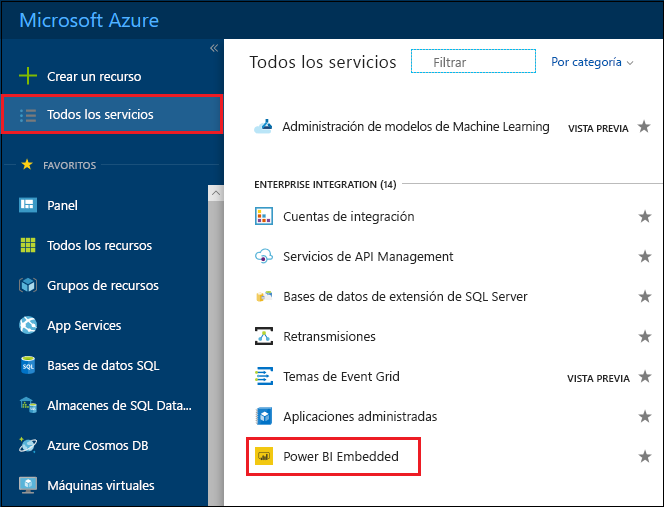
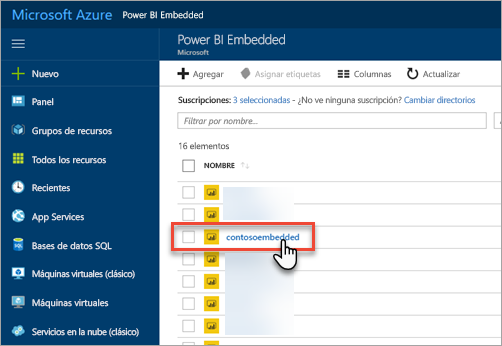
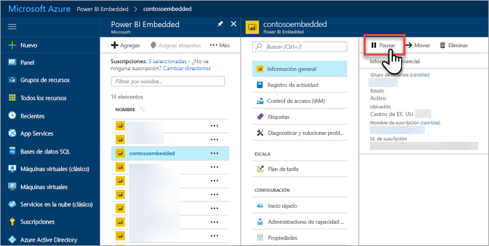
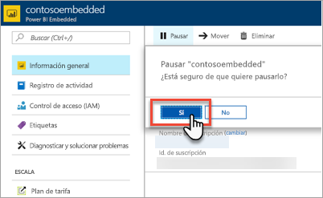
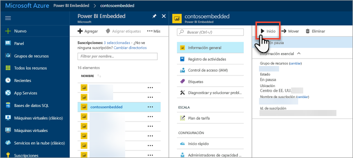
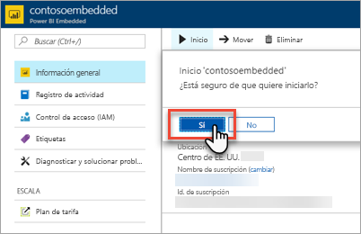

# Pausar e iniciar una capacidad de Power BI Embedded en Azure Portal

En este artículo se explica cómo pausar e iniciar una capacidad de Power BI Embedded en Microsoft Azure. Se da por supuesto que ya ha creado una capacidad de Power BI Embedded, pero si no lo ha hecho, vea [Creación de una capacidad de Power BI Embedded en Azure Portal](azure-pbie-create-capacity.md) para empezar.

Si no tiene ninguna suscripción a Azure, cree una [cuenta gratuita](https://azure.microsoft.com/free/) antes de empezar.

## Pausar la capacidad

Si pausa la capacidad, detiene la facturación. Es muy útil pausar la capacidad si no necesita usarla durante un período de tiempo. Siga los pasos que se indican a continuación para pausar la capacidad.

> [!NOTE]
> Al pausar una capacidad, puede impedir que el contenido esté disponible en Power BI. Asegúrese de desasignar las áreas de trabajo de la capacidad antes de pausarla para evitar la interrupción.

1. Inicie sesión en [Azure Portal](https://portal.azure.com/).

2. Seleccione **All services (Todos los servicios)** > **Power BI Embedded** para ver las capacidades.

    

3. Seleccione la capacidad que quiere pausar.

    

4. En los detalles de la capacidad, seleccione **Pausar**.

    

5. Seleccione **Sí** para confirmar que quiere pausar la capacidad.

    

## Iniciar la capacidad

Inicie la capacidad para seguir usándola. Al iniciar la capacidad, también se reanuda la facturación.

1. Inicie sesión en [Azure Portal](https://portal.azure.com/).

2. Seleccione **All services (Todos los servicios)** > **Power BI Embedded** para ver las capacidades.

    

3. Seleccione la capacidad que quiere iniciar.

    

4. En los detalles de la capacidad, seleccione **Iniciar**.

    

5. Seleccione **Sí** para confirmar que quiere iniciar la capacidad.

    

Si esta capacidad tiene contenido asignado, estará disponible cuando se inicie.

## Pasos siguientes

Si quiere aumentar o reducir la escala de la capacidad, vea [Escalar una capacidad de Power BI Embedded](azure-pbie-scale-capacity.md).

Para empezar a insertar contenido de Power BI en la aplicación, vea [Inserción de un informe, un panel o un icono de Power BI](https://powerbi.microsoft.com/documentation/powerbi-developer-embedding-content/).

¿Tiene más preguntas? [Pruebe a preguntar a la comunidad de Power BI](http://community.powerbi.com/)