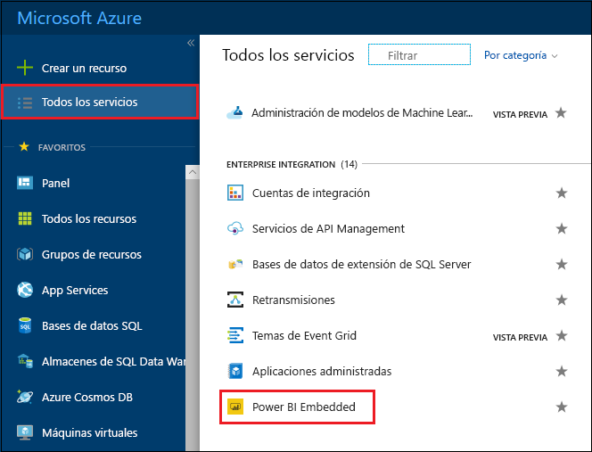
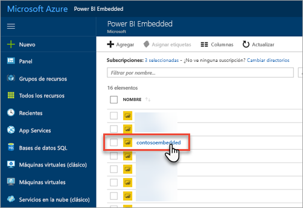
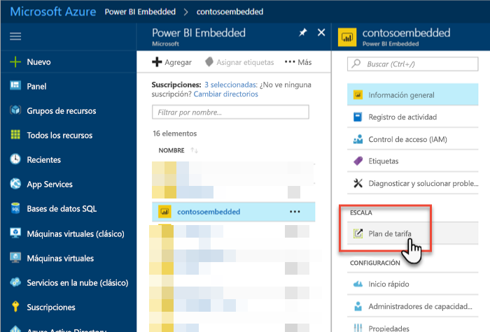
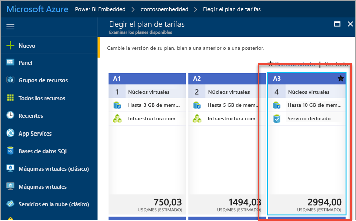
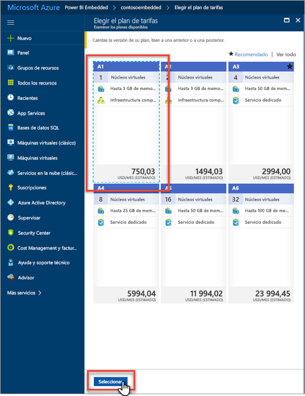
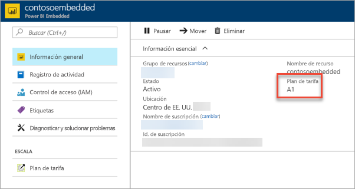

# Escalar una capacidad de Power BI Embedded en Azure Portal

En este artículo se explica cómo escalar una capacidad de Power BI Embedded en Microsoft Azure. El escalado permite aumentar o disminuir el tamaño de la capacidad.

Se da por supuesto que ya ha creado una capacidad de Power BI Embedded, pero si no lo ha hecho, vea [Creación de una capacidad de Power BI Embedded en Azure Portal](azure-pbie-create-capacity.md) para empezar.

> [!NOTE]
> Una operación de escalado puede llevar aproximadamente un minuto. Durante este tiempo, la capacidad no estará disponible y puede producirse un error al cargar el contenido insertado.

## Escalar una capacidad

1. Inicie sesión en [Azure Portal](https://portal.azure.com/).

2. Seleccione **All services (Todos los servicios)**  > **Power BI Embedded** para ver las capacidades.

    

3. Seleccione la capacidad que quiere escalar.

    

4. En la capacidad, seleccione **Plan de tarifa** en **Escala**.

    

    El plan de tarifa actual se muestra en azul.

    

5. Para aumentar o reducir la escala, seleccione el nuevo plan al que quiere cambiar. Si elige un nuevo plan, la selección se rodea con un contorno discontinuo de color azul. Haga clic en **Seleccionar** para escalar al nuevo plan.

    

    El escalado de la capacidad puede tardar en completarse un minuto o dos.

6. Para confirmar el plan, consulte la pestaña de información general. Aquí se muestra el plan de tarifa actual.

    

## Pasos siguientes

Para pausar o iniciar la capacidad, vea [Pausar e iniciar una capacidad de Power BI Embedded en Azure Portal](azure-pbie-pause-start.md).

Para empezar a insertar contenido de Power BI en la aplicación, vea [Inserción de un informe, un panel o un icono de Power BI](https://powerbi.microsoft.com/documentation/powerbi-developer-embedding-content/).

¿Tiene más preguntas? [Pruebe a preguntar a la comunidad de Power BI](https://community.powerbi.com/)
