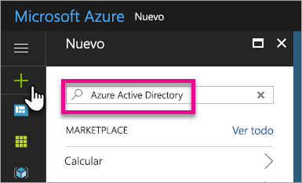
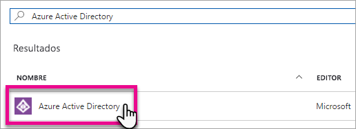
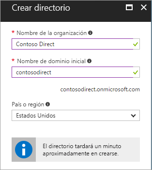
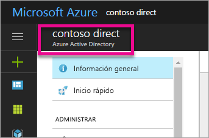
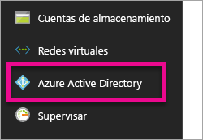
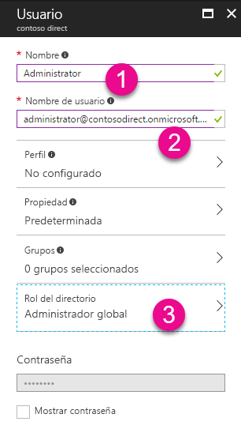
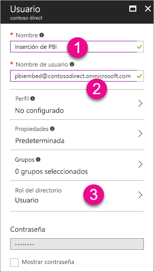
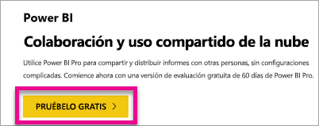

# Crear un inquilino de Azure Active Directory para su uso con Power BI

Aprenda a crear un nuevo inquilino de Azure Active Directory (Azure AD) para una aplicación personalizada que llama a las [API REST de Power BI](rest-api-reference.md).

Un inquilino representa a una organización en Azure Active Directory. Es una instancia dedicada del servicio de Azure AD que una organización recibe y posee cuando se suscribe a un servicio en la nube de Microsoft como Azure, Microsoft Intune u Office 365. Cada inquilino de Azure AD es distinto e independiente de otros inquilinos de Azure AD.

Una vez que tenga un inquilino de Azure AD, puede definir una aplicación y asignar permisos para que la aplicación pueda llamar a las [API REST de Power BI](rest-api-reference.md).

Es posible que su organización ya tenga un inquilino de Azure AD que puede usar para la aplicación. También puede crear un nuevo inquilino específicamente para la aplicación. Este artículo explica cómo crear un nuevo inquilino.

## Crear un inquilino de Azure Active Directory

Para integrar Power BI en su aplicación personalizada, debe definir primero una aplicación en Azure AD, lo que requiere un directorio de Azure AD. Este directorio es su *inquilino*. Si su organización aún no tiene un inquilino porque no usa Power BI u Office 365, [deberá configurar un entorno de desarrollo](https://docs.microsoft.com/azure/active-directory/develop/active-directory-howto-tenant). También deberá crear uno si no desea que la aplicación se combine con el inquilino de su organización para mantener los elementos aislados. O bien, puede crear un inquilino solo con fines de prueba.

Para crear un nuevo inquilino de Azure AD:

1. Vaya a [Azure Portal](https://portal.azure.com) e inicie sesión con una cuenta que tenga una suscripción de Azure.

2. Seleccione el **icono del signo más (+)** y busque **Azure Active Directory**.

    

3. Seleccione **Azure Active Directory** en los resultados de búsqueda.

    

4. Seleccione **Crear**.

5. Proporcione un **Nombre de organización** y un **Nombre de dominio inicial**. Después, seleccione **Crear**. Se ha creado el directorio.

    

   > [!NOTE]
   > El dominio inicial es parte de onmicrosoft.com. Posteriormente puede agregar otros nombres de dominio. El directorio de un inquilino puede tener varios dominios asignados a él.

6. Una vez completada la creación del directorio, seleccione el cuadro de información para administrarlo.

A continuación, va a agregar los usuarios del inquilino.

## Creación de los usuarios de un inquilino de Azure Active Directory

Ahora que tiene un directorio, vamos a crear al menos dos usuarios. Uno es un administrador global del inquilino y otro es un usuario maestro para la inserción. Se puede considerar este último como una cuenta de servicio.

1. En Azure Portal, asegúrese de que está en el menú emergente de Azure Active Directory.

    

    Si no lo está, seleccione el icono de Azure Active Directory en la barra de servicios situada a la izquierda.

    

2. En **Administrar**, seleccione **Usuarios**.

    

3. Seleccione **Todos los usuarios** y, a continuación, seleccione **+ Nuevo usuario**.

4. Proporcione un **Nombre** y un **Nombre de usuario** para el administrador global del inquilino. Cambie el **Rol del directorio** a **Administrador global**. También puede mostrar la contraseña temporal. Cuando haya terminado, seleccione **Crear**.

    

5. Realice lo mismo para un usuario del inquilino normal. Puede usar esta cuenta para la cuenta de inserción maestra. En esta ocasión, para **Rol del directorio**, déjelo como **Usuario**. Anote la contraseña y, a continuación, seleccione **Crear**.

    

6. Regístrese en Power BI con la cuenta de usuario que creó en el paso 5. Vaya a [powerbi.com](https://powerbi.microsoft.com/get-started/) y seleccione **Probar gratis** en **Power BI: colaboración y uso compartido en la nube**.

    

    Al registrarse, se le pedirá que pruebe Power BI Pro gratis durante 60 días. Puede optar por convertirse en un usuario Pro, le ofrece la opción de [empezar a desarrollar una solución insertada](embedding-content.md).

   > [!NOTE]
   > Asegúrese de que se registra con la dirección de correo electrónico de la cuenta de usuario.

## Pasos siguientes

Ahora que tiene un inquilino de Azure AD, puede usarlo para probar los elementos de Power BI. También puede insertar informes y paneles de Power BI en la aplicación. Para más información, consulte [Procedimiento para insertar paneles, informes e iconos de Power BI](embedding-content.md).

[¿Qué es Azure Active Directory?](https://docs.microsoft.com/azure/active-directory/active-directory-whatis) 
 
[Inicio rápido: Configuración de un entorno de desarrollo](https://docs.microsoft.com/azure/active-directory/develop/active-directory-howto-tenant)  

¿Tiene más preguntas? [Pruebe a preguntar a la comunidad de Power BI](https://community.powerbi.com/)
