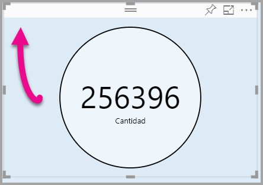

# <a name="tutorial-adding-formatting-options-to-a-power-bi-custom-visual"></a>Tutorial: Adición de opciones de formato a un objeto visual personalizado de Power BI

En este tutorial aprenderá a agregar propiedades comunes al objeto visual.

En este tutorial, obtendrá información sobre cómo:
> [!div class="checklist"]
> * Agregar propiedades de los objetos visuales.
> * Empaquetar el objeto visual.
> * Importar el objeto visual personalizado a un informe de Power BI Desktop.

## <a name="adding-formatting-options"></a>Adición de opciones de formato

1. En **Power BI**, seleccione la **página Formato**.

    Debería ver un mensaje que dice: *Las opciones de formato no están disponibles para este objeto visual.*

    

2. En **Visual Studio Code**, abra el archivo *capabilities.json*.

3. Antes de la matriz **dataViewMappings**, agregue **objects** (después de la línea 8).

    ```json
    "objects": {},
    ```
    

4. Guarde el archivo **capabilities.json**.

5. En **Power BI**, vuelva a revisar las opciones de formato.

    > [!Note]
    > Si no ve el cambio de opciones de formato, seleccione **Reload Custom Visual** (Recargar objeto visual personalizado).

    

6. Establezca la opción **Title** (Título) en *Off* (Desactivar). Tenga en cuenta que el objeto visual ya no muestra el nombre de medida en la esquina superior izquierda.

    

    

### <a name="adding-custom-formatting-options"></a>Adición de opciones de formato personalizadas

Puede agregar propiedades personalizadas para permitir la configuración del color del círculo y también del ancho del borde.

1. En PowerShell, detenga el objeto visual personalizado.

2. En Visual Studio Code, en el archivo **capabilities.json**, inserte el siguiente fragmento de JSON en el objeto que tiene la etiqueta **objects**.

    ```json
    "circle": {
     "displayName": "Circle",
     "properties": {
         "circleColor": {
             "displayName": "Color",
             "description": "The fill color of the circle.",
             "type": {
                 "fill": {
                     "solid": {
                         "color": true
                     }
                 }
             }
         },
         "circleThickness": {
             "displayName": "Thickness",
             "description": "The circle thickness.",
             "type": {
                 "numeric": true
                 }
             }
         }
     },
    ```

    El fragmento de JSON describe un grupo denominado círculo, que consta de dos opciones con nombre circleColor y circleThickness.

   

3. Guarde el archivo **capabilities.json**.

4. En el **panel Explorador**, desde dentro de la carpeta **src** y, después, seleccione **settings.ts**. *Este archivo representa la configuración para el objeto visual de inicio*.

5. En el archivo **settings.ts**, reemplace las dos clases por el código siguiente.

    ```typescript
    export class CircleSettings {
     public circleColor: string = "white";
     public circleThickness: number = 2;
    }
    export class VisualSettings extends DataViewObjectsParser {
     public circle: CircleSettings = new CircleSettings();
    }
    ```

    

    Este módulo define las dos clases. La clase **CircleSettings** define dos propiedades con nombres que coinciden con los objetos definidos en el archivo **capabilities.json** (**circleColor** y **circleThickness**) y también establece valores predeterminados. La clase **VisualSettings** hereda la clase **DataViewObjectParser** y agrega una propiedad llamada **circle**, que coincide con el objeto definido en el archivo *capabilities.json*, y devuelve una instancia de **CircleSettings**.

6. Guarde el archivo **settings.ts**.

7. Abra el archivo **visual.ts**.

8. En la clase **Visual**, agregue la siguiente propiedad.

    ```typescript
    private visualSettings: VisualSettings;
    ```
    Esta propiedad almacena una referencia al objeto **VisualSettings**, que describe la configuración visual.

    

9. En la clase **Visual**, agregue el método siguiente antes del método **update**. Este método se usa para rellenar las opciones de formato.

    ```typescript
    public enumerateObjectInstances(options: EnumerateVisualObjectInstancesOptions): VisualObjectInstanceEnumeration {
     const settings: VisualSettings = this.visualSettings ||
    VisualSettings.getDefault() as VisualSettings;
     return VisualSettings.enumerateObjectInstances(settings, options);
    }
    ```
    Este método se usa para rellenar las opciones de formato.

    

10. En el método **update**, después de la declaración de la variable **radius**, agregue el código siguiente.

    ```typescript
    this.visualSettings = VisualSettings.parse<VisualSettings>(dataView);

    this.visualSettings.circle.circleThickness = Math.max(0, this.visualSettings.circle.circleThickness);

    this.visualSettings.circle.circleThickness = Math.min(10, this.visualSettings.circle.circleThickness);
    ```
    Este código recupera las opciones de formato. Ajusta cualquier valor pasado a la propiedad **circleThickness**, convirtiéndolo en 0 si es negativo, o en 10 si es mayor de 10.

    

11. Para el **elemento de círculo**, modifique el valor pasado al **estilo de relleno** en la siguiente expresión.

    ```typescript
    this.visualSettings.circle.circleColor
    ```

    

12. Para el **elemento de círculo**, modifique el valor pasado al **estilo de ancho del trazo** en la siguiente expresión.

    ```typescript
    this.visualSettings.circle.circleThickness
    ```

    

13. Guarde el archivo visual.ts.

14. En PowerShell, inicie el objeto visual.

    ```powershell
    pbiviz start
    ```

15. En **Power BI**, la barra de herramientas flotante sobre el objeto visual, seleccione **Activar recarga automática**.

16. En las opciones de **formato del objeto visual**, expanda **Circle**.

    

    Modifique las opciones de **color** y **grosor**.

    Modifique la opción de **grosor** a un valor inferior a cero y un valor superior a 10. A continuación, observe que el objeto visual actualiza el valor a un mínimo o máximo tolerable.

## <a name="packaging-the-custom-visual"></a>Empaquetado del objeto visual personalizado

Introduzca los valores de propiedad para el proyecto del objeto visual personalizado, actualice el archivo de iconos y, después, empaquete el objeto visual personalizado.

1. En **PowerShell**, detenga el objeto visual personalizado.

2. Abra el archivo **pbiviz.json** en **Visual Studio Code**.

3. En el objeto **visual**, modifique la propiedad **displayName** en *Circle Card*.

    En el panel **Visualizaciones**, al mantener el cursor sobre el icono, se muestra el nombre.

    

4. En la propiedad **description**, escriba el texto siguiente.

    *Muestra el valor de medida con formato dentro de un círculo*

5. Si lo desea, en el objeto **author**, escriba los detalles.

6. Guarde el archivo **pbiviz.json**.

7. En el objeto **assets**, tenga en cuenta que el documento define una ruta de acceso a un icono. El icono es la imagen que aparece en el panel **_Visualizaciones_**. Debe ser un archivo **PNG**, *20 píxeles por 20 píxeles*.

8. En el Explorador de Windows, copie el archivo icon.png y péguelo para reemplazar el archivo predeterminado ubicado en la carpeta assets.

9. En Visual Studio Code, en el panel Explorador, expanda la carpeta assets y, después, seleccione el archivo icon.png.

10. Revise el icono.

    

11. En Visual Studio Code, asegúrese de que todos los archivos se guardan.

12. Para empaquetar el objeto visual personalizado, en PowerShell, escriba el siguiente comando.

    ```powershell
    pbiviz package
    ```

    

Ahora el paquete se muestra en la carpeta **dist** del proyecto. El paquete contiene todo lo necesario para importar el objeto visual personalizado en el servicio Power BI o en un informe de Power BI Desktop. Ahora ha empaquetado el objeto visual personalizado y está listo para su uso.

## <a name="importing-the-custom-visual"></a>Importación de objetos visuales personalizados

Ahora puede abrir el informe de Power BI Desktop e importar el objeto visual personalizado Circle Card.

1. Abra **Power BI Desktop**, cree un nuevo informe con cualquier *conjunto de datos de ejemplo*

2. En el panel **_Visualizaciones_**, seleccione los **puntos suspensivos** y, después, seleccione **Importar** desde archivo.

    

3. En la **ventana de importación**, seleccione **Importar**.

4. En la ventana Abrir, desplácese hasta la carpeta **dist** en el directorio del proyecto.

5. Seleccione el archivo **circleCard.pbiviz** y, a continuación, seleccione **Abrir**.

6. Cuando se importó correctamente el objeto visual, seleccione **Aceptar**.

7. Compruebe que el objeto visual se ha agregado al panel **_Visualizaciones_**.

    

8. Mantenga el puntero sobre el icono **Circle Card** y verá la información sobre herramientas que aparece.

## <a name="debugging"></a>Depuración

Para obtener sugerencias sobre cómo depurar el objeto visual personalizado, consulte la [guía de depuración](https://microsoft.github.io/PowerBI-visuals/docs/how-to-guide/how-to-debug/).

## <a name="next-steps"></a>Pasos siguientes

Puede enumerar los objetos visuales recién desarrollados para que los usen otras personas y enviarlos a **AppSource**. Para obtener más información sobre este proceso, vea [Publicar objetos visuales personalizados en AppSource](office-store.md).