# <a name="tutorial-developing-a-power-bi-custom-visual"></a>Tutorial: Desarrollo de objetos visuales personalizados de Power BI

Permitimos que los desarrolladores agreguen fácilmente a Power BI objetos visuales personalizados para usarlos en los paneles e informes. Para ayudarle a comenzar, publicamos en GitHub el código de todas nuestras visualizaciones.

Junto con el marco de trabajo de visualización, incluimos nuestro conjunto de pruebas y herramientas para ayudar a la comunidad a crear objetos visuales personalizados de alta calidad para Power BI.

Este tutorial le muestra cómo desarrollar un objeto visual personalizado de Power BI llamado Circle Card para mostrar un valor de medida formateado dentro de un círculo. El objeto visual Circle Card admite la personalización del color de relleno y el grosor de su contorno.

En el informe de Power BI Desktop, las tarjetas se modifican para convertirse en tarjetas circulares.

  

En este tutorial, obtendrá información sobre cómo:
> [!div class="checklist"]
> * Crear un objeto visual de Power BI.
> * Desarrollar el objeto visual personalizado con elementos visuales de D3.
> * Configurar el enlace de datos con los elementos visuales.
> * Dar formato a los valores de datos.

## <a name="prerequisites"></a>Requisitos previos

* Si no está registrado en **Power BI Pro**, [regístrese para obtener una evaluación gratuita](https://powerbi.microsoft.com/pricing/) antes de empezar.
* Necesita tener [Visual Studio Code](https://www.visualstudio.com/) instalado.
* Necesita la versión 4 de [Windows PowerShell](https://docs.microsoft.com/powershell/scripting/setup/installing-windows-powershell?view=powershell-6) o una posterior para los usuarios de Windows o [Terminal](https://macpaw.com/how-to/use-terminal-on-mac) para los usuarios de OSX.

## <a name="setting-up-the-developer-environment"></a>Configuración del entorno de desarrollo

Además de los requisitos previos, hay algunas herramientas más que necesita instalar.

### <a name="installing-nodejs"></a>Instalación de node.js

1. Para instalar Node.js en un explorador web, vaya a [Node.js](https://nodejs.org).

2. Descargue la última característica del instalador MSI.

3. Ejecute al instalador y, después, siga los pasos de instalación. Acepte los términos del contrato de licencia y todos los valores predeterminados.

   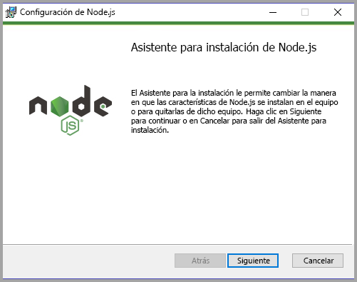

4. Reinicie el equipo.

### <a name="installing-packages"></a>Instalación de paquetes

Ahora tiene que instalar el paquete **pbiviz**.

1. Una vez reiniciado el equipo, abra Windows PowerShell.

2. Para instalar pbiviz, escriba el siguiente comando.

    ```powershell
    npm i -g powerbi-visuals-tools
    ```

### <a name="creating-and-installing-a-certificate"></a>Creación e instalación de un certificado

#### <a name="windows"></a>Windows

1. Para crear un certificado, escriba el siguiente comando.

    ```powershell
    pbiviz --create-cert
    ```

  Devuelve un resultado que genera una *frase de contraseña*. En este caso, la *frase de contraseña* es **_15105661266553327_**.

  

2. Ahora es necesario instalar el certificado. Para instalar el certificado, escriba el siguiente comando.

    ```powershell
    pbiviz --install-cert
    ```

3. En el Asistente para importar certificados, compruebe que la ubicación del almacén se establece en el usuario actual. Después, seleccione *Siguiente*.

      

4. En el paso **Archivo para importar**, seleccione *Siguiente*.

5. En el paso **Protección de clave privada**, en el cuadro de contraseña, pegue la frase de contraseña que ha recibido al crear el certificado.  De nuevo, en este caso es **_15105661266553327_**.

      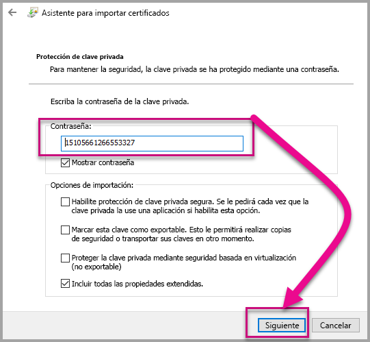

6. En el paso **Almacén de certificados**, seleccione la opción **Colocar todos los certificados en el siguiente almacén**. Después, seleccione *Examinar*.

      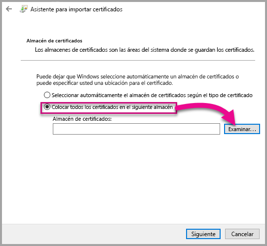

7. En la ventana **Seleccionar almacén de certificados**, seleccione **Entidades de certificación raíz de confianza** y luego seleccione *Aceptar*. A continuación, seleccione *Siguiente* en la pantalla **Almacén de certificados**.

      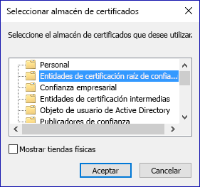

8. Para completar la importación, seleccione **Finalizar**.

9. Si recibe una advertencia de seguridad, seleccione **Sí**.

    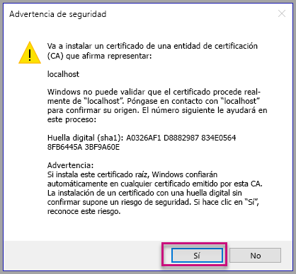

10. Cuando se le notifique que la importación se ha realizado correctamente, seleccione **Aceptar**.

    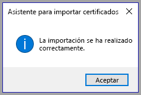

> [!Important]
> No cierre la sesión de Windows PowerShell.

#### <a name="osx"></a>OSX

1. Si el candado de la parte superior izquierda está bloqueado, selecciónelo para desbloquearlo. Busque *localhost* y haga doble clic en el certificado.

    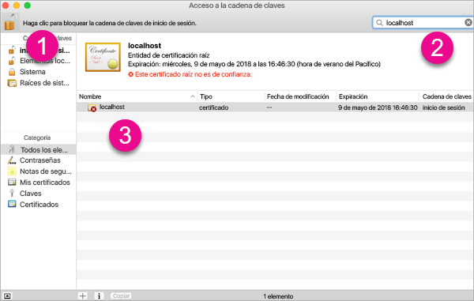

2. Seleccione **Confiar siempre** y cierre la ventana.

    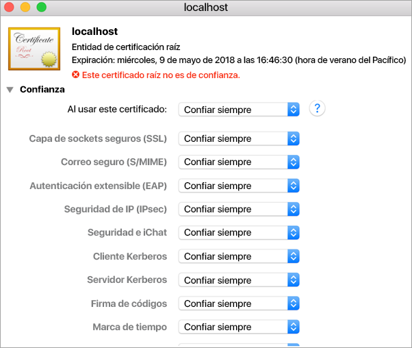

3. Escriba el nombre de usuario y contraseña. Seleccione **Actualizar configuración**.

    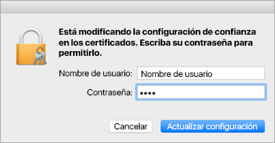

4. Cierre los exploradores que tenga abiertos.

> [!NOTE]
> Si no se reconoce el certificado, deberá reiniciar el equipo.

## <a name="creating-a-custom-visual"></a>Creación de un objeto visual personalizado

Ahora que ha configurado el entorno, es momento de crear el objeto visual personalizado.

También puede [descargar](https://github.com/Microsoft/PowerBI-visuals-circlecard) el código fuente completo para este tutorial.

1. Compruebe que se ha instalado el paquete de herramientas de objetos visuales de Power BI.

    ```powershell
    pbiviz
    ```
    Debería ver el resultado de la ayuda.

    <pre><code>
        +syyso+/
    oms/+osyhdhyso/
    ym/       /+oshddhys+/
    ym/              /+oyhddhyo+/
    ym/                     /osyhdho
    ym/                           sm+
    ym/               yddy        om+
    ym/         shho /mmmm/       om+
        /    oys/ +mmmm /mmmm/       om+
    oso  ommmh +mmmm /mmmm/       om+
    ymmmy smmmh +mmmm /mmmm/       om+
    ymmmy smmmh +mmmm /mmmm/       om+
    ymmmy smmmh +mmmm /mmmm/       om+
    +dmd+ smmmh +mmmm /mmmm/       om+
            /hmdo +mmmm /mmmm/ /so+//ym/
                /dmmh /mmmm/ /osyhhy/
                    //   dmmd
                        ++

        PowerBI Custom Visual Tool

    Usage: pbiviz [options] [command]

    Commands:

    new [name]        Create a new visual
    info              Display info about the current visual
    start             Start the current visual
    package           Package the current visual into a pbiviz file
    update [version]  Updates the api definitions and schemas in the current visual. Changes the version if specified
    help [cmd]        display help for [cmd]

    Options:

    -h, --help      output usage information
    -V, --version   output the version number
    --install-cert  Install localhost certificate
    </code></pre>

    <a name="ssl-setup"></a>

2. Revise la salida, incluida la lista de comandos admitidos.

     

3. Para crear un proyecto de objetos visuales personalizados, escriba el siguiente comando. **CircleCard** es el nombre del proyecto.

    ```PowerShell
    pbiviz new CircleCard
    ```
    

    > [!Note]
    > El nuevo proyecto se crea en la ubicación actual de la confirmación.

4. Vaya a la carpeta del proyecto.

    ```powershell
    cd CircleCard
    ```
5. Inicie el objeto visual personalizado. Su objeto visual CircleCard ahora se ejecuta mientras está hospedado en el equipo.

    ```powershell
    pbiviz start
    ```

    

> [!Important]
> No cierre la sesión de Windows PowerShell.

### <a name="testing-the-custom-visual"></a>Prueba del objeto visual personalizado

En esta sección, vamos a probar el objeto visual personalizado CircleCard al cargar un informe de Power BI Desktop y luego editar el informe para mostrar el objeto visual personalizado.

1. Inicie sesión en [PowerBI.com](https://powerbi.microsoft.com/) > vaya al **icono de engranaje** > y seleccione **Settings** (Configuración).

      

2. Seleccione **Desarrollador** y luego active la casilla **Habilitar objeto visual de desarrollador para realizar pruebas**.

    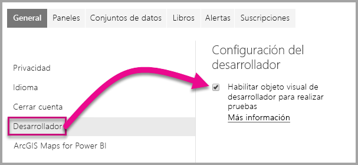

3. Cargue un informe de Power BI Desktop.  

    Obtener datos > Archivos > Archivo local.

    También puede [descargar](https://microsoft.github.io/PowerBI-visuals/docs/step-by-step-lab/images/US_Sales_Analysis.pbix) un informe de ejemplo de Power BI Desktop si aún no ha creado uno.

    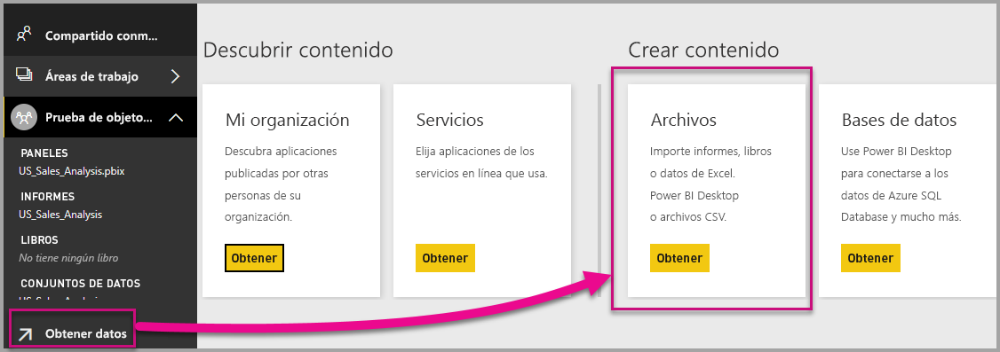 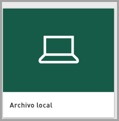

    Ahora, para ver el informe, seleccione **US_Sales_Analysis** en la sección **Informe** del panel de navegación de la izquierda.

    

4. Ahora tiene que editar el informe en el servicio Power BI.

    Vaya a **Editar informe**.

    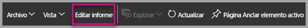

5. Seleccione el **objeto visual de desarrollador** en el panel **Visualizaciones**.

    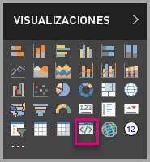

    > [!Note]
    > Esta visualización representa el objeto visual personalizado que inició en el equipo. Solo está disponible cuando se ha habilitado la configuración del desarrollador.

6. Tenga en cuenta que se ha agregado una visualización al lienzo del informe.

    

    > [!Note]
    > Este es un objeto visual muy simple que muestra el número de veces que se ha llamado al método update. En esta fase, el objeto visual todavía no recupera los datos.

7. Al seleccionar el nuevo objeto visual en el informe, vaya al panel Campos > expanda Ventas > seleccione Cantidad.

    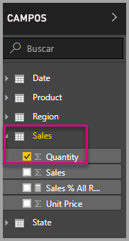

8. Después, para probar el nuevo objeto visual, cambie el tamaño del objeto visual y observe los incrementos de valor de actualización.

    

Para detener la ejecución del objeto visual personalizado en PowerShell, introduzca Ctrl+C. Cuando se le solicite que finalice el trabajo por lotes, escriba S y presione ENTRAR.

## <a name="adding-visual-elements"></a>Adición de elementos visuales

Ahora tiene que instalar la **biblioteca JavaScript D3**. D3 es una biblioteca de JavaScript para producir visualizaciones de datos dinámicos e interactivos en exploradores web. Utiliza estándares SVG HTML5 y CSS ampliamente implementados.

Ahora puede desarrollar el objeto visual personalizado para mostrar un círculo con texto.

> [!Note]
> Muchas de las entradas de texto de este tutorial se pueden copiar desde [aquí](https://github.com/uve/circlecard).

1. Para instalar la **biblioteca D3** en PowerShell, escriba el siguiente comando.

    ```powershell
    npm i d3@3.5.5 --save
    ```

    

2. Para instalar las definiciones de tipo para la **biblioteca D3**, escriba el siguiente comando.

    ```powershell
    npm i @types/d3@3.5
    ```

    

    Este comando instala las definiciones de TypeScript basadas en archivos JavaScript, lo que le permite desarrollar el objeto visual personalizado en TypeScript (que es un superconjunto de JavaScript). Visual Studio Code es el entorno de desarrollo integrado perfecto para desarrollar aplicaciones de TypeScript.

3. Inicie [Visual Studio Code](https://code.visualstudio.com/).

    Puede iniciar **Visual Studio Code** desde PowerShell mediante el comando siguiente.

    ```powershell
    code .
    ```

4. En el **panel Explorador**, expanda la carpeta **node_modules** para comprobar que la **biblioteca D3** se ha instalado.

    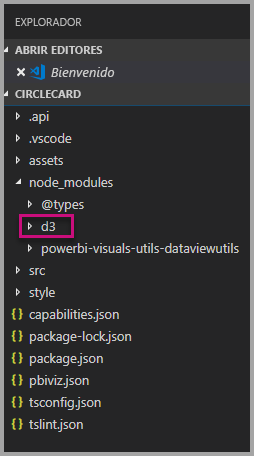

5. Observe el archivo TypeScript, **index.d.ts** y expanda node_modules > @types > d3 en el **panel Explorador**.

    

6. Seleccione el archivo **pbiviz.json**.

7. Para registrar la **biblioteca d3**, escriba la siguiente referencia de archivo en la matriz externalJS. Asegúrese de agregar una *coma* entre la referencia existente al archivo y la nueva referencia.

    ```javascript
    "node_modules/d3/d3.min.js"
    ```
    

8. Guarde los cambios del archivo **pbiviz.json**.

### <a name="developing-the-visual-elements"></a>Desarrollo de los elementos visuales

Ahora podemos explorar cómo desarrollar el objeto visual personalizado para mostrar un círculo y un texto de ejemplo.

1. En el **panel Explorador**, expanda la carpeta **src** y, después, seleccione **visual.ts**.

    > [!Note]
    > Tenga en cuenta los comentarios de la parte superior del archivo **visual.ts**. El permiso para utilizar los paquetes de objetos visuales personalizados de Power BI se concede sin cargo en virtud de los términos de la licencia MIT. Como parte del contrato, debe dejar los comentarios en la parte superior del archivo.

2. Quite la siguiente lógica del objeto visual personalizado predeterminada de la clase Visual.
    * Las cuatro declaraciones privadas de variables a nivel de clase.
    * Todas las líneas de código desde el constructor.
    * Todas las líneas de código desde el método update.
    * Todas las líneas restantes dentro del módulo, incluidos los métodos parseSettings y enumerateObjectInstances.

    Compruebe que el código del módulo tiene un aspecto similar al siguiente.

    ```typescript
    module powerbi.extensibility.visual {
    "use strict";
    export class Visual implements IVisual {

        constructor(options: VisualConstructorOptions) {

        }

        public update(options: VisualUpdateOptions) {

            }
        }
    }
    ```

3. Debajo de la declaración de clase *Visual*, inserte las siguientes propiedades de nivel de clase.

    ```typescript
     private host: IVisualHost;
     private svg: d3.Selection<SVGElement>;
     private container: d3.Selection<SVGElement>;
     private circle: d3.Selection<SVGElement>;
     private textValue: d3.Selection<SVGElement>;
     private textLabel: d3.Selection<SVGElement>; 
    ```

    

4. Agregue el código siguiente al *constructor*.

    ```typescript
    this.svg = d3.select(options.element)
                 .append('svg')
                 .classed('circleCard', true);
    this.container = this.svg.append("g")
                         .classed('container', true);
    this.circle = this.container.append("circle")
                             .classed('circle', true);
    this.textValue = this.container.append("text")
                                 .classed("textValue", true);
    this.textLabel = this.container.append("text")
                                 .classed("textLabel", true);
    ```

    Este código agrega un grupo de SVG dentro del objeto visual y, después, agrega tres formas: un círculo y dos elementos de texto.

    Para dar formato al código en el documento, haga clic con el botón derecho en cualquier parte del documento **Visual Studio Code** y, después, seleccione **Dar formato al documento**.

      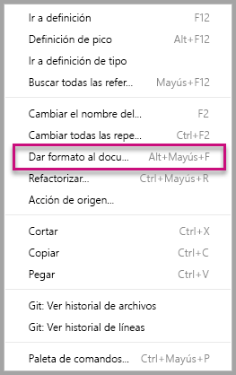

    Para mejorar la legibilidad, se recomienda que dé formato al documento cada vez que se peguen fragmentos de código.

5. Agregue el código siguiente al método *update*.

    ```typescript
    let width: number = options.viewport.width;
    let height: number = options.viewport.height;
    this.svg.attr({
     width: width,
     height: height
    });
    let radius: number = Math.min(width, height) / 2.2;
    this.circle
     .style("fill", "white")
     .style("fill-opacity", 0.5)
     .style("stroke", "black")
     .style("stroke-width", 2)
    .attr({
     r: radius,
     cx: width / 2,
     cy: height / 2
    });
    let fontSizeValue: number = Math.min(width, height) / 5;
    this.textValue
     .text("Value")
     .attr({
         x: "50%",
         y: "50%",
         dy: "0.35em",
         "text-anchor": "middle"
     }).style("font-size", fontSizeValue + "px");
    let fontSizeLabel: number = fontSizeValue / 4;
    this.textLabel
     .text("Label")
     .attr({
         x: "50%",
         y: height / 2,
         dy: fontSizeValue / 1.2,
         "text-anchor": "middle"
     })
     .style("font-size", fontSizeLabel + "px");
    ```

    *Este código establece el ancho y la altura del objeto visual, y después inicializa los atributos y estilos de los elementos visuales.*

6. Guarde el archivo **visual.ts**.

7. Seleccione el archivo **capabilities.json**.

    En la línea 14, quite el elemento objects completo (líneas 14-60).

8. Guarde el archivo **capabilities.json**.

9. En PowerShell, inicie el objeto visual personalizado.

    ```powershell
    pbiviz start
    ```

### <a name="toggle-auto-reload"></a>Activar recarga automática

1. Vuelva al informe de Power BI.
2. En la barra de herramientas flotante sobre el objeto visual de desarrollador, seleccione **Activar recarga automática**.

    

    Esta opción asegura que el objeto visual se recargue automáticamente cada vez que guarde los cambios en el proyecto.

3. En el **panel Campos**, arrastre el campo **Cantidad** al objeto visual de desarrollador.

4. Compruebe que el objeto visual tiene un aspecto similar al siguiente.

    

5. Cambie el tamaño del objeto visual.

    Observe que las escalas de los valores del círculo y texto se ajustan a la dimensión disponible del objeto visual.

    El método update se llama continuamente con el cambio de tamaño del objeto visual y tiene como resultado un cambio de escala fluido de los elementos visuales.

    Ahora ha desarrollado los elementos visuales.

6. Continúe ejecutando el objeto visual.

## <a name="configuring-data-binding"></a>Configuración de enlace de datos

Defina los roles de datos y las asignaciones de vista de datos, y después modifique la lógica del objeto visual personalizado para mostrar el valor y el nombre para mostrar de una medida.

### <a name="configuring-the-capabilities"></a>Configuración de las funcionalidades

Modifique el archivo **capabilities.json** para definir el rol de datos y las asignaciones de vistas de datos.

1. En Visual Studio Code, en el archivo **capabilities.json**, desde dentro de la matriz **dataRoles**, quite todo el contenido (líneas 3-12).

2. Dentro de la matriz **dataRoles**, inserte el código siguiente.

    ```json
    {
     "displayName": "Measure",
     "name": "measure",
     "kind": "Measure"
    }
    ```
    La matriz **dataRoles** define ahora un rol de datos único de tipo **measure**, que se denomina **measure** y se muestra como **Measure**. Este rol de datos permite pasar un campo de medida o un campo integrado.

3. Desde dentro de la matriz **dataViewMappings**, quite todo el contenido (líneas 10-31).

4. Dentro de la matriz **dataViewMappings**, inserte el siguiente contenido.

    ```json
            {
            "conditions": [
                { "measure": { "max": 1 } }
            ],
            "single": {
                "role": "measure"
            }
           }
    ```
    La matriz **dataViewMappings** ahora define un campo se puede pasar al rol de datos denominado **measure**.

5. Guarde el archivo **capabilities.json**.

6. En Power BI, observe que el objeto visual ahora puede configurarse con **Measure**.

    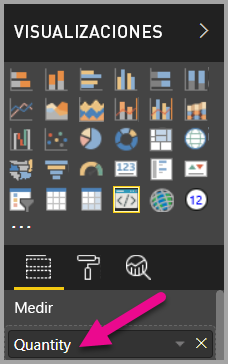

    > [!Note]
    > El proyecto de objeto visual todavía no incluye la lógica de enlace de datos.

### <a name="exploring-the-dataview"></a>Exploración de la vista de datos

1. En la barra de herramientas flotante encima del objeto visual, seleccione **Mostrar vista de datos**.

    

2. Desplácese hacia abajo a **single** y observe el valor.

    

3. Vaya a **metadata** y, después, en la matriz **columns** observe en particular los valores **format** y **displayName**.

    

4. Para volver al objeto visual, en la barra de herramientas flotante sobre el objeto visual, seleccione **Mostrar vista de datos**.

    

### <a name="configuring-data-binding"></a>Configuración de enlace de datos

1. En **Visual Studio Code**, en el archivo **visual.ts**, agregue la siguiente instrucción como la primera instrucción del método update.

    ```typescript
    let dataView: DataView = options.dataViews[0];
    ```
    

    Esta instrucción asigna el objeto *dataView* a una variable para facilitar el acceso y declara la variable para hacer referencia a dicho objeto *dataView*.

2. En el método **update**, reemplace .text("Value")** por lo siguiente.

    ```typescript
    .text(dataView.single.value as string)
    ```
    

3. En el método **update**, reemplace **.text("Label")** por lo siguiente.

    ```typescript
    .text(dataView.metadata.columns[0].displayName)
    ```
    

4. Guarde el archivo **visual.ts**.

5. En **Power BI**, revise el objeto visual, que ahora muestra el valor y el nombre para mostrar.

Ahora ha configurado los roles de datos y ha enlazado el objeto visual con la vista de datos.

En el siguiente tutorial aprenderá a agregar opciones de formato al objeto visual personalizado.

## <a name="debugging"></a>Depuración

Para obtener sugerencias sobre cómo depurar el objeto visual personalizado, consulte la [guía de depuración](https://microsoft.github.io/PowerBI-visuals/docs/how-to-guide/how-to-debug/).

## <a name="next-steps"></a>Pasos siguientes

> [!div class="nextstepaction"]
> [Adición de opciones de formato](custom-visual-develop-tutorial-format-options.md)
