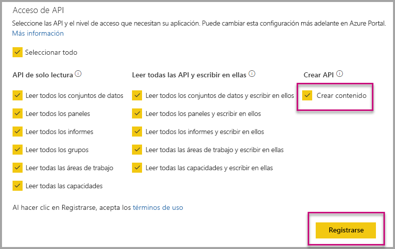

# Instalación automática de aplicaciones de Power BI al insertar contenido para la organización

Para insertar contenido desde una aplicación, el usuario que realiza la inserción debe tener [acceso a la aplicación](../service-create-distribute-apps.md). Si el usuario tiene instalada la aplicación, la inserción funciona sin problemas. Para más información, consulte [Inserción de informes o paneles desde una aplicación](embed-from-apps.md). En PowerBI.com, se puede definir que todas las aplicaciones se puedan [instalar automáticamente](https://powerbi.microsoft.com/blog/automatically-install-apps/). Sin embargo, esta acción se realiza en el nivel de inquilino y se aplica a todas las aplicaciones.

## Instalación automática de aplicaciones al insertar contenido

Si un usuario tiene acceso a una aplicación pero la aplicación no está instalada, se produce un error en la inserción. Para evitar estos errores al insertar desde una aplicación, puede permitir la instalación automática de la aplicación en la inserción. Esta acción significa que si la aplicación que el usuario intenta insertar no está instalada, se instala automáticamente. Por tanto, el contenido se inserta inmediatamente, lo que resulta en una experiencia fluida para el usuario.

## Inserción para usuarios de Power BI (el usuario es propietario de los datos)

Para permitir la instalación automática de aplicaciones para los usuarios, debe conceder el permiso "Crear contenido" a la aplicación en el momento del [registro de la aplicación](register-app.md#register-with-the-power-bi-application-registration-tool) o bien agregarlo si ya ha registrado la aplicación.

A continuación, debe proporcionar el identificador de aplicación en la dirección URL de inserción. Para proporcionar el identificador de aplicación, el creador de la aplicación primero debe instalar la aplicación y, a continuación, usar una de las llamadas a la [API REST de Power BI](https://docs.microsoft.com/rest/api/power-bi/) admitidas: [Get Reports](https://docs.microsoft.com/rest/api/power-bi/reports/getreports) o [Get Dashboards](https://docs.microsoft.com/rest/api/power-bi/dashboards/getdashboards). A continuación, el creador de la aplicación debe tomar la dirección URL de inserción de la respuesta de la API REST. El identificador de aplicación aparece en la dirección URL si el contenido procede de una aplicación.  Una vez que tiene la dirección URL de inserción, se puede usar para la inserción de forma normal.

## Protección de la inserción

Para usar la instalación automática de aplicaciones, el creador de la aplicación debe instalar la aplicación, ir a la aplicación en PowerBI.com, ir hasta el informe y obtener el vínculo de la manera habitual. Los demás usuarios con acceso a la aplicación que pueden usar el vínculo, pueden insertar el informe.

## Consideraciones y limitaciones

* Solo puede insertar informes y paneles en este escenario.

* Esta característica no se admite actualmente para escenarios en los que la aplicación es propietaria de los datos y en la inserción de SharePoint.