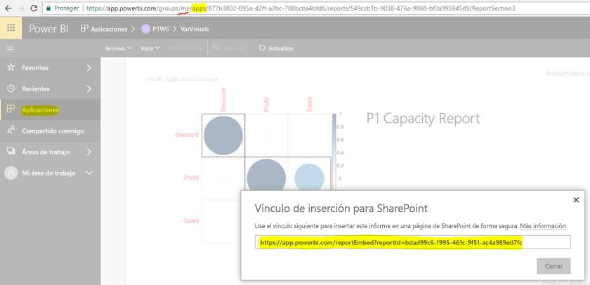

# Insertar informes o paneles desde aplicaciones

En Power BI, se pueden crear aplicaciones para reunir paneles e informes relacionados en un solo lugar. Después, se pueden publicar en grandes grupos de usuarios de la organización. El uso de esas aplicaciones es relevante cuando todos los usuarios son usuarios de Power BI. Por tanto, puede compartir contenido con ellas mediante el uso de aplicaciones de Power BI. En este artículo se proporcionan algunos pasos rápidos para extraer contenido de una aplicación de Power BI publicada e insertarlo en una aplicación de terceros.

## Obtención de un valor embedURL de informe para la inserción

1. Cree una instancia de la aplicación en un área de trabajo de usuario, **Mi área de trabajo**. Comparta con usted mismo o guíe a otro usuario para recorrer este flujo.

2. Abra el informe que quiera en el servicio Power BI.

3. Vaya a **Archivo** > **Insertar en SharePoint Online** y obtenga el valor de embedURL de informe. En la instantánea siguiente se muestra un ejemplo de embedURL. También puede llamar a la API de REST GetReports/GetReport y extraer de la respuesta el campo embedURL de informe correspondiente. La llamada a REST no debería incluir un identificador de área de trabajo como parte de la dirección URL, ya que se creó una instancia de la aplicación en el área de trabajo del usuario.

    

4. Use el valor de embedURL recuperado en el paso 3 con el SDK de JavaScript.

## Obtención de un valor embedURL de panel para la inserción

1. Cree una instancia de la aplicación en un área de trabajo de usuario, **Mi área de trabajo**. Comparta con usted mismo o guíe a otro usuario para recorrer este flujo.

2. O bien llame a la API REST GetDashboards y extraiga de la respuesta el campo embedURL de panel correspondiente. La llamada a REST no debería incluir un identificador de área de trabajo como parte de la dirección URL, ya que se creó una instancia de la aplicación en el área de trabajo del usuario.

3. Use el valor de embedURL recuperado en el paso 2 con el SDK de JavaScript.

## Pasos siguientes

Vea cómo insertar desde áreas de trabajo de aplicación para los clientes de terceros y la organización:

> [!div class="nextstepaction"]
>[Inserción para clientes de terceros](embed-sample-for-customers.md)

> [!div class="nextstepaction"]
>[Insertar para la organización](embed-sample-for-your-organization.md)
