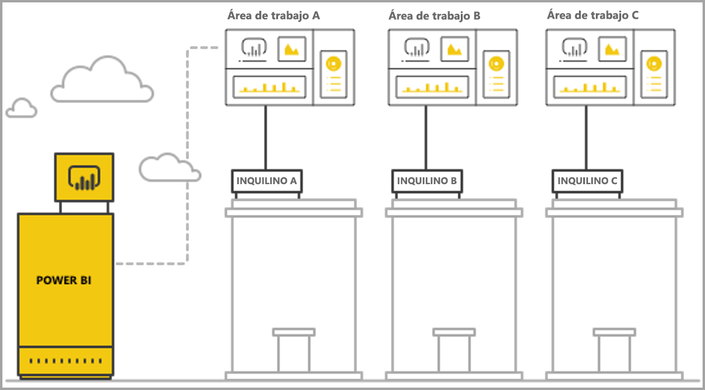
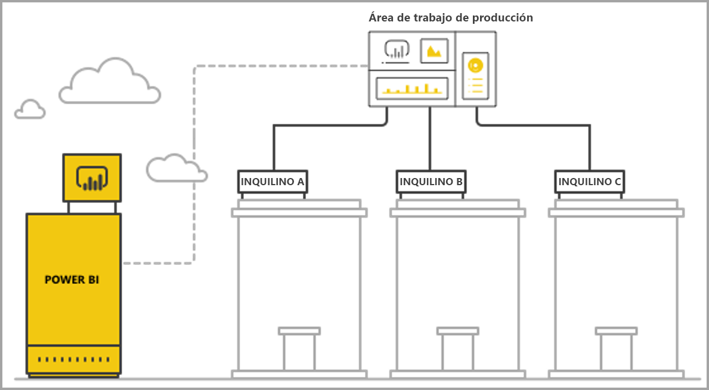

# Administración de varios inquilinos con análisis integrado de Power BI

Al diseñar una aplicación SaaS de varios inquilinos, debe elegir cuidadosamente el modelo de formato de inquilino que mejor se adapte a las necesidades de su aplicación SaaS. Este proceso también es válido para Power BI como parte del análisis integrado de su aplicación SaaS. Un modelo de formato de inquilino determina cómo se asignan y administran dentro de Power BI y la cuenta de almacenamiento los datos de cada inquilino. El modelo de formato de inquilino afecta a la administración y el diseño de la aplicación. El cambio a un modelo diferente más adelante puede ser costoso y problemático.

Con Power BI Embedded, hay fundamentalmente dos enfoques principales para mantener la separación entre los inquilinos.

   1. **Aislamiento basado en el área de trabajo**: creación de un área de trabajo de Power BI independiente por inquilino.
   2. **Aislamiento basado en la seguridad a nivel de fila**: donde los datos subyacentes se utilizan para controlar y administrar el acceso a los datos por usuario o grupo.

En este artículo se describen los diferentes enfoques y se analizan en función de varios criterios de evaluación.

## Conceptos y terminología

**[AAD](https://docs.microsoft.com/azure/active-directory/fundamentals/active-directory-whatis)**: Azure Active Directory.

**Aplicación de AAD**: una identidad de aplicación en AAD. Se necesita una aplicación de AAD para la autenticación.

**Aplicación SaaS (software como servicio)**: sistema implementado por una empresa o fabricante de software independiente que normalmente es un servicio en línea. También tiene sistemas de software relacionados para servir a múltiples inquilinos clientes (organizaciones). En este artículo, **la aplicación SaaS usa Power BI Embedded para ofrecer análisis a sus diferentes inquilinos**. Power BI Embedded puede también funcionar para todos los tipos de aplicaciones cuando tienen una conexión en línea.

**Inquilino**: un solo cliente (organización) que usa la aplicación SaaS y los recursos o datos que el cliente lleva a la aplicación SaaS.

**[Power BI](../power-bi-overview.md)**: servicio Power BI en la nube que sirve como plataforma para Power BI Embedded.

**Inquilino de Power BI**: conjunto de recursos de Power BI asociado a un único inquilino de AAD.

**[Área de trabajo de Power BI](../service-create-workspaces.md)**: contenedor para el contenido de Power BI.

**Artefactos de Power BI**: hay varios artefactos de Power BI en áreas de trabajo de Power BI, como paneles, informes, conjuntos de datos y flujos de datos.

**[Power BI Embedded](azure-pbie-what-is-power-bi-embedded.md)**: conjunto de API públicas que permiten a los desarrolladores compilar aplicaciones que administran contenido de Power BI e insertan elementos de Power BI.

**[Seguridad de nivel de fila](embedded-row-level-security.md)**: ofrece la capacidad de controlar el acceso de los usuarios a los datos para las filas individuales de una tabla. Puede implementar la seguridad de nivel de fila en el nivel de origen de datos o en el modelo semántico de Power BI.

**Usuario maestro**: identidad que representa la aplicación SaaS en Power BI y que la aplicación SaaS usa al llamar a las API de Power BI. Debe ser un usuario de AAD con una licencia de Power BI Pro.

**Usuario de aplicación de AAD (entidad de servicio)**: identidad que representa la aplicación SaaS en Power BI y que la aplicación SaaS usa al llamar a las API de Power BI. Debe ser una aplicación web de AAD. Puede reemplazar el uso de un usuario *maestro* para autenticarse en Power BI.

**Capacidad**: conjunto de recursos dedicados a ejecutar el servicio Power BI. [Capacidades de Power BI Premium](../service-premium.md): opción destinada a empresas que usan Power BI internamente, mientras que las [capacidades de Power BI Embedded](azure-pbie-create-capacity.md) están previstas para que los desarrolladores de aplicaciones desarrollen aplicaciones SaaS para terceros.

**[Licencia de Power BI Pro](../service-admin-purchasing-power-bi-pro.md)**: licencia basada en usuarios, que concede derechos para publicar contenido en áreas de trabajo de las aplicaciones, consumir aplicaciones sin la capacidad Premium, compartir paneles y suscribirse a paneles e informes.

**[Modos de conectividad de datos](../desktop-directquery-about.md)**: la conexión de orígenes de datos a Power BI que se pueden realizar en modos distintos:

   * Importar: la manera más común de obtener datos.
   * DirectQuery: conexión directa a los datos en su repositorio de origen.
   * Conexión dinámica: otro modo que se conecta directamente a los datos de Analysis Services (de forma local y en Azure).

## Criterios de evaluación

La elección óptima para el modelo de formato de inquilino adecuado para su aplicación SaaS varía según los requisitos técnicos y comerciales específicos o la arquitectura de datos, entre otros factores. Una comprensión profunda de estos requisitos, junto con las opciones de modelos de formato de arrendamiento disponibles y las ventajas y desventajas de cada una de ellas, puede ayudar a definir una arquitectura sólida, de alto rendimiento, rentable y escalable para su aplicación SaaS.

A continuación se describe un conjunto de áreas que se deben tener en cuenta al elegir entre los diferentes modelos de formato de inquilino.

### Arquitectura de datos

Normalmente, los desarrolladores que crean aplicaciones con Power BI Embedded ya tienen una base de datos de uno o varios inquilinos. Es más fácil usar un modelo de formato de inquilino de Power BI Embedded que sea similar al modelo de formato de inquilino de la base de datos. Si el modelo de formato de inquilino de la base de datos no se ha definido todavía, puede considerar otros aspectos antes de tomar una decisión sobre la arquitectura de datos.

### Aislamiento de datos

¿Cuál es el grado de confidencialidad de los datos que se van a almacenar? ¿Qué nivel de aislamiento necesita al separar los diferentes inquilinos de cliente? La respuesta puede variar entre sectores diferentes o entre clientes determinados que tienen ciertos requisitos específicos.

### Escalabilidad

Para encontrar la mejor solución, defina la escala que alcanzará en un futuro próximo. Recuerde que una solución que podría ser conveniente ahora es posible que no sea suficiente cuando el uso y los datos aumenten. Al analizar la escalabilidad, considere estos aspectos:

   * Número de inquilinos (clientes).
   * Número de informes, paneles y conjuntos de datos para cada inquilino.
   * Tamaño de los datos de cada conjunto de datos y frecuencia de las actualizaciones.
   * Número de usuarios.
   * Número de usuarios simultáneos en horas de máxima actividad.

Algunas aplicaciones SaaS pueden tener un número reducido de clientes y un uso bajo, pero grandes cantidades de datos. Otras pueden tener muchos clientes y un uso elevado, pero una pequeña cantidad de datos e informes para cada cliente. Los números altos en cualquiera de estas situaciones pueden afectar a los costos futuros y la complejidad operativa.

### Automatización y complejidad operativa

Identifique los procesos recurrentes que necesitan automatización.

   * ¿Cuál es la frecuencia de incorporación de nuevos inquilinos? ¿Qué acciones se requieren para incorporar completamente cada uno de ellos?
   * ¿Cuál es la cadencia de publicación de contenido de Power BI nuevo o actualizado que debe implementarse?
   * ¿Cuántos roles de seguridad de nivel de fila se definen para cada inquilino?  

La identificación de estos procesos y el modo de abordarlos puede ayudarle a comprender la complejidad operativa que implica el mantenimiento de cada modelo.

### Requisitos de residencia de datos y necesidad de admitir varias ubicaciones geográficas

Power BI Embedded admite la implementación de varios puntos geográficos (característica en versión preliminar). [Multi-Geo](embedded-multi-geo.md) permite que los recursos de Power BI Embedded se implementen en diferentes regiones con contenido específico asignado para residir en regiones específicas. Esta característica se puede usar en todos los modelos, pero puede afectar a la cantidad de contenido que desee administrar y el costo. Actualmente, Multi-Geo está diseñado para satisfacer los requisitos de residencia de datos y no mejora el rendimiento al mover los datos más cerca de los consumidores.

### Costo

[Power BI Embedded](https://azure.microsoft.com/services/power-bi-embedded/) tiene un modelo de compra basado en recursos, como **Power BI Premium**. Puede comprar una o más capacidades con capacidad de proceso y memoria fijas. Esta capacidad es el elemento de mayor costo cuando se trabaja con **Power BI Embedded**. No hay ningún límite en el número de usuarios con la capacidad. El único límite es el rendimiento de la capacidad. Se requiere una [licencia de Power BI Pro](../service-admin-licensing-organization.md) para cada usuario *maestro*, o usuarios específicos que necesitan acceder al portal de Power BI.

Se recomienda la prueba y la medición de la carga esperada de su capacidad mediante la simulación del uso y el entorno de producción y la ejecución de pruebas de carga sobre la capacidad. Puede medir la carga y el rendimiento con las diversas métricas disponibles en la capacidad de Azure o la [aplicación de las métricas de capacidad Premium](../service-admin-premium-monitor-capacity.md).

### Creación y personalización del contenido

Existen dos enfoques para aplicaciones SaaS que confieren a los usuarios la capacidad de editar y crear informes o cargar datos en el servicio como parte del flujo:

   * [Modo de edición o creación de un iFrame insertado](https://github.com/Microsoft/PowerBI-JavaScript/wiki/Create-Report-in-Embed-View): el usuario obtiene una vista del informe o un nuevo lienzo en blanco dentro de la aplicación SaaS. De este modo, puede usar la barra de herramientas de Power BI para crear contenido basado en un conjunto de datos del área de trabajo. Se recomienda esta opción, ya que se encuentra en el contexto del usuario en un entorno familiar. Es más fácil empezar a trabajar y editar, y el usuario crea un informe conectado a un conjunto de datos existente.

   * Use Power BI Desktop para crear contenido y cargarlo a través de la interfaz de usuario de la aplicación SaaS al área de trabajo. En este enfoque, los usuarios tienen más herramientas para trabajar al usar Power BI Desktop. Sin embargo, no se recomienda este enfoque puesto que los usuarios deben estar familiarizados con una herramienta adicional fuera del contexto de la aplicación SaaS. La carga de un archivo PBIX implica que el usuario está agregando un conjunto de datos adicional, que podría ser un duplicado de los conjuntos de datos ya presentes en el área de trabajo.

## Aislamiento basado en el área de trabajo de Power BI

Con el aislamiento basado en el área de trabajo de Power BI, la aplicación SaaS admite varios inquilinos desde un solo inquilino de Power BI. El aislamiento basado en el área de trabajo contiene todo el contenido de Power BI que usan distintos inquilinos. La separación de inquilinos se realiza en el nivel de área de trabajo de Power BI, mediante la creación de varias áreas de trabajo. Cada área de trabajo contiene los conjuntos de datos, informes y paneles pertinentes para dicho inquilino. Además, cada área de trabajo está conectada solo a los datos de ese inquilino. Si necesita aislamiento adicional, puede crear un usuario *maestro* o una entidad de servicio para cada área de trabajo y su contenido.

### Arquitectura de datos

Hay dos enfoques principales para administrar los datos de inquilino.

* Una base de datos independiente por inquilino
* Una sola base de datos de varios inquilinos

Si el almacenamiento de una aplicación SaaS consiste en mantener una base de datos independiente por inquilino, la opción natural es usar conjuntos de datos de un solo inquilino en Power BI con la cadena de conexión para cada conjunto de datos apuntando a la base de datos coincidente.

Si el almacenamiento de la aplicación SaaS usa una base de datos de varios inquilinos para todos los inquilinos, es fácil separar los inquilinos por área de trabajo. Puede configurar la conexión de la base de datos para el conjunto de datos de Power BI con una consulta de la base de datos parametrizada que solo recupera los datos del inquilino correspondiente. Puede actualizar la conexión con [Power BI Desktop](../desktop-query-overview.md) o mediante la [API](https://docs.microsoft.com/rest/api/power-bi/datasets/updatedatasourcesingroup) con [parámetros](https://docs.microsoft.com/rest/api/power-bi/datasets/updateparametersingroup) en la consulta.

### Aislamiento de datos

Los datos en este modelo de formato de inquilino se separan en el nivel de área de trabajo. Una sencilla asignación entre un área de trabajo y un inquilino impide que los usuarios de un inquilino vean el contenido de otro inquilino. El uso de un usuario *maestro* requiere que tenga acceso a todas las áreas de trabajo diferentes. La configuración de los datos que se muestran a un usuario final se define durante la [generación del token de inserción](https://docs.microsoft.com/rest/api/power-bi/embedtoken), un proceso de solo back-end que los usuarios finales no pueden ver ni cambiar.

Para agregar aislamiento adicional, un desarrollador de aplicaciones puede definir un usuario *maestro* o una aplicación por área de trabajo en lugar de un solo usuario *maestro* o una aplicación con acceso a varias áreas de trabajo. De este modo, puede asegurarse de que cualquier error humano o pérdida de credenciales no provoque la exposición de los datos de múltiples clientes.

### Escalabilidad

Una ventaja de este modelo es que la separación de los datos en varios conjuntos de datos para cada inquilino supera los [límites de tamaño de un único conjunto de datos](https://docs.microsoft.com/power-bi/service-premium-large-datasets) (actualmente 10 GB en una capacidad). Cuando se sobrecarga la capacidad, [puede expulsar los conjuntos de datos sin usar](../service-premium-understand-how-it-works.md) para liberar memoria para los conjuntos de datos activos. Esta tarea no es posible con un único conjunto de datos de gran tamaño. Al usar varios conjuntos de datos, también es posible separar los inquilinos en varias capacidades de Power BI, si fuera necesario.

A pesar de estas ventajas, se debe tener en cuenta la escala que la aplicación SaaS puede alcanzar en el futuro. Por ejemplo, podría alcanzar las limitaciones sobre el número de artefactos que puede administrar. Consulte la sección de [límites](#summary-comparison-of-the-different-approaches) de la implementación más adelante en este artículo para obtener más información. La SKU de capacidad utilizada presenta un límite en el tamaño de la memoria a la que deben adaptarse los conjuntos de datos, [la cantidad de actualizaciones que se pueden ejecutar al mismo tiempo](../service-premium-understand-how-it-works.md) y la frecuencia máxima de las actualizaciones de datos. Se recomienda hacer la prueba al administrar cientos o miles de conjuntos de datos. También se recomienda tener en cuenta el volumen promedio y máximo de uso, así como los inquilinos específicos con grandes conjuntos de datos o patrones de uso diferentes que se administran de forma diferente a otros inquilinos.

### Automatización y complejidad operativa

Con el aislamiento basado en el área de trabajo de Power BI, un desarrollador de aplicaciones podría requerir administrar cientos o miles de artefactos. Es fundamental definir los procesos que se producen con frecuencia en la administración del ciclo de vida de la aplicación y asegurarse de que tiene el conjunto correcto de herramientas para realizar estas operaciones a escala en este modelo de formato de inquilino. Algunas operaciones son, por ejemplo, las siguientes:

   * Agregar un nuevo inquilino (cliente)
   * Actualizar un informe o panel para algunos inquilinos o todos ellos
   * Actualizar el esquema del conjunto de datos para algunos inquilinos o todos ellos
   * Personalizaciones no planeadas para inquilinos específicos
   * Frecuencia de las actualizaciones del conjunto de datos

Por ejemplo, crear un área de trabajo para un nuevo inquilino es una tarea común, que necesita la automatización. Con la [API REST de Power BI](https://docs.microsoft.com/rest/api/power-bi/), puede lograr la [completa automatización para crear áreas de trabajo](https://powerbi.microsoft.com/blog/duplicate-workspaces-using-the-power-bi-rest-apis-a-step-by-step-tutorial/).

### Necesidades de Multi-Geo

Multi-Geo implica la compra de capacidad en las regiones deseadas y la asignación de un área de trabajo a esa capacidad. Si necesita admitir diferentes inquilinos en distintas regiones, debe asignar el área de trabajo del inquilino a una capacidad en la región deseada. Esta tarea es una operación sencilla donde el costo es solo el derivado de tener todas las áreas de trabajo en la misma capacidad. Sin embargo, si tiene inquilinos que necesitan datos residentes en varias regiones, todos los artefactos del área de trabajo deben estar duplicados en cada capacidad regional, lo cual aumenta el costo y la complejidad de administración.

### Costo

Los desarrolladores de aplicaciones que usan Power BI Embedded deben [adquirir la capacidad de Power BI Embedded para pasar a producción](embed-sample-for-customers.md#move-to-production).  Es importante comprender el impacto del modelo de aislamiento basado en el área de trabajo y su efecto en las capacidades.

El modelo de aislamiento basado en el área de trabajo se complementa bien con las capacidades por las razones siguientes:

   * El objeto más pequeño que puede asignar de manera independiente a una capacidad es un área de trabajo (no se puede asignar un informe, por ejemplo); así pues, al separar inquilinos por áreas de trabajo, obtiene flexibilidad plena en la administración de cada inquilino y sus necesidades de rendimiento, así como en la optimización del uso de la capacidad al escalar o reducir verticalmente. Por ejemplo, los inquilinos grandes y esenciales con alto volumen y volatilidad pueden administrarse en una capacidad separada para garantizar un nivel de servicio coherente, agrupando los inquilinos más pequeños en otra capacidad para optimizar los costos.

   * Las áreas de trabajo separadas implican también la separación de los conjuntos de datos entre inquilinos para que los modelos de datos pueden estar en fragmentos más pequeños, en lugar de en un único conjunto de datos de gran tamaño. Esta tarea permite a la capacidad administrar mejor el uso de la memoria, expulsando conjuntos de datos pequeños y no usados cuando no se necesitan, y manteniendo a los usuarios satisfechos con el rendimiento.

Los desarrolladores de aplicaciones deben tener en cuenta el límite del número de actualizaciones paralelas, ya que los procesos de actualización pueden requerir capacidad adicional al tener varios conjuntos de datos.

### Creación y personalización del contenido

Para los casos de uso principales de creación de contenido, el desarrollador de la aplicación debe pensar detenidamente qué inquilinos pueden tener capacidades de edición, y cuántos usuarios de cada inquilino pueden editar. Al permitir que varios usuarios de cada inquilino puedan editar podría ocurrir que se genere mucho contenido o que se alcance un límite del conjunto de datos, como el número de informes por conjunto de datos o el número de conjuntos de datos en un área de trabajo. Si proporciona esta capacidad a los usuarios, se recomienda supervisar estrechamente la generación de contenido y escalar verticalmente según sea necesario. Por las mismas razones, no se recomienda usar esta capacidad para la personalización de contenido, donde cada usuario puede realizar pequeños cambios en un informe y guardarlo por su cuenta. Si la aplicación SaaS permite la personalización de contenido, considere la posibilidad de introducir y comunicar las directivas de retención del área de trabajo para el contenido específico del usuario a fin de facilitar el flujo de eliminación del contenido cuando los usuarios finales cambien de puesto, abandonen la empresa o dejen de usar la plataforma.

## Aislamiento basado en seguridad de nivel de fila

Con el aislamiento basado en seguridad de nivel de fila, la aplicación SaaS usa una sola área de trabajo para hospedar a varios inquilinos. Esto significa que cada informe, panel y conjunto de datos de los artefactos de Power BI se crea una vez que todos los inquilinos lo usen. La separación de datos entre los inquilinos se logra mediante la [seguridad de nivel de fila](embedded-row-level-security.md) en el conjunto de datos de varios inquilinos. Cuando los usuarios finales inician sesión en la aplicación SaaS y abren contenido, se genera un token de inserción para la sesión de ese usuario, con los roles y los filtros que garantizan que el usuario solo ve los datos que tiene permiso de ver. Si no se permite a los usuarios del mismo inquilino ver los mismos datos, el desarrollador de la aplicación debe implementar roles jerárquicos entre los inquilinos y dentro del mismo inquilino.

### Arquitectura de datos

La implementación del aislamiento basado en seguridad de nivel de fila es más cómodo cuando los datos de todos los inquilinos se almacenan en un único almacén de datos. En este caso, el desarrollador de aplicaciones puede pasar solo los datos pertinentes desde el almacén de datos en el conjunto de datos de Power BI, ya sea a través de DirectQuery o la importación de datos. Si los datos en la base de datos se separan por inquilino, deben combinarse en un único conjunto de datos, lo que da como resultado un menor grado de separación entre los inquilinos que existían en la base de datos.

### Aislamiento de datos

Con el aislamiento basado en seguridad de nivel de fila, la separación de datos se realiza mediante [definiciones de seguridad de nivel de fila](embedded-row-level-security.md) en el conjunto de datos, lo que significa que todos los datos coexisten. Esta forma de separación de datos es más susceptible a la pérdida de datos a través de un error del desarrollador. Incluso si la seguridad de nivel de fila se realiza en el back-end y se protege de un usuario final, si los datos son altamente confidenciales o los clientes piden separación de datos, podría ser mejor utilizar el aislamiento basado en el área de trabajo.

### Escalabilidad

Con el aislamiento basado en seguridad de nivel de fila, los datos deben adaptarse al límite de tamaño del conjunto de datos, que actualmente es de 10 GB. Con la introducción de la [actualización incremental](../service-premium-incremental-refresh.md) y la próxima publicación de un punto de conexión XMLA para conjuntos de datos de Power BI, el límite de tamaño del conjunto de datos se espera que aumente significativamente. Sin embargo, los datos aún deben adaptarse a la memoria de la capacidad, dejando suficiente memoria adicional para la ejecución de las actualizaciones de datos. Las implementaciones a gran escala necesitan una gran capacidad para evitar que los usuarios experimenten problemas debidos a la superación por la memoria de los límites de la capacidad actual. Otras maneras de gestionar el escalado incluyen el uso de **[agregaciones](../desktop-aggregations.md)** o la conexión al origen de datos directamente mediante DirectQuery o la conexión dinámica, en lugar de almacenar en caché todos los datos de la capacidad de Power BI.

### Automatización y complejidad operativa

La administración de artefactos es mucho más cómoda al usar el aislamiento basado en la seguridad de nivel de fila que el aislamiento basado en el área de trabajo porque hay una sola versión de un artefacto para cada entorno (desarrollo, prueba y producción), en lugar de una versión por inquilino. A gran escala, la administración de artefactos implica administrar y actualizar decenas de artefactos, y no miles y miles de ellos.

Power BI aún no tiene una API para modificar o crear reglas y roles de seguridad de nivel de fila. La adición o el cambio de roles solo se puede realizar manualmente en Power BI Desktop. La aplicación de una jerarquía de seguridad de nivel de fila puede resultar complicada y ser propensa a errores en su administración si no se prepara detenidamente.

Si el desarrollador de aplicaciones debe administrar muchos roles y definiciones de roles que deben crearse o actualizarse con frecuencia, el aislamiento basado en seguridad de nivel de fila no es escalable, desde una perspectiva de facilidad de uso.

Otra complejidad operativa es la necesidad de supervisar estrechamente la utilización de memoria y de crear un mecanismo eficaz de alertas y escalado para ofrecer a los usuarios una experiencia fluida.  

### Necesidades de Multi-Geo

Dado que todos los datos se almacenan en un único conjunto de datos, resulta difícil satisfacer los requisitos de residencia de datos que requieren determinados datos para enlazarse a ubicaciones específicas. También puede aumentar significativamente el costo de usar varias regiones, ya que todos los datos se replican y almacenan en cada región. Si solo un número limitado de inquilinos necesita diferentes regiones geográficas, puede mantener solo los datos de esos inquilinos en una región distinta, usando el modelo de aislamiento basado en el área de trabajo descrito anteriormente.

### Costo

El controlador de costos principales con el aislamiento basado en seguridad de nivel de fila es la superficie de memoria del conjunto de datos. Necesita suficiente capacidad para almacenar el conjunto de datos y mantener un búfer de memoria adicional para los picos de demanda de memoria. Una manera de mitigar esta situación es almacenar los datos en una base de datos de SQL Server o un cubo de SQL Server Analysis Services y usar Direct Query o una conexión dinámica para recuperar los datos del origen de datos en tiempo real. Este enfoque aumenta el costo de los orígenes de datos, pero reduce la necesidad de una gran capacidad debido a las necesidades de memoria, reduciendo así el costo de la capacidad de Power BI.

### Creación y personalización del contenido

A medida que los usuarios finales editan o crean informes, pueden usar el conjunto de datos de varios inquilinos de producción. Por ese motivo, se recomienda utilizar solo la opción de iFrame insertado para editar o [crear informes](https://github.com/Microsoft/PowerBI-JavaScript/wiki/Create-Report-in-Embed-View), ya que se basa en el mismo conjunto de datos, con la seguridad de nivel de fila aplicada. Hacer que los usuarios carguen archivos PBIX con conjuntos de datos adicionales puede ser costoso y difícil de administrar con el aislamiento basado en seguridad de nivel de fila. Además, cuando los usuarios generan nuevo contenido que se encuentra en la misma área de trabajo, deberá asegurarse de que el área de trabajo de producción no alcance sus límites y crear un mecanismo eficaz para distinguir el contenido que está conectado a cada inquilino.

## Comparación de resumen de los diferentes enfoques

> [!Important]
> El siguiente análisis se basa en el estado actual del producto. Como vamos a publicar nuevas características a un ritmo mensual, seguiremos proporcionando nuevas capacidades y características que den respuesta a las limitaciones y los puntos débiles actuales. Asegúrese de comprobar nuestras entradas de blog mensuales para ver las novedades y vuelva a este artículo para ver cómo afectan las nuevas características a la recomendación del modelo de formato de inquilino.

| Criterios de evaluación | Basado en el área de trabajo   | Basado en la seguridad de nivel de fila  |  |  |
|--------------------------------------|----------------------------------------------------------------------------------------------------------------------|---------------------------------------------------------------------------------------|---|---|
| Arquitectura de datos  | Más fácil cuando hay una base de datos independiente por inquilino  | Más fácil cuando todos los datos para todos los inquilinos están en un único almacén de datos   |  |  |
| Aislamiento de datos  | Bueno. Cada inquilino tiene un conjunto de datos dedicado.  | Moderado. Todos los datos están en el mismo conjunto de datos compartido, pero se administran a través del control de acceso.  |  |  |
| Escalabilidad  | Medio. La división de los datos en varios conjuntos de datos habilita la optimización.  | Mínimo. Restringido por los límites del conjunto de datos.  |  |  |
| Necesidades de Multi-Geo  | Buena opción cuando la mayoría de los inquilinos están solo en una región.  | No se recomienda. Es necesario tener todo el conjunto de datos almacenado en varias regiones.  |  |  |
| Automatización y complejidad operativa  | Automatización buena para el inquilino individual.   Complejo para administrar muchos artefactos a escala.  | Facilidad de administración de los artefactos de Power BI pero complejidad de administración de seguridad de nivel de fila a gran escala.  |  |  |
| Costo  | Bajo-medio. Se puede optimizar el uso para reducir el costo por inquilino.  Puede aumentar cuando se necesiten actualizaciones frecuentes.  | Medio-alto si utiliza el modo de importación.  Bajo-medio si utiliza el modo Direct Query.  |  |  |
| Creación y personalización del contenido  | Buena opción. Podría alcanzar las limitaciones a gran escala.  | Generación de contenido solo en iFrame insertado  |  |  |

## Consideraciones y limitaciones de implementación

**Limites del artefacto de Power BI:**

* El número de áreas de trabajo V1 (grupos) de los que un solo usuario/aplicación puede ser miembro o administrador es de 250.
* El número de áreas de trabajo V2 (carpetas) de los que un solo usuario/aplicación puede ser miembro o administrador es de 1000.
* El número de conjuntos de datos en un área de trabajo es de 1000.
* El número de informes o paneles conectados a un único conjunto de datos es de 1000.
* El límite de tamaño de memoria de conjunto de datos para cargar un archivo *.pbix* es de 10 GB.

**Consideraciones y limitaciones de capacidad de Power BI:**

* Cada capacidad solo puede usar su memoria y núcleos virtuales asignados, según la [SKU adquirida](../service-premium.md).
* Para obtener más detalles sobre el tamaño del conjunto de datos recomendado para cada SKU, consulte [Compatibilidad de Power BI Premium para grandes conjuntos de datos](../service-premium-large-datasets.md).
* El tamaño máximo del conjunto de datos en una capacidad dedicada es de 10 GB.
* El número de actualizaciones programadas para un conjunto de datos del *modo de importación* en un día es de 48.
* El tiempo entre actualizaciones programadas para un conjunto de datos del *modo de importación* es de 30 minutos.
* Para el número de actualizaciones que pueden ejecutarse simultáneamente en una capacidad, consulte [Optimización y administración de recursos](../service-premium-understand-how-it-works.md).
* El tiempo medio de escalado de una capacidad está entre 1 y 2 minutos. Durante ese tiempo, la capacidad no está disponible. Se recomienda usar un enfoque de escalado horizontal para [evitar tiempos de inactividad](https://powerbi.microsoft.com/blog/power-bi-developer-community-november-update-2018/#scale-script).

## Pasos siguientes

* [Análisis integrado con Power BI](embedding.md)
* [¿Qué es Power BI Embedded de Azure?](azure-pbie-what-is-power-bi-embedded.md)
* [Power BI Premium](../service-premium.md)
* [Uso de la seguridad de nivel de fila con contenido insertado de Power BI](embedded-row-level-security.md)