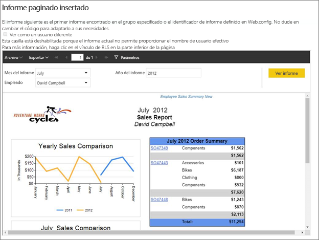
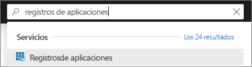
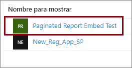
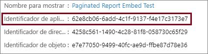
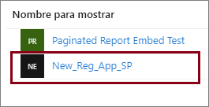
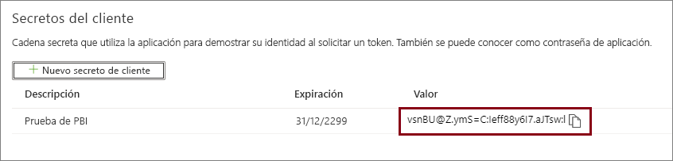

# <a name="tutorial-embed-power-bi-paginated-reports-into-an-application-for-your-customers-preview"></a>Tutorial: Inserción de informes paginados de Power BI en una aplicación para los clientes (versión preliminar)

Con **Power BI Embedded en Azure** o la **inserción de Power BI en Office**, puede insertar informes paginados en una aplicación mediante el uso de "la aplicación posee los datos". Una **aplicación que posee los datos** consiste en tener una aplicación que use Power BI como plataforma de análisis integrados. Como **ISV** o **desarrollador**, puede crear contenido de Power BI que muestre informes paginados en una aplicación que esté completamente integrada e interactiva, sin necesidad de que los usuarios dispongan de una licencia de Power BI. En este tutorial se muestra cómo integrar un informe paginado en una aplicación mediante el SDK para .NET de Power BI con la API para JavaScript de Power BI.



En este tutorial, obtendrá información sobre cómo:
> [!div class="checklist"]
> * Registrar una aplicación en Azure.
> * Insertar un informe paginado de Power BI en una aplicación.

## <a name="prerequisites"></a>Requisitos previos

Para empezar, es necesario que tenga:

* Una [entidad de servicio (token de solo aplicación)](embed-service-principal.md)
* Una suscripción a [Microsoft Azure](https://azure.microsoft.com/)
* Su propia configuración de [inquilino de Azure Active Directory](create-an-azure-active-directory-tenant.md)
* Al menos una [capacidad](#create-a-dedicated-capacity) A4 o P1, con la carga de trabajo de [informes paginados](../service-admin-premium-workloads.md#paginated-reports) habilitada

Si no tiene una suscripción a Azure, cree una [cuenta gratuita](https://azure.microsoft.com/free/?WT.mc_id=A261C142F) antes de empezar.

## <a name="set-up-your-power-bi-environment"></a>Configuración del entorno de Power BI

La inserción de un informe paginado requiere la asignación de un área de trabajo a una capacidad dedicada y la carga del informe en el área de trabajo.

### <a name="create-an-app-workspace"></a>Crear área de trabajo de la aplicación

Puesto que usa una [entidad de servicio](embed-service-principal.md) para iniciar sesión en la aplicación, tendrá que usar las [nuevas áreas de trabajo](../service-create-the-new-workspaces.md). Como *entidad de servicio*, también debe ser un administrador o un miembro de las áreas de trabajo de aplicación que participan en la aplicación.

### <a name="create-a-dedicated-capacity"></a>Crear una capacidad dedicada

Antes de importar o cargar un informe paginado para su inserción, el área de trabajo que contiene el informe debe estar asignada al menos a una capacidad A4 o P1. Puede elegir entre dos tipos de capacidad:
* **Power BI Premium**: para insertar un informe paginado, se requiere una capacidad de SKU de tipo *P*. Al insertar contenido de Power BI, se hace referencia a esta solución como *Inserción de Power BI*. Para más información acerca de esta suscripción, consulte [¿Qué es Power BI Premium?](../service-premium-what-is.md)
* **Azure Power BI Embedded**: puede adquirir una capacidad dedicada desde [Microsoft Azure Portal](https://portal.azure.com). Esta suscripción utiliza las SKU de tipo *A*. Para insertar informes paginados, necesita al menos una suscripción *A4*. Para obtener más información sobre cómo crear la capacidad de Power BI Embedded, consulte [Creación de una capacidad de Power BI Embedded en Azure Portal](azure-pbie-create-capacity.md).

En la tabla siguiente se describen los recursos y los límites de cada SKU. Para determinar cuál es la capacidad que mejor se adapta a sus necesidades, consulte la tabla [Qué SKU debo comprar para mi escenario](https://docs.microsoft.com/power-bi/developer/embedded-faq#power-bi-now-offers-three-skus-for-embedding-a-skus-em-skus-and-p-skus-which-one-should-i-purchase-for-my-scenario).

| Nodos de capacidad | Total de núcleos virtuales | Núcleos virtuales de back-end | RAM (GB) | Núcleos virtuales de front-end | 
| --- | --- | --- | --- | --- |
| P1/A4 | 8 | 4 | 25 | 4 |
| P2/A5 | 16 | 8 | 50 | 8 |
| P3/A6 | 32 | 16 | 100 | 16 |
| | | | | |

### <a name="assign-an-app-workspace-to-a-dedicated-capacity"></a>Asignación de un área de trabajo de aplicación a la capacidad dedicada

Una vez creada una capacidad dedicada, puede asignar el área de trabajo de la aplicación a esa capacidad dedicada.

Para asignar una capacidad dedicada a un área de trabajo mediante la [entidad de servicio](embed-service-principal.md), use la [API REST de Power BI](https://docs.microsoft.com/rest/api/power-bi/capacities/groups_assigntocapacity). Cuando use las API REST de Power BI, asegúrese de usar el [identificador de objeto de entidad de servicio](embed-service-principal.md#how-to-get-the-service-principal-object-id).

### <a name="create-and-upload-your-paginated-reports"></a>Creación y carga de informes paginados

Puede crear el informe paginado mediante el [Generador de informes de Power BI](../paginated-reports-report-builder-power-bi.md#create-reports-in-power-bi-report-builder) y, a continuación, [cargar el informe en el servicio](../paginated-reports-quickstart-aw.md#upload-the-report-to-the-service).

Puede importar informes paginados en las nuevas áreas de trabajo mediante las [API REST de Power BI](https://docs.microsoft.com/rest/api/power-bi/imports/postimportingroup).

## <a name="embed-content-using-the-sample-application"></a>Inserción de contenido mediante la aplicación de ejemplo

Este ejemplo se mantiene deliberadamente sencillo para fines de demostración. La protección del secreto de aplicación le corresponde a usted o a los desarrolladores.

Siga estos pasos para empezar a insertar contenido mediante la aplicación de ejemplo.

1. Descargue [Visual Studio](https://www.visualstudio.com/) (versión 2013 o posterior). Asegúrese de descargar el [paquete NuGet](https://www.nuget.org/profiles/powerbi) más reciente.

2. Descargue el [ejemplo de la aplicación posee los datos](https://github.com/Microsoft/PowerBI-Developer-Samples) de GitHub para comenzar.

    

3. Abra el archivo **Web.config** de la aplicación de ejemplo. Hay campos que debe rellenar para ejecutar la aplicación. Elija **ServicePrincipal** para el campo **AuthenticationType**.

    Rellene los campos siguientes:
    * [applicationId](#application-id)
    * [workspaceId](#workspace-id)
    * [reportId](#report-id)
    * [applicationsecret](#application-secret)
    * [tenant](#tenant)

    > [!Note]
    > En este ejemplo, el valor predeterminado de **AuthenticationType** es MasterUser. Asegúrese de cambiarlo a **ServicePrincipal**. 


    

### <a name="application-id"></a>Id. de aplicación

Rellene la información de **applicationId** con el **identificador de aplicación** de **Azure**. La aplicación usa **applicationId** para identificarse ante los usuarios a los que solicita permisos.

Para obtener **applicationId**, siga estos pasos:

1. Inicie sesión en [Azure Portal](https://portal.azure.com).

2. En el panel de navegación izquierdo, seleccione **Todos los servicios** y busque **Registros de aplicaciones**.

    

3. Seleccione la aplicación que necesite el valor **applicationId**.

    

4. Hay un **identificador de la aplicación** que se muestra como un GUID. Use este **identificador de aplicación** como **applicationId** de la aplicación.

    

### <a name="workspace-id"></a>Id. del área de trabajo

Rellene la información del valor **workspaceId** con el GUID del área de trabajo de la aplicación (grupo) de Power BI. Puede obtener esta información de la dirección URL cuando inicie sesión en el servicio Power BI o mediante Powershell.

URL <br>


PowerShell <br>

```powershell
Get-PowerBIworkspace -name "Paginated Report Embed"
```

   

### <a name="report-id"></a>Report ID (Id. de informe)

Rellene la información de **reportId** con el GUID de informe de Power BI. Puede obtener esta información de la dirección URL cuando inicie sesión en el servicio Power BI o mediante Powershell.

URL<br>


PowerShell <br>

```powershell
Get-PowerBIworkspace -name "Paginated Report Embed" | Get-PowerBIReport
```


### <a name="application-secret"></a>Secreto de aplicación

Rellene la información de **ApplicationSecret** a partir de la sección **Claves** de la sección **Registros de aplicaciones** de **Azure**.

Para obtener **ApplicationSecret**, siga estos pasos:

1. Inicie sesión en [Azure Portal](https://portal.azure.com).

2. En el panel de navegación izquierdo, seleccione **Todos los servicios** y busque **Registros de aplicaciones**.

    

3. Seleccione la aplicación que necesite usar **ApplicationSecret**.

    

4. Seleccione **Certificates and secrets** (Certificados y secretos) en **Administrar**.

5. Seleccione **New client secrets** (Nuevos secretos de cliente).

6. Escriba un nombre en el cuadro **Descripción** y seleccione una duración. Después, haga clic en **Guardar** para obtener el **valor** para la aplicación. Cuando se cierra el panel **Claves** después de guardar el valor de clave, el campo de valor solo se muestra como oculto. En ese momento, no puede recuperar el valor de clave. Si pierde el valor de clave, cree uno nuevo en Azure Portal.

    

### <a name="tenant"></a>Inquilino

Rellene la información del elemento **tenant** con el identificador del inquilino de Azure. Puede obtener esta información del [centro de administración de Azure AD](/onedrive/find-your-office-365-tenant-id) cuando inicie sesión en el servicio Power BI o mediante PowerShell.

### <a name="run-the-application"></a>Ejecutar la aplicación

1. Seleccione **Ejecutar** en **Visual Studio**.

    

2. Luego seleccione **Insertar informe**.

    

3. Ahora puede ver el informe en la aplicación de ejemplo.

    

## <a name="embed-power-bi-paginated-reports-within-your-application"></a>Inserción de informes paginados de Power BI en la aplicación

Aunque los pasos para insertar los informes paginados de Power BI se realizan con las [API REST de Power BI](https://docs.microsoft.com/rest/api/power-bi/), los códigos de ejemplo descritos en este artículo se realizan con el **SDK para .NET**.

La inserción de informes paginados de Power BI para los clientes dentro de la aplicación requiere que tenga una [entidad de servicio](embed-service-principal.md) de **Azure AD** y obtener un [token de acceso de Azure AD](get-azuread-access-token.md#access-token-for-non-power-bi-users-app-owns-data) para la aplicación de Power BI antes de realizar llamadas a las [API REST de Power BI](https://docs.microsoft.com/rest/api/power-bi/).

Para crear el cliente de Power BI con el **token de acceso**, deberá crear un objeto de cliente de Power BI, que permite interactuar con las [API REST de Power BI](https://docs.microsoft.com/rest/api/power-bi/). Para crear un objeto de cliente de Power BI, ajuste el valor de **AccessToken** con un objeto ***Microsoft.Rest.TokenCredentials***.

```csharp
using Microsoft.IdentityModel.Clients.ActiveDirectory;
using Microsoft.Rest;
using Microsoft.PowerBI.Api.V2;

var tokenCredentials = new TokenCredentials(authenticationResult.AccessToken, "Bearer");

// Create a Power BI Client object. it's used to call Power BI APIs.
using (var client = new PowerBIClient(new Uri(ApiUrl), tokenCredentials))
{
    // Your code to embed items.
}
```

### <a name="get-the-paginated-report-you-want-to-embed"></a>Obtención del informe paginado que desea insertar

Puede usar el objeto de cliente de Power BI para recuperar una referencia al elemento que quiera insertar.

A continuación tiene un código de ejemplo sobre cómo recuperar el primer informe de un área de trabajo determinada.

*En el archivo Services\EmbedService.cs de la [aplicación de ejemplo](https://github.com/Microsoft/PowerBI-Developer-Samples) se incluye un ejemplo de cómo obtener un elemento de contenido, ya sea un informe, un panel o un icono, que se quiere insertar.*

```csharp
using Microsoft.PowerBI.Api.V2;
using Microsoft.PowerBI.Api.V2.Models;

// You need to provide the workspaceId where the dashboard resides.
ODataResponseListReport reports = await client.Reports.GetReportsInGroupAsync(workspaceId);

// Get the first report in the group.
Report report = reports.Value.FirstOrDefault();
```

### <a name="create-the-embed-token"></a>Creación del token de inserción

Genere un token de inserción, que se puede usar desde la API de JavaScript. Para crear un token insertado para insertar informes paginados de Power BI, use la API [Reports GenerateTokenForCreateInGroup](https://docs.microsoft.com/rest/api/power-bi/embedtoken/reports_generatetokenforcreateingroup).

Un ejemplo de creación de un token de inserción está disponible en el archivo *Services\EmbedService.cs* de la [aplicación de ejemplo](https://github.com/Microsoft/PowerBI-Developer-Samples).

```csharp
using Microsoft.PowerBI.Api.V2;
using Microsoft.PowerBI.Api.V2.Models;

// Generate Embed Token.
var generateTokenRequestParameters = new GenerateTokenRequest(accessLevel: "view");
EmbedToken tokenResponse = client.Reports.GenerateTokenInGroup(workspaceId, report.Id, generateTokenRequestParameters);

// Generate Embed Configuration.
var embedConfig = new EmbedConfig()
{
    EmbedToken = tokenResponse,
    EmbedUrl = report.EmbedUrl,
    Id = report.Id
};
```

### <a name="load-an-item-using-javascript"></a>Carga de un elemento por medio de JavaScript

Puede usar JavaScript para cargar un informe paginado en un elemento div de su página web.

Para obtener un ejemplo completo del uso de la API de JavaScript, puede usar la [herramienta del sitio de prueba](https://microsoft.github.io/PowerBI-JavaScript/demo). La herramienta de área de juegos es una forma rápida de reproducir diferentes tipos de ejemplos de Power BI Embedded. También puede obtener más información sobre la API de JavaScript si consulta la página de la [wiki de PowerBI-JavaScript](https://github.com/Microsoft/powerbi-javascript/wiki).

## <a name="next-steps"></a>Pasos siguientes

En este tutorial ha aprendido a insertar informes paginados de Power BI en una aplicación para sus clientes. También puede intentar insertar contenido de Power BI para su organización.

¿Tiene más preguntas? [Pruebe a preguntar a la comunidad de Power BI](https://community.powerbi.com/)
