# <a name="tutorial-embed-a-power-bi-report-dashboard-or-tile-into-an-application-for-your-customers"></a>Tutorial: Inserción de un informe, un panel o un icono de Power BI en una aplicación para los clientes

Con **Power BI Embedded en Azure**, puede insertar informes, paneles o iconos en una aplicación con una **aplicación que posee los datos**. Una **aplicación que posee los datos** consiste en tener una aplicación que use Power BI como plataforma de análisis integrados. El uso de **la aplicación posee los datos** suele ser el caso de los **desarrolladores proveedores de software independientes (ISV)**. Como **desarrollador ISV**, puede crear contenido de **Power BI** que muestre informes, paneles o iconos en una aplicación completamente integrada e interactiva, sin necesidad de que los usuarios de la aplicación dispongan de una licencia de Power BI. En este tutorial se explica cómo integrar un informe en una aplicación con el SDK de .NET para **Power BI** junto con la API de JavaScript para **Power BI** al usar **Power BI Embedded en Azure** para los clientes que usan una **aplicación que posee los datos**.

En este tutorial, obtendrá información sobre cómo:
>[!div class="checklist"]
>* Registrar una aplicación en Azure.
>* Insertar un informe de Power BI en una aplicación.

## <a name="prerequisites"></a>Requisitos previos

Para empezar, necesita una cuenta de **Power BI Pro**, que será su **cuenta maestra**, y una suscripción a **Microsoft Azure**.

* Si no está registrado en **Power BI Pro**, [regístrese para obtener una evaluación gratuita](https://powerbi.microsoft.com/en-us/pricing/) antes de empezar.
* Si no tiene una suscripción a Azure, cree una [cuenta gratuita](https://azure.microsoft.com/free/?WT.mc_id=A261C142F) antes de empezar.
* Debe tener su propio [inquilino de Azure Active Directory ](create-an-azure-active-directory-tenant.md) configurado.
* También debe tener [Visual Studio](https://www.visualstudio.com/) instalado (versión 2013 o posterior).

## <a name="set-up-your-embedded-analytics-development-environment"></a>Configuración del entorno de desarrollo de análisis integrados

Antes de empezar a insertar informes, paneles o iconos en la aplicación, debe asegurarse de que su entorno está configurado para permitir la inserción. Como parte de la configuración debe hacer lo siguiente.

Puede seguir los pasos de la [herramienta de configuración de incorporación](https://aka.ms/embedsetup/AppOwnsData) para empezar a trabajar rápidamente y descargar una aplicación de ejemplo con la que podrá crear un entorno e insertar un informe.

Si prefiere configurar el entorno manualmente, siga los pasos que se indican más adelante.

### <a name="register-an-application-in-azure-active-directory-azure-ad"></a>Registro de una aplicación en Azure Active Directory (Azure AD)

La aplicación se registra en Azure Active Directory para permitir que esta acceda a las API de REST de Power BI. Esto le permite establecer una identidad para la aplicación y especificar los permisos para los recursos de REST de Power BI.

1. Acepte los [Términos de la API de Microsoft Power BI](https://powerbi.microsoft.com/api-terms).

2. Inicie sesión en [Azure Portal](https://portal.azure.com).

    

3. En el panel de navegación izquierdo, elija **Todos los servicios**, seleccione **Registros de aplicaciones** y luego seleccione **Nuevo registro de aplicaciones**.

    </br>
    

4. Siga las indicaciones y cree una nueva aplicación. Para las aplicaciones que poseen datos debe usar el tipo de aplicación **Nativa**. También debe proporcionar un **URI de redirección** que usará **Azure AD** para devolver las respuestas de token. Escriba un valor que sea específico de la aplicación, como, por ejemplo, `http://localhost:13526/Redirect`.

    

### <a name="apply-permissions-to-your-application-within-azure-active-directory"></a>Aplicación de permisos a la aplicación en Azure Active Directory

Hay que habilitar más permisos relativos a la aplicación, además de los proporcionados en la página de registro de la aplicación. Debe registrarse en la cuenta *maestra*, que se usó para la inserción, que debe ser una cuenta de administrador global.

### <a name="use-the-azure-active-directory-portal"></a>Uso del portal de Azure Active Directory

1. Vaya a [Registros de aplicaciones](https://portal.azure.com/#blade/Microsoft_AAD_IAM/ApplicationsListBlade) en Azure Portal y seleccione la aplicación que va a usar para insertar.

    

2. Seleccione **Configuración** y, luego, en **Acceso de API**, seleccione **Permisos necesarios**.

    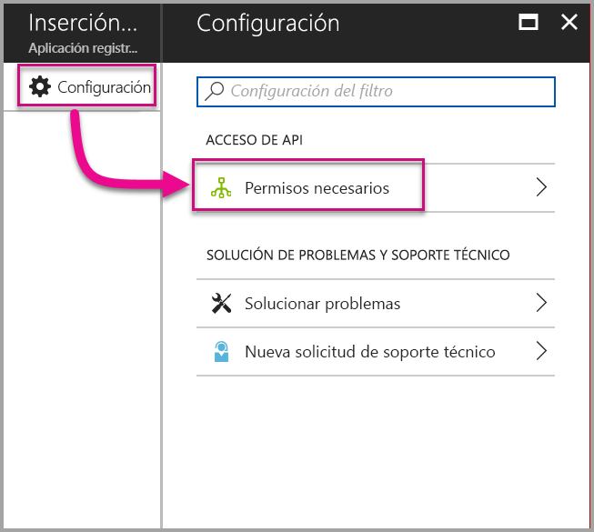

3. Seleccione **Microsoft Azure Active Directory** y asegúrese de que la opción **Acceder al directorio como usuario con sesión iniciada** esté activada. Seleccione **Guardar**.

    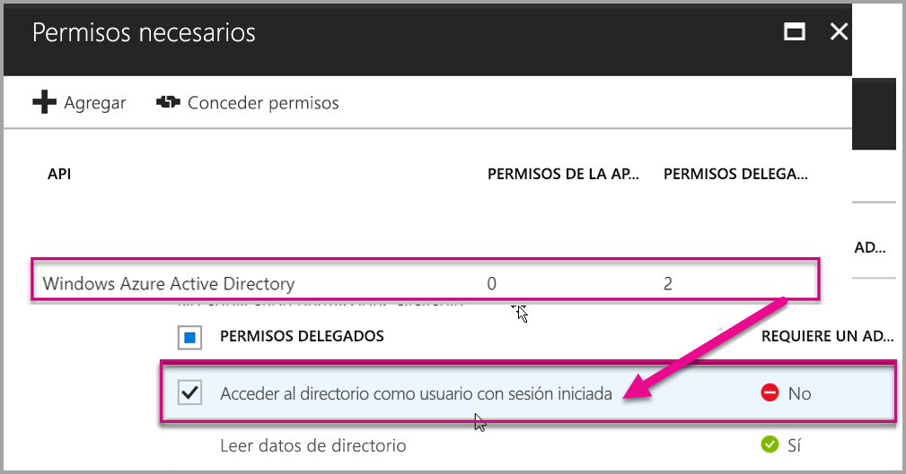

4. Seleccione **Agregar**.

    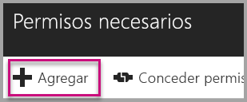

5. Haga clic en **Seleccionar una API**.

    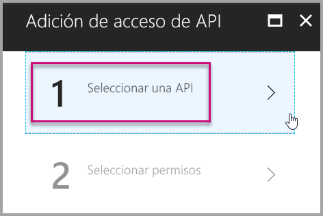

6. Seleccione **Servicio Power BI** y después haga clic en **Seleccionar**.

    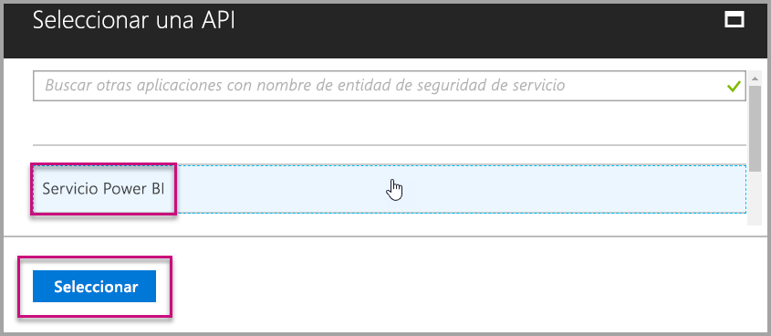

7. Seleccione todos los permisos en **Permisos delegados**. Debe seleccionarlos uno por uno para guardar las selecciones. Seleccione **Guardar** cuando haya finalizado.

    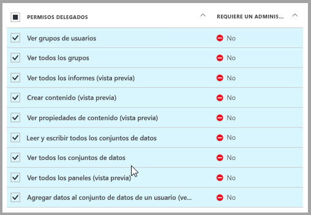

8. En **Permisos necesarios**, seleccione **Conceder permisos**.

    La acción **Conceder permisos** requiere el uso de una *cuenta maestra* para evitar que Azure AD solicite consentimiento. Si la cuenta que lleva a cabo esta acción es de un administrador global, deberá conceder permisos a todos los usuarios dentro de su organización en relación con esta aplicación. Si la cuenta que lleva a cabo esta acción es la *cuenta maestra* y no es un administrador global, deberá conceder permisos solo a la *cuenta maestra* de esta aplicación.

    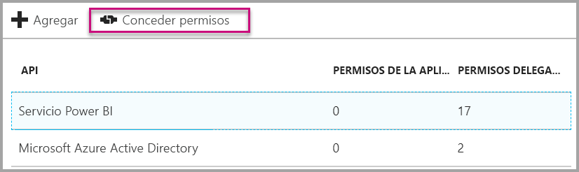

## <a name="set-up-your-power-bi-environment"></a>Configuración del entorno de Power BI

### <a name="create-an-app-workspace"></a>Crear área de trabajo de la aplicación

Si va a insertar informes, paneles o iconos para los clientes, tiene que colocar el contenido en un área de trabajo de la aplicación. La cuenta *maestra* debe corresponder a un administrador del área de trabajo de la aplicación.

1. Comience por crear el área de trabajo. Seleccione **Áreas de trabajo** > **Crear área de trabajo de la aplicación**. Aquí es donde hay que poner el contenido al que la aplicación necesita acceder.

    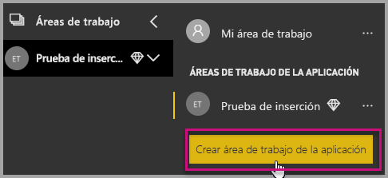

2. Asigne un nombre al área de trabajo. Si el **Id. de área de trabajo** correspondiente no está disponible, puede editarlo para tener un identificador único. Este debe ser también el nombre de la aplicación.

    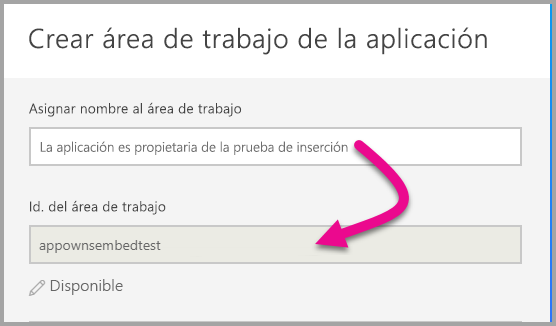

3. Tiene que establecer algunas opciones. Si elige **Pública**, cualquier persona de la organización puede ver el contenido del área de trabajo. **Privada**, por otro lado, significa que solo los miembros del área de trabajo pueden ver su contenido.

    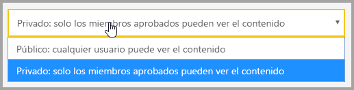

    No puede cambiar la configuración pública o privada una vez creado el grupo.

4. También puede elegir si los miembros pueden **editar** o tener acceso de **solo lectura**.

    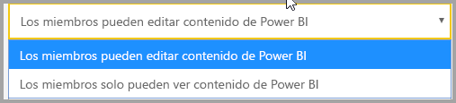

5. Agregue las direcciones de correo electrónico de las personas que desea que tengan acceso al área de trabajo y seleccione **Agregar**. No se pueden agregar alias de grupo, solo individuales.

6. Decida si cada persona es un miembro o un administrador. Los administradores pueden editar el área de trabajo y agregar otros miembros. Los miembros pueden editar el contenido del área de trabajo, a menos que tengan acceso de solo lectura. Los administradores y los miembros pueden publicar la aplicación.

    Ahora puede ver el área de trabajo nueva. Power BI crea el área de trabajo y la abre. Aparece en la lista de áreas de trabajo de las que es miembro. Dado que es un administrador, puede seleccionar los puntos suspensivos (...) para volver atrás y realizar cambios, agregar nuevos miembros o cambiar sus permisos.

    

### <a name="create-and-publish-your-reports"></a>Creación y publicación de informes

Puede crear sus propios informes y conjuntos de datos mediante Power BI Desktop y publicar esos informes en un área de trabajo de la aplicación. El usuario final que publique los informes deberá tener una licencia de Power BI Pro para publicar en un área de trabajo de la aplicación.

1. Descargue la [demostración de blog](https://github.com/Microsoft/powerbi-desktop-samples) de ejemplo de GitHub.

    

2. Abra el informe de ejemplo PBIX en **Power BI Desktop**.

   

3. Publíquelo en el **área de trabajo de la aplicación**.

   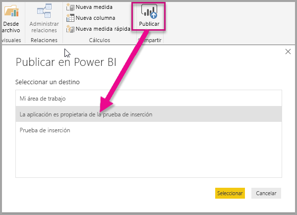

    Ahora puede ver el informe en el servicio Power BI en línea.

   

## <a name="embed-your-content-using-the-sample-application"></a>Inserción de contenido mediante la aplicación de ejemplo

Siga estos pasos para empezar a insertar contenido con una aplicación de ejemplo.

1. Descargue el [ejemplo de la aplicación posee los datos](https://github.com/Microsoft/PowerBI-Developer-Samples) de GitHub para comenzar.

    

2. Abra el archivo Web.config en la aplicación de ejemplo. Hay cinco campos que debe rellenar para ejecutar la aplicación correctamente: **clientId**, **groupId**, **reportId**, **pbiUsername** y **pbiPassword**.

    

    Rellene la información del campo **clientId** con el **identificador de la aplicación** de **Azure**. La aplicación usa el **identificador de cliente** para identificarse ante los usuarios a los que solicita permisos. Haga lo siguiente para obtener el valor **clientId**:

    Inicie sesión en [Azure Portal](https://portal.azure.com).

    

    En el panel de navegación izquierdo, elija **Todos los servicios** y seleccione **Registros de aplicaciones**.

    

    Seleccione la aplicación para la que desea obtener el **identificador de cliente**.

    

    Debe ver un **identificador de la aplicación** que aparece como un GUID. Use este **identificador de la aplicación** como el **identificador de cliente** de la aplicación.

    

    Rellene la información del **identificador de grupo** con el **GUID del área de trabajo de la aplicación** de Power BI.

    

    Rellene la información del **identificador de informe** con el **GUID de informe** de Power BI.

    

    * Rellene la información del elemento **pbiUsername** con la cuenta de usuario maestra de Power BI.
    * Rellene la información del elemento **pbiPassword** con la contraseña de la cuenta de usuario maestra de Power BI.

3. Ejecute la aplicación.

    Primero seleccione **Ejecutar** en **Visual Studio**.

    

    Luego seleccione **Insertar informe**. En función del contenido con el que desee realizar las pruebas, es decir, informes, paneles o iconos, seleccione la opción correspondiente en la aplicación.

    

    Ahora puede ver el informe en la aplicación de ejemplo.

    

## <a name="embed-your-content-within-your-application"></a>Inserción de contenido en la aplicación

Aunque los pasos para insertar el contenido se pueden llevar a cabo con las [API de REST de Power BI](https://docs.microsoft.com/rest/api/power-bi/), la inserción de los códigos de ejemplo descritos en este artículo se efectúa con el **SDK de .NET**.

La inserción de contenido para los clientes en la aplicación requiere disponer de un **token de acceso** para la cuenta maestra en **Azure AD**. Es necesario obtener un [token de acceso de Azure AD](get-azuread-access-token.md#access-token-for-non-power-bi-users-app-owns-data) para la aplicación de Power BI con una **aplicación que posea los datos**  antes de llamar a las [API de REST de Power BI](https://docs.microsoft.com/rest/api/power-bi/).

Para crear el cliente de Power BI con el **token de acceso**, deberá crear el objeto de cliente de Power BI, que le permite interactuar con las [API de REST de Power BI](https://docs.microsoft.com/rest/api/power-bi/). Para ello, ajuste **AccessToken** con un objeto ***Microsoft.Rest.TokenCredentials***.

```csharp
using Microsoft.IdentityModel.Clients.ActiveDirectory;
using Microsoft.Rest;
using Microsoft.PowerBI.Api.V2;

var tokenCredentials = new TokenCredentials(authenticationResult.AccessToken, "Bearer");

// Create a Power BI Client object. It is used to call Power BI APIs.
using (var client = new PowerBIClient(new Uri(ApiUrl), tokenCredentials))
{
    // Your code to embed items.
}
```

### <a name="get-the-content-item-you-want-to-embed"></a>Obtención del elemento de contenido que desea insertar

Puede usar el objeto de cliente de Power BI para recuperar una referencia al elemento que quiera insertar.

A continuación tiene un código de ejemplo sobre cómo recuperar el primer informe de un área de trabajo determinada.

*En el archivo Controllers\HomeController.cs de la [aplicación de ejemplo](#embed-your-content-within-a-sample-application) encontrará un ejemplo sobre cómo obtener un elemento de contenido, ya sea un informe, un panel o un icono, que quiera insertar.*

```csharp
using Microsoft.PowerBI.Api.V2;
using Microsoft.PowerBI.Api.V2.Models;

// You need to provide the GroupID where the dashboard resides.
ODataResponseListReport reports = client.Reports.GetReportsInGroupAsync(GroupId);

// Get the first report in the group.
Report report = reports.Value.FirstOrDefault();
```

### <a name="create-the-embed-token"></a>Creación del token de inserción

Se debe generar un token de inserción que se pueda usar desde la API de JavaScript. El token de inserción es específico del elemento que va a insertar. Esto significa que, siempre que quiera insertar un fragmento de contenido de Power BI, deberá crear un nuevo token de inserción específico. Para más información, incluido el **accessLevel** que debe usar, consulte [GenerateToken API](https://msdn.microsoft.com/library/mt784614.aspx).

En este ejemplo se indica cómo agregar un token de inserción de un informe en la aplicación.

*En el archivo Controllers\Homecontroller.cs de la [aplicación de ejemplo](#embed-your-content-within-a-sample-application) encontrará un ejemplo sobre cómo crear un token de inserción de un informe, panel o icono.*

```csharp
using Microsoft.PowerBI.Api.V2;
using Microsoft.PowerBI.Api.V2.Models;

// Generate Embed Token.
var generateTokenRequestParameters = new GenerateTokenRequest(accessLevel: "view");
EmbedToken tokenResponse = client.Reports.GenerateTokenInGroup(GroupId, report.Id, generateTokenRequestParameters);

// Generate Embed Configuration.
var embedConfig = new EmbedConfig()
{
    EmbedToken = tokenResponse,
    EmbedUrl = report.EmbedUrl,
    Id = report.Id
};
```

Se supone que se crea una clase para **EmbedConfig** y **TileEmbedConfig**. Hay ejemplos disponibles en los archivos **Models\EmbedConfig.cs** y **Models\TileEmbedConfig.cs**.

### <a name="load-an-item-using-javascript"></a>Carga de un elemento por medio de JavaScript

Puede usar JavaScript para cargar un informe en un elemento div en su página web.

Para obtener un ejemplo completo del uso de la API de JavaScript, puede usar la [herramienta del sitio de prueba](https://microsoft.github.io/PowerBI-JavaScript/demo). Se trata de una forma rápida de reproducir diferentes tipos de ejemplos de Power BI Embedded. También puede obtener más información sobre la API de JavaScript si consulta la página de la [wiki de PowerBI-JavaScript](https://github.com/Microsoft/powerbi-javascript/wiki).

En este ejemplo se utiliza un modelo **EmbedConfig** y otro **TileEmbedConfig**, junto con las vistas de un informe.

*En los archivos Views\Home\EmbedReport.cshtml, Views\Home\EmbedDashboard.cshtml o Views\Home\Embedtile.cshtml de la [aplicación de ejemplo](#embed-your-content-within-a-sample-application) encontrará un ejemplo sobre cómo agregar una vista de un informe, panel o icono.*

```javascript
<script src="~/scripts/powerbi.js"></script>
<div id="reportContainer"></div>
<script>
    // Read embed application token from Model
    var accessToken = "@Model.EmbedToken.Token";

    // Read embed URL from Model
    var embedUrl = "@Html.Raw(Model.EmbedUrl)";

    // Read report Id from Model
    var embedReportId = "@Model.Id";

    // Get models. models contains enums that can be used.
    var models = window['powerbi-client'].models;

    // Embed configuration used to describe the what and how to embed.
    // This object is used when calling powerbi.embed.
    // This also includes settings and options such as filters.
    // You can find more information at https://github.com/Microsoft/PowerBI-JavaScript/wiki/Embed-Configuration-Details.
    var config = {
        type: 'report',
        tokenType: models.TokenType.Embed,
        accessToken: accessToken,
        embedUrl: embedUrl,
        id: embedReportId,
        permissions: models.Permissions.All,
        settings: {
            filterPaneEnabled: true,
            navContentPaneEnabled: true
        }
    };

    // Get a reference to the embedded report HTML element
    var reportContainer = $('#reportContainer')[0];

    // Embed the report and display it within the div container.
    var report = powerbi.embed(reportContainer, config);
</script>
```

## <a name="move-to-production"></a>Pasar a producción

Ahora que ya ha terminado de desarrollar la aplicación, es hora de proporcionar una capacidad dedicada a su área de trabajo de la aplicación. Se necesita capacidad dedicada para pasar a producción.

### <a name="create-a-dedicated-capacity"></a>Crear una capacidad dedicada

Al crear una capacidad dedicada, puede aprovechar las ventajas de disponer de un recurso dedicado de su cliente. Puede comprar una capacidad dedicada en [Microsoft Azure Portal](https://portal.azure.com). Para obtener más información sobre cómo crear la capacidad de Power BI Embedded, consulte [Creación de una capacidad de Power BI Embedded en Azure Portal](azure-pbie-create-capacity.md).

Use la tabla siguiente para determinar qué capacidad de Power BI Embedded se adecúa mejor a sus necesidades.

| Nodo de capacidad | Núcleos totales<br/>*(Back-end y front-end)* | Núcleos de back-end | Núcleos de front-end | Límites de conexiones dinámicas/DirectQuery | Representaciones de páginas máximas en horas punta |
| --- | --- | --- | --- | --- | --- |
| A1 |1 núcleo virtual |5 núcleos, 3 GB de RAM |5 núcleos | 5 por segundo |1-300 |
| A2 |2 núcleos virtuales |1 núcleo, 5 GB de RAM |1 núcleo | 10 por segundo |301-600 |
| A3 |4 núcleos virtuales |2 núcleos, 10 GB de RAM |2 núcleos | 15 por segundo |601-1200 |
| A4 |8 núcleos virtuales |4 núcleos, 25 GB de RAM |4 núcleos |30 por segundo |1201-2400 |
| A5 |16 núcleos virtuales |8 núcleos, 50 GB de RAM |8 núcleos |60 por segundo |2401-4800 |
| A6 |32 núcleos virtuales |16 núcleos, 100 GB de RAM |16 núcleos |120 por segundo |4,801-9600 |

**_Las SKU de Azure no permiten acceder al contenido de Power BI mediante una licencia gratuita de Power BI._**

El uso de tokens de inserción con licencias PRO está pensado para el desarrollo y las pruebas, de modo que el número de tokens de inserción que puede generar una cuenta maestra de Power BI es limitado. Debe adquirir capacidad dedicada para realizar inserciones en un entorno de producción. No hay ningún límite en cuanto a la cantidad de tokens de inserción que puede generar con una capacidad dedicada. Vaya a [Available Features](https://docs.microsoft.com/rest/api/power-bi/availablefeatures/getavailablefeatures) (Características disponibles) para comprobar el valor de uso que indica el porcentaje de uso actual de Power BI Embedded. El porcentaje de uso depende de la cuenta maestra.

Para obtener más información, vea [Embedded analytics capacity planning whitepaper](https://aka.ms/pbiewhitepaper) (Notas del producto sobre el planeamiento de la capacidad de análisis de inserción).

### <a name="assign-an-app-workspace-to-a-dedicated-capacity"></a>Asignación de un área de trabajo de aplicación a la capacidad dedicada

Una vez creada una capacidad dedicada, puede asignar el área de trabajo de la aplicación a esa capacidad dedicada. Para hacerlo, siga estos pasos.

1. En el **servicio Power BI**, expanda las áreas de trabajo y seleccione el botón de puntos suspensivos del área de trabajo en la que quiera insertar contenido. A continuación, seleccione **Editar áreas de trabajo**.

    

2. Expanda **Avanzadas**, habilite **Capacidad dedicada** y luego seleccione la capacidad dedicada que ha creado. Luego seleccione **Guardar**.

    

3. Después de seleccionar **Guardar**, se debe ver un **diamante** junto al nombre del área de trabajo de la aplicación.

    

## <a name="next-steps"></a>Pasos siguientes

En este tutorial ha aprendido a insertar contenido de Power BI en una aplicación para sus clientes. También puede intentar insertar contenido de Power BI para su organización.

> [!div class="nextstepaction"]
>[Insertar para la organización](embed-sample-for-your-organization.md)

¿Tiene más preguntas? [Pruebe a preguntar a la comunidad de Power BI](http://community.powerbi.com/)
