# <a name="tutorial-embed-power-bi-content-into-an-application-for-your-customers"></a>Tutorial: Insertar contenido de Power BI en una aplicación para los clientes

Con **Power BI Embedded en Azure** o la **inserción de Power BI en Office**, puede insertar informes, paneles o iconos en una aplicación mediante el uso de "la aplicación posee los datos". Una **aplicación que posee los datos** consiste en tener una aplicación que use Power BI como plataforma de análisis integrados. Como **ISV** o **desarrollador**, puede crear contenido de Power BI que muestre informes, paneles o iconos en una aplicación que esté completamente integrada e interactiva, sin necesidad de que los usuarios dispongan de una licencia de Power BI. En este tutorial se muestra cómo integrar un informe en una aplicación mediante el SDK para .NET de Power BI con la API para JavaScript de Power BI.

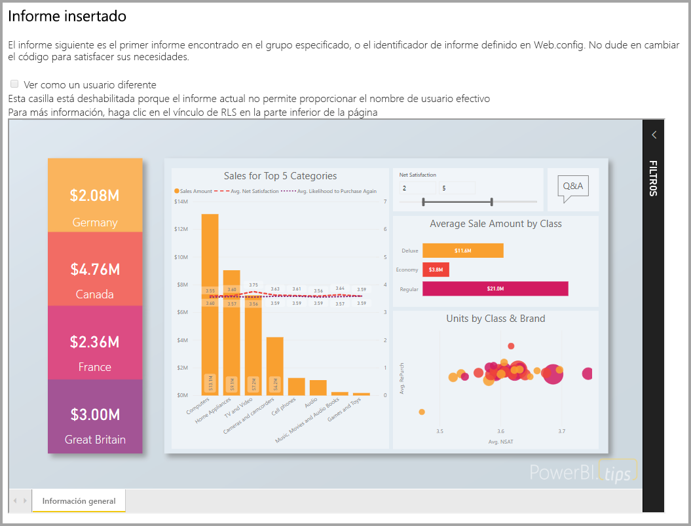

En este tutorial, obtendrá información sobre cómo:
> [!div class="checklist"]
> * Registrar una aplicación en Azure.
> * Insertar un informe de Power BI en una aplicación.

## <a name="prerequisites"></a>Requisitos previos

Para empezar, es necesario que tenga:

* Una [cuenta de Power BI Pro](../service-self-service-signup-for-power-bi.md) (una cuenta maestra que es el nombre de usuario y la contraseña para iniciar sesión en la cuenta de Power BI Pro), o bien una [entidad de servicio (token de solo aplicación)](embed-service-principal.md).
* Debe tener configurado un [inquilino de Azure Active Directory](create-an-azure-active-directory-tenant.md) propio.

Si no está registrado en **Power BI Pro**, [regístrese para obtener una evaluación gratuita](https://powerbi.microsoft.com/pricing/) antes de empezar.

## <a name="set-up-your-embedded-analytics-development-environment"></a>Configuración del entorno de desarrollo de análisis integrados

Antes de empezar a insertar informes, paneles o iconos en la aplicación, debe asegurarse de que su entorno permita la inserción con Power BI.

Puede seguir los pasos de la [herramienta de configuración de integración](https://aka.ms/embedsetup/AppOwnsData) para empezar a trabajar rápidamente y descargar una aplicación de ejemplo que sirve para crear un entorno e insertar un informe.

Si prefiere configurar el entorno manualmente, siga los pasos que se indican más adelante.

### <a name="register-an-application-in-azure-active-directory-azure-ad"></a>Registro de una aplicación en Azure Active Directory (Azure AD)

[Registre la aplicación](register-app.md) con Azure Active Directory para permitir que acceda a las [API REST de Power BI](https://docs.microsoft.com/rest/api/power-bi/). El hecho de registrar su aplicación permite establecer una identidad para esta y especificar los permisos para los recursos de REST de Power BI. En función de si quiere usar una cuenta maestra o una [entidad de servicio](embed-service-principal.md) se determina cómo empezar a registrar una aplicación.

El método que adopte afectará al tipo de aplicación que se registra en Azure.

Si continúa con una cuenta maestra, continúe con el registro de una aplicación **nativa**. Se usa una aplicación nativa porque se trabaja con un inicio de sesión no interactivo.

Pero si continúa con la entidad de servicio, tendrá que continuar con el registro de una **aplicación web del lado servidor**. Una aplicación web del lado servidor se registra para crear un secreto de aplicación.

## <a name="set-up-your-power-bi-environment"></a>Configuración del entorno de Power BI

### <a name="create-a-workspace"></a>Creación de un área de trabajo

Si va a insertar informes, paneles o iconos para los clientes, tiene que colocar el contenido en un área de trabajo. Existen distintos tipos de áreas de trabajo que se pueden configurar: las [áreas de trabajo tradicionales](../service-create-workspaces.md) o las [áreas de trabajo nuevas](../service-create-the-new-workspaces.md). Si usa una cuenta *maestra*, entonces no importa qué tipo de áreas de trabajo utilice. Sin embargo, si usa una *[entidad de servicio](embed-service-principal.md)* para iniciar sesión en la aplicación, tendrá que usar las nuevas áreas de trabajo. En ambos escenarios, tanto la cuenta *maestra* como la *entidad de servicio* debe ser un administrador de las áreas de trabajo relacionadas con la aplicación.

### <a name="create-and-publish-your-reports"></a>Creación y publicación de informes

Puede crear sus propios informes y conjuntos de datos mediante Power BI Desktop y, después, publicar esos informes en un área de trabajo. Existen dos formas de realizar esta tarea: Como usuario final, puede publicar informes en un área de trabajo tradicional con una cuenta maestra (licencia de Power BI Pro). Si usa la entidad de servicio, puede publicar informes en las áreas de trabajo nuevas mediante las [API REST de Power BI](https://docs.microsoft.com/rest/api/power-bi/imports/postimportingroup).

En los pasos siguientes se explica cómo publicar el informe PBIX en el área de trabajo de Power BI.

1. Descargue la [demostración de blog](https://github.com/Microsoft/powerbi-desktop-samples) de ejemplo de GitHub.

    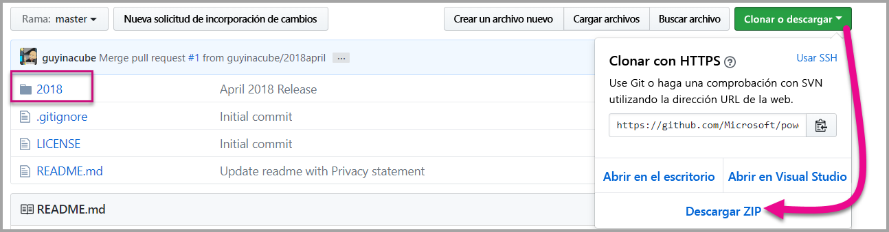

2. Abra el informe PBIX de ejemplo en **Power BI Desktop**.

   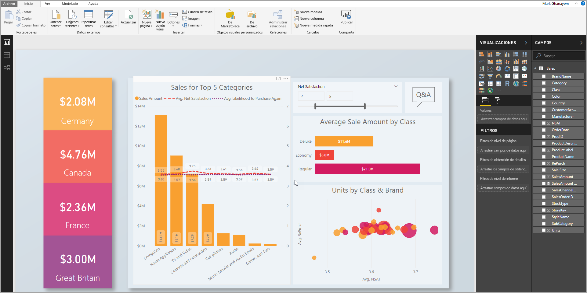

3. Publíquelo en **áreas de trabajo**. Este proceso es diferente en función de si usa una cuenta maestra (licencia de Power Pro) o una entidad de servicio. Si usa una cuenta maestra, puede publicar el informe a través de Power BI Desktop.  Pero si usa la entidad de servicio, tendrá que usar las API REST de Power BI.

## <a name="embed-content-using-the-sample-application"></a>Inserción de contenido mediante la aplicación de ejemplo

Este ejemplo se mantiene deliberadamente sencillo para fines de demostración. La protección del secreto de aplicación o de las credenciales de la cuenta maestra es responsabilidad suya o de los desarrolladores.

Siga estos pasos para empezar a insertar contenido mediante la aplicación de ejemplo.

1. Descargue [Visual Studio](https://www.visualstudio.com/) (versión 2013 o posterior). Asegúrese de descargar el [paquete NuGet](https://www.nuget.org/profiles/powerbi) más reciente.

2. Descargue el [ejemplo de la aplicación posee los datos](https://github.com/Microsoft/PowerBI-Developer-Samples) de GitHub para comenzar.

    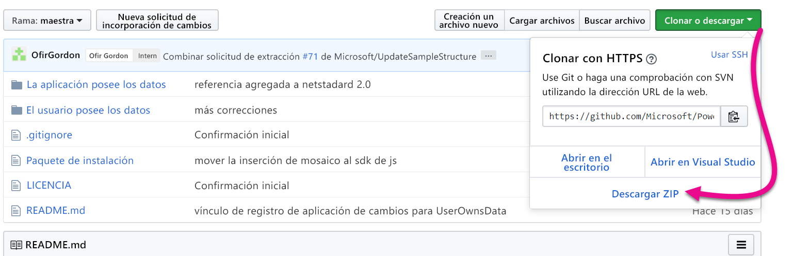

3. Abra el archivo **Web.config** de la aplicación de ejemplo. Hay campos que debe rellenar para ejecutar la aplicación. Puede elegir **MasterUser** o **ServicePrincipal** para el valor de **AuthenticationType**. En función del tipo de método de autenticación elija, tendrá que completar campos diferentes.

    > [!Note]
    > En este ejemplo, el valor predeterminado de **AuthenticationType** es MasterUser.

    <center>

    | **MasterUser** <br> (Licencia de Power BI Pro) | **ServicePrincipal** <br> (token de solo aplicación)|
    |---------------|-------------------|
    | [applicationId](#application-id) | [applicationId](#application-id) |
    | [workspaceId](#workspace-id) | [workspaceId](#workspace-id) |
    | [reportId](#report-id) | [reportId](#report-id) |
    | [pbiUsername](#power-bi-username-and-password) |  |
    | [pbiPassword](#power-bi-username-and-password) |  |
    |  | [applicationsecret](#application-secret) |
    |  | [tenant](#tenant) |

   </center>

    

### <a name="application-id"></a>Id. de aplicación

Este atributo es necesario para los dos valores de AuthenticationType (cuenta maestra y [entidad de servicio](embed-service-principal.md)).

Rellene la información de **applicationId** con el **identificador de aplicación** de **Azure**. La aplicación usa **applicationId** para identificarse ante los usuarios a los que solicita permisos.

Para obtener **applicationId**, siga estos pasos:

1. Inicie sesión en [Azure Portal](https://portal.azure.com).

2. En el panel de navegación izquierdo, seleccione **Todos los servicios** y seleccione **Registros de aplicaciones**.

    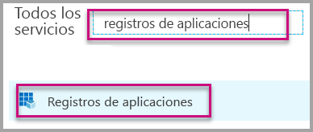

3. Seleccione la aplicación que necesite el valor **applicationId**.

    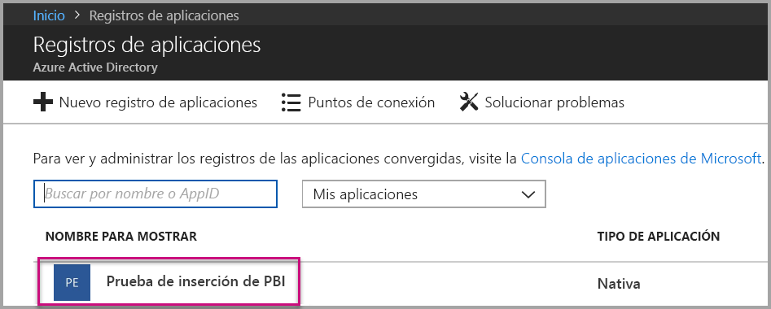

4. Hay un **identificador de la aplicación** que se muestra como un GUID. Use este **identificador de aplicación** como **applicationId** de la aplicación.

    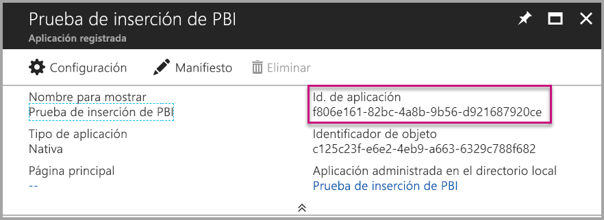

### <a name="workspace-id"></a>Id. del área de trabajo

Este atributo es necesario para los dos valores de AuthenticationType (cuenta maestra y [entidad de servicio](embed-service-principal.md)).

Rellene la información del valor **workspaceId** con el GUID del área de trabajo (grupo) de Power BI. Puede obtener esta información de la dirección URL cuando inicie sesión en el servicio Power BI o mediante Powershell.

URL <br>

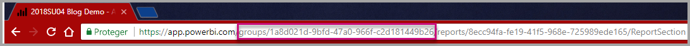

PowerShell <br>

```powershell
Get-PowerBIworkspace -name "App Owns Embed Test"
```

   

### <a name="report-id"></a>Report ID (Id. de informe)

Este atributo es necesario para los dos valores de AuthenticationType (cuenta maestra y [entidad de servicio](embed-service-principal.md)).

Rellene la información de **reportId** con el GUID de informe de Power BI. Puede obtener esta información de la dirección URL cuando inicie sesión en el servicio Power BI o mediante Powershell.

URL<br>

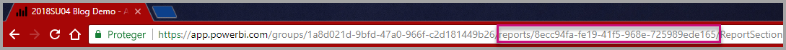

PowerShell <br>

```powershell
Get-PowerBIworkspace -name "App Owns Embed Test" | Get-PowerBIReport
```


### <a name="power-bi-username-and-password"></a>Nombre de usuario y contraseña de Power BI

Estos atributos solo son necesarios para el valor de cuenta maestra de AuthenticationType.

Si usa la [entidad de servicio](embed-service-principal.md) para la autenticación, no es necesario rellenar los atributos de nombre de usuario o contraseña.

* Rellene la información del elemento **pbiUsername** con la cuenta maestra de Power BI.
* Rellene la información del elemento **pbiPassword** con la contraseña de la cuenta maestra de Power BI.

### <a name="application-secret"></a>Secreto de aplicación

Este atributo solo es necesario para el valor [entidad de servicio](embed-service-principal.md) de AuthenticationType.

Rellene la información de **ApplicationSecret** a partir de la sección **Claves** de la sección **Registros de aplicaciones** de **Azure**.  Este atributo funciona cuando se usa la [entidad de servicio](embed-service-principal.md).

Para obtener **ApplicationSecret**, siga estos pasos:

1. Inicie sesión en [Azure Portal](https://portal.azure.com).

2. En el panel de navegación izquierdo, seleccione **Todos los servicios** y, a continuación, seleccione **Registros de aplicaciones**.

    

3. Seleccione la aplicación que necesite usar **ApplicationSecret**.

    

4. Seleccione **Certificates and secrets** (Certificados y secretos) en **Administrar**.

5. Seleccione **New client secrets** (Nuevos secretos de cliente).

6. Escriba un nombre en el cuadro **Descripción** y seleccione una duración. Después, haga clic en **Guardar** para obtener el **valor** para la aplicación. Cuando se cierra el panel **Claves** después de guardar el valor de clave, el campo de valor solo se muestra como oculto. En ese momento, no puede recuperar el valor de clave. Si pierde el valor de clave, cree uno nuevo en Azure Portal.

    

### <a name="tenant"></a>Inquilino

Este atributo solo es necesario para el valor [entidad de servicio](embed-service-principal.md) de AuthenticationType.

Rellene la información del elemento **tenant** con el identificador del inquilino de Azure. Puede obtener esta información del [centro de administración de Azure AD](/onedrive/find-your-office-365-tenant-id) cuando inicie sesión en el servicio Power BI o mediante PowerShell.

### <a name="run-the-application"></a>Ejecutar la aplicación

1. Seleccione **Ejecutar** en **Visual Studio**.

    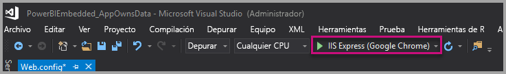

2. Luego seleccione **Insertar informe**. En función del contenido con el que desee realizar las pruebas, es decir, informes, paneles o iconos, seleccione la opción correspondiente en la aplicación.

    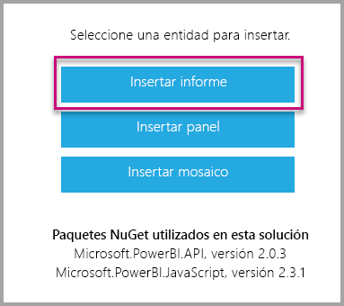

3. Ahora puede ver el informe en la aplicación de ejemplo.

    

## <a name="embed-content-within-your-application"></a>Inserción de contenido en la aplicación

Aunque los pasos para insertar el contenido se realizan con las [API REST de Power BI](https://docs.microsoft.com/rest/api/power-bi/), la inserción de los códigos de ejemplo descritos en este artículo se realiza con el **SDK de .NET**.

La inserción para los clientes de la aplicación requiere que obtenga un **token de acceso** para la cuenta maestra o una [entidad de servicio](embed-service-principal.md) de **Azure AD**. Tendrá que obtener un [token de acceso de Azure AD](get-azuread-access-token.md#access-token-for-non-power-bi-users-app-owns-data) para la aplicación de Power BI antes de llamar a las [API REST de Power BI](https://docs.microsoft.com/rest/api/power-bi/).

Para crear el cliente de Power BI con el **token de acceso**, deberá crear el objeto de cliente de Power BI, que permite interactuar con las [API de REST de Power BI](https://docs.microsoft.com/rest/api/power-bi/). Para crear un objeto de cliente de Power BI, ajuste el valor de **AccessToken** con un objeto ***Microsoft.Rest.TokenCredentials***.

```csharp
using Microsoft.IdentityModel.Clients.ActiveDirectory;
using Microsoft.Rest;
using Microsoft.PowerBI.Api.V2;

var tokenCredentials = new TokenCredentials(authenticationResult.AccessToken, "Bearer");

// Create a Power BI Client object. it's used to call Power BI APIs.
using (var client = new PowerBIClient(new Uri(ApiUrl), tokenCredentials))
{
    // Your code to embed items.
}
```

### <a name="get-the-content-item-you-want-to-embed"></a>Obtención del elemento de contenido que desea insertar

Puede usar el objeto de cliente de Power BI para recuperar una referencia al elemento que quiera insertar.

A continuación tiene un código de ejemplo sobre cómo recuperar el primer informe de un área de trabajo determinada.

*En el archivo Services\EmbedService.cs de la [aplicación de ejemplo](https://github.com/Microsoft/PowerBI-Developer-Samples) se incluye un ejemplo de cómo obtener un elemento de contenido, ya sea un informe, un panel o un icono, que se quiere insertar.*

```csharp
using Microsoft.PowerBI.Api.V2;
using Microsoft.PowerBI.Api.V2.Models;

// You need to provide the workspaceId where the dashboard resides.
ODataResponseListReport reports = await client.Reports.GetReportsInGroupAsync(workspaceId);

// Get the first report in the group.
Report report = reports.Value.FirstOrDefault();
```

### <a name="create-the-embed-token"></a>Creación del token de inserción
Genere un token de inserción, que se puede usar desde la API de JavaScript. Hay dos tipos de API, el primer grupo contiene cinco API y cada una genera un token de inserción para un elemento específico. El segundo grupo, que contiene solo una API, genera un token que se puede usar para insertar varios elementos.

**API para generar un token de inserción para un elemento específico**

El token de inserción creado con estas API es específico del elemento que se va a insertar. Siempre que inserte un elemento de Power BI (como un informe, un panel o un icono) con estas API, deberá crear un nuevo token de inserción para él.
* [Dashboards GenerateTokenInGroup](https://docs.microsoft.com/rest/api/power-bi/embedtoken/dashboards_generatetokeningroup)
* [Datasets GenerateTokenInGroup](https://docs.microsoft.com/rest/api/power-bi/embedtoken/datasets_generatetokeningroup)
* [Reports GenerateTokenForCreateInGroup](https://docs.microsoft.com/rest/api/power-bi/embedtoken/reports_generatetokenforcreateingroup)
* [Reports GenerateTokenInGroup](https://docs.microsoft.com/rest/api/power-bi/embedtoken/reports_generatetokeningroup)
* [Tiles GenerateTokenInGroup](https://docs.microsoft.com/rest/api/power-bi/embedtoken/tiles_generatetokeningroup)

Los ejemplos de creación de un token de inserción para un informe, un panel o un icono están disponibles en los siguientes archivos de la [aplicación de ejemplo](https://github.com/Microsoft/PowerBI-Developer-Samples).
* Services\EmbedService.cs
* Models\EmbedConfig.cs
* Models\TileEmbedConfig.cs

A continuación se muestra un ejemplo de código para usar la API de tokens de inserción Reports GenerateTokenInGroup.
```csharp
using Microsoft.PowerBI.Api.V2;
using Microsoft.PowerBI.Api.V2.Models;

// Generate Embed Token.
var generateTokenRequestParameters = new GenerateTokenRequest(accessLevel: "view");
EmbedToken tokenResponse = client.Reports.GenerateTokenInGroup(workspaceId, report.Id, generateTokenRequestParameters);

// Generate Embed Configuration.
var embedConfig = new EmbedConfig()
{
    EmbedToken = tokenResponse,
    EmbedUrl = report.EmbedUrl,
    Id = report.Id
};
```

**API para generar un token de inserción para varios elementos**<a id="multiEmbedToken"></a>

La API de inserción [Generate Token](https://docs.microsoft.com/rest/api/power-bi/embedtoken/generatetoken) genera un token que se puede usar para insertar varios elementos.

También se puede usar para seleccionar dinámicamente un conjunto de datos mientras se inserta un informe. Para más información sobre este uso de la API, consulte [enlace dinámico](embed-dynamic-binding.md).


A continuación se muestra un ejemplo del uso de esta API.
 
```csharp
using Microsoft.PowerBI.Api.V2;
using Microsoft.PowerBI.Api.V2.Models;

var reports = new List<GenerateTokenRequestV2Report>()
{ 
    new GenerateTokenRequestV2Report()
    {
        AllowEdit = false,
        Id = report1.Id
    },
    new GenerateTokenRequestV2Report()
    {
        AllowEdit = true,
        Id = report2.Id
    }
};

var datasets= new List<GenerateTokenRequestV2Dataset>()
{
    new GenerateTokenRequestV2Dataset(dataset1.Id),
    new GenerateTokenRequestV2Dataset(dataset2.Id),
    new GenerateTokenRequestV2Dataset(dataset3.Id),
};

var targetWorkspaces = new List<GenerateTokenRequestV2TargetWorkspace>()
{
    new GenerateTokenRequestV2TargetWorkspace(workspace1.Id),
    new GenerateTokenRequestV2TargetWorkspace(workspace2.Id),
};

var request = new GenerateTokenRequestV2()
{
    Datasets = datasetsRequestDetails ?? null,
    Reports = reportsRequestDetails,
    TargetWorkspaces = targetWSRequestdetials ?? null,
};

var token = client.GetClient().EmbedToken.GenerateToken(request);
```

### <a name="load-an-item-using-javascript"></a>Carga de un elemento por medio de JavaScript

Puede usar JavaScript para cargar un informe en un elemento div en su página web.

Para obtener un ejemplo completo del uso de la API de JavaScript, puede usar la [herramienta del sitio de prueba](https://microsoft.github.io/PowerBI-JavaScript/demo). La herramienta de área de juegos es una forma rápida de reproducir diferentes tipos de ejemplos de Power BI Embedded. También puede obtener más información sobre la API de JavaScript si consulta la página de la [wiki de PowerBI-JavaScript](https://github.com/Microsoft/powerbi-javascript/wiki).

En este ejemplo se utiliza un modelo **EmbedConfig** y otro **TileEmbedConfig**, junto con las vistas de un informe.

*En los archivos Views\Home\EmbedReport.cshtml, Views\Home\EmbedDashboard.cshtml o Views\Home\Embedtile.cshtml de la [aplicación de ejemplo](#embed-content-using-the-sample-application) encontrará un ejemplo sobre cómo agregar una vista de un informe, panel o icono.*

```javascript
<script src="~/scripts/powerbi.js"></script>
<div id="reportContainer"></div>
<script>
    // Read embed application token from Model
    var accessToken = "@Model.EmbedToken.Token";

    // Read embed URL from Model
    var embedUrl = "@Html.Raw(Model.EmbedUrl)";

    // Read report Id from Model
    var embedReportId = "@Model.Id";

    // Get models. models contains enums that can be used.
    var models = window['powerbi-client'].models;

    // Embed configuration used to describe what and how to embed.
    // This object is used when calling powerbi.embed.
    // This also includes settings and options such as filters.
    // You can find more information at https://github.com/Microsoft/PowerBI-JavaScript/wiki/Embed-Configuration-Details.
    var config = {
        type: 'report',
        tokenType: models.TokenType.Embed,
        accessToken: accessToken,
        embedUrl: embedUrl,
        id: embedReportId,
        permissions: models.Permissions.All,
        settings: {
            filterPaneEnabled: true,
            navContentPaneEnabled: true
        }
    };

    // Get a reference to the embedded report HTML element
    var reportContainer = $('#reportContainer')[0];

    // Embed the report and display it within the div container.
    var report = powerbi.embed(reportContainer, config);
</script>
```

## <a name="move-to-production"></a>Pasar a producción

Ahora que ya ha terminado de desarrollar la aplicación, es el momento de proporcionar una capacidad dedicada al área de trabajo. 

> [!Important]
> Se necesita capacidad dedicada para pasar a producción. Todas las áreas de trabajo (las que contienen los informes o paneles y las que contienen los conjuntos de datos) deben asignarse a una capacidad.

### <a name="create-a-dedicated-capacity"></a>Crear una capacidad dedicada

Al crear una capacidad dedicada, puede aprovechar las ventajas de disponer de un recurso dedicado de su cliente. Puede elegir entre dos tipos de capacidad:
* **Power BI Premium**: una suscripción de Office 365 de nivel de inquilino disponible en dos familias de SKU, *EM* y *P*. Al insertar contenido de Power BI, se hace referencia a esta solución como *Inserción de Power BI*. Para más información acerca de esta suscripción, consulte [¿Qué es Power BI Premium?](../service-premium-what-is.md)
* **Azure Power BI Embedded**: puede adquirir una capacidad dedicada desde [Microsoft Azure Portal](https://portal.azure.com). Esta suscripción utiliza las SKU de tipo *A*. Para obtener más información sobre cómo crear la capacidad de Power BI Embedded, consulte [Creación de una capacidad de Power BI Embedded en Azure Portal](azure-pbie-create-capacity.md).
> [!NOTE]
> Con las SKU de tipo A no puede acceder al contenido de Power BI con una licencia gratuita de Power BI.

En la tabla siguiente se describen los recursos y los límites de cada SKU. Para determinar cuál es la capacidad que mejor se adapta a sus necesidades, consulte la tabla [Qué SKU debo comprar para mi escenario](https://docs.microsoft.com/power-bi/developer/embedded-faq#power-bi-now-offers-three-skus-for-embedding-a-skus-em-skus-and-p-skus-which-one-should-i-purchase-for-my-scenario).

| Nodos de capacidad | Total de núcleos virtuales | Núcleos virtuales de back-end | RAM (GB) | Núcleos virtuales de front-end | Límites de conexiones dinámicas/DirectQuery (por segundo) | Paralelismo de actualización de modelo |
| --- | --- | --- | --- | --- | --- | --- |
| EM1/A1 | 1 | 0,5 | 2.5 | 0,5 | 3,75 | 1 |
| EM2/A2 | 2 | 1 | 5 | 1 | 7,5 | 2 |
| EM3/A3 | 4 | 2 | 10 | 2 | 15 | 3 |
| P1/A4 | 8 | 4 | 25 | 4 | 30 | 6 |
| P2/A5 | 16 | 8 | 50 | 8 | 60 | 12 |
| P3/A6 | 32 | 16 | 100 | 16 | 120 | 24 |
| | | | | | | |

### <a name="development-testing"></a>Pruebas de desarrollo

El uso de tokens de inserción con licencias Pro está pensado para pruebas de desarrollo, de modo que el número de tokens de inserción que puede generar una cuenta maestra o una entidad de servicio de Power BI es limitado. Se necesita una capacidad dedicada para realizar inserciones en un entorno de producción. No hay ningún límite en cuanto a la cantidad de tokens de inserción que puede generar con una capacidad dedicada. Vaya a [Available Features](https://docs.microsoft.com/rest/api/power-bi/availablefeatures/getavailablefeatures) (Características disponibles) para comprobar el valor de uso que indica el porcentaje de uso actual de Power BI Embedded. El porcentaje de uso depende de la cuenta maestra.

Para más información, consulte las [notas del producto de planeamiento de la capacidad de análisis integrado](https://aka.ms/pbiewhitepaper).

### <a name="assign-a-workspace-to-a-dedicated-capacity"></a>Asignación de un área de trabajo a una capacidad dedicada

Una vez creada una capacidad dedicada, puede asignar el área de trabajo a esa capacidad dedicada.

Todas las áreas de trabajo que contengan recursos de Power BI relacionados con contenido insertado (incluidos conjuntos de datos, informes y paneles) se deben asignar a capacidades dedicadas. Por ejemplo, si un informe insertado y su conjunto de datos enlazado se encuentran en áreas de trabajo diferentes, las dos áreas de trabajo se deben asignar a capacidades dedicadas.

Para asignar una capacidad dedicada a un área de trabajo mediante la [entidad de servicio](embed-service-principal.md), use la [API REST de Power BI](https://docs.microsoft.com/rest/api/power-bi/capacities/groups_assigntocapacity). Cuando use las API REST de Power BI, asegúrese de usar el [identificador de objeto de entidad de servicio](embed-service-principal.md#how-to-get-the-service-principal-object-id).

Siga estos pasos para asignar una capacidad dedicada a un área de trabajo mediante una **cuenta maestra**.

1. En el **servicio Power BI**, expanda las áreas de trabajo y seleccione el botón de puntos suspensivos del área de trabajo en la que quiera insertar contenido. A continuación, seleccione **Editar áreas de trabajo**.

    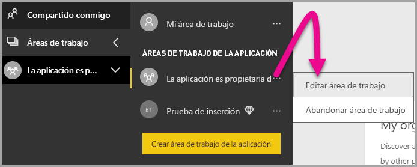

2. Expanda **Avanzadas**, habilite **Capacidad dedicada** y luego seleccione la capacidad dedicada que ha creado. Luego seleccione **Guardar**.

    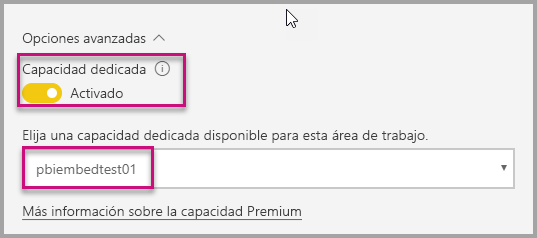

3. Después de seleccionar **Guardar**, debería ver un **rombo** junto al nombre del área de trabajo.

    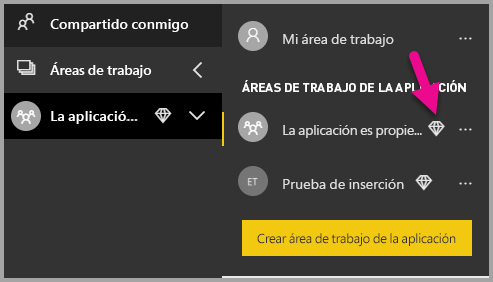

## <a name="next-steps"></a>Pasos siguientes

En este tutorial ha aprendido a insertar contenido de Power BI en una aplicación para sus clientes. También puede intentar insertar contenido de Power BI para su organización.

> [!div class="nextstepaction"]
>[Insertar para la organización](embed-sample-for-your-organization.md)

¿Tiene más preguntas? [Pruebe a preguntar a la comunidad de Power BI](https://community.powerbi.com/)
