# <a name="tutorial-embed-a-power-bi-report-dashboard-or-tile-into-an-application-for-your-organization"></a>Tutorial: Insertar un informe, un panel o un icono de Power BI en una aplicación para la organización

En **Power BI**, puede insertar informes, paneles o iconos en una aplicación mediante User owns data. **User owns data** permite a la aplicación ampliar el servicio Power BI para usar análisis integrados. En este tutorial se muestra cómo integrar un informe en una aplicación. Puede usar .NET SDK de Power BI, junto con la API JavaScript de Power BI para insertar Power BI en una aplicación para la organización.


En este tutorial, aprenderá las tareas siguientes:
> [!div class="checklist"]
> * Registrar una aplicación en Azure.
> * Insertar un informe de Power BI en una aplicación.

## <a name="prerequisites"></a>Requisitos previos

Para empezar, necesita una cuenta de Power BI Pro y una suscripción a Microsoft Azure:

* Si no está registrado en Power BI Pro, [regístrese para obtener una evaluación gratuita](https://powerbi.microsoft.com/pricing/) antes de empezar.
* Si no tiene una suscripción a Azure, cree una [cuenta gratuita](https://azure.microsoft.com/free/?WT.mc_id=A261C142F) antes de empezar.
* Configure su propio [inquilino de Azure Active Directory (Azure AD)](create-an-azure-active-directory-tenant.md).
* Instale [Visual Studio](https://www.visualstudio.com/), versión 2013 o posterior.

## <a name="set-up-your-embedded-analytics-development-environment"></a>Configuración del entorno de desarrollo de análisis integrados

Antes de empezar a insertar informes, paneles o iconos en la aplicación, asegúrese de que el entorno está configurado para permitir la inserción. Como parte de la instalación, realice una de estas acciones:

* Puede seguir los pasos de la [herramienta de configuración de inserción](https://aka.ms/embedsetup/UserOwnsData) para empezar a trabajar rápidamente y descargar una aplicación de ejemplo con la que podrá seguir los pasos para crear un entorno e insertar un informe.

* Si elige configurar manualmente el entorno, siga los pasos de las secciones siguientes.

### <a name="register-an-application-in-azure-active-directory"></a>Registro de una aplicación en Azure Active Directory

Para permitir que la aplicación acceda a las API REST de Power BI, debe registrarla en Azure Active Directory. Después, puede establecer una identidad para la aplicación y especificar los permisos para los recursos de REST de Power BI.

1. Acepte los [Términos de la API de Microsoft Power BI](https://powerbi.microsoft.com/api-terms).

2. Inicie sesión en [Azure Portal](https://portal.azure.com).

    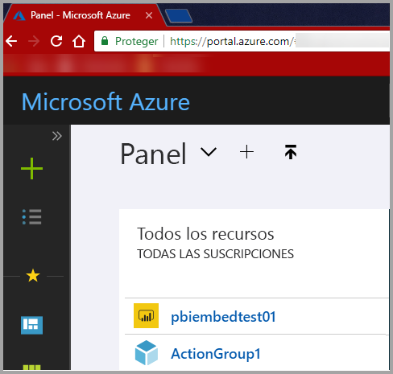

3. En el panel de navegación de la izquierda, haga clic en **Todos los servicios** y en **Registros de aplicaciones**. Después, haga clic en **Nuevo registro de aplicaciones**.

    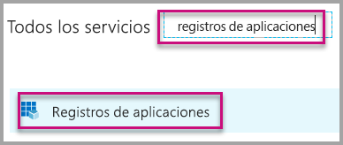</br>

    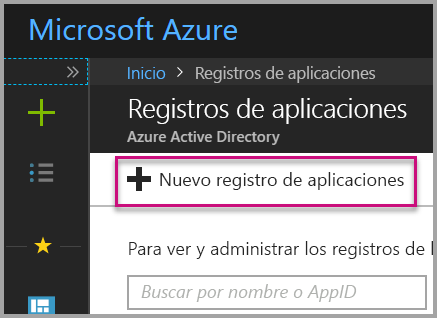

4. Siga las indicaciones y cree una nueva aplicación. Para **user owns data**, use **Aplicación web o API** para el **tipo de aplicación**. Proporcione una **URL de inicio de sesión** que Azure AD usa para devolver respuestas de token. Escriba un valor específico de la aplicación. Un ejemplo es `http://localhost:13526/`.

    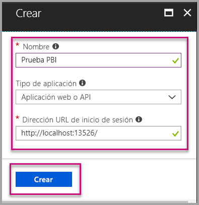

### <a name="apply-permissions-to-your-application-within-azure-active-directory"></a>Aplicación de permisos a la aplicación en Azure Active Directory

Habilite permisos para la aplicación además de los que haya proporcionado en la página de registro de la aplicación. Inicie sesión con una cuenta de administrador global para habilitar los permisos.

### <a name="use-the-azure-active-directory-portal"></a>Uso del portal de Azure Active Directory

1. Vaya a [Registros de aplicaciones](https://portal.azure.com/#blade/Microsoft_AAD_IAM/ApplicationsListBlade) en Azure Portal y seleccione la aplicación que va a usar para la inserción.

    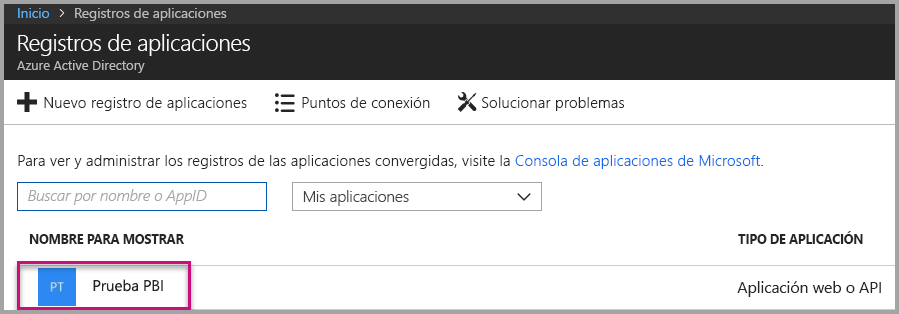

2. Seleccione **Configuración**. Después, en **Acceso de API**, haga clic en **Permisos necesarios**.

    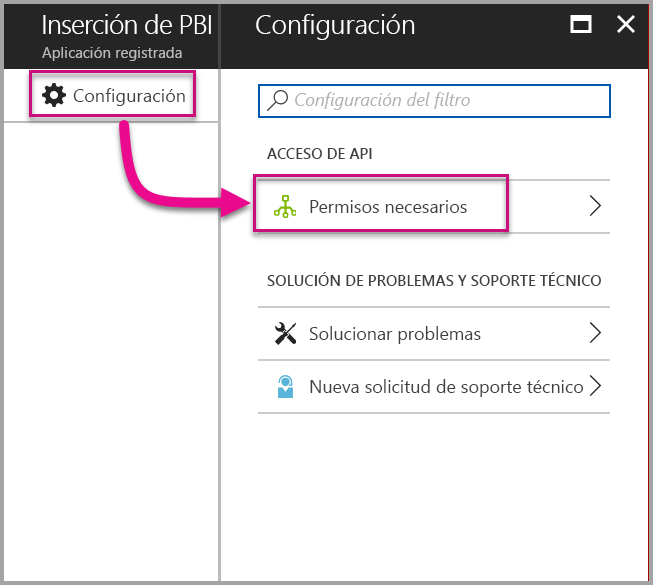

3. Seleccione **Windows Azure Active Directory**. Después, asegúrese de que la opción **Acceder al directorio como usuario con sesión iniciada** esté activada. Seleccione **Guardar**.

    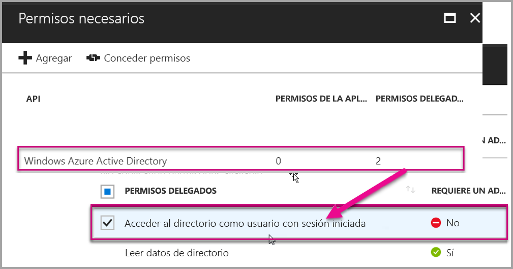

4. Seleccione **Agregar**.

    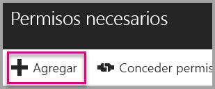

5. Haga clic en **Seleccionar una API**.

    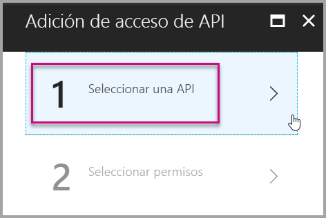

6. Seleccione **Servicio Power BI**. Después, haga clic en **Seleccionar**.

    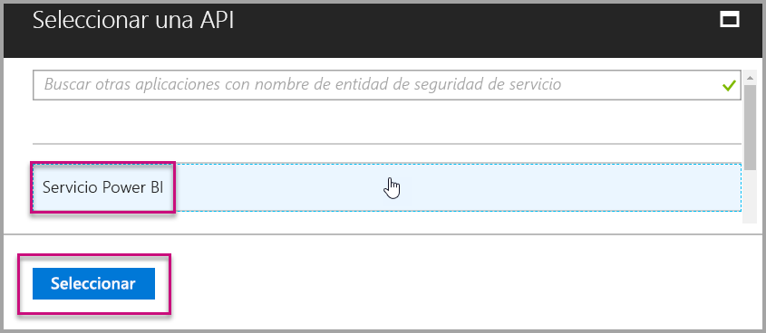

7. Seleccione todos los permisos en **Permisos delegados**. Selecciónelos uno por uno para guardar las selecciones. Cuando haya terminado, haga clic en **Guardar**.

    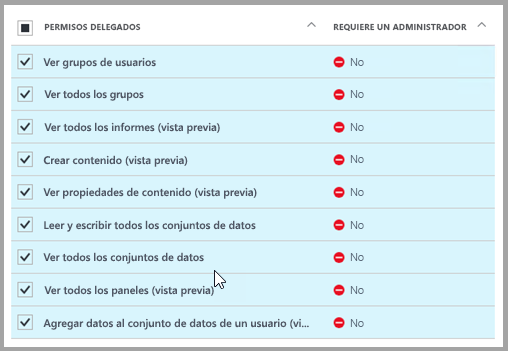

## <a name="set-up-your-power-bi-environment"></a>Configuración del entorno de Power BI

### <a name="create-an-app-workspace"></a>Crear área de trabajo de la aplicación

Si va a insertar informes, paneles o iconos para los clientes, tendrá que colocar el contenido en un área de trabajo de la aplicación:

1. Comience por crear el área de trabajo. Seleccione **Áreas de trabajo** > **Crear área de trabajo de la aplicación**. Este área de trabajo es donde se coloca el contenido al que tiene que acceder la aplicación.

    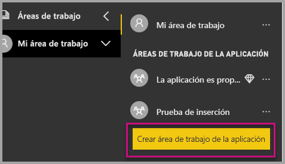

2. Asigne un nombre al área de trabajo. Si el **Id. de área de trabajo** correspondiente no está disponible, puede editarlo para tener un identificador único. Este nombre también debe ser el de la aplicación.

    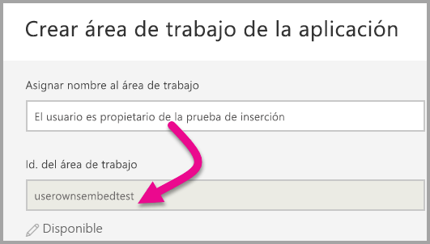

3. Tiene que establecer algunas opciones. Si elige **Pública**, cualquier persona de la organización puede ver el contenido del área de trabajo. **Privada** significa que solo los miembros del área de trabajo pueden ver su contenido.

    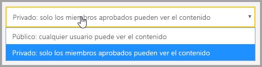

    No puede cambiar el valor Pública o Privada una vez creado el grupo.

4. También puede elegir si los miembros pueden editar o tener acceso de solo lectura.

    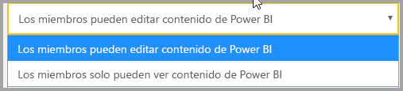

5. Agregue las direcciones de correo electrónico de los usuarios que quiere que tengan acceso al área de trabajo y haga clic en **Agregar**. No se pueden agregar alias de grupo, solo individuales.

6. Decida si cada persona es un miembro o un administrador. Los administradores pueden editar el área de trabajo y agregar otros miembros. Los miembros pueden editar el contenido del área de trabajo, a menos que tengan acceso de solo lectura. Los administradores y los miembros pueden publicar la aplicación.

    Ahora puede ver el área de trabajo nueva. Power BI crea el área de trabajo y la abre. Se muestra en la lista de áreas de trabajo de las que es miembro. Dado que es un administrador, puede seleccionar los puntos suspensivos (...) para volver atrás y realizar cambios, agregar nuevos miembros o cambiar sus permisos.

    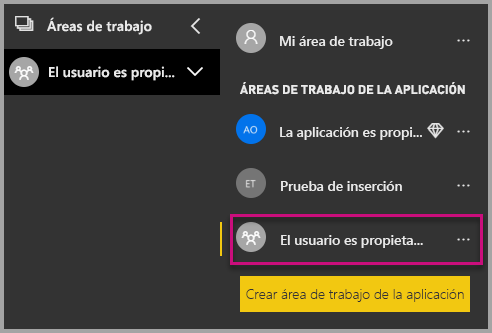

### <a name="create-and-publish-your-reports"></a>Creación y publicación de informes

Con Power BI Desktop puede crear informes y conjuntos de datos propios. Después, puede publicar esos informes en un área de trabajo de la aplicación. El usuario final que publique los informes deberá tener una licencia de Power BI Pro para publicar en un área de trabajo de la aplicación.

1. Descargue la [demostración de blog](https://github.com/Microsoft/powerbi-desktop-samples) de ejemplo de GitHub.

    

2. Abra el informe .pbix de ejemplo en Power BI Desktop.

   

3. Publíquelo en el área de trabajo de la aplicación.

   

    Ahora puede ver el informe en el servicio Power BI en línea.

   

## <a name="embed-your-content-by-using-the-sample-application"></a>Inserción del contenido mediante la aplicación de ejemplo

Para insertar el contenido con una aplicación de ejemplo, siga estos pasos:

1. Para empezar, descargue el [ejemplo User Owns Data](https://github.com/Microsoft/PowerBI-Developer-Samples) de GitHub. Hay tres aplicaciones de ejemplo diferentes, una para [informes](https://github.com/Microsoft/PowerBI-Developer-Samples/tree/master/User%20Owns%20Data/integrate-report-web-app), otra para [paneles](https://github.com/Microsoft/PowerBI-Developer-Samples/tree/master/User%20Owns%20Data/integrate-dashboard-web-app) y la última para [iconos](https://github.com/Microsoft/PowerBI-Developer-Samples/tree/master/User%20Owns%20Data/integrate-tile-web-app). En este artículo se hace referencia a la aplicación de **informes**.

    

2. Abra el archivo **Cloud.config** de la aplicación de ejemplo. Hay varios campos que debe rellenar para ejecutar la aplicación correctamente: **ApplicationID** y **ApplicationSecret**.

    

    Rellene la información de **ApplicationID** con el **identificador de aplicación** de Azure. La aplicación usa **ApplicationID** para identificarse ante los usuarios a los que solicita los permisos.

    Para obtener **ApplicationID**, siga estos pasos:

    1. Inicie sesión en [Azure Portal](https://portal.azure.com).

       

    2. En el panel de navegación de la izquierda, haga clic en **Todos los servicios** y en **Registros de aplicaciones**.

       

    3. Seleccione la aplicación que necesite usar el valor **ApplicationID**.

       

    4. Debería ver un **identificador de la aplicación** que aparece como un GUID. Use este **identificador de aplicación** como **ApplicationID** de la aplicación.

        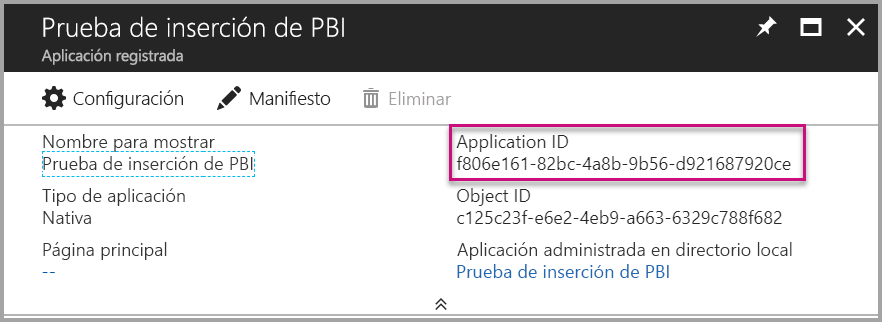

    Rellene la información de **ApplicationSecret** a partir de la sección **Claves** de la sección **Registros de aplicaciones** de **Azure**.

    Para obtener **ApplicationSecret**, siga estos pasos:

    1. Inicie sesión en [Azure Portal](https://portal.azure.com).

       

    2. En el panel de navegación de la izquierda, haga clic en **Todos los servicios** y en **Registros de aplicaciones**.

       

    3. Seleccione la aplicación que necesite usar **ApplicationSecret**.

       

    4. Seleccione **Configuración**.

       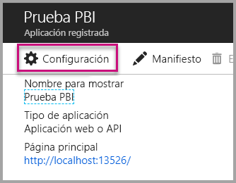

    5. Seleccione **Claves**.

       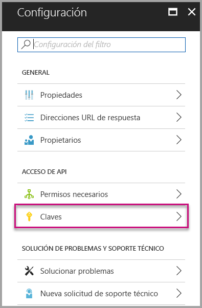

    6. Escriba un nombre en el cuadro **Descripción** y seleccione una duración. Después, haga clic en **Guardar** para obtener el **valor** para la aplicación. Cuando se cierra el panel **Claves** después de guardar el valor de clave, el campo de valor solo se muestra como oculto. En ese momento, no puede recuperar el valor de clave. Si pierde el valor de clave, cree uno nuevo en Azure Portal.

          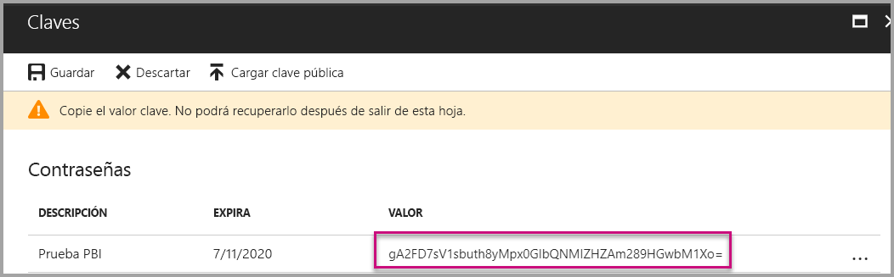

    7. Para **groupId**, escriba el GUID del área de trabajo de la aplicación de Power BI.

       

    8. Para **reportId**, escriba el GUID del informe de Power BI.

       

3. Ejecute la aplicación:

    Seleccione **Ejecutar** en **Visual Studio**.

    

    Luego seleccione **Obtener informe**.

    

    Ahora puede ver el informe en la aplicación de ejemplo.

    

## <a name="embed-your-content-within-your-application"></a>Inserción de contenido en la aplicación

Aunque los pasos para insertar el contenido se pueden realizar con las [API REST de Power BI](https://docs.microsoft.com/rest/api/power-bi/), la inserción de los códigos de ejemplo descritos en este artículo se ha realizado con el SDK de .NET.

Para integrar un informe en una aplicación web, use la API REST de Power BI o el SDK de C# de Power BI. También puede usar un token de acceso de autorización de Azure Active Directory para obtener un informe. Luego, cargue el informe con el mismo token de acceso. La API REST de Power BI proporciona acceso mediante programación a recursos concretos de Power BI. Para obtener más información, vea [Power BI REST APIs](https://docs.microsoft.com/rest/api/power-bi/) (API REST de Power BI) y la [API de JavaScript de Power BI](https://github.com/Microsoft/PowerBI-JavaScript).

### <a name="get-an-access-token-from-azure-ad"></a>Obtener un token de acceso de Azure AD

En la aplicación, debe obtener un token de acceso de Azure AD para poder realizar llamadas a la API REST de Power BI. Para más información, consulte [Authenticate users and get an Azure AD access token for your Power BI app](get-azuread-access-token.md) (Autenticación de usuarios y obtención de un token de acceso de Azure AD para su aplicación de Power BI).

### <a name="get-a-report"></a>Obtener un informe

Para obtener un informe de Power BI, use la operación [Obtener informes](https://docs.microsoft.com/rest/api/power-bi/reports/getreports), que obtiene una lista de informes de Power BI. En la lista de informes, puede obtener un identificador de informe.

### <a name="get-reports-by-using-an-access-token"></a>Obtención de informes mediante un token de acceso

La operación [Obtener informes](https://docs.microsoft.com/rest/api/power-bi/reports/getreports) devuelve una lista de informes. Puede obtener un informe de la lista de informes.

Para realizar la llamada de API de REST, debe incluir un encabezado *Autorización* con el formato de *Portador {token de acceso}*.

#### <a name="get-reports-with-the-rest-api"></a>Obtención de informes con la API de REST

En el ejemplo de código siguiente se muestra cómo recuperar informes con la **API REST**:

> [!NOTE]  
> En el archivo **Default.aspx.cs** de la [aplicación de ejemplo](#embed-your-content-using-the-sample-application) hay disponible un ejemplo de cómo obtener un elemento de contenido que se quiera insertar. Los ejemplos son un informe, panel o icono.

```csharp
using Newtonsoft.Json;

//Get a Report. In this sample, you get the first Report.
protected void GetReport(int index)
{
    //Configure Reports request
    System.Net.WebRequest request = System.Net.WebRequest.Create(
        String.Format("{0}/Reports",
        baseUri)) as System.Net.HttpWebRequest;

    request.Method = "GET";
    request.ContentLength = 0;
    request.Headers.Add("Authorization", String.Format("Bearer {0}", accessToken.Value));

    //Get Reports response from request.GetResponse()
    using (var response = request.GetResponse() as System.Net.HttpWebResponse)
    {
        //Get reader from response stream
        using (var reader = new System.IO.StreamReader(response.GetResponseStream()))
        {
            //Deserialize JSON string
            PBIReports Reports = JsonConvert.DeserializeObject<PBIReports>(reader.ReadToEnd());

            //Sample assumes at least one Report.
            //You could write an app that lists all Reports
            if (Reports.value.Length > 0)
            {
                var report = Reports.value[index];

                txtEmbedUrl.Text = report.embedUrl;
                txtReportId.Text = report.id;
                txtReportName.Text = report.name;
            }
        }
    }
}

//Power BI Reports used to deserialize the Get Reports response.
public class PBIReports
{
    public PBIReport[] value { get; set; }
}
public class PBIReport
{
    public string id { get; set; }
    public string name { get; set; }
    public string webUrl { get; set; }
    public string embedUrl { get; set; }
}
```

#### <a name="get-reports-by-using-the-net-sdk"></a>Obtención de informes mediante el SDK de .NET

Puede usar el SDK de .NET para recuperar una lista de informes, en lugar de llamar directamente a la API de REST. En el ejemplo de código siguiente se muestra cómo enumerar los informes:

```csharp
using Microsoft.IdentityModel.Clients.ActiveDirectory;
using Microsoft.PowerBI.Api.V2;
using Microsoft.PowerBI.Api.V2.Models;

var tokenCredentials = new TokenCredentials(<ACCESS TOKEN>, "Bearer");

// Create a Power BI Client object. It is used to call Power BI APIs.
using (var client = new PowerBIClient(new Uri(ApiUrl), tokenCredentials))
{
    // Get the first report all reports in that workspace
    ODataResponseListReport reports = client.Reports.GetReports();

    Report report = reports.Value.FirstOrDefault();

    var embedUrl = report.EmbedUrl;
}
```

### <a name="load-a-report-by-using-javascript"></a>Carga de un informe mediante JavaScript

Puede usar JavaScript para cargar un informe en un elemento div en su página web. En el ejemplo de código siguiente se muestra cómo recuperar un informe de un área de trabajo determinada:

> [!NOTE]  
> En el archivo **Default.aspx** de la [aplicación de ejemplo](#embed-your-content-using-the-sample-application) hay disponible un ejemplo de cómo cargar un elemento de contenido que se quiera insertar. Los ejemplos son un informe, panel o icono.

```javascript
<!-- Embed Report-->
<div> 
    <asp:Panel ID="PanelEmbed" runat="server" Visible="true">
        <div>
            <div><b class="step">Step 3</b>: Embed a report</div>

            <div>Enter an embed url for a report from Step 2 (starts with https://):</div>
            <input type="text" id="tb_EmbedURL" style="width: 1024px;" />
            <br />
            <input type="button" id="bEmbedReportAction" value="Embed Report" />
        </div>

        <div id="reportContainer"></div>
    </asp:Panel>
</div>
```

#### <a name="sitemaster"></a>Site.master

```javascript
window.onload = function () {
    // client side click to embed a selected report.
    var el = document.getElementById("bEmbedReportAction");
    if (el.addEventListener) {
        el.addEventListener("click", updateEmbedReporte, false);
    } else {
        el.attachEvent('onclick', updateEmbedReport);
    }

    // handle server side post backs, optimize for reload scenarios
    // show embedded report if all fields were filled in.
    var accessTokenElement = document.getElementById('MainContent_accessTokenTextbox');
    if (accessTokenElement !== null) {
        var accessToken = accessTokenElement.value;
        if (accessToken !== "")
            updateEmbedReport();
    }
};

// update embed report
function updateEmbedReport() {

    // check if the embed url was selected
    var embedUrl = document.getElementById('tb_EmbedURL').value;
    if (embedUrl === "")
        return;

    // get the access token.
    accessToken = document.getElementById('MainContent_accessTokenTextbox').value;

    // Embed configuration used to describe the what and how to embed.
    // This object is used when calling powerbi.embed.
    // You can find more information at https://github.com/Microsoft/PowerBI-JavaScript/wiki/Embed-Configuration-Details.
    var config = {
        type: 'report',
        accessToken: accessToken,
        embedUrl: embedUrl
    };

    // Grab the reference to the div HTML element that will host the report.
    var reportContainer = document.getElementById('reportContainer');

    // Embed the report and display it within the div container.
    var report = powerbi.embed(reportContainer, config);

    // report.on will add an event handler which prints to Log window.
    report.on("error", function (event) {
        var logView = document.getElementById('logView');
        logView.innerHTML = logView.innerHTML + "Error<br/>";
        logView.innerHTML = logView.innerHTML + JSON.stringify(event.detail, null, "  ") + "<br/>";
        logView.innerHTML = logView.innerHTML + "---------<br/>";
    }
  );
}
```

## <a name="using-a-power-bi-premium-dedicated-capacity"></a>Uso de una capacidad dedicada de Power BI Premium

Ahora que ya ha terminado de desarrollar la aplicación, es el momento de proporcionar una capacidad dedicada al área de trabajo de la aplicación.

### <a name="create-a-dedicated-capacity"></a>Crear una capacidad dedicada

Al crear una capacidad dedicada, puede aprovechar las ventajas de disponer de un recurso dedicado para el contenido del área de trabajo de la aplicación. Puede crear una capacidad dedicada mediante [Power BI Premium](../service-premium.md).

En la tabla siguiente se enumeran las SKU de Power BI Premium disponibles en [Microsoft Office 365](../service-admin-premium-purchase.md):

| Nodo de capacidad | Núcleos virtuales totales<br/>(back-end y front-end) | Núcleos virtuales de back-end | Núcleos virtuales de front-end | Límites de conexiones dinámicas/DirectQuery |
| --- | --- | --- | --- | --- | --- |
| EM1 |1 núcleo virtual |0,5 núcleos virtuales, 10 GB de RAM |0,5 núcleos virtuales |3,75 por segundo |
| EM2 |2 núcleos virtuales |1 núcleo virtual, 10 GB de RAM |1 núcleo virtual |7,5 por segundo |
| EM3 |4 núcleos virtuales |2 núcleos virtuales, 10 GB de RAM |2 núcleos virtuales |15 por segundo |
| P1 |8 núcleos virtuales |4 núcleos virtuales, 25 GB de RAM |4 núcleos virtuales |30 por segundo |
| P2 |16 núcleos virtuales |8 núcleos virtuales, 50 GB de RAM |8 núcleos virtuales |60 por segundo |
| P3 |32 núcleos virtuales |16 núcleos virtuales, 100 GB de RAM |16 núcleos virtuales |120 por segundo |
| P4 |64 núcleos virtuales |32 núcleos virtuales, 200 GB de RAM |32 núcleos virtuales |240 por segundo |
| P5 |128 núcleos virtuales |64 núcleos virtuales, 400 GB de RAM |64 núcleos virtuales |480 por segundo |
> [!NOTE]
> - Cuando intente realizar la inserción con aplicaciones de Microsoft Office, puede usar las SKU de EM para acceder a contenido con una licencia gratuita de Power BI. Pero no puede acceder al contenido con una licencia gratuita de Power BI cuando se usa Powerbi.com o Power BI Mobile.
> - Cuando intente realizar la inserción con aplicaciones de Microsoft Office mediante Powerbi.com o Power BI Mobile, puede acceder al contenido con una licencia gratuita de Power BI.

### <a name="assign-an-app-workspace-to-a-dedicated-capacity"></a>Asignación de un área de trabajo de aplicación a la capacidad dedicada

Después de crear una capacidad dedicada, puede asignar el área de trabajo de la aplicación a esa capacidad dedicada. Para completar este proceso, siga estos pasos:

1. En el servicio Power BI, expanda las áreas de trabajo y haga clic en el botón de puntos suspensivos del área de trabajo en la que quiera insertar el contenido. A continuación, seleccione **Editar áreas de trabajo**.

    

2. Expanda **Avanzadas** y habilite **Capacidad dedicada**. Seleccione la capacidad dedicada que ha creado. Luego seleccione **Guardar**.

    

3. Después de hacer clic en **Guardar**, debería ver un rombo junto al nombre del área de trabajo de la aplicación.

    

## <a name="admin-settings"></a>Configuración de administración

Los administradores globales o los administradores de servicios de Power BI pueden activar o desactivar la capacidad para usar las API REST de un inquilino. Los administradores de Power BI pueden establecer esta opción para toda la organización o para grupos de seguridad individuales. De forma predeterminada, está habilitada para toda la organización. Puede realizar estos cambios en el [portal de administración de Power BI](../service-admin-portal.md).

## <a name="next-steps"></a>Pasos siguientes

En este tutorial, ha obtenido información sobre cómo insertar contenido de Power BI en una aplicación mediante la cuenta de la organización de Power BI. Ahora puede intentar insertar contenido de Power BI en una aplicación mediante aplicaciones. También puede intentar insertar contenido de Power BI para los clientes:

> [!div class="nextstepaction"]
> [Insertar desde aplicaciones](embed-from-apps.md)

> [!div class="nextstepaction"]
>[Insertar para los clientes](embed-sample-for-customers.md)

Si tiene más preguntas, [pruebe a preguntar a la comunidad de Power BI](http://community.powerbi.com/).
