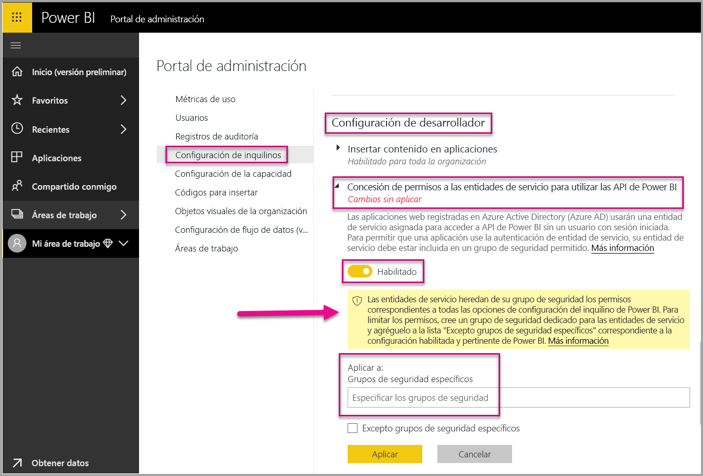
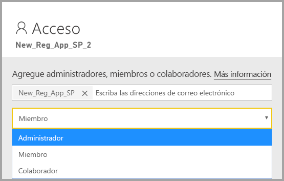
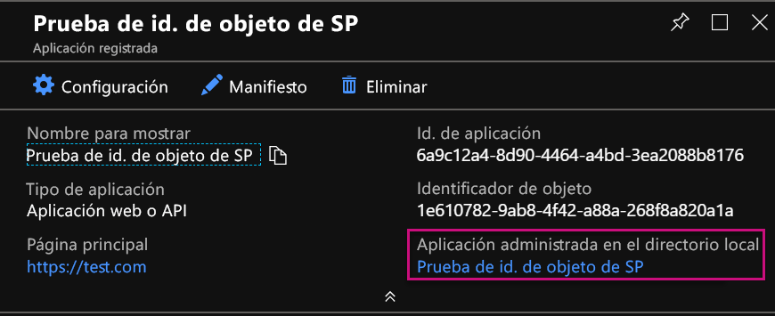
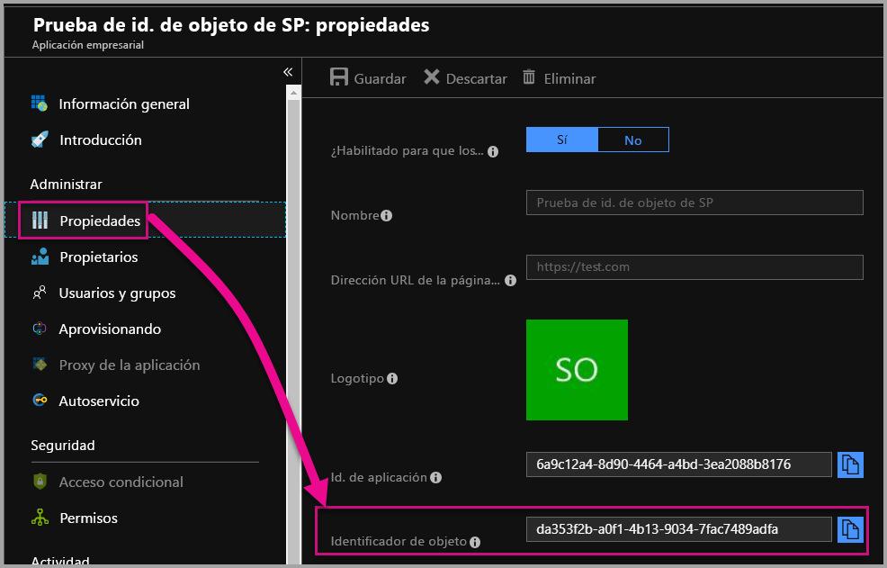

# <a name="service-principal-with-power-bi-preview"></a>Entidad de servicio con Power BI (versión preliminar)

Con una **entidad de servicio**, puede insertar contenido de Power BI en una aplicación y usar la automatización con Power BI mediante un token **de solo aplicación**. La entidad de servicio es útil cuando se usa **Power BI Embedded** o al **automatizar procesos y tareas de Power BI**.

Cuando se trabaja con Power BI Embedded, el uso de la entidad de servicio ofrece diversas ventajas. Una ventaja importante es que no se necesita una cuenta maestra (una licencia de Power BI Pro, que simplemente es un nombre de usuario y una contraseña para iniciar sesión) para autenticarse en la aplicación. La entidad de servicio usa un identificador y un secreto de aplicación para autenticar la aplicación.

Cuando trabaja para automatizar las tareas de Power BI, también puede incluir en un script la forma de procesar y administrar las entidades de servicio para escalarlas.

## <a name="application-and-service-principal-relationship"></a>Relación entre la entidad de servicio y la aplicación

Para acceder a los recursos que protegen a un inquilino de Azure AD, la entidad que requiere el acceso representa una entidad de seguridad. Esta acción se cumple tanto para los usuarios (entidad de usuario) como para las aplicaciones (entidad de servicio).

La entidad de seguridad define la directiva de acceso y los permisos para los usuarios y las aplicaciones en el inquilino de Azure AD. Esta directiva de acceso permite características básicas como la autenticación de usuarios y aplicaciones durante el inicio de sesión, y la autorización durante el acceso a los recursos. Para más información, vea [Objetos de aplicación y de entidad de servicio de Azure Active Directory (AAD)](https://docs.microsoft.com/azure/active-directory/develop/app-objects-and-service-principals).

Cuando se registra una aplicación de Azure AD en Azure Portal, se crean dos objetos en el inquilino de Azure AD:

* Un [objeto de aplicación](https://docs.microsoft.com/azure/active-directory/develop/app-objects-and-service-principals#application-object)
* Un [objeto de entidad de servicio](https://docs.microsoft.com/azure/active-directory/develop/app-objects-and-service-principals#service-principal-object)

Considere el objeto de aplicación como la representación *global* de la aplicación para su uso en todos los inquilinos, y el objeto de entidad de servicio como la representación *local* para su uso en un inquilino específico.

El objeto de aplicación actúa como la plantilla de la que se que *derivan* propiedades comunes y predeterminadas que se usan en la creación de los correspondientes objetos de entidad de servicio.

Se necesita una entidad de servicio por cada inquilino en el que se use la aplicación, lo que le permite establecer una identidad para el inicio de sesión y el acceso a los recursos que están protegidos por el inquilino. Una aplicación de inquilino único solo tiene una entidad de servicio (en su inquilino principal), que se crea y se puede usar durante el registro de la aplicación.

## <a name="service-principal-with-power-bi-embedded"></a>Entidad de servicio con Power BI Embedded

Con la entidad de servicio, puede enmascarar la información de la cuenta maestra en la aplicación mediante un identificador y un secreto de aplicación. Ya no es necesario codificar de forma rígida una cuenta maestra en la aplicación para autenticarse.

Como en las **API de Power BI** y el **SDK de .NET de Power BI** ahora se admiten llamadas con la entidad de servicio, se pueden usar las [API REST de Power BI](https://docs.microsoft.com/rest/api/power-bi/) con la entidad de servicio. Por ejemplo, puede realizar cambios en las áreas de trabajo, como crear áreas de trabajo, agregar o quitar usuarios de las áreas de trabajo, e importar contenido a áreas de trabajo.

Solo se puede usar la entidad de servicio si los artefactos y recursos de Power BI se almacenan en la [nueva área de trabajo de Power BI](../service-create-the-new-workspaces.md).

## <a name="service-principal-vs-master-account"></a>Diferencias entre la entidad de servicio y la cuenta maestra

Hay diferencias entre el uso de una entidad de servicio y una cuenta maestra estándar (licencia de Power BI Pro) para la autenticación. En la tabla siguiente se resaltan algunas diferencias importantes.

| Función | Cuenta de usuario maestra <br> (licencia de Power BI Pro) | Entidad de servicio <br> (token de solo aplicación) |
|------------------------------------------------------|---------------------|-------------------|
| Puede iniciar sesión en el servicio Power BI  | Sí | No |
| Está habilitada en el portal de administración de Power BI | No | Sí |
| [Funciona con áreas de trabajo de la aplicación (v1)](../service-create-workspaces.md) | Sí | No |
| [Funciona con las nuevas áreas de trabajo de la aplicación (v2)](../service-create-the-new-workspaces.md) | Sí | Sí |
| Tiene que ser un administrador del área de trabajo si se usa con Power BI Embedded | Sí | Sí |
| Puede usar las API REST de Power BI | Sí | Sí |
| Se necesita un administrador global para crearla | Sí | No |
| Puede instalar y administrar una puerta de enlace de datos local | Sí | No |

## <a name="get-started-with-a-service-principal"></a>Tareas iniciales con una entidad de servicio

A diferencia del uso de una cuenta maestra tradicional, para utilizar la entidad de servicio (el token de solo aplicación) es necesario configurar varios elementos distintos. Para empezar a trabajar con la entidad de servicio (el token de solo aplicación), tendrá que configurar el entorno adecuado.

1. [Registre una aplicación web del lado servidor](register-app.md) en Azure Active Directory (AAD) para usarla con Power BI. Después de registrar una aplicación puede capturar un identificador y un secreto de aplicación, y el identificador de objeto de entidad de servicio para acceder al contenido de Power BI. Puede crear una entidad de servicio con [PowerShell](https://docs.microsoft.com/powershell/azure/create-azure-service-principal-azureps?view=azps-1.1.0).

    A continuación se muestra script de ejemplo para crear una aplicación de Azure Active Directory.

    ```powershell
    # The app id - $app.appid
    # The service principal object id - $sp.objectId
    # The app key - $key.value

    # Sign in as a user that is allowed to create an app.
    Connect-AzureAD

    # Create a new AAD web application
    $app = New-AzureADApplication -DisplayName "testApp1" -Homepage "https://localhost:44322" -ReplyUrls "https://localhost:44322"

    # Creates a service principal
    $sp = New-AzureADServicePrincipal -AppId $app.AppId

    # Get the service principal key.
    $key = New-AzureADServicePrincipalPasswordCredential -ObjectId $sp.ObjectId
    ```

   > [!Important]
   > Después de habilitar la entidad de servicio para usarla con Power BI, los permisos de AD de la aplicación ya no tendrán efecto. Los permisos de la aplicación se administrarán desde el portal de administración de Power BI.

2. Cree un [grupo de seguridad en Azure Active Directory (AAD)](https://docs.microsoft.com/azure/active-directory/fundamentals/active-directory-groups-create-azure-portal) y agregue a ese grupo la aplicación que ha creado. Puede crear un grupo de seguridad de AAD con [PowerShell](https://docs.microsoft.com/powershell/azure/create-azure-service-principal-azureps?view=azps-1.1.0).

    A continuación se muestra un script de ejemplo para crear un grupo de seguridad y agregarle una aplicación.

    ```powershell
    # Required to sign in as a tenant admin
    Connect-AzureAD

    # Create an AAD security group
    $group = New-AzureADGroup -DisplayName <Group display name> -SecurityEnabled $true -MailEnabled $false -MailNickName notSet

    # Add the service principal to the group
    Add-AzureADGroupMember -ObjectId $($group.ObjectId) -RefObjectId $($sp.ObjectId)
    ```

3. Como administrador de Power BI, tendrá que habilitar la entidad de servicio en la **configuración de desarrollador** en el portal de administración de Power BI. Agregue el grupo de seguridad que ha creado en Azure AD a la sección **Grupos de seguridad específicos** de **Configuración de desarrollador**.

   > [!Important]
   > Las entidades de servicio tienen acceso a las configuraciones de inquilino que están habilitadas para toda la organización o para grupos de seguridad que tienen entidades de servicio como parte del grupo. Para restringir el acceso de entidades de servicio a determinada configuración de inquilino, permita el acceso únicamente a grupos de seguridad específicos o cree un grupo de seguridad dedicado con las entidades de servicio y exclúyalo.

    

4. Configure el [entorno de Power BI](embed-sample-for-customers.md#set-up-your-power-bi-environment).

5. Agregue la entidad de servicio como un **administrador** a la nueva área de trabajo que ha creado. Puede administrar esta tarea a través de las [API](https://docs.microsoft.com/rest/api/power-bi/groups/addgroupuser) o con el servicio Power BI.

    

6. Ahora, elija insertar el contenido en una aplicación de ejemplo o en una aplicación propia.

    * [Inserción de contenido mediante la aplicación de ejemplo](embed-sample-for-customers.md#embed-content-using-the-sample-application)
    * [Inserción de contenido en una aplicación propia](embed-sample-for-customers.md#embed-content-within-your-application)

7. Ahora ya está listo para [pasar a producción](embed-sample-for-customers.md#move-to-production).

## <a name="migrate-to-service-principal"></a>Migración a la entidad de servicio

Puede migrar para usar la entidad de servicio si en la actualidad usa una cuenta maestra con Power BI o Power BI Embedded.

Complete los tres primeros pasos en la sección [Tareas iniciales con una entidad de servicio](#get-started-with-a-service-principal) y, después, vea la información siguiente.

Si ya usa las [nuevas áreas de trabajo](../service-create-the-new-workspaces.md) de Power BI, agregue la entidad de servicio como un **administrador** a las áreas de trabajo que contengan los artefactos de Power BI. Pero si usa las [áreas de trabajo tradicionales](../service-create-workspaces.md), copie o mueva los artefactos y recursos de Power BI a las áreas de trabajo nuevas y, después, agregue la entidad de servicio como un **administrador** a esas áreas de trabajo.

No hay ninguna característica de interfaz de usuario para mover artefactos y recursos de Power BI desde un área de trabajo a otra, por lo que tendrá que usar las [API](https://powerbi.microsoft.com/pt-br/blog/duplicate-workspaces-using-the-power-bi-rest-apis-a-step-by-step-tutorial/) para realizar esta tarea. Al usar las API con la entidad de servicio, necesita el identificador de objeto de entidad de servicio.

### <a name="how-to-get-the-service-principal-object-id"></a>Cómo obtener el identificador de objeto de entidad de servicio

Para asignar una entidad de servicio a una nueva área de trabajo de la aplicación, se usan las [API REST de Power BI](https://docs.microsoft.com/rest/api/power-bi/groups/addgroupuser). Para hacer referencia a una entidad de servicio para operaciones o para realizar cambios, use el **identificador de objeto de entidad de servicio**; por ejemplo, para aplicar una entidad de servicio como un administrador a un área de trabajo.

A continuación se muestran los pasos para obtener el identificador de objeto de entidad de servicio desde Azure Portal.

1. Cree un registro de aplicación en Azure Portal.  

2. Después, en **Aplicación administrada en directorio local**, seleccione el nombre de la aplicación que ha creado.

   

    > [!Note]
    > El identificador de objeto de la imagen anterior no es el que se usa con la entidad de servicio.

3. Haga clic en **Propiedades** para ver el identificador de objeto.

    

A continuación se muestra un script de ejemplo para recuperar el identificador de objeto de entidad de servicio con PowerShell.

   ```powershell
   Get-AzureADServicePrincipal -Filter "DisplayName eq '<application name>'"
   ```

## <a name="considerations-and-limitations"></a>Consideraciones y limitaciones

* La entidad de servicio solo funciona con las [nuevas áreas de trabajo de la aplicación](../service-create-the-new-workspaces.md).
* Cuando se usa la entidad de servicio, no se admite **Mi área de trabajo**.
* Para pasar a producción, se necesita capacidad Premium dedicada.
* No se puede iniciar sesión en el portal de Power BI con la entidad de servicio.
* Se necesitan derechos de administrador de Power BI para habilitar la entidad de servicio en la configuración de desarrollador en el portal de administración de Power BI.
* No se puede instalar ni administrar una puerta de enlace de datos local con la entidad de servicio.
* En las aplicaciones de [inserción para la organización](embed-sample-for-your-organization.md) no se puede usar la entidad de servicio.
* No se admite la administración de [flujos de datos](../service-dataflows-overview.md).
* La entidad de servicio no es compatible con las API de administración.

## <a name="next-steps"></a>Pasos siguientes

* [Registro de una aplicación](register-app.md)
* [Power BI Embedded para los clientes](embed-sample-for-customers.md)
* [Objetos de aplicación y de entidad de servicio de Azure Active Directory](https://docs.microsoft.com/azure/active-directory/develop/app-objects-and-service-principals)
