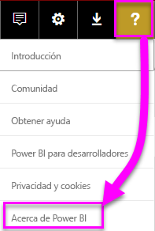
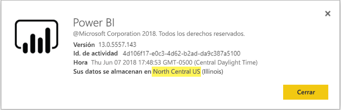

# <a name="frequently-asked-questions-about-power-bi-embedded"></a>Preguntas más frecuentes acerca de Power BI Embedded

* Si tiene otras preguntas, [pruebe a preguntar a la comunidad de Power BI](http://community.powerbi.com/).
* ¿Sigue teniendo problemas? Visite la [página de soporte técnico de Power BI](https://powerbi.microsoft.com/support/).

## <a name="general"></a>General

### <a name="what-is-power-bi-embedded"></a>¿Qué es Power BI Embedded?

Microsoft Power BI Embedded (PBIE) permite a los desarrolladores de aplicaciones insertar sorprendentes informes totalmente interactivos en aplicaciones sin el tiempo y los gastos que conllevan la creación de sus propias visualizaciones de datos y controles de principio a fin.

### <a name="who-is-the-target-audience-for-power-bi-embedded"></a>¿Quién es la público objetivo de Power BI Embedded?

Los desarrolladores y las empresas de software que crean sus propias aplicaciones a los que se les conoce como fabricantes de software independientes (ISV).

### <a name="how-is-power-bi-embedded-different-from-power-bi-the-service"></a>¿En qué se diferencian Power BI Embedded del servicio Power BI?

Power BI Embedded está previsto para los ISV o desarrolladores que compilan aplicaciones y desean insertar objetos visuales en dichas aplicaciones para ayudar a sus clientes a tomar decisiones sin generar ninguna solución de análisis desde el principio. El análisis insertado permite a los usuarios empresariales acceder a los datos empresariales y realizar consultas para generar información del uso de estos datos en la aplicación.

Power BI es una solución de análisis de software como servicio que proporciona a las organizaciones una única vista de sus datos empresariales más importantes.

### <a name="what-is-the-difference-between-power-bi-premium-and-power-bi-embedded"></a>¿En qué se diferencian Power BI Premium y Power BI Embedded?

La capacidad de Power BI Premium está dirigida a las empresas, quienes desean una completa solución de inteligencia empresarial que proporcione una vista única de su organización, asociados, clientes y proveedores. Power BI Premium ayuda a las organizaciones a tomar decisiones. Power BI Premium es un producto SaaS e incluye la capacidad de que los usuarios consuman el contenido a través del portal de Power BI, un aplicación móvil y aplicaciones desarrolladas internamente.

Power BI Embedded es para aquellos ISV o desarrolladores que creen aplicaciones y deseen insertar objetos visuales en dichas aplicaciones. Power BI Embedded ayuda a los clientes tomar decisiones. Dado que Power BI Embedded es para desarrolladores de aplicaciones, los clientes de la aplicación pueden consumir contenido almacenado en la capacidad de Power BI Embedded, incluidos todos los usuarios de dentro o fuera de la organización. El contenido de la capacidad de Power BI Embedded no se puede compartir a través de la publicación en la Web con un solo clic ni de la publicación en SharePoint con un solo clic, y no es compatible con los informes de SSRS.

### <a name="what-is-the-microsoft-recommendation-for-when-a-customer-should-buy-power-bi-premium-vs-power-bi-embedded"></a>¿A quiénes recomienda Microsoft comprar Power BI Premium y a quiénes Power BI Embedded?

La recomendación de Microsoft es que las empresas compren Power BI Premium, una solución autoservicio de inteligencia empresarial en la nube de nivel empresarial, y que los ISV compren Power BI Embedded, componentes de análisis insertados con tecnología de la nube. Sin embargo, no hay restricción alguna sobre qué producto puede comprar un cliente.

Puede haber algunos casos en los que un ISV (normalmente grande) desee utilizar una SKU P para lograr las ventajas adicionales del servicio Power BI preempaquetado en su organización, así como para insertarlo en sus aplicaciones. Es posible que algunas empresas decidan usar SKU A en Azure si solo les interesa la línea de creación de aplicaciones empresariales e inserción de análisis en ellas, pero no les interesa usar el servicio Power BI ya empaquetado.

### <a name="how-many-embed-tokens-can-i-create"></a>¿Cuántos tokens de inserción puedo crear?

Los tokens de inserción con licencias PRO están pensados para el desarrollo y las pruebas, de modo que el número de tokens de inserción que puede generar una cuenta maestra de Power BI es limitado. Debe [adquirir capacidad](#technical) para realizar inserciones en un entorno de producción. No hay ningún límite en la cantidad de tokens de inserción que se pueden generar cuando se compra una capacidad. Vaya a [Available Features](https://docs.microsoft.com/rest/api/power-bi/availablefeatures) (Características disponibles) para comprobar el valor de uso que indica el porcentaje de uso actual de Power BI Embedded.

## <a name="technical"></a>Preguntas técnicas

### <a name="what-is-the-difference-between-the-a-skus-in-azure-and-the-em-skus-in-office-365"></a>¿En qué se diferencian las SKU A de Azure y las SKU EM de Office 365?

PowerBI.com es una solución empresarial que incluye numerosas funcionalidades, como la colaboración social, la suscripción al correo electrónico, etc. en una oferta de software como servicio

Power BI Embedded es un conjunto de API que Microsoft pone a disposición de los desarrolladores para crear una solución de análisis insertado en una oferta de plataforma como servicio. En el caso de análisis insertado, debe usarse PowerBI.com para ayudar tanto a los ISV como a los desarrolladores a administrar el contenido de su solución de análisis insertado contenido y la configuración del nivel de los inquilinos.

Esta es una lista parcial de las diferencias que puede utilizar con cada una de ellas.

| Destacado | Power BI Embedded | Capacidad de Power BI Premium | Capacidad de Power BI Premium |
|----------------------------------------------------------------------------------|-------------------|---------------------------|---------------------------|
|   | (SKU A) | (SKU EM) | (SKU P) |
| Insertar artefactos desde áreas de trabajo de la aplicación de Power BI | Capacidad de Azure | Capacidad de Office 365 | Capacidad de Office 365 |
| Consumir informes de Power BI en una aplicación insertada | Sí | Sí | Sí |
| Consumir informes de Power BI en SharePoint | No | Sí | Sí |
| Consumir informes de Power BI en Dynamics | No | Sí | Sí |
| Consumir informes de Power BI en Teams (excluye la aplicación móvil) | No | Sí | Sí |
| Acceso al contenido con una licencia gratuita de Power BI en Powerbi.com y Power BI Mobile | No | No | Sí |
| Acceso al contenido con una licencia gratuita de Power BI insertada en aplicaciones de MS Office | No | Sí | Sí |

### <a name="power-bi-now-offers-three-skus-for-embedding-a-skus-em-skus-and-p-skus-which-one-should-i-purchase-for-my-scenario"></a>Power BI ahora ofrece tres SKU que se pueden insertar: SKU A, SKU EM y SKU P. ¿Cuál debo comprar para mi escenario?

|  |SKU A (Power BI Embedded)  |SKU EM (Power BI Premium)  |SKU P (Power BI Premium)  |
|---------|---------|---------|---------|
|Comprar  |Azure Portal |Office |Office |
|Casos de uso | Insertar contenido en su propia aplicación | <li> Insertar contenido en su propia aplicación <br><br></br> <li> Insertar contenido en aplicaciones de MS Office: <br> - [SharePoint](https://powerbi.microsoft.com/blog/integrate-power-bi-reports-in-sharepoint-online/) <br> - [Teams (se excluyen las aplicaciones móviles)](https://powerbi.microsoft.com/blog/power-bi-teams-up-with-microsoft-teams/) <br> - [Dynamics 365](https://docs.microsoft.com/dynamics365/customer-engagement/basics/add-edit-power-bi-visualizations-dashboard) | <li> Insertar contenido en su propia aplicación <br><br></br> <li> Insertar contenido en aplicaciones de MS Office: <br> - [SharePoint](https://powerbi.microsoft.com/blog/integrate-power-bi-reports-in-sharepoint-online/) <br> - [Teams (se excluyen las aplicaciones móviles)](https://powerbi.microsoft.com/blog/power-bi-teams-up-with-microsoft-teams/) <br> - [Dynamics 365](https://docs.microsoft.com/dynamics365/customer-engagement/basics/add-edit-power-bi-visualizations-dashboard) <br><br></br> <li> Compartir contenido con usuarios de Power BI mediante el [servicio Power BI](https://powerbi.microsoft.com/)  |
|Facturación |Cada hora |Mensual |Mensualmente |
|Asignación  |Sin asignación |Anualmente  |Mensual o anual |
|Diferenciación |Elasticidad total: se puede escalar y reducir verticalmente, pausar y reanudar recursos en Azure Portal o a través de API  |Se puede usar para insertar contenido en SharePoint Online y Microsoft Teams (se excluyen las aplicaciones móviles) |Combinar la inserción en aplicaciones y utilizar el servicio Power BI en la misma capacidad |

### <a name="what-are-the-prerequisites-to-create-a-pbie-capacity-in-azure"></a>¿Cuáles son los requisitos previos para crear una capacidad de PBIE en Azure?

* Debe iniciar sesión en el directorio de su organización (las cuentas MSA no son compatibles).
* Debe tener un inquilino de Power BI, es decir, al menos un usuario en su directorio debe estar registrado en Power BI. 
* Debe tener una suscripción a Azure en el directorio de su organización.

### <a name="how-can-i-monitor-power-bi-embedded-capacity-consumption"></a>¿Cómo puedo supervisar el uso de funcionalidad de Power BI Embedded?

* Con el [portal de administración de Power BI](../service-admin-portal.md#power-bi-embedded).

* Mediante la descarga de la [aplicación de métricas](https://review.docs.microsoft.com/power-bi/service-admin-premium-monitor-capacity) de Power BI.

* Con los [registros de diagnóstico de Azure](azure-pbie-diag-logs.md).

### <a name="will-my-capacity-scale-automatically-to-adjust-to-the-consumption-of-my-app"></a>¿Escalará automáticamente mi capacidad para ajustarse al consumo de mi aplicación?

Aunque ahora no hay escalado automatizado, todas las API están disponibles para escalarlas en cualquier momento.

### <a name="why-creatingscalingresuming-a-capacity-results-in-putting-the-capacity-into-a-suspended-state"></a>¿Por qué al crear, escalar o reanudar una capacidad, esta pasa a un estado suspendido?

El aprovisionamiento de una capacidad (escalado/reanudación/creación) puede generar errores. El autor de la llamada de aprovisionamiento debe consultar el estado de aprovisionamiento (ProvisioningState) de una capacidad, usando para ello la API de obtención de detalles: [Capacities - Get Details](https://docs.microsoft.com/rest/api/power-bi-embedded/capacities/getdetails) (Capacidades: Obtener detalles).

### <a name="can-i-only-create-power-bi-embedded-capacities-in-a-specific-region"></a>¿Puedo crear solo las capacidades de Power BI Embedded en una región específica?

Con la característica [Multi-Geo (versión preliminar)](embedded-multi-geo.md), puede adquirir una [capacidad de Power BI Embedded](azure-pbie-create-capacity.md) en una región distinta de la ubicación del inquilino principal de Power BI.

### <a name="how-can-i-find-what-is-my-pbi-tenant-region"></a>¿Cómo puedo averiguar cuál es mi región de inquilino de PBI?

Puede usar el portal de PBI para saber cuál es su región de inquilino de PBI.

[https://app.powerbi.com/](https://app.powerbi.com/) > ? > Acerca de Power BI




### <a name="what-is-supported-with-the-cloud-solution-provider-csp-channel"></a>¿Qué es compatible con el canal Proveedor de soluciones en la nube (CSP)?

* Puede crear PBIE en su inquilino con el tipo de suscripción de CSP.
* La cuenta de asociado puede iniciar sesión en el inquilino del cliente y adquirir PBIE para dicho inquilino especificando el usuario del inquilino de cliente como administrador de capacidad de Power BI.

### <a name="why-do-i-get-an-unsupported-account-message"></a>¿Por qué aparece un mensaje de cuenta no compatible?

Power BI requiere que se registre con una cuenta de la organización. No se admite el intento de registrarse en Power BI con una cuenta Microsoft.

### <a name="can-i-use-apis-to-create--manage-azure-capacities"></a>¿Puedo usar API para crear y administrar las capacidades de Azure?

Sí, hay cmdlets de Powershell y API de Azure Resource Manager que puede usar para crear y administrar recursos de PBIE.

* API de REST: https://docs.microsoft.com/rest/api/power-bi-embedded/
* Cmdlets de PowerShell: https://docs.microsoft.com/powershell/module/azurerm.powerbiembedded/

### <a name="what-is-the-pbi-embedded-dedicated-capacity-role-in-a-pbi-embedded-solution"></a>¿Qué es el rol de capacidad dedicada de PBI Embedded en una solución de PBI Embedded?

Para poder [promover su solución a producción](https://docs.microsoft.com/power-bi/developer/embedding-content#step-3-promote-your-solution-to-production), es necesario que el contenido de Power BI (el área de trabajo de aplicación que usa en su aplicación) tenga asignada una capacidad de Power BI Embedded (SKU A).

### <a name="what-are-the-azure-regions-pbi-embedded-is-available"></a>¿Cuáles son las regiones de Azure en las que PBI Embedded está disponible?

[PAM](https://ecosystemmanager.azurewebsites.net/home) (EcoManager). Consulte el administrador de disponibilidad de productos.

16 regiones disponibles (las mismas que Power BI)

* EE. UU. (6): Este de EE. UU., Este de EE. UU. 2, Centro y norte de EE. UU., Centro y sur de EE. UU., Oeste de EE. UU., Oeste de EE. UU. 2
* Europa (2): Europa del Norte, Europa Occidental
* Asia Pacífico (2): Sudeste Asiático, Asia Oriental
* Brasil (1): Sur de Brasil
* Japón (1): Este de Japón
* Australia (1): Sudeste de Australia
* India (1): Oeste de la India
* Canadá (1): Centro de Canadá
* Reino Unido (1): Sur de Reino Unido

### <a name="what-is-the-authentication-model-for-power-bi-embedded"></a>¿Qué es el modelo de autenticación para Power BI Embedded?

Power BI Embedded sigue usando Azure AD para la autenticación del usuario maestro (un usuario con licencia de Power BI Pro designado), autenticando la aplicación dentro de Power BI.

La autenticación y la autorización de los usuarios de la aplicación las implementa el ISV, ya que el ISV puede implementar su propia autenticación para sus aplicaciones.

Si ya tiene un inquilino de Azure AD, puede usar su directorio existente, o bien puede crear un nuevo inquilino de Azure AD para la seguridad del contenido de las aplicaciones insertadas.

Para obtener un token de AAD, puede usar una de las bibliotecas de autenticación de Azure Active Directory: https://docs.microsoft.com/azure/active-directory/develop/active-directory-authentication-libraries. Existen bibliotecas de cliente para varias plataformas.

### <a name="my-application-already-uses-aad-for-user-authentication-how-can-we-use-this-identity-when-authenticating-to-power-bi-in-an-user-owns-data-scenario"></a>Mi aplicación ya usa AAD para la autenticación de usuario. ¿Cómo se puede usar esta identidad al autenticarse en Power BI en un escenario en el que el usuario posee los datos?

Es el flujo típico en nombre de otra persona de OAuth (https://docs.microsoft.com/azure/active-directory/develop/active-directory-authentication-scenarios#web-application-to-web-api)). La aplicación debe configurarse para requerir permisos para el servicio Power BI (con los ámbitos necesarios) y, una vez que tenga un token de usuario en la aplicación, solo tiene que llamar al método AcquireTokenAsync de API de ADAL mediante el token de acceso de usuario y especificar la dirección URL del recurso de Power BI como identificador de recurso. Consulte a continuación un fragmento de código que muestra cómo llevar esto a cabo:

```csharp
var context = new AD.AuthenticationContext(authorityUrl);
var userAssertion = new AD.UserAssertion(userAccessToken);
var clientAssertion = new AD.ClientAssertionCertificate(MyAppId, MyAppCertificate)
var authenticationResult = await context.AcquireTokenAsync(resourceId, clientAssertion, userAssertion);
```

### <a name="how-is-power-bi-embedded-different-from-other-azure-services"></a>¿En qué se diferencia Power BI Embedded de otros servicios de Azure?

El ISV o programador debe tener una cuenta de Power BI para poder comprar Power BI Embedded en Azure. La región de implementación de Power BI Embedded la determina su cuenta de Power BI. Administre su recurso de Power BI Embedded en Azure para:

* Escalar y reducir verticalmente
* Agregar administradores de capacidad
* Pausar y reanudar el servicio

Utilice PowerBI.com para asignar o desasignar áreas de trabajo a su capacidad de Power BI Embedded.

### <a name="what-deploy-regions-are-supported"></a>¿Qué regiones de implementación son compatibles?

Sudeste de Australia, Sur de Brasil, Centro de Canadá, Este de EE. UU. 2, India occidental, Japón Oriental, Centro y norte de EE. UU., Europa del Norte, Centro y Sur de EE. UU., Asia Suroriental, Sur de Reino Unido, Europa Occidental, Oeste de EE. UU. y Oeste de EE. UU. 2.

### <a name="what-type-of-content-pack-data-can-be-embedded"></a>¿Qué tipo de datos de paquetes de contenido se puede insertar?

Los **paneles** e **iconos** que se generan a partir de conjuntos de datos de paquetes de contenido *no se pueden* insertar, pero *sí* los **informes** generados a partir de un conjunto de datos de paquetes de contenido.

### <a name="what-is-the-difference-between-using-rls-vs-javascript-filters"></a>¿Cuál es la diferencia entre usar RLS y filtros de JavaScript?

A menudo hay confusión en torno a cuándo usar  RLS y cuándo filtros de JavaScript, ya que un método trata sobre cómo controlar lo que puede ver un usuario específico y el otro va sobre la optimización de la vista del usuario.

En RLS, el desarrollador de ISV controla el filtrado de datos como parte de la creación del modelo y la generación de tokens de inserción. El usuario final ve solo lo que el ISV permite que vea el usuario. En este caso, el usuario puede elegir ver menos de lo que se filtra, pero no podrá omitir la configuración de RLS y ver más de lo que se permite.

Para el filtrado en el lado cliente (JavaScript), el ISV puede decidir lo que ve el usuario final en la vista inicial, pero no puede controlar los cambios que el usuario final podría aplicar a la propia vista. Aunque el filtrado de datos puede producirse en el back-end, se desencadena mediante el código de cliente de JavaScript y, por tanto, los usuarios finales pueden cambiarlo, luego no puede considerarse seguro.

Para más información, consulte [RLS frente a los filtros de JavaScript](embedded-row-level-security.md#using-rls-vs-javascript-filters).

### <a name="what-are-the-best-practices-to-improve-performance"></a>¿Cuáles son los procedimientos recomendados para mejorar el rendimiento?

[Procedimientos recomendados de rendimiento de Power BI Embedded](embedded-performance-best-practices.md)

## <a name="licensing"></a>Licencias

### <a name="how-do-i-purchase-power-bi-embedded"></a>¿Cómo se adquiere Power BI Embedded?

Power BI Embedded está disponible a través de Azure.

### <a name="what-happens-if-i-already-purchased-power-bi-premium-and-now-i-want-some-of-the-benefits-of-power-bi-embedded-in-azure"></a>¿Qué ocurre si ya he adquirido Power BI Premium y ahora deseo algunas de las ventajas de Power BI Embedded en Azure?

Los clientes siguen pagando todas las compras de Power BI Premium que realicen hasta el final del plazo de su contrato actual y, luego, pueden cambiar sus compras de Power BI Premium si fuera necesario.

### <a name="do-i-still-have-to-buy-power-bi-premium-to-get-access-to-power-bi-embedded"></a>¿Hay que comprar Power BI Premium para obtener acceso a Power BI Embedded?

No, Power BI Embedded incluye la capacidad basada en Azure que necesita para implementar y distribuir su solución a los clientes.

### <a name="whats-the-purchase-commitment-for-power-bi-embedded"></a>¿Cuál es el compromiso de compra de Power BI Embedded?

Los clientes pueden cambiar su uso cada hora. No hay compromiso mensual o anual para el servicio Power BI Embedded.

### <a name="how-does-the-usage-of-power-bi-embedded-show-up-on-my-bill"></a>¿Cómo se muestra el uso de Power BI Embedded en mi factura?

Power BI Embedded factura a un precio por hora predecible en función del tipo de nodos. Mientras el recurso esté activo, se le factura aunque no se use. Para detener la facturación, debe pausar el recurso.

### <a name="who-needs-a-power-bi-pro-license-for-power-bi-embedded-and-why"></a>¿Quién necesita una licencia de Power BI Pro para Power BI Embedded y por qué?

Los analistas que necesiten agregar informes a un área de trabajo de Power BI deben tener una licencia de Power BI. Los desarrolladores que necesiten usar las API REST, deben tener una licencia de Power BI Pro. Los administradores de inquilinos que necesitan administrar el inquilino de Power BI y la capacidad, deben tener una licencia de Power BI Pro.

Dado que Power BI Embedded permite el uso del portal de Power BI para administrar y validar contenido insertado, la licencia de Power BI Pro es necesaria para autenticar la aplicación en PowerBI.com para obtener acceso a los informes de los repositorios correctos.

Pero para [crear o editar informes insertados](https://github.com/Microsoft/PowerBI-JavaScript/wiki/Create-Report-in-Embed-View) dentro de su propia aplicación, el usuario final no necesita una licencia Pro, porque no es imprescindible ser un usuario de Power BI.

### <a name="can-i-get-started-for-free"></a>¿Puedo empezar de forma gratuita?

Sí, puede usar sus [créditos de Azure](https://azure.microsoft.com/free/) para Power BI Embedded.

### <a name="can-i-get-a-trial-experience-for-power-bi-embedded-in-azure"></a>¿Puedo usar una versión de evaluación gratuita de Power BI Embedded en Azure?

Puesto que Power BI Embedded forma parte de Azure, se puede usar el servicio con el [crédito de 200 dólares que se recibe al suscribirse a Azure](https://azure.microsoft.com/free/).

### <a name="is-power-bi-embedded-available-for-sovereign-clouds-us-government-germany-china"></a>¿Existe Power BI Embedded para nubes soberanas (Gobierno de EE. UU., Alemania, China)?

Power BI Embedded está disponible para algunas [nubes soberanas](embed-sample-for-customers-sovereign-clouds.md). Todavía **NO** está disponible para la nube de China.

### <a name="is-power-bi-embedded-available-for-non-profits-and-educational"></a>¿Está Power BI Embedded disponible para entidades educativas y sin ánimo de lucro?

Las entidades sin ánimo de lucro y educativas pueden comprar Azure. No hay precios especiales para estos tipos de clientes en Azure.

## <a name="power-bi-workspace-collection"></a>Colección de áreas de trabajo de Power BI

### <a name="what-is-power-bi-workspace-collection"></a>¿Qué es la colección de áreas de trabajo de Power BI?

**Colección de áreas de trabajo de Power BI** (**Power BI Embedded**, versión 1) es una solución basada en el recurso de Azure **Colección de áreas de trabajo de Power BI**. Esta solución le permite crear aplicaciones de **Power BI Embedded** para sus clientes con contenido de Power BI en la solución **Colección de áreas de trabajo de Power BI**, API dedicadas y claves de colecciones de áreas de trabajo para autenticar la aplicación en Power BI.

### <a name="can-i-migrate-from-power-bi-workspace-collection-to-power-bi-embedded"></a>¿Puedo migrar de la colección de áreas de trabajo de Power BI a Power BI Embedded?

1. Puede usar la herramienta de migración para clonar el contenido de la **colección de áreas de trabajo de Power BI** en Power BI: https://docs.microsoft.com/power-bi/developer/migrate-from-powerbi-embedded#content-migration.

2. Comience con la prueba de concepto de la aplicación de **Power BI Embedded** que usa el contenido de Power BI.

3. Cuando esté listo para producción, adquiera una capacidad dedicada de **Power BI Embedded** y asigne el contenido de Power BI (área de trabajo) a dicha capacidad.

    > [!Note]
    > Puede seguir usando la **colección de áreas de trabajo de Power BI** al compilar en paralelo con una solución de **Power BI Embedded**. Cuando esté listo, puede mover el cliente a la nueva solución de **Power BI Embedded** y retirar la solución **Colección de áreas de trabajo de Power BI**.

Para más información, vea [Migración de contenido de la colección de áreas de trabajo de Power BI a Power BI Embedded](https://docs.microsoft.com/power-bi/developer/migrate-from-powerbi-embedded).

### <a name="is-power-bi-workspace-collection-on-a-path-to-be-deprecated"></a>¿La colección de áreas de trabajo de Power BI está en una ruta de acceso en desuso?

Sí, pero los clientes que ya usan la solución de la **colección de áreas de trabajo de Power BI** pueden seguir usándola hasta que esté en desuso. Los clientes también pueden crear colecciones de áreas de trabajo y cualquier aplicación de **Power BI Embedded** que todavía use la solución **Colección de áreas de trabajo de Power BI**.

Esto también supone que las nuevas características no se agregan a todas las soluciones de la **Colección de áreas de trabajo de Power BI**. Por este motivo, se anima a los clientes a que planeen la migración a la nueva solución **Power BI Embedded**.

### <a name="when-is-power-bi-workspace-collection-support-discontinued"></a>¿Cuándo se interrumpe el soporte para la colección de áreas de trabajo de Power BI?

Los clientes que ya usan la solución de las **colecciones de áreas de trabajo de Power BI** pueden seguir usándola hasta el final de junio de 2018 o hasta que finalice su contrato de soporte técnico.

### <a name="in-what-regions-can-pbi-workspace-collection-be-created"></a>¿En qué regiones se pueden crear colecciones de áreas de trabajo de Power BI?

Las regiones disponibles son Sudeste de Australia, Sur de Brasil, Centro de Canadá, Este de EE. UU. 2, Japón Oriental, Centro y norte de EE. UU., Europa del Norte, Centro y Sur de EE. UU., Asia Suroriental, Sur de Reino Unido, Europa Occidental, India occidental y Oeste de EE. UU.

### <a name="why-should-i-migrate-from-pbi-workspace-collection-to-power-bi-embedded"></a>¿Por qué debo migrar de la Colección de áreas de trabajo de Power BI a Power BI Embedded?

Hay varias características y funcionalidades que se introducen en la solución **Power BI Embedded** que no puede usar con la **Colección de áreas de trabajo de Power BI**.

Algunas de las características son:

* Se admiten todos los orígenes de datos de PBI; sin embargo, en la **colección de áreas de trabajo de Power BI** solo se admiten dos orígenes de datos. 
* Las nuevas características como Preguntas y respuestas, actualizaciones, marcadores, inserción de paneles e iconos y menús personalizados solo se admiten en la solución **Power BI Embedded**.
* Modelo de facturación de capacidad.

## <a name="embedding-setup-tool"></a>Herramienta de configuración de inserción

### <a name="what-is-the-embedding-setup-tool"></a>¿Qué es la herramienta de configuración de inserción?

La [herramienta de configuración de inserción](https://aka.ms/embedsetup) permite empezar a trabajar rápidamente y descargar una aplicación de ejemplo para empezar con la inserción con Power BI.

### <a name="which-solution-should-i-choose"></a>¿Qué solución debería elegir?

* La [inserción para los clientes](embedding.md#embedding-for-your-customers) permite insertar paneles e informes para los usuarios que no tienen una cuenta de Power BI. Ejecute la solución de [inserción para los clientes](https://aka.ms/embedsetup/AppOwnsData).
* La [inserción para la organización](embedding.md#embedding-for-your-organization) permite ampliar el servicio Power BI. Ejecute la solución de [inserción para la organización](https://aka.ms/embedsetup/UserOwnsData).

### <a name="ive-downloaded-the-sample-app-which-solution-do-i-choose"></a>He descargado la aplicación de ejemplo, ¿qué solución debo elegir?

Si está trabajando con la experiencia de **inserción para los clientes**, guarde el archivo *PowerBI-Developer-Samples.zip* y descomprímalo. Después, abra la carpeta *PowerBI-Developer-Samples-master\App Owns Data* y ejecute el archivo *PowerBIEmbedded_AppOwnsData.sln*.

Si está trabajando con la experiencia de **inserción para la organización**, guarde el archivo *PowerBI-Developer-Samples.zip* y descomprímalo. Después, abra la carpeta *PowerBI-Developer-Samples-master\User Owns Data\integrate-report-web-app* y ejecute el archivo *pbi-saas-embed-report.sln*.

### <a name="how-can-i-edit-my-registered-application"></a>¿Cómo puedo editar mi aplicación registrada?

[Aquí](https://docs.microsoft.com/azure/active-directory/develop/active-directory-integrating-applications#updating-an-application) encontrará información sobre cómo editar aplicaciones registradas en AAD.

### <a name="how-can-i-edit-my-power-bi-user-profile-or-data"></a>¿Cómo puedo editar los datos o el perfil de usuario de Power BI?

[Aquí](https://docs.microsoft.com/power-bi/service-basic-concepts) encontrará información sobre cómo editar los datos de Power BI.

Para obtener más información, vea [Solución de problemas de una aplicación insertada](embedded-troubleshoot.md).

¿Tiene más preguntas? [Pruebe la comunidad de Power BI](http://community.powerbi.com/)