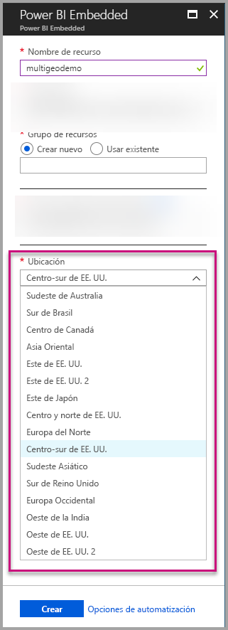
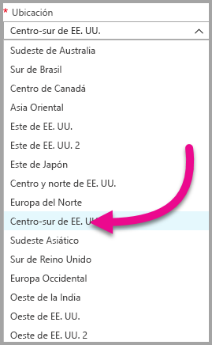
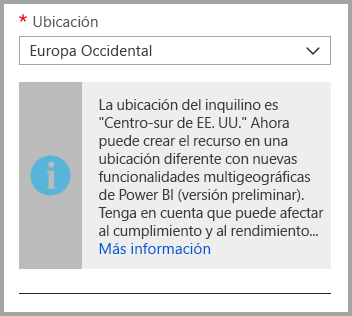
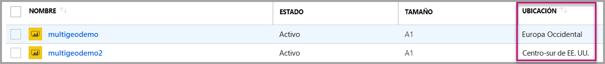
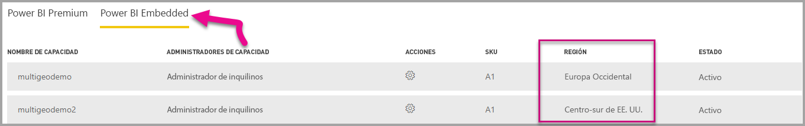

# Compatibilidad de Multi-Geo con Power BI Embedded

La **compatibilidad de Multi-Geo con Power BI Embedded** significa que los ISV y las organizaciones que compilan aplicaciones con Power BI Embedded para insertar análisis en sus aplicaciones ahora pueden implementar sus datos en diferentes regiones de todo el mundo.

Ahora los clientes que usan **Power BI Embedded** pueden configurar una **capacidad A** mediante **Multi-Geo**, según las mismas características y limitaciones que [admite Power BI Premium mediante Multi-Geo](../service-admin-premium-Multi-Geo.md).

## Creación de nuevos recurso de capacidad de Power BI Embedded con Multi-Geo

En la pantalla **Crear recurso**, debe elegir la ubicación de su capacidad. Hasta ahora, estaba limitado solo a la ubicación del inquilino de Power BI, de modo que solo había una ubicación disponible. Con Multi-Geo, puede elegir entre diferentes regiones para implementar su capacidad.

Tenga en cuenta que al abrir el menú desplegable de ubicación, el inquilino principal es la selección predeterminada.
  

Al elegir una ubicación diferente, un mensaje le pide que confirme la selección.

## Visualización de la ubicación de capacidad

Puede ver fácilmente la ubicación de las capacidades cuando vaya a la página principal de administración de Power BI Embedded en Azure Portal.

También está disponible en el Portal de administración en Powerbi.com. En el Portal de administración, elija "Configuración de la capacidad" y, a continuación, cambie a la pestaña "Power BI Embedded".

[Más información sobre la creación de capacidades con Power BI Embedded.](azure-pbie-create-capacity.md)

## Administración de la ubicación de capacidades existentes

No puede cambiar una ubicación de recursos de Power BI Embedded después de crear una capacidad.

Para mover el contenido de Power BI a una región diferente, siga estos pasos:

1. [Cree una nueva capacidad](azure-pbie-create-capacity.md) en una región distinta.

2. Asigne todas las áreas de trabajo de la capacidad existente a la nueva capacidad.

3. Elimine o pause la capacidad anterior.

Es importante tener en cuenta que si decide eliminar una capacidad sin volver a asignar su contenido, todo el contenido de esa capacidad se mueve a una capacidad compartida, que se encuentra en la región principal.

## Compatibilidad de API en Multi-Geo

Para que sea posible la administración de capacidades con Multi-Geo mediante API, se han realizado algunos cambios en las API existentes:

1. **[Get Capacities](https://docs.microsoft.com/rest/api/power-bi/capacities/getcapacities)** : la API devuelve una lista de capacidades con acceso al usuario. La respuesta incluye ahora una propiedad adicional denominada "region", que especifica la ubicación de la capacidad.

2. **[Assign To Capacity](https://docs.microsoft.com/rest/api/power-bi/capacities)** : la API permite asignar un área de trabajo determinada a una capacidad. Esta operación no permite asignar áreas de trabajo a una capacidad fuera de la región principal ni mover áreas de trabajo entre capacidades de diferentes regiones. Para realizar esta operación, el usuario o la [entidad de servicio](embed-service-principal.md) todavía necesita permisos de administrador en el área de trabajo, y permisos de administración o asignación en la capacidad de destino.

3. **[API de Azure Resource Manager](https://docs.microsoft.com/rest/api/power-bi-embedded/capacities)** : todas las operaciones de API de Azure Resource Manager, como *Crear* y *Eliminar*, admiten Multi-Geo.

## Limitaciones y consideraciones

* Antes de iniciar la transferencia de datos, confirme que cualquier movimiento que inició entre regiones satisface todos los requisitos de cumplimiento corporativos y gubernamentales.

* Una consulta en caché almacenada en una región remota permanece en esa región en reposo. Sin embargo, otros datos en tránsito pueden ir y venir entre distintas geografías.

* Al mover datos de una región a otra en un entorno Multi-Geo, los datos de origen pueden permanecer en la región de la que se movieron durante 30 días como máximo. Durante ese período, los usuarios no tienen acceso a ellos. Se quitan de esta región y se destruyen durante el período de 30 días.

* En términos generales, Multi-Geo no genera un mejor rendimiento. La carga de informes y paneles aún implica solicitudes de metadatos a la región principal.

## Pasos siguientes

Consulte los siguientes vínculos para más información sobre las capacidades de Power BI Embedded y las opciones Multi-Geo para todas las capacidades.

* [¿Qué es Power BI Embedded?](azure-pbie-what-is-power-bi-embedded.md)

* [Creación de una capacidad de Power BI Embedded](azure-pbie-create-capacity.md)

* [Multi-Geo en capacidades de Power BI Premium](../service-admin-premium-multi-geo.md)

¿Tiene más preguntas? [Pruebe a preguntar a la comunidad de Power BI](http://community.powerbi.com/)