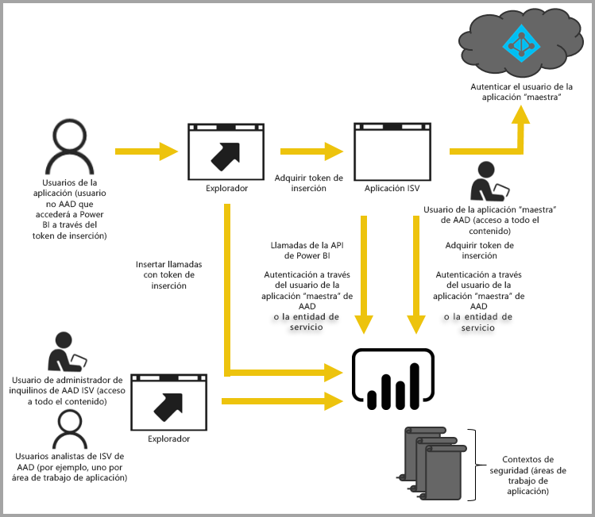

# Inserción con Power BI
El servicio Power BI (SaaS) y el servicio Power BI Embedded en Azure (PaaS) tienen las API para insertar los paneles e informes. Esto significa que dispone de un conjunto de funcionalidades y acceso a las últimas características de Power BI (como paneles, puertas de enlace y áreas de trabajo de la aplicación) para insertar el contenido.

Puede seguir los pasos de la [herramienta para incorporar la inserción](https://aka.ms/embedsetup) para empezar a trabajar rápidamente y descargar una aplicación de ejemplo.

Elija la solución que más le convenga:

* La [inserción para la organización](embedding.md#embedding-for-your-organization) permite ampliar el servicio Power BI. Ejecute la solución de [inserción para la organización](https://aka.ms/embedsetup/UserOwnsData).
* La [inserción para los clientes](embedding.md#embedding-for-your-customers) permite insertar paneles e informes para los usuarios que no tienen una cuenta de Power BI. Ejecute la solución de [inserción para los clientes](https://aka.ms/embedsetup/AppOwnsData).

## Uso de API
Hay dos escenarios principales al insertar el contenido de Power BI.  Inserción de contenido para usuarios de la organización (con licencia de Power BI) e inserción de contenido para usuarios y clientes sin que necesiten licencia de Power BI. La API de REST de Power BI permite ambos escenarios.

En el caso de clientes y usuarios que no tengan licencia de Power BI, puede insertar paneles e informes en la aplicación personalizada con las mismas API, tanto para la organización como para los clientes. Los clientes verán los datos que la aplicación administre. Además, en el caso de los usuarios de Power BI de su organización, tendrán opciones adicionales para ver *sus datos* directamente en Power BI o en el contexto de la aplicación insertada. Puede aprovechar al máximo las API de REST y de JavaScript para lo que necesite insertar.

Para ver un ejemplo de cómo funciona la inserción, consulte [Ejemplo de inserción de JavaScript](https://microsoft.github.io/PowerBI-JavaScript/demo/).

## Inserción de contenido para la organización
La **inserción para la organización** permite ampliar el servicio Power BI. Cuando los usuarios quieran ver el contenido, deberán iniciar sesión en el servicio Power BI. Cuando los usuarios de la organización inicien sesión, solo tendrán acceso a los paneles e informes que se hayan compartido con ellos en el servicio Power BI.

*Entre los ejemplos de inserción de contenido para la organización se incluye la inserción de aplicaciones web internas, elementos web de SharePoint Online y las [integraciones de Microsoft Teams. Tenga en cuenta que se necesitan privilegios de administrador](https://powerbi.microsoft.com/en-us/blog/power-bi-teams-up-with-microsoft-teams/).*

Para insertar contenido para su organización, consulte lo siguiente:

* [Integrar un informe en una aplicación](embed-sample-for-your-organization.md)

Al usar la inserción para los usuarios de Power BI, las funcionalidades de autoservicio (como son editar, guardar y otras) están disponibles a través de la [API de JavaScript](https://github.com/Microsoft/PowerBI-JavaScript).

Puede seguir los pasos de [Onboarding experience tool to embed for your organization](https://aka.ms/embedsetup/UserOwnsData) (Herramienta para incorporar la inserción para la organización) para empezar a trabajar rápidamente y descargar una aplicación de ejemplo que le guiará por los pasos para integrar un informe para la organización.

## Inserción de contenido para los clientes

La **inserción para los clientes** permite insertar paneles e informes para los usuarios que no tienen una cuenta de Power BI. Los clientes no necesitan saber nada acerca de Power BI. Se necesita al menos una cuenta de Power BI Pro para crear una aplicación insertada. Esa cuenta actuará como cuenta maestra de la aplicación. Considérela como una cuenta de proxy. La cuenta de Power BI Pro le permite también generar tokens de inserción que proporcionan acceso a los paneles e informes dentro del servicio Power BI que la aplicación posea o administre.

[Power BI Embedded](azure-pbie-what-is-power-bi-embedded.md) ofrece a los proveedores y desarrolladores de software independientes (ISV) una función de inserción para los clientes. Así, es posible agregar objetos visuales, informes y panales impresionantes con gran rapidez en las aplicaciones gracias a un modelo de medición por horas basado en la capacidad.

Power BI Embedded ofrece ventajas para los ISV, los desarrolladores y los clientes. Por ejemplo, un ISV puede empezar creando objetos visuales con Power BI Desktop de forma gratuita. Los ISV pueden acortar el tiempo y el esfuerzo dedicados al desarrollo de análisis visuales y, así, reducir los tiempos de creación y comercialización, y destacar entre la competencia con experiencias de datos diferenciadoras. Asimismo, los ISV también pueden elegir cobrar un cargo suplementario por el valor adicional creado gracias a los análisis insertados.

Los desarrolladores pueden centrarse en la creación de las características básicas de su aplicación, en lugar de en el desarrollo de los objetos visuales y los análisis. Además, los desarrolladores pueden satisfacer rápidamente las necesidades de los clientes en materia de informes y paneles, así como integrarlos fácilmente con las API y SDK, ambas con su documentación correspondiente. Por último, al habilitar en sus aplicaciones la exploración de datos de navegación fácil, los ISV permiten a sus clientes tomar decisiones rápidas y fundamentadas de conformidad con los datos, en contexto y con confianza en cualquier dispositivo.

> [!IMPORTANT]
> Aunque la inserción de contenido tiene una dependencia del servicio Power BI, no existe ninguna dependencia de Power BI para los clientes. No es necesario que se registren en Power BI para ver el contenido insertado en la aplicación.

Cuando esté listo para pasar a producción, se requiere asignar el área de trabajo de la aplicación a una capacidad dedicada. Power BI Embedded de Microsoft Azure ofrece capacidades dedicadas para usarlas con las aplicaciones.

Para más información acerca de los procedimientos de inserción, consulte [Procedimiento para insertar paneles, informes e iconos de Power BI](embed-sample-for-customers.md).

Puede seguir los pasos de la [Herramienta para incorporar la inserción](https://aka.ms/embedsetup/AppOwnsData) para empezar a trabajar rápidamente y descargar una aplicación de ejemplo que le guíe por los pasos para integrar un informe en la aplicación.

Si usó el servicio Colección de áreas de trabajo de Power BI en Azure, consulte [Migración de contenido desde el servicio Colección de áreas de trabajo de Power BI](migrate-from-powerbi-embedded.md) para más información sobre cómo migrar el contenido.

## Pasos siguientes
Ahora puede intentar insertar contenido de Power BI en una aplicación o intentar insertar el contenido de Power BI para los clientes.

> [!div class="nextstepaction"]
> [¿Qué es Power BI Embedded?](azure-pbie-what-is-power-bi-embedded.md)

> [!div class="nextstepaction"]
> [Insertar para la organización](embed-sample-for-your-organization.md)

> [!div class="nextstepaction"]
>[Insertar para los clientes](embed-sample-for-customers.md)

¿Tiene más preguntas? [Pruebe a preguntar a la comunidad de Power BI](http://community.powerbi.com/)