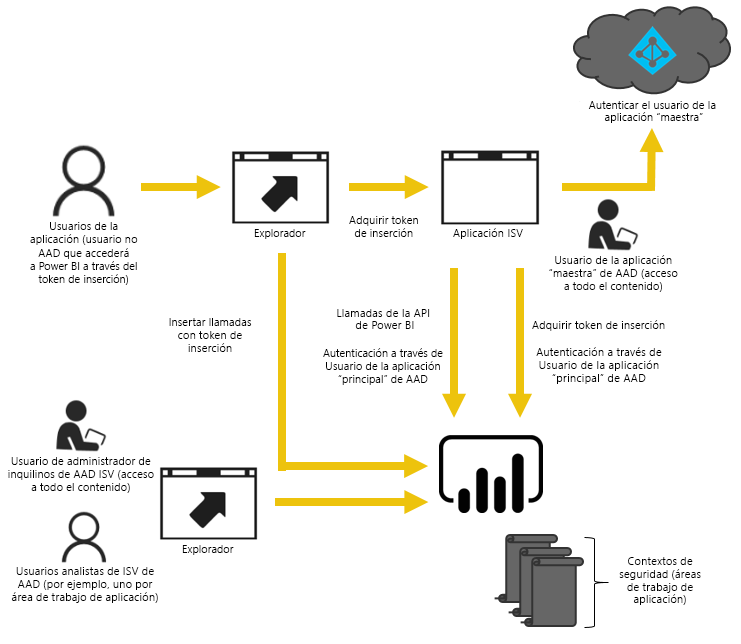
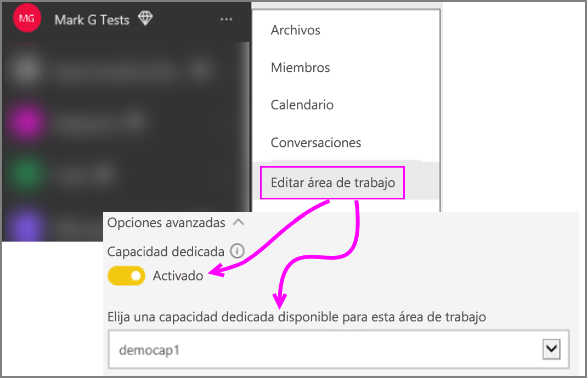

# Migración de contenido de la colección de áreas de trabajo de Power BI a Power BI Embedded

Aprenda a migrar de la colección de áreas de trabajo de Power BI a Power BI Embedded y aproveche los avances para la inserción en aplicaciones.

Recientemente, Microsoft [presentó Power BI Embedded](https://powerbi.microsoft.com/blog/power-bi-embedded-capacity-based-skus-coming-to-azure/), un nuevo modelo de licencias basado en la capacidad que aumenta la flexibilidad con la que los usuarios acceden al contenido, lo comparten y lo distribuyen. La oferta también incluye mayor rendimiento y escalabilidad.

Con Power BI Embedded, al insertar el contenido tendrá una superficie de API, un conjunto coherente de funcionalidades y acceso a las características más recientes de Power BI (como paneles, puertas de enlace y áreas de trabajo). Más adelante, podrá empezar con Power BI Desktop y pasar a implementar con Power BI Embedded.

La colección de áreas de trabajo de Power BI actual seguirá estando disponible durante un tiempo limitado. Los clientes sujetos a un contrato Enterprise tendrán acceso hasta la expiración de los acuerdos existentes; los clientes que hayan adquirido la colección de áreas de trabajo de Power BI a través de canales Direct o CSP conservarán el acceso durante un año a partir de la versión de disponibilidad general de Power BI Embedded.  En este artículo se ofrecen pautas para migrar de la colección de áreas de trabajo de Power BI a la nueva experiencia de Power BI Embedded e indicaciones de qué cambios se pueden esperar en la aplicación.

> [!IMPORTANT]
> Aunque la migración adoptará una dependencia de Power BI Embedded, no existe ninguna dependencia de Power BI para los usuarios de la aplicación cuando usen un **token de inserción**. No es necesario que se registren en Power BI para ver el contenido insertado en la aplicación. Puede usar esta estrategia de inserción para los usuarios de Embedded que no usen Power BI.

Antes de empezar a migrar a la nueva versión de Power BI Embedded, puede hacer un tutorial para configurar el nuevo entorno de Power BI Embedded con la [herramienta de configuración de inserción](https://aka.ms/embedsetup).

Elija la solución que más le convenga:
* **Inserción para los clientes**: si está interesado en una solución en la que la [aplicación posee los datos](https://aka.ms/embedsetup/AppOwnsData). La [inserción para los clientes](embedding.md#embedding-for-your-customers) permite insertar paneles e informes para los usuarios que no tienen una cuenta de Power BI. 

* **Inserción para la organización**: si está interesado en una solución en la que el [usuario posee los datos](https://aka.ms/embedsetup/UserOwnsData). La [inserción para la organización](embedding.md#embedding-for-your-organization) permite ampliar el servicio Power BI.

## Prepararse para la migración

Hay algunas cosas que debe hacer para preparar la migración de la colección de áreas de trabajo de Power BI a Power BI Embedded. Necesitará un inquilino, así como un usuario que tenga una licencia de Power BI Pro.

1. Asegúrese de tener acceso a un inquilino de Azure Active Directory (Azure AD).

    Debe determinar qué configuración de inquilino se va a usar.

   * ¿Se usa el inquilino de Power BI corporativo actual?
   * ¿Se usa un inquilino independiente para la aplicación?
   * ¿Se usa un inquilino independiente para cada cliente?

     Si decide crear un inquilino para la aplicación o para cada cliente, consulte [Crear un inquilino de Azure Active Directory](create-an-azure-active-directory-tenant.md) u [Obtención de un inquilino de Azure Active Directory](https://docs.microsoft.com/azure/active-directory/develop/active-directory-howto-tenant).
2. Dentro de este nuevo inquilino, cree un usuario que actuará como su cuenta "maestra" de la aplicación. Esa cuenta debe registrarse en Power BI y debe tener asignada una licencia de Power BI Pro.

## Cuentas en Azure AD

Las siguientes cuentas deberán existir dentro de su inquilino.

> [!NOTE]
> Estas cuentas deberán tener licencias de Power BI Pro para poder usar las áreas de trabajo.

1. Un usuario administrador del inquilino.

    Se recomienda que el usuario sea miembro de todas las áreas de trabajo creadas para la inserción.

2. Cuentas para los analistas que van a crear contenido.

    Estos usuarios deben asignarse a las áreas de trabajo según sea necesario.

3. Una cuenta de usuario *maestra* de la aplicación, o cuenta de Embedded.

    El back-end de aplicaciones almacenará las credenciales para esta cuenta y las usará para adquirir un token de Azure AD para usarlo con las API REST de Power BI. Se usará esta cuenta para generar el token de inserción para la aplicación. Esta cuenta también debe ser administrador de las áreas de trabajo creadas para la inserción.

> [!NOTE]
> Se trata de una cuenta de usuario normal de la organización que se usará con fines de inserción.

## Registro y permisos de la aplicación

Tendrá que registrar una aplicación en Azure AD y concederle determinados permisos.

### Registrar una aplicación

Para realizar llamadas a la API de REST será preciso registrar la aplicación en Azure AD. Esto incluye ir a Azure Portal para aplicar una configuración adicional además de la proporcionada en la página de registro de la aplicación Power BI. Para más información, consulte [Registro de una aplicación de Azure AD para insertar contenido de Power BI](register-app.md).

Debe registrar la aplicación mediante la cuenta **maestra** de la aplicación.

## Creación de áreas de trabajo (necesario)

Puede aprovechar las áreas de trabajo para proporcionar un mejor aislamiento si la aplicación va a dar servicio a varios clientes. Los paneles e informes deberían permanecer aislados entre sus clientes. Podría utilizar una cuenta de Power BI para cada área de trabajo para aislar aún más el uso de la aplicación entre sus clientes.

> [!IMPORTANT]
> No puede utilizar un área de trabajo personal para aprovechar las ventajas de la inserción para los usuarios que no usan Power BI.

Para crear un área de trabajo en Power BI, necesitará un usuario que tenga licencia de la versión Pro. De forma predeterminada, el usuario de Power BI que cree el área de trabajo será su administrador.

> [!NOTE]
> La cuenta *maestra* de la aplicación debe ser un administrador del área de trabajo.

## Migración de contenido

La migración del contenido de las colecciones de áreas de trabajo a Power BI Embedded se puede efectuar a la vez que usa su solución actual y no requiere ningún tiempo de inactividad.

Puede usar una **herramienta de migración** con el fin de ayudar a copiar el contenido de la colección de áreas de trabajo de Power BI a Power BI Embedded. Sobre todo, si tiene mucho contenido. Para más información, consulte [Herramienta de migración de Power BI Embedded](migrate-tool.md).

La migración de contenido se basa principalmente en dos API.

1. Download PBIX: esta API puede descargar los archivos PBIX que se cargaron en Power BI después de octubre de 2016.
2. Import PBIX: esta API carga cualquier PBIX en Power BI.

Para ver algunos fragmentos de código relacionados, consulte [Fragmentos de código para migrar contenido de la colección de áreas de trabajo de Power BI](migrate-code-snippets.md).

### Tipos de informes

Hay varios tipos de informes y cada uno requiere un flujo de migración ligeramente distinto.

#### Informe y conjunto de datos almacenados en caché

Los conjuntos de datos almacenados en caché hacen referencia a los archivos PBIX que hayan importado datos en lugar de una conexión dinámica o una conexión DirectQuery.

**Flujo**

1. Llame a la API Download PBIX para descargar los archivos PBIX desde el área de trabajo de PaaS.
2. Guarde los archivos PBIX.
3. Llame a Import PBIX para importar los archivos PBIX al área de trabajo de SaaS.

#### Informe y conjunto de datos DirectQuery

**Flujo**

1. Llame a GET https://api.powerbi.com/v1.0/collections/{collection_id}/workspaces/{wid}/datasets/{dataset_id}/Default.GetBoundGatewayDataSources y guarde la cadena de conexión recibida.
2. Llame a la API Download PBIX para descargar los archivos PBIX desde el área de trabajo de PaaS.
3. Guarde los archivos PBIX.
4. Llame a Import PBIX para importar los archivos PBIX al área de trabajo de SaaS.
5. Actualice la cadena de conexión mediante una llamada a - POST https://api.powerbi.com/v1.0/myorg/datasets/{dataset_id}/Default.SetAllConnections.
6. Obtenga los identificadores de GW y del origen de datos mediante una llamada a - GET https://api.powerbi.com/v1.0/myorg/datasets/{dataset_id}/Default.GetBoundGatewayDataSources.
7. Actualice las credenciales del usuario mediante una llamada a - PATCH https://api.powerbi.com/v1.0/myorg/gateways/{gateway_id}/datasources/{datasource_id}.

#### Informes y conjuntos de datos antiguos

Se trata de conjuntos de datos e informes creados antes de octubre de 2016. Download PBIX no admite PBIX que se hayan cargado antes de octubre de 2016

**Flujo**

1. Obtenga PBIX desde su entorno de desarrollo (su control de código fuente interno).
2. Llame a Import PBIX para importar los archivos PBIX al área de trabajo de SaaS.

#### Informe y conjunto de datos de inserción

Download PBIX no admite conjuntos de datos *Push API*. No se pueden migrar datos de conjuntos de datos Push API desde PaaS a SaaS.

**Flujo**

1. Llame a la API "Create dataset" con el conjunto de datos JSON para crear el conjunto de datos en el área de trabajo de SaaS.
2. Vuelva a generar el informe para el conjunto de datos creado*.

Es posible usar algunas soluciones alternativas para migrar el informe de Push API desde PaaS a SaaS haciendo lo siguiente.

1. Cargue algunos archivos PBIX ficticios en el área de trabajo de PaaS.
2. Clone el informe de Push API y enlácelo al PBIX ficticio del paso 1.
3. Descargue el informe de Push API con el PBIX ficticio.
4. Cargue el PBIX ficticio en el área de trabajo de SaaS.
5. Cree el conjunto de datos de inserción en el área de trabajo de SaaS.
6. Vuelva a enlazar el informe con el conjunto de datos Push API.

## Cree y cargue los nuevos informes

Además del contenido que haya migrado desde la colección de áreas de trabajo de Power BI, puede crear sus propios informes y conjuntos de datos mediante Power BI Desktop y, después, publicar dichos informes en un área de trabajo. El usuario final que publique los informes deberá tener una licencia de Power BI Pro para publicar en un área de trabajo.

## Recompilar la aplicación

1. Debe modificar la aplicación para que use las API de REST de Power BI y la ubicación del informe en powerbi.com.
2. Recompile su autenticación AuthN/AuthZ mediante la cuenta *maestra* para la aplicación. Puede usar un [token de inserción](https://docs.microsoft.com/rest/api/power-bi/embedtoken) para permitir que este usuario actúe en nombre de otros usuarios.
3. Inserte los informes de powerbi.com en su aplicación.

## Asignar los usuarios a un usuario de Power BI

En la aplicación, asignará los usuarios que administra dentro de la aplicación a unas credenciales *maestras* de Power BI que se usarán con su aplicación. Las credenciales para esta cuenta *maestra* de Power BI se almacenan en la aplicación y se pueden usar para crear tokens de inserción.

## Qué hacer cuando esté listo para la producción

Cuando esté listo para pasar a producción, debe hacer lo siguiente.

* Si usa un inquilino independiente para el desarrollo, tendrá que asegurarse de que las áreas de trabajo, junto con los paneles e informes, estén disponibles en el entorno de producción. También deberá asegurarse de que creó la aplicación en Azure AD para el inquilino de producción y de que se le asignaron los permisos de aplicación adecuados, tal como se indica en el paso 1.
* Adquiera la capacidad que se adapte a sus necesidades. Para comprender mejor la cantidad y el tipo de la capacidad que se necesita, consulte las [notas del producto sobre el planeamiento de la capacidad de análisis de Power BI Embedded](https://aka.ms/pbiewhitepaper). También puede [adquirir capacidad](https://portal.azure.com/#create/Microsoft.PowerBIDedicated) en Azure.
* Edite el área de trabajo y asígnele una capacidad Premium en las opciones avanzadas.

    

* Implemente la aplicación actualizada en producción y empiece a insertar informes desde Power BI Embedded.

## Después de la migración

Debería hacer una limpieza dentro de Azure.

* Quite todas las áreas de trabajo de la solución implementada en el servicio Azure Embedded de la colección de áreas de trabajo de Power BI.
* Elimine las colecciones de áreas de trabajo que existan dentro de Azure.

## Pasos siguientes

[Inserción con Power BI](embedding.md)  
[Herramienta de migración de la colección de áreas de trabajo de Power BI](migrate-tool.md)  
[Fragmentos de código para migrar contenido de la colección de áreas de trabajo de Power BI](migrate-code-snippets.md)  
[Procedimiento para insertar paneles, informes e iconos de Power BI](embedding-content.md)  
[¿Qué es Power BI Premium?](../service-premium-what-is.md)  
[Repositorio Git de la API de JavaScript](https://github.com/Microsoft/PowerBI-JavaScript)  
[Repositorio Git de C# de Power BI](https://github.com/Microsoft/PowerBI-CSharp)  
[Ejemplo de inserción de JavaScript](https://microsoft.github.io/PowerBI-JavaScript/demo/)  
[Notas del producto sobre el planeamiento de la capacidad de análisis de la colección de áreas de trabajo](https://aka.ms/pbiewhitepaper)  
[Notas del producto de Power BI Premium](https://aka.ms/pbipremiumwhitepaper)  

¿Tiene más preguntas? [Pruebe a preguntar a la comunidad de Power BI](https://community.powerbi.com/)
