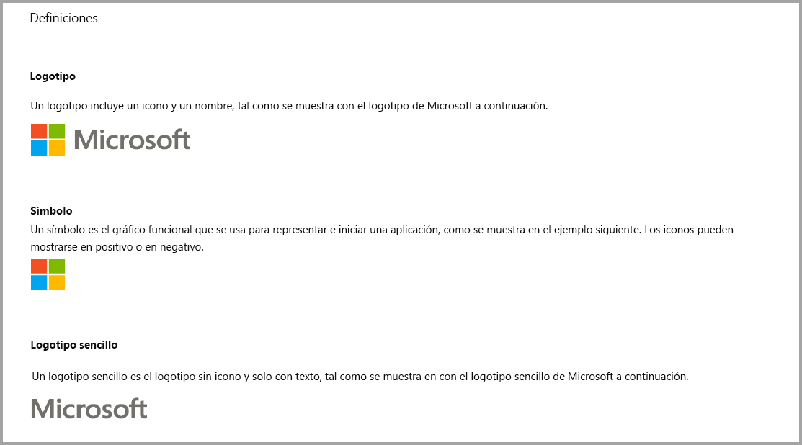
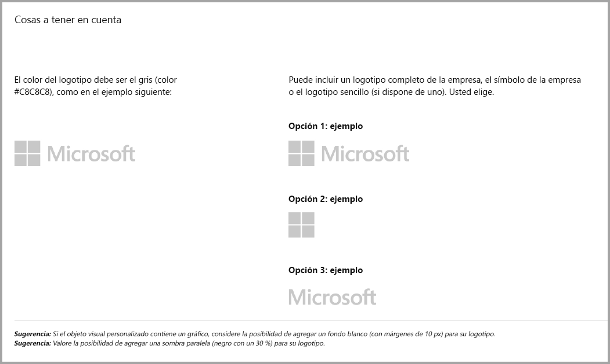
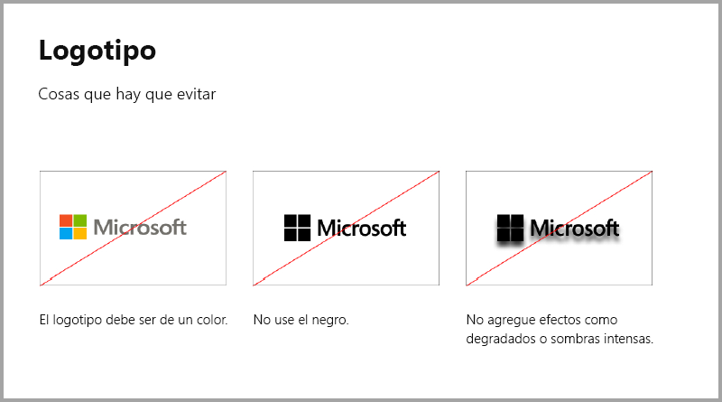
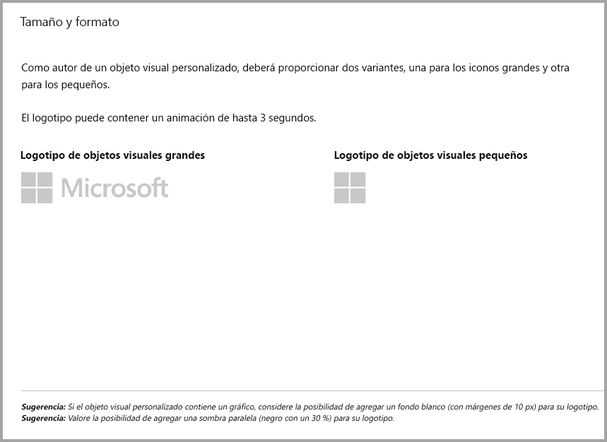
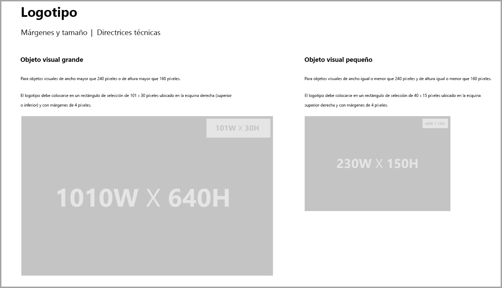
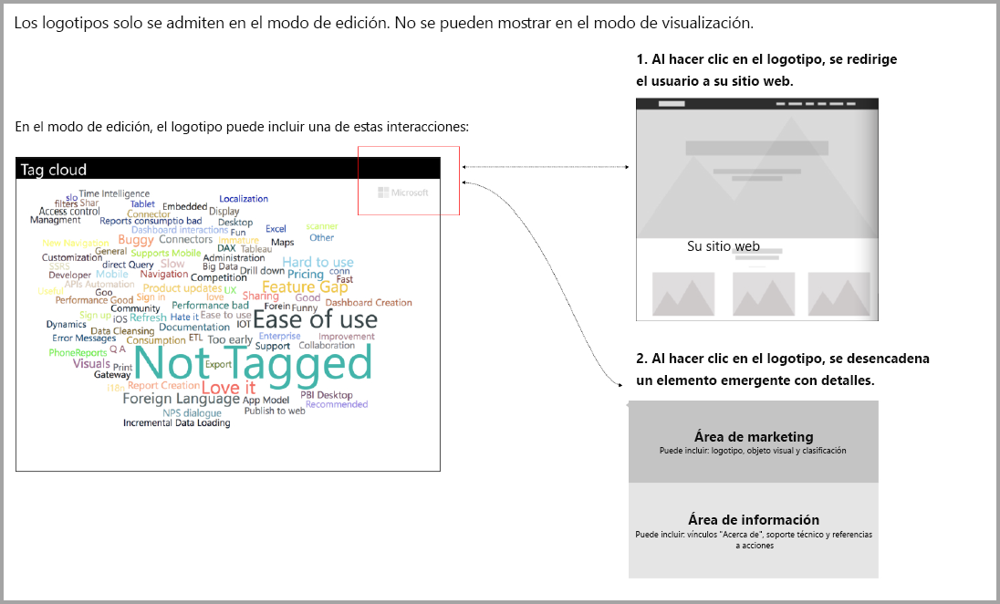

# Instrucciones para objetos visuales de Power BI con compras adicionales

Hasta hace poco, **Marketplace (AppSource)** solo aceptaba objetos visuales de Power BI que eran gratuitos. Esta directiva va a cambiar de modo que también se puedan enviar objetos visuales con la etiqueta de precio “Es posible que se requiera una compra adicional” a **AppSource**. Los objetos visuales con la etiqueta “Es posible que se requiera una compra adicional” son similares a los complementos de compra desde la aplicación (IAP) de la Tienda Office. Los desarrolladores también pueden enviar estos objetos visuales para que se certifiquen después de que el equipo de **AppSource** los apruebe, así como después de asegurarse de que cumplen con los requisitos de certificación, tal y como se describe en el artículo [Objetos visuales personalizados certificados](../power-bi-custom-visuals-certified.md).

> [!Note]
> Para que se certifique el objeto visual, no puede acceder a servicios o recursos externos.

## ¿Qué cambia en el proceso de envío?

Los desarrolladores cargan sus objetos visuales de IAP en AppSource mediante el panel de vendedores, tal y como han estado realizando con los objetos visuales gratuitos. Para indicar que el objeto visual enviado tiene características de IAP, los desarrolladores deben escribir en las notas del panel de vendedores: "Objeto visual con compra desde la aplicación". Además, los desarrolladores tienen que proporcionar un token o una clave de licencia para que el equipo de validación pueda validar las características de IAP. Una vez que el objeto visual se valide y apruebe, en la lista de AppSource de los estados de los objetos visuales de IAP se indica “Es posible que se requiera una compra adicional” en las opciones de los precios.

## ¿Qué es un objeto visual de Power BI con características de IAP?

Un objeto visual de IAP es un objeto visual gratuito que ofrece características gratuitas, pero que también tiene características adicionales por las que se pueden aplicar cargos adicionales a fin de que funcionen. Los desarrolladores deben indicar a los usuarios en la descripción del objeto visual qué características requieren compras adicionales para que funcionen. Actualmente, Microsoft no proporciona interfaces de programación de aplicaciones (API) nativas que admitan comprar en aplicaciones y complementos. Los desarrolladores pueden usar cualquier sistema de pago de terceros para esas compras. Consulte la [directiva](https://docs.microsoft.com/office/dev/store/validation-policies#2-apps-or-add-ins-can-display-certain-ads) de nuestra tienda.

## Instrucciones para los logotipos

En esta sección se describen las especificaciones para agregar logotipos en objetos visuales.

> [!NOTE]
> Los logotipos solo se admiten en el modo de edición. Los logotipos no se pueden mostrar en el modo de visualización.

## Procedimientos recomendados

### Página de aterrizaje del objeto visual

Use la página de aterrizaje para aclarar a los usuarios cómo pueden utilizar el objeto visual y dónde deben comprar la licencia. No incluya vídeos que se reproduzcan de forma automática. Agregue solo material que ayude a mejorar la experiencia del usuario, por ejemplo, información o vínculos sobre los detalles de la compra y cómo usar las características de IAP.

### Token y clave de licencia

Para que los usuarios los encuentren fácilmente, agregue campos relacionados con el token o la clave de licencia en la parte superior del panel de formato.

## PREGUNTAS MÁS FRECUENTES

Para obtener más información y respuestas a las preguntas, visite las [preguntas más frecuentes sobre objetos visuales personalizados de Power BI con compras adicionales](https://docs.microsoft.com/power-bi/power-bi-custom-visuals-faq#visuals-with-additional-purchases).

## Pasos siguientes

Aprenda a publicar objetos visuales personalizados en [AppSource](office-store.md) para que otros usuarios puedan descubrirlos y usarlos.
