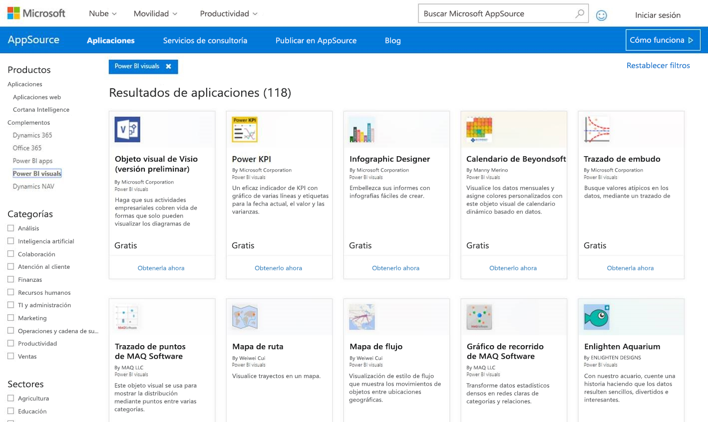
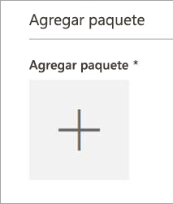
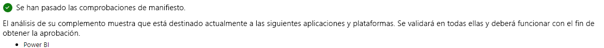
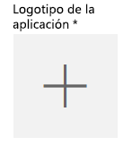
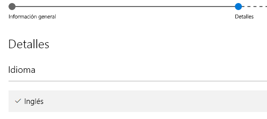

# Publicación de objetos visuales de Power BI en AppSource

Aprenda a publicar objetos visuales personalizados en AppSource para que otros usuarios puedan descubrirlos y usarlos.

Una vez que haya creado un objeto visual personalizado, puede publicarlo en AppSource para que otros usuarios lo detecten y lo usen. Para ello, es preciso prepararlo con anterioridad. Para obtener más información acerca de cómo crear un objeto visual personalizado, consulte [Desarrollo de objetos visuales personalizados de Power BI](visuals/custom-visual-develop-tutorial.md).

   

## ¿Qué es AppSource?

**AppSource** es el lugar donde podrá encontrar aplicaciones SaaS y complementos para sus productos y servicios de Microsoft. [AppSource](https://appsource.microsoft.com/marketplace/apps?product=power-bi-visuals) conecta millones de usuarios de productos como Office 365, Dynamics 365 y otros con soluciones que les ayudan a realizar su trabajo de forma más eficaz, minuciosa o atractiva que antes.

## Preparación de objetos visuales para su envío

Cuando acabe de leer nuestras [Instrucciones para objetos visuales de Power BI](guidelines-powerbi-visuals.md), de programar, de [probar su objeto visual personalizado](https://github.com/Microsoft/PowerBI-visuals/blob/master/Tutorial/SubmissionTesting.md) y de empaquetarlo en un archivo pbiviz, debe tener lo siguiente listo también para realizar el envío.

| Artículo | Obligatoria | Descripción |
| --- | --- | --- |
| El paquete pbiviz contiene todos los metadatos requeridos |Sí |Nombre de objeto visual Nombre para mostrar GUID Versión Descripción Nombre y correo electrónico del autor |
| Archivo de informe .pbix de ejemplo |Sí |Para presentar el objeto visual, debe ayudar a los usuarios a familiarizarse con él. Debe resaltar el valor que el objeto visual aporta al usuario y ofrecen ejemplos de uso, opciones de formato, etc. También puede agregar una página de *"sugerencias"* al final que contenga trucos y sugerencias, acciones que conviene evitar y cosas similares. El archivo de informe .pbix de ejemplo debe funcionar sin conexión, sin ninguna conexión externa |
| Icono |Sí |Debe incluir el logotipo del objeto visual personalizado que aparecerá en el escaparate. Su formato puede ser .png, .jpg, .jpeg o .gif. Debe ser exactamente de 300 px (ancho) x 300 px (alto). **Importante** Revise cuidadosamente la [guía breve](https://docs.microsoft.com/office/dev/store/craft-effective-appsource-store-images) antes de enviar el icono. |
| Capturas de pantalla |Sí |Debe incluir al menos una captura de pantalla. Su formato puede ser .png, .jpg, .jpeg o .gif. Debe ser exactamente de 1366 px (ancho) x 768 px (alto). El tamaño del archivo no puede superar los 1024 KB. *Si el uso va a ser mayor, agregue burbujas de texto para articular la propuesta de valor de las características clave que se muestran en cada captura.* |
| Vínculo de descarga de soporte técnico |Sí |Especifique la dirección URL en la que se proporcionará soporte técnicos a los clientes que tengan problemas con el objeto visual. Este vínculo se especifica como parte de su lista de SellerDashboard y es visible para los usuarios cuando acceden a la lista de objetos visuales en AppSource. El formato de la dirección URL debe incluir https:// o http://. |
| Vínculo de documento de privacidad |Sí |Especifique un vínculo a la directiva de privacidad para los clientes que usen el objeto visual. Este vínculo se especifica como parte de su lista de SellerDashboard y es visible para los usuarios cuando acceden a la lista de objetos visuales en AppSource. El formato del vínculo debe incluir https:// o http://. |
| Contrato de licencia para el usuario final (CLUF) |Sí |Debe cargar un archivo con el CLUF. Puede ser su propio CLUF, o bien puede usar el CLUF predeterminado de la Tienda Office para objetos visuales de Power BI. Para usar el CLUF predeterminado, pegue la siguiente dirección URL en el cuadro de diálogo de carga del archivo del "Contrato de licencia para el usuario final" del panel del vendedor: [https://visuals.azureedge.net/app-store/Power BI - Default Custom Visual EULA.pdf](https://visuals.azureedge.net/app-store/Power%20BI%20-%20Default%20Custom%20Visual%20EULA.pdf). |
| Enlace de vídeo |No |Para aumentar el interés de los usuarios por el objeto visual personalizado, se recomienda incluir un vínculo a un vídeo acerca de dicho objeto. El formato de la dirección URL debe incluir https:// o http://. |
| Repositorio de GitHub |No |Es preferible tener un vínculo válido y público a un repositorio de [GitHub](https://www.github.com) con orígenes del objeto visual y datos de ejemplo que permitir que otros desarrolladores incluyan comentarios y sugieran mejoras en el código. |

## Envío a Power BI

Todo comienza con el envío de un correo electrónico al equipo de envío de objetos visuales de Power BI. Dicho correo electrónico se puede dirigir a [pbivizsubmit@microsoft.com](mailto:pbivizsubmit@microsoft.com).

> [!IMPORTANT]
> Debe rellenar los campos siguientes en el archivo pbiviz.json: "description", "supportUrl", "author", "name" y "email" antes de crear el paquete .pbiviz.

Adjunte tanto el **archivo .pbiviz** como el **archivo .pbix del informe** de ejemplo. El equipo de Power BI responderá con instrucciones y un archivo XML del paquete de la aplicación que se debe cargar. Dicho paquete se requiere para enviar cualquier objeto visual a través del Centro para desarrolladores de Office.

> [!NOTE]
> Para mejorar la calidad y garantizar que los informes existentes no se interrumpan, las actualizaciones de los objetos visuales existentes tardará un dos semanas más en llegar al entorno de producción tras su aprobación en la tienda.

## Envío a AppSource

Una vez que obtenga el código XML del paquete de la aplicación del equipo de Power BI, vaya al [Centro para desarrolladores](https://sellerdashboard.microsoft.com/Application/Summary) para enviar el objeto visual a AppSource.

> [!NOTE]
> Para iniciar sesión en el [Centro para desarrolladores de Office](https://dev.office.com/) es preciso tener una cuenta de desarrollador de Office válida. Una cuenta de desarrollador de Office debe ser una cuenta Microsoft (Live ID, por ejemplo, hotmail.com o outlook.com).

> [!IMPORTANT]
> Debe enviar un correo electrónico con los archivos .pbiviz y .pbix al equipo de Power BI antes de realizar el envío a AppSource. Esto permite al equipo de Power BI cargar los archivos en el servidor de recursos compartidos público. De lo contrario, la tienda no podrá recuperar los archivos. Los archivos deben enviarse cada vez que se envíe un objeto visual nuevo, que se actualice uno existente y que se corrijan los envíos que han sido rechazados.

### Proceso para el envío de un objeto visual

Siga estos pasos para completar el envío.

1. Seleccione **Agregar una nueva aplicación**.

    

2. Seleccione **Objeto visual personalizado de Power BI** y, después, **Siguiente**.

3. Seleccione el signo **+** en **Paquete de la aplicación** y, en el cuadro de diálogo Abrir archivo, seleccione el archivo XML del paquete de la aplicación que le ha enviado el equipo de Power BI.

    

4. Debería recibir una aprobación en la que se indica que se trata de un paquete de aplicación de Power BI válido.

    

5. Rellene los detalles de **Información general**.

   * *Título del envío:* cómo se denominará el envío en el centro para desarrolladores.
   * *Versión:* el número de versión se rellena automáticamente desde el paquete de la aplicación del complemento.
   * *Fecha de lanzamiento (UCT):* seleccione la fecha en que se publicará la aplicación en la tienda. Si se elige una fecha futura, la aplicación no estará disponible en la tienda hasta dicha fecha.
   * *Categoría:* la primera categoría se rellenará como "Visualización de datos + BI" de forma automática. Así es como se etiquetan todos los objetos visuales de Power BI. Puede proporcionar hasta dos categorías adicionales para ayudar a los usuarios a buscar fácilmente el objeto visual.
   * *Notas de pruebas:* opcional, si desea proporcionar instrucciones para los evaluadores de Microsoft
   * *Mi aplicación llama, admite, contiene o usa criptografía o cifrado*: déjela desactivada
   * *Establecer este complemento como disponible en el catálogo de complementos de Office para iPad*: déjela desactivada
6. Cargue el logotipo del objeto visual, para lo que debe seleccionar el signo **+** de **Logotipo de la aplicación**. Después, seleccione el archivo del icono en el cuadro de diálogo Abrir archivo. El archivo debe tener una de las siguientes extensiones: .png, .jpg, .jpeg o .gif. Debe ser tener, exactamente, 300 px (ancho) x 300 px (ancho) y su tamaño no puede superar los 512 KB.

    

7. Rellene los datos de **Documentos de soporte técnico**.

   * Vínculo de documento de soporte técnico
   * Vínculo de documento de privacidad
   * Enlace de vídeo
   * Contrato de licencia de usuario final (CLUF)

       Debe cargar un archivo con el CLUF. Puede ser su propio CLUF, o bien puede usar el CLUF predeterminado de la Tienda Office para objetos visuales de Power BI. Para usar el CLUF predeterminado, pegue la siguiente dirección URL en el cuadro de diálogo de carga del archivo del "Contrato de licencia para el usuario final" del panel del vendedor: [https://visuals.azureedge.net/app-store/Power BI - Default Custom Visual EULA.pdf](https://visuals.azureedge.net/app-store/Power%20BI%20-%20Default%20Custom%20Visual%20EULA.pdf).

8. Seleccione **Siguiente** para pasar a la página **Detalles**.

9. Seleccione **Idioma** y elija uno de los idiomas de la lista.

    

10. Rellene los datos de "Descripción".

    * *Nombre de la aplicación (para este idioma):* escriba el título de la aplicación, tal como debe aparecer en escaparate.
    * *Descripción breve:* especifique una descripción breve de la aplicación, de hasta 100 caracteres, como debe aparecer en el escaparate. Esta descripción se mostrará en las primeras páginas, junto con el logotipo. Puede utilizar la descripción del paquete pbiviz.
    * *Descripción larga:* proporcione una descripción más detallada de la aplicación, que es la que los clientes verán en la página de detalles de la aplicación. Si quiere permitir que la comunidad mejore el objeto visual convirtiéndolo en código abierto, proporcione el vínculo al repositorio público, como GitHub, aquí.

11. Cargue al menos una captura de pantalla. Su formato puede ser .png, .jpg, .jpeg o .gif. Debe ser exactamente de 1366 px (ancho) x 768 px (alto). El tamaño del archivo no puede superar los 1024 KB. *Si el uso va a ser mayor, agregue burbujas de texto para articular la propuesta de valor de las características clave que se muestran en cada captura.*

12. Si desea agregar más idiomas, seleccione **Agregar un idioma** y repita los pasos 10 y 11. La incorporación de más idiomas ayudará a los usuarios a ver la información del objeto visual personalizado en su propio idioma. Si el idioma no aparece en la lista, se utilizará de manera predeterminada el primer idioma seleccionado.

13. Cuando haya terminado de agregar idiomas, seleccione **Siguiente** para pasar a la página **Bloquear acceso**.

14. Si desea impedir que clientes de determinados países o regiones usen o compren la aplicación, active la casilla y selecciónelo en la lista.

15. Seleccione **Siguiente** para pasar a la página **Precios**.

16. En estos momentos, solo se permiten los objetos visuales *gratuitos*, pero no las compras adicionales integradas ellos (compras desde la aplicación). Seleccione **Esta aplicación es gratuita**.

    > [!NOTE]
    > Si selecciona cualquier otra opción que no sea la gratuita, o bien si en el objeto visual enviado hay contenido para compras desde la aplicación, el envío se rechazará.

17. Ahora puede seleccionar **Guardar como borrador** o **Enviar para aprobación** para enviar el objeto visual personalizado a la Tienda Office.

## Seguimiento del uso y estado del envío

Puede revisar las [directivas de validación](https://dev.office.com/officestore/docs/validation-policies#13-power-bi-custom-visuals).

Después del envío, el estado del envío se puede ver en el [panel de la aplicación](https://sellerdashboard.microsoft.com/Application/Summary/).

## Certificación del objeto visual

Una vez creado el objeto visual, si lo desea, puede obtener su certificación. Esto significa que puede ejecutarse en el servicio Power BI y utilizarse con otras características del servicio, como la exportación a PowerPoint. Para más información, consulte [Obtención de un objeto visual personalizado *certificado*](../developer/power-bi-custom-visuals-certified.md).

## Pasos siguientes

[Desarrollo de objetos visuales personalizados de Power BI](visuals/custom-visual-develop-tutorial.md)  
[Visualizaciones en Power BI](../visuals/power-bi-report-visualizations.md)  
[Visualizaciones personalizadas en Power BI](../developer/power-bi-custom-visuals.md)  
[Obtención de un objeto visual personalizado *certificado*](../developer/power-bi-custom-visuals-certified.md)

¿Tiene más preguntas? [Pruebe a preguntar a la comunidad de Power BI](https://community.powerbi.com/)
