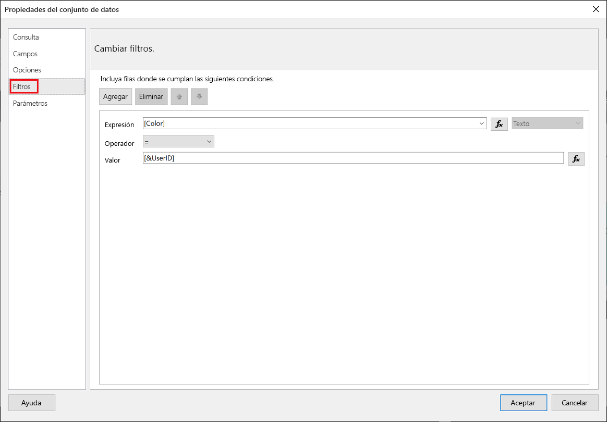
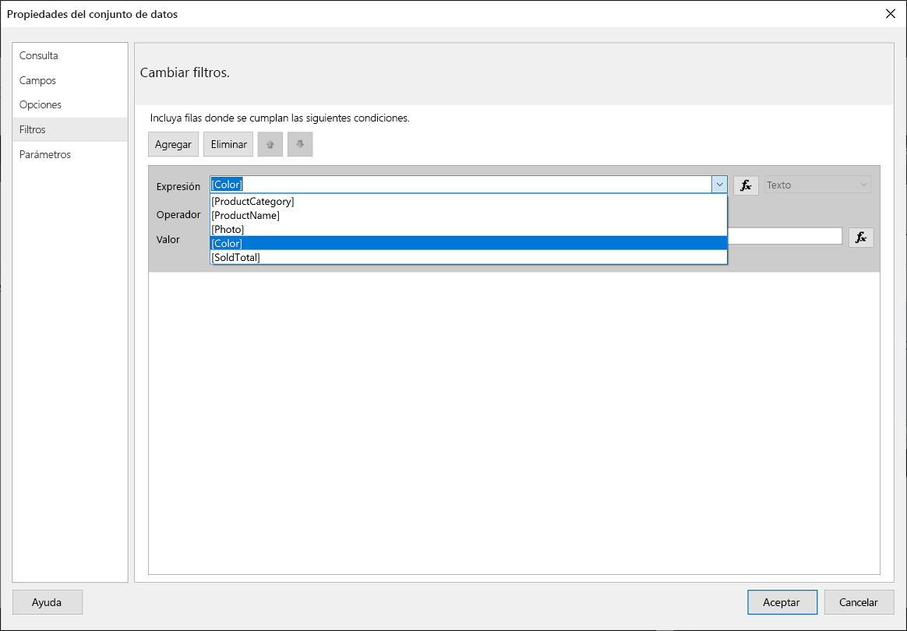
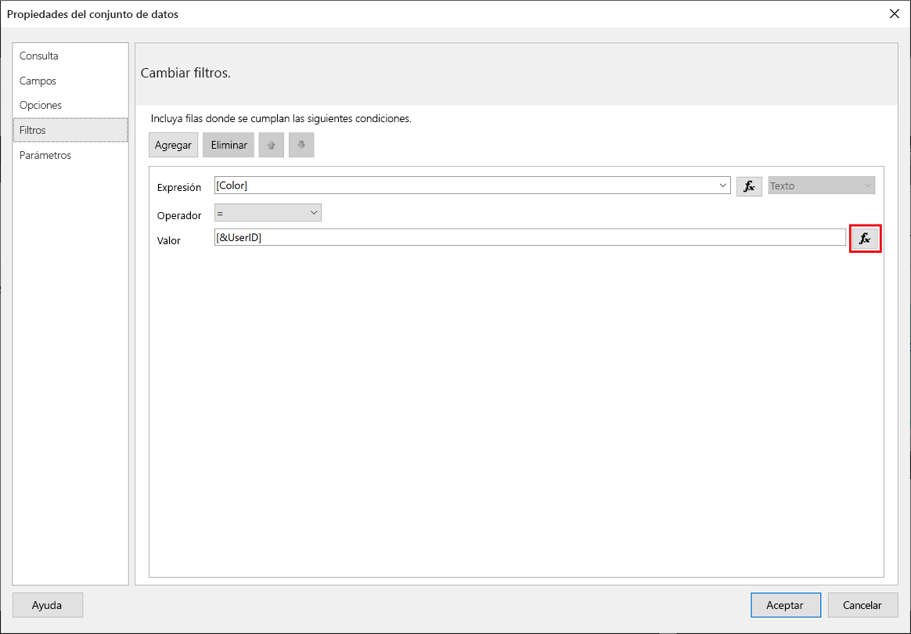
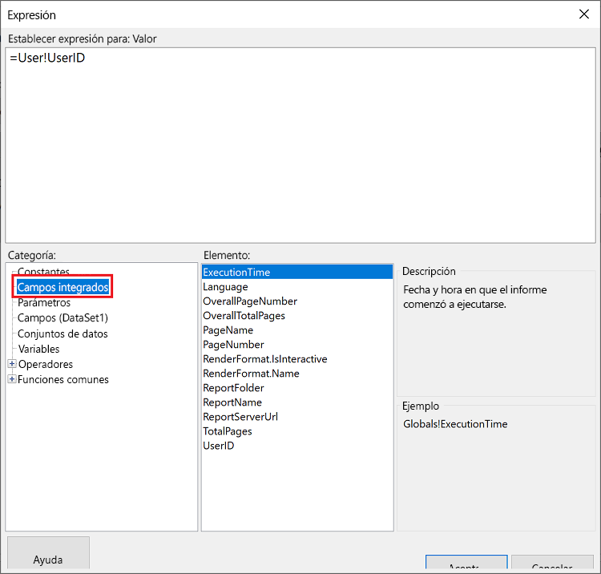
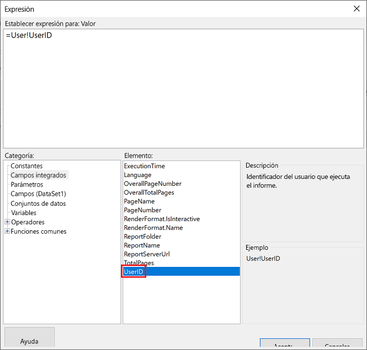
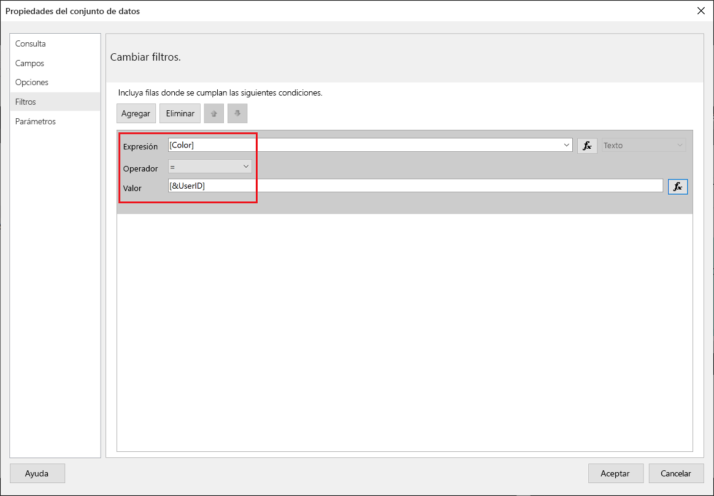
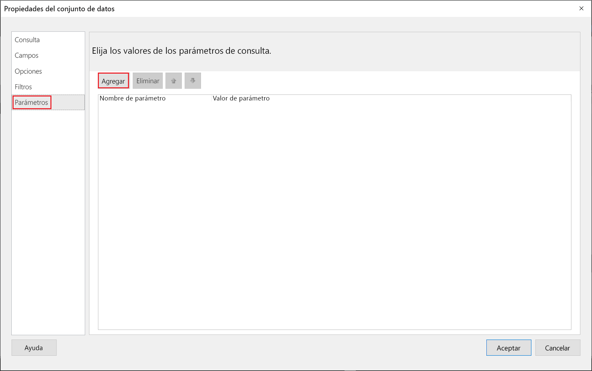
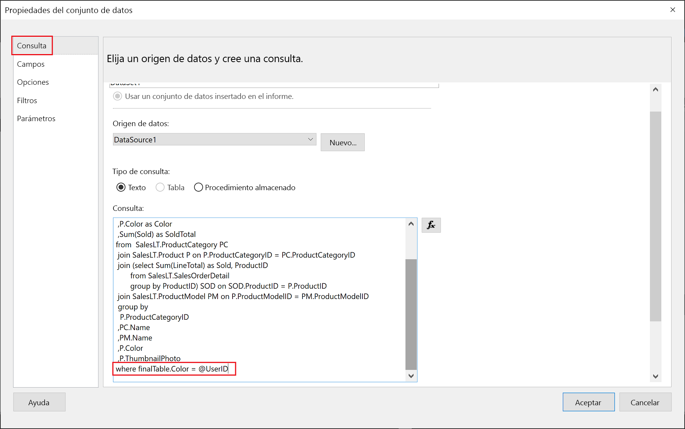

# <a name="implementing-row-level-security-in-embedded-paginated-reports-preview"></a>Implementación de la seguridad de nivel de fila en los informes paginados insertados (versión preliminar)

Al insertar un informe paginado, puede controlar los datos que se muestran. Esto permite personalizar la información mostrada a cada usuario. Por ejemplo, si tiene un informe paginado de Power BI que incluye los resultados de las ventas globales, puede insertarlo de modo que solo estén disponibles los resultados de las ventas de una región determinada.

Esta característica proporciona una manera segura de mostrar un subconjunto de los datos, de forma que no se ponga en peligro el resto de los datos. Es similar a la característica [Seguridad de nivel de fila (RLS)](embedded-row-level-security.md), que proporciona una forma segura de mostrar los datos en los informes (que no son paginados), paneles, iconos y conjuntos de datos de Power BI.  

> [!Note]
> Esta característica funciona con la inserción de informes paginados para los clientes.

## <a name="configuring-a-parameter-to-filter-the-dataset"></a>Configuración de un parámetro para filtrar el conjunto de datos

Al aplicar la seguridad de nivel de fila a un informe paginado de Power BI, debe asignar un [parámetro](../report-builder-parameters.md) al atributo **UserID**. Este parámetro limitará los datos extraídos del conjunto de datos antes de que el informe sea insertado.

Después de asignar el parámetro a **UserID**, utilice la API [Reports GenerateTokenForCreateInGroup](https://docs.microsoft.com/rest/api/power-bi/embedtoken/reports_generatetokenforcreateingroup) para obtener el token de inserción.

## <a name="use-uderid-as-a-filter-at-report-or-query-level"></a>Uso de UserID como filtro en el nivel de informe o consulta

Puede utilizar **UserId** como un *filtro* o en una *consulta* al origen de datos en el [Generador de informes paginados de Power BI](../report-builder-power-bi.md).

### <a name="using-the-filter"></a>Uso del filtro

1. En la ventana **Propiedades del conjunto de datos**, en el panel izquierdo, seleccione **Filtro**.

    

2. En el menú desplegable **Expresión**, seleccione el parámetro que desea usar para filtrar los datos.

     

3. Haga clic en el botón de la función **Valor**. 

    

4. En la ventana **Expresión**, en la lista **Categoría**, seleccione **Campos integrados**.

    

5. En la lista **Elemento**, seleccione **UserID** y haga clic en **Aceptar**.

    

6. En la ventana **Propiedades del conjunto de datos**, compruebe que la expresión es *el parámetro seleccionado = UserID* y haga clic en **Aceptar**.

    

### <a name="using-a-query"></a>Uso de una consulta

1. En la ventana **Propiedades del conjunto de datos**, en el panel izquierdo, seleccione **Parámetros** y haga clic en **Agregar**.

    

2. En **Nombre del parámetro**, escriba **@UserID** y en **Valor del parámetro**, agregue **[&UserID]** .

     

3. En el panel izquierdo, seleccione **Consulta**, en la Consulta agregue el parámetro **UserID** como parte de la consulta y haga clic en **Aceptar**.
    > [!NOTE]
    > En la siguiente captura de pantalla, el parámetro de color se usa como ejemplo (whereFinalTable.Color = @UserID). Si es necesario, es posible crear una consulta más compleja.

    

## <a name="passing-the-configured-parameter-using-the-embed-token"></a>Paso del parámetro configurado mediante el token de inserción

Al insertar un informe paginado para sus clientes, se usa la API [Reports GenerateTokenForCreateInGroup](https://docs.microsoft.com/rest/api/power-bi/embedtoken/reports_generatetokenforcreateingroup) para obtener el token de inserción. Este token también se puede usar para filtrar algunos de los datos que se extraen del informe paginado.

Para exponer solo algunos de los datos, asigne el campo `username` con la información que desea mostrar. Por ejemplo, en un informe paginado que tenga un parámetro de color, si escribe *verde* en el campo `username`, el token de inserción restringirá los datos insertados para mostrar solo los datos que tienen el valor *verde* en la columna color.

```JSON
{
    "accessLevel": "View",
    "reportId": "cfafbeb1-8037-4d0c-896e-a46fb27ff229",
    "identities": [
            {
                    // Replace the 'username' with a paginated report parameter
                    "username":     "...",
                    "reports: [
                        "cfafbeb1-8037-4d0c-896e-a46fb27ff229"
                    ]
            }
    ]
}
```
