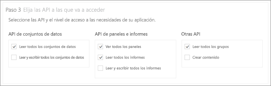
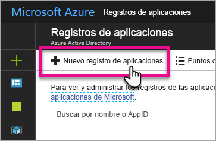
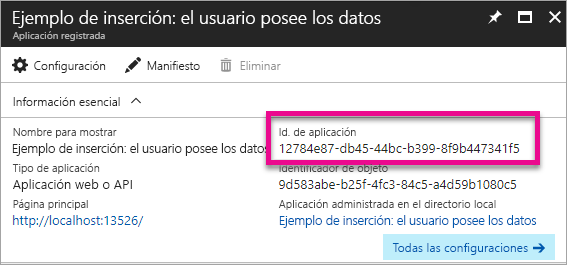
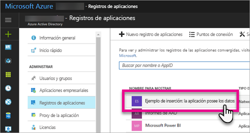
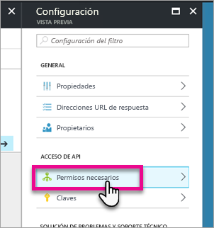
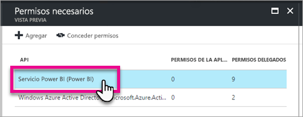
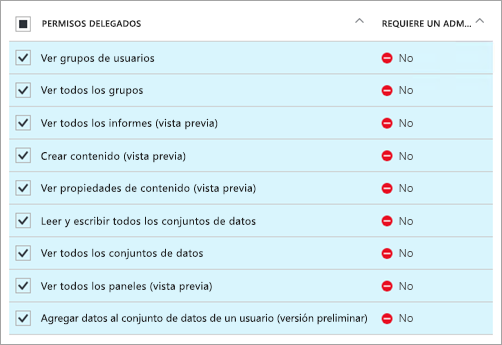
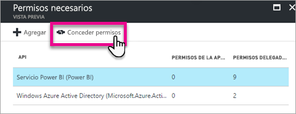

# <a name="register-an-azure-ad-app-to-embed-power-bi-content"></a>Registro de una aplicación de Azure AD para insertar contenido de Power BI
Aprenda a registrar una aplicación en Azure Active Directory (Azure AD) para su uso con la inserción de contenido de Power BI.

Deberá registrar la aplicación con Azure AD para permitir que la aplicación acceda a la API de REST de Power BI. Esto le permite establecer una identidad para la aplicación y especificar los permisos para los recursos de REST de Power BI.

> [!IMPORTANT]
> Antes de registrar una aplicación de Power BI, necesita un [inquilino de Azure Active Directory y un usuario de la organización](create-an-azure-active-directory-tenant.md). Si aún no se ha registrado en Power BI con un usuario del inquilino, el registro de la aplicación no se efectuará correctamente.
> 
> 

Hay dos formas de registrar la aplicación. La primera es con la [herramienta de registro de aplicaciones de Power BI](https://dev.powerbi.com/apps/) o puede hacerlo también directamente en Azure Portal. La herramienta de registro de aplicaciones de Power BI es la opción más fácil, ya que hay pocos campos para rellenar. Use Azure Portal si quiere realizar cambios en la aplicación.

## <a name="register-with-the-power-bi-app-registration-tool"></a>Registro con la herramienta de registro de aplicaciones de Power BI
Debe registrar la aplicación en **Azure Active Directory** para establecer una identidad para la aplicación y especificar permisos para los recursos de REST de Power BI. Al registrar una aplicación, como una aplicación de consola o un sitio web, recibirá un identificador que la aplicación usará para identificarlos ante los usuarios a los que está solicitando permisos.

Aquí se muestra cómo registrar la aplicación con la herramienta de registro de aplicaciones de Power BI:

1. Vaya a [www.powerbi.com/apps](https://dev.powerbi.com/apps).
2. Seleccione **Iniciar sesión con su cuenta existente**.
3. Proporcione un **nombre de la aplicación**.
4. La selección del tipo de aplicación depende del tipo de aplicación que esté usando.
   
   * Use **Aplicación nativa** para las aplicaciones que se ejecutan en dispositivos cliente. Debe seleccionar **Aplicación nativa** si va a insertar contenido para los clientes, independientemente de cual sea la aplicación real (incluso para las aplicaciones web).
   * Use **Aplicación web de servidor** para las aplicaciones web o las API web.

5. Escriba un valor para **URL de redireccionamiento** y **URL de página principal**. La **dirección URL de redireccionamiento** funciona con cualquier dirección URL válida.
   
    La opción **URL de página principal** solo está disponible si elige **Server-side Web app** (Aplicación web de servidor) como tipo de aplicación.
   
    Para los ejemplos de *inserción para los clientes* e *integrate-dashboard-web-app*, la URL de redireccionamiento es `http://localhost:13526/redirect`. Para el ejemplo de informe y de icono, la URL de redireccionamiento es `http://localhost:13526/`.
6. Elija las API para la aplicación que tiene acceso. Para más información sobre los permisos de acceso a Power BI, consulte [Permisos de Power BI](power-bi-permissions.md).
   
    
7. Seleccione **Registrar aplicación**.
   
    Luego se le proporcionará un **Id. de cliente** y, si selecciona **Server-side Web app** (Aplicación web de servidor), recibirá un **secreto de cliente**. El **Id. de cliente** se puede recuperar de Azure Portal más tarde si es necesario. Si pierde el **secreto de cliente**, deberá crear uno nuevo en Azure Portal.

8. Debe ir a Azure para seleccionar **Conceder permisos**.
> [!Note]
    > Debe ser administrador global en el inquilino de Azure para completar este proceso.
>

* Vaya a Azure.
* Busque y seleccione **Registros de aplicaciones**.
* Seleccione su aplicación.
* Seleccione **Configuración**.
* Seleccione **Permisos necesarios**.
* Seleccione **Power BI Service** para comprobar los permisos que ha seleccionado en el sitio Registros de aplicaciones.
* Seleccione **Conceder permisos**.

Ahora ya puede utilizar la aplicación registrada como parte de su aplicación personalizada para interactuar con el servicio Power BI.

> [!IMPORTANT]
> Si va a insertar contenido para los clientes, debe configurar permisos adicionales en Azure Portal. Para más información, consulte [Aplicar permisos a la aplicación](#apply-permissions-to-your-application).
> 

## <a name="register-with-the-azure-portal"></a>Registro con Azure Portal
La otra opción para registrar la aplicación consiste en hacerlo directamente en Azure Portal. Para registrar la aplicación, siga estos pasos.

1. Acepte los [Términos de la API de Microsoft Power BI](https://powerbi.microsoft.com/api-terms).
2. Inicie sesión en [Azure Portal](https://portal.azure.com).
3. Elija al inquilino de Azure AD mediante la selección de la cuenta en la esquina superior derecha de la página.
4. En el panel de navegación izquierdo, elija **Mas servicios**, seleccione **Registros de aplicaciones** en **Seguridad e identidad**, y seleccione **Nuevo registro de aplicaciones**.
   
    
5. Siga las indicaciones y cree una nueva aplicación.
   
   * Para las aplicaciones web, indique la dirección URL de inicio de sesión, que es la dirección URL base de la aplicación, en la que los usuarios pueden iniciar sesión, como, por ejemplo, http://localhost:13526.
   * Para aplicaciones nativas, proporcione un URI de redireccionamiento que usará Azure AD para devolver las respuestas de token. Escriba un valor que sea específico para la aplicación como, por ejemplo, http://myapplication/redirect.

Para más información sobre cómo registrar aplicaciones en Azure Active Directory, consulte [Integración de aplicaciones con Azure Active Directory](https://docs.microsoft.com/azure/active-directory/develop/active-directory-integrating-applications)

## <a name="how-to-get-the-client-id"></a>Cómo obtener el identificador de cliente
Al registrar una aplicación, recibirá un **identificador de cliente**.  El **Id. de cliente** solicita permisos a los usuarios en la aplicación para que puedan identificarse.

A continuación se indica cómo obtener un identificador de cliente:

1. Inicie sesión en [Azure Portal](https://portal.azure.com).
2. Elija al inquilino de Azure AD mediante la selección de la cuenta en la esquina superior derecha de la página.
3. En el panel de navegación izquierdo, elija **Mas servicios** y seleccione **Registros de aplicaciones**.
4. Seleccione la aplicación de la que desea recuperar el identificador de cliente.
5. Verá que el **Id. de aplicación** aparece como un GUID. Este es el identificador de cliente para la aplicación.
   
    

## <a name="apply-permissions-to-your-application-within-azure-ad"></a>Aplicar permisos a la aplicación en Azure AD
> [!IMPORTANT]
> Esta sección solo está destinada a las aplicaciones que **insertan contenido para la organización**.
> 

Debe habilitar permisos adicionales en la aplicación, además de lo que se proporciona en la página de registro de la aplicación. Puede hacerlo por medio del portal de Azure AD o mediante programación.

Tiene que iniciar sesión con la cuenta *maestra*, que se usó para la inserción, o con una cuenta de administrador global.

### <a name="using-the-azure-ad-portal"></a>Usar el portal de Azure AD
1. Vaya a [Registros de aplicaciones](https://portal.azure.com/#blade/Microsoft_AAD_IAM/ApplicationsListBlade) en Azure Portal y seleccione la aplicación que va a usar para insertar.
   
    
2. Seleccione **Permisos necesarios** en **Acceso de API**.
   
    

3. En **Permisos necesarios**, seleccione **Servicio Power BI (Power BI)**.
   
    
   
   > [!NOTE]
   > Si creó la aplicación directamente en el portal de Azure AD, la opción **Servicio Power BI (Power BI)** puede no aparecer. Si no está, seleccione **+ Agregar** y luego **1 Seleccionar una API**. Seleccione **Servicio Power BI** en la lista de API y luego **Seleccionar**.  Si **Servicio Power BI (Power BI)** no está disponible en **+ Agregar**, suscríbase a Power BI con al menos un usuario.
   > 
   > 
4. Seleccione todos los permisos en **Permisos delegados**. Debe seleccionarlos uno por uno para guardar las selecciones. Seleccione **Guardar** cuando haya finalizado.
   
    
5. En **Permisos necesarios**, seleccione **Conceder permisos**.
   
    La acción **Conceder permisos** es necesaria para evitar que Azure AD le solicite consentimiento a la *cuenta maestra*. Si la cuenta que lleva a cabo esta acción es de un administrador global, concederá permisos a todos los usuarios dentro de su organización para esta aplicación. Si la cuenta que lleva a cabo esta acción es la *cuenta maestra* y no es un administrador global, concederá permisos solo a la *cuenta maestra* de esta aplicación.
   
    

### <a name="applying-permissions-programmatically"></a>Aplicar permisos mediante programación
1. Debe obtener las entidades de servicio (usuarios) existentes dentro de su inquilino. Para información sobre cómo hacerlo, consulte [Get servicePrincipal](https://developer.microsoft.com/en-us/graph/docs/api-reference/beta/api/serviceprincipal_get).
   
    Puede llamar a la API *Get servicePrincipal* sin {id} y obtendrá todas las entidades de servicio en el inquilino.
2. Busque una entidad de servicio con el identificador de cliente de aplicación como la propiedad **appId**.
3. Cree un plan de servicio si la aplicación carece de él.
   
    ```
    Post https://graph.microsoft.com/beta/servicePrincipals
    Authorization: Bearer ey..qw
    Content-Type: application/json
    {
    "accountEnabled" : true,
    "appId" : "{App_Client_ID}",
    "displayName" : "{App_DisplayName}"
    }
    ```
4. Conceder permisos de aplicación a la API de Power BI
   
   Si va a usar un inquilino actual y no le interesa conceder permisos en nombre de todos sus usuarios, puede concederlos a un usuario específico reemplazando el valor de **contentType** por **Principal**.

   El valor de **consentType** puede proporcionar **AllPrincipals** o **Principal**.

   * **AllPrincipals** solo lo puede usar un administrador de inquilinos para conceder permisos en nombre de todos los usuarios del inquilino.
   * **Principal** se usa para conceder permisos en nombre de un usuario específico. En este caso, se debe agregar una propiedad adicional al cuerpo de la solicitud (*principalId={User_ObjectId}*).
    
    La acción *Conceder permisos* es necesaria para la cuenta maestra para evitar que Azure AD le solicite consentimiento, lo cual no es posible al llevar a cabo un inicio de sesión no interactivo.
   
    ```
    Post https://graph.microsoft.com/beta/OAuth2PermissionGrants
    Authorization: Bearer ey..qw
    Content-Type: application/json
    { 
    "clientId":"{Service_Plan_ID}",
    "consentType":"AllPrincipals",
    "resourceId":"c78b2585-1df6-41de-95f7-dc5aeb7dc98e",
    "scope":"Dataset.ReadWrite.All Dashboard.Read.All Report.Read.All Group.Read Group.Read.All Content.Create Metadata.View_Any Dataset.Read.All Data.Alter_Any",
    "expiryTime":"2018-03-29T14:35:32.4943409+03:00",
    "startTime":"2017-03-29T14:35:32.4933413+03:00"
    }
    ```

5.  Conceder permisos de aplicación a Azure Active Directory (AAD)
   
    El valor de **consentType** puede proporcionar **AllPrincipals** o **Principal**.

    * **AllPrincipals** solo lo puede usar un administrador de inquilinos para conceder permisos en nombre de todos los usuarios del inquilino.
    * **Principal** se usa para conceder permisos en nombre de un usuario específico. En este caso, se debe agregar una propiedad adicional al cuerpo de la solicitud (*principalId={User_ObjectId}*).
    
    La acción *Conceder permisos* es necesaria para la cuenta maestra para evitar que Azure AD le solicite consentimiento, lo cual no es posible al llevar a cabo un inicio de sesión no interactivo.

 ```
    Post https://graph.microsoft.com/beta/OAuth2PermissionGrants
    Authorization: Bearer ey..qw
    Content-Type: application/json
    { 
    "clientId":"{Service_Plan_ID}",
    "consentType":"AllPrincipals",
    "resourceId":"61e57743-d5cf-41ba-bd1a-2b381390a3f1",
    "scope":"User.Read Directory.AccessAsUser.All",
    "expiryTime":"2018-03-29T14:35:32.4943409+03:00",
    "startTime":"2017-03-29T14:35:32.4933413+03:00"
    }
 ```

## <a name="next-steps"></a>Pasos siguientes
Ahora que ha registrado su aplicación en Azure AD, deberá autenticar los usuarios dentro de esta. Consulte [Autenticación de usuarios y obtención de un token de acceso de Azure AD para la aplicación de Power BI](get-azuread-access-token.md).

¿Tiene más preguntas? [Pruebe a preguntar a la comunidad de Power BI](http://community.powerbi.com/)