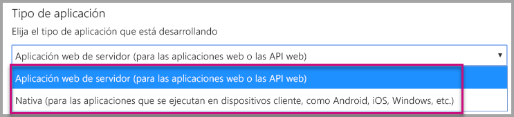
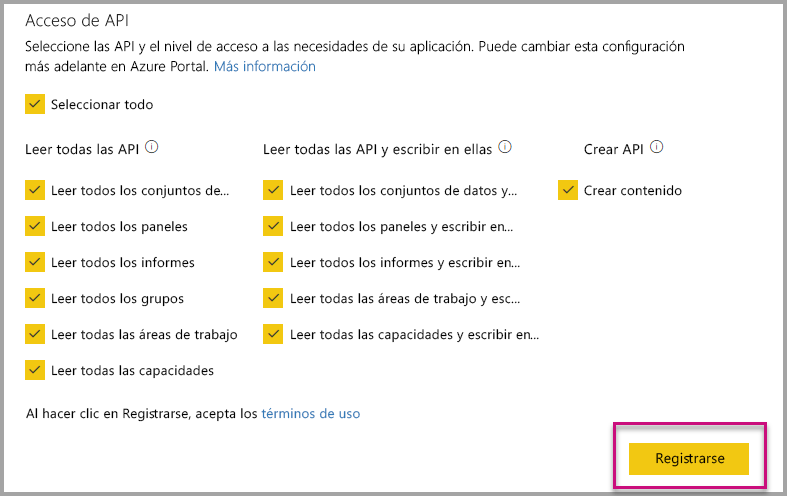
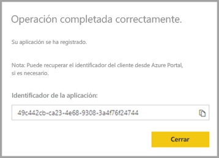
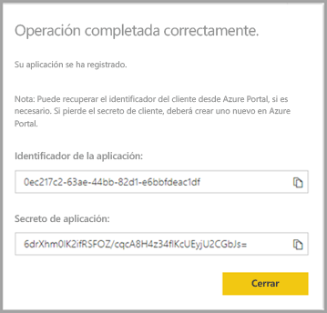

# <a name="register-an-azure-ad-application-to-use-with-power-bi"></a>Registro de una aplicación de Azure AD para usarla con Power BI

Aprenda a registrar una aplicación en Azure Active Directory (Azure AD) para su uso con la inserción de contenido de Power BI.

La aplicación se registra con Azure AD para permitir que acceda a las [API REST de Power BI](https://docs.microsoft.com/rest/api/power-bi/). Una vez que registre su aplicación, podrá establecer una identidad para esta y especificar los permisos para los recursos de REST de Power BI.

> [!IMPORTANT]
> Antes de registrar una aplicación de Power BI, necesita un [inquilino de Azure Active Directory y un usuario de la organización](create-an-azure-active-directory-tenant.md). Si aún no se ha registrado en Power BI con un usuario del inquilino, el registro de la aplicación no se efectuará correctamente.

Hay dos formas de registrar la aplicación. La primera es con la [herramienta de registro de aplicaciones de Power BI](https://dev.powerbi.com/apps/), aunque también puede hacerlo directamente en Azure Portal. La herramienta de registro de aplicaciones de Power BI es más fácil de usar, ya que hay pocos campos para rellenar. Use Azure Portal si quiere realizar cambios en la aplicación.

## <a name="register-with-the-power-bi-application-registration-tool"></a>Registro con la herramienta de registro de aplicaciones de Power BI

Registre la aplicación en **Azure Active Directory** para establecer una identidad para la aplicación y especificar permisos para los recursos de REST de Power BI. Al registrar una aplicación, como una aplicación de consola o un sitio web, recibirá un identificador, que la aplicación usa para su identificación ante los usuarios a los que solicite permisos.

Aquí se muestra cómo registrar la aplicación con la herramienta de registro de aplicaciones de Power BI:

1. Vaya a [www.powerbi.com/apps](https://dev.powerbi.com/apps).

2. Haga clic en **Iniciar sesión** con la cuenta existente y después en **Siguiente**.

3. Proporcione un **nombre de la aplicación**.

4. Proporcione un **tipo de aplicación**.

    Estas son las diferencias de por qué elegir **Nativa** frente a **Aplicaciones web del lado servidor** para un tipo de aplicación.

    Nativa:
    * Planea crear una aplicación [diseñada para los clientes](embed-sample-for-customers.md) con una cuenta de usuario maestra (una licencia de Power BI Pro que se usa para iniciar sesión en Power BI) para la autenticación.

    Aplicación web del lado servidor:
    * Planea crear una aplicación [diseñada para la organización](embed-sample-for-your-organization.md).
    * Planea crear una aplicación [diseñada para los clientes](embed-sample-for-customers.md) y usa la entidad de servicio para la autenticación.
    * Planear crear aplicaciones web o API web.

    

5. Si ha seleccionado **Aplicación web del lado servidor** para el tipo de aplicación, continúe con la introducción de un valor para **URL de página principal** y **URL de redireccionamiento**. La **URL de redireccionamiento** funciona con cualquier dirección URL válida y se debe corresponder con la aplicación que ha creado. Si ha seleccionado **Nativa**, vaya al paso 6.

6. Elija las API de Power BI que necesite la aplicación. Para más información sobre los permisos de acceso a Power BI, consulte [Permisos de Power BI](power-bi-permissions.md). Después, haga clic en **Registrar**.

    

    > [!Important]
    > Si habilita entidades de servicio para usarlas con Power BI, los permisos de Azure Active Directory ya no tendrán efecto. Los permisos se administrarán desde el portal de administración de Power BI.

7. Si elige **Nativa** para el tipo de aplicación, se le proporcionará un **identificador de aplicación**. Si selecciona **Aplicación web del lado servidor** para el tipo de aplicación, recibirá un **identificador de aplicación** y un **secreto de aplicación**.

    > [!Note]
    > El **Id. de aplicación** se puede recuperar de Azure Portal más tarde si es necesario. Si pierde el **secreto de aplicación**, tendrá que crear uno en Azure Portal.

| Nativa | Aplicación web del lado servidor |
|--------|-----------------------------|
|  |  |

Ahora ya puede usar la aplicación registrada como parte de la aplicación personalizada para interactuar con el servicio Power BI y la aplicación de Power BI Embedded.

## <a name="register-with-the-azure-portal"></a>Registro con Azure Portal

La otra opción para registrar la aplicación consiste en hacerlo directamente en Azure Portal. Para registrar la aplicación, siga estos pasos.

1. Acepte los [Términos de la API de Microsoft Power BI](https://powerbi.microsoft.com/api-terms).

2. Inicie sesión en [Azure Portal](https://portal.azure.com).

3. Elija al inquilino de Azure AD mediante la selección de la cuenta en la esquina superior derecha de la página.

4. En el panel de navegación izquierdo, vaya a **Todos los servicios**, seleccione **Registros de aplicaciones** y, luego, seleccione **Nuevo registro**.

5. Siga las indicaciones y cree una nueva aplicación.

   Para más información sobre cómo registrar aplicaciones en Azure Active Directory, consulte [Registro de una aplicación en Azure Active Directory](https://docs.microsoft.com/azure/active-directory/develop/quickstart-v2-register-an-app).

## <a name="how-to-get-the-application-id"></a>Cómo obtener el identificador de aplicación

Al registrar una aplicación, recibirá un [identificador de aplicación](embed-sample-for-customers.md#application-id).  El **identificador de aplicación** solicita permisos a los usuarios en la aplicación para que se puedan identificar.

## <a name="how-to-get-the-service-principal-object-id"></a>Cómo obtener el identificador de objeto de entidad de servicio

Cuando se usan las [API de Power BI](https://docs.microsoft.com/rest/api/power-bi/), asegúrese de definir las operaciones mediante el [identificador de objeto de entidad de servicio](embed-service-principal.md#how-to-get-the-service-principal-object-id) para hacer referencia a la entidad de servicio; por ejemplo, para aplicar una entidad de servicio como un administrador a un área de trabajo.

## <a name="apply-permissions-to-your-application-within-azure-ad"></a>Aplicar permisos a la aplicación en Azure AD

Habilite permisos adicionales en la aplicación, además de lo que se proporciona en la página de registro de la aplicación. Puede realizar esta tarea a través del portal de Azure AD o mediante programación.

Tiene que iniciar sesión con la cuenta *maestra*, que se usó para la inserción, o con una cuenta de administrador global.

### <a name="using-the-azure-ad-portal"></a>Usar el portal de Azure AD

1. Vaya a [Registros de aplicaciones](https://portal.azure.com/#blade/Microsoft_AAD_RegisteredApps/ApplicationsListBlade/quickStartType//sourceType/) en Azure Portal y seleccione la aplicación que va a usar para la inserción.

2. Seleccione **Permisos de API** en **Administrar**.

3. En **Permisos de API**, seleccione **Agregar un permiso** y, luego, **Servicio Power BI**.

    

4. Seleccione los permisos específicos que necesita en **Permisos delegados**. Selecciónelos uno por uno para guardar las selecciones. Seleccione **Guardar** cuando haya finalizado.

5. Seleccione **Otorgar consentimiento**.

    La acción **Otorgar consentimiento** necesita la *cuenta maestra* para evitar que Azure AD solicite consentimiento. Si la cuenta que lleva a cabo esta acción es de un administrador global, concederá permisos a todos los usuarios dentro de su organización para esta aplicación. Si la cuenta que realiza esta acción es la *cuenta maestra* y no es un administrador global, conceda permisos solo a la *cuenta maestra* de esta aplicación.

### <a name="applying-permissions-programmatically"></a>Aplicar permisos mediante programación

1. Debe obtener las entidades de servicio (usuarios) existentes dentro de su inquilino. Para información sobre cómo hacerlo, consulte [servicePrincipal](https://docs.microsoft.com/graph/api/resources/serviceprincipal?view=graph-rest-beta).

    Puede llamar a la API *Get servicePrincipal* sin {ID} y obtendrá todas las entidades de servicio en el inquilino.

2. Busque una entidad de servicio con el identificador de aplicación como la propiedad **appId**.

3. Cree un plan de servicio si la aplicación carece de él.

    ```json
    Post https://graph.microsoft.com/beta/servicePrincipals
    Authorization: Bearer ey..qw
    Content-Type: application/json
    {
    "accountEnabled" : true,
    "appId" : "{App_Client_ID}",
    "displayName" : "{App_DisplayName}"
    }
    ```

4. Conceder permisos de aplicación a la API de Power BI

   Si usa un inquilino existente y no le interesa conceder permisos en nombre de todos los usuarios del inquilino, puede concederlos a un usuario específico si reemplaza el valor de **contentType** por **Principal**.

   El valor de **consentType** puede proporcionar **AllPrincipals** o **Principal**.

   * **AllPrincipals** solo lo puede usar un administrador de inquilinos para conceder permisos en nombre de todos los usuarios del inquilino.
   * **Principal** se usa para conceder permisos en nombre de un usuario específico. En este caso, se debe agregar una propiedad adicional al cuerpo de la solicitud (*principalId={User_ObjectId}* ).

     Necesita *Conceder permisos* para la cuenta maestra con el fin de evitar que Azure AD le solicite consentimiento, lo que no es posible al realizar un inicio de sesión no interactivo.

     ```json
     Post https://graph.microsoft.com/beta/OAuth2PermissionGrants
     Authorization: Bearer ey..qw
     Content-Type: application/json
     {
     "clientId":"{Service_Plan_ID}",
     "consentType":"AllPrincipals",
     "resourceId":"c78a3685-1ce7-52cd-95f7-dc5aea8ec98e",
     "scope":"Dataset.ReadWrite.All Dashboard.Read.All Report.Read.All Group.Read Group.Read.All Content.Create Metadata.View_Any Dataset.Read.All Data.Alter_Any",
     "expiryTime":"2018-03-29T14:35:32.4943409+03:00",
     "startTime":"2017-03-29T14:35:32.4933413+03:00"
     }
     ```

    El valor **resourceId** *c78a3685-1ce7-52cd-95f7-dc5aea8ec98e* no es universal, sino que depende del inquilino. Este valor es el elemento objectId de la aplicación "Servicio Power BI" en el inquilino de Azure Active Directory (AAD).

    El usuario puede obtener este valor rápidamente en Azure Portal:
    1. https://portal.azure.com/#blade/Microsoft_AAD_IAM/StartboardApplicationsMenuBlade/AllApps

    2. Búsqueda de "Servicio Power BI" en el cuadro de búsqueda

5. Conceder permisos de aplicación a Azure Active Directory (AAD)

   El valor de **consentType** puede proporcionar **AllPrincipals** o **Principal**.

   * **AllPrincipals** solo lo puede usar un administrador de inquilinos para conceder permisos a todos los usuarios del inquilino.
   * **Principal** se usa para conceder permiso a un usuario específico. En este caso, se debe agregar una propiedad adicional al cuerpo de la solicitud (*principalId={User_ObjectId}* ).

   Necesita *Conceder permisos* para la cuenta maestra con el fin de evitar que Azure AD le solicite consentimiento, lo que no es posible al realizar un inicio de sesión no interactivo.

   ```json
   Post https://graph.microsoft.com/beta/OAuth2PermissionGrants
   Authorization: Bearer ey..qw
   Content-Type: application/json
   { 
   "clientId":"{Service_Plan_ID}",
   "consentType":"AllPrincipals",
   "resourceId":"61e57743-d5cf-41ba-bd1a-2b381390a3f1",
   "scope":"User.Read Directory.AccessAsUser.All",
   "expiryTime":"2018-03-29T14:35:32.4943409+03:00",
   "startTime":"2017-03-29T14:35:32.4933413+03:00"
   }
   ```

## <a name="next-steps"></a>Pasos siguientes

Ahora que ha registrado la aplicación en Azure AD, tendrá que autenticar a los usuarios dentro de esta. Consulte [Autenticación de usuarios y obtención de un token de acceso de Azure AD para la aplicación de Power BI](get-azuread-access-token.md).

¿Tiene más preguntas? [Pruebe a preguntar a la comunidad de Power BI](https://community.powerbi.com/)