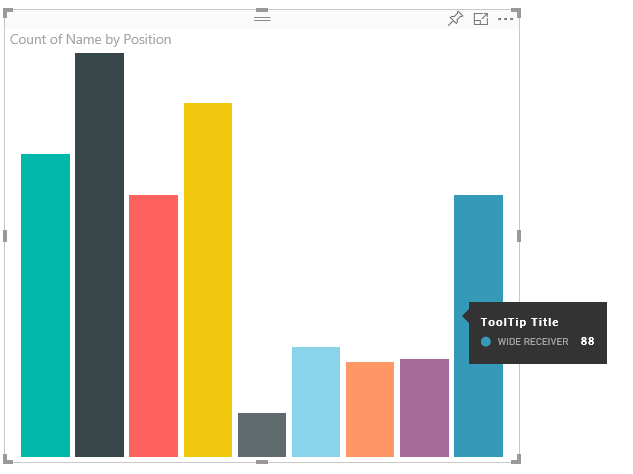
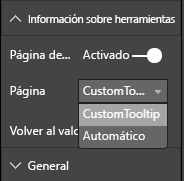

# <a name="tooltips-in-power-bi-visuals"></a>Información sobre herramientas en objetos visuales de Power BI

Ahora, los objetos visuales pueden aprovechar la compatibilidad con la información sobre herramientas de Power BI. Con la información en pantalla de Power BI se controlan las siguientes interacciones:

* Mostrar una información en pantalla.
* Ocultar una información en pantalla.
* Mover una información en pantalla.

La información sobre herramientas puede mostrar un elemento de texto con un título, un valor en un color determinado y opacidad en un conjunto especificado de coordenadas. Estos datos se proporcionan a la API y el host de Power BI los representa de la misma manera que representa la información sobre herramientas de los objetos visuales nativos.

En la siguiente imagen se muestra una información sobre herramientas en un gráfico de barras de ejemplo:



En la imagen de información sobre herramientas anterior se muestra una sola categoría de barra y su valor. Puede extender una sola información sobre herramientas para mostrar varios valores.

## <a name="manage-tooltips"></a>Administración de la información sobre herramientas

La interfaz mediante la que se administra la información sobre herramientas es "ITooltipService". Se usa para notificar al host que una información sobre herramientas debe mostrarse, quitarse o moverse.

```typescript
    interface ITooltipService {
        enabled(): boolean;
        show(options: TooltipShowOptions): void;
        move(options: TooltipMoveOptions): void;
        hide(options: TooltipHideOptions): void;
    }
```

El objeto visual tiene que escuchar los eventos del mouse dentro del objeto visual y llamar a los delegados `show()`, `move()` y `hide()` según sea necesario con el contenido adecuado rellenado en los objetos `Tooltip****Options`.
A su vez, `TooltipShowOptions` y `TooltipHideOptions` definirían lo que se va a mostrar y cómo comportarse en estos eventos.

Dado que llamar a estos métodos implica eventos de usuario tales como movimientos del mouse o eventos táctiles, es una buena idea crear clientes de escucha para estos eventos, lo que a su vez invocaría a los miembros de `TooltipService`.
En nuestro ejemplo se agrega en una clase denominada `TooltipServiceWrapper`.

### <a name="the-tooltipservicewrapper-class"></a>Clase TooltipServiceWrapper

La idea básica que subyace en esta clase es mantener la instancia de la clase `TooltipService`, escuchar los eventos del mouse D3 sobre elementos pertinentes y, luego, realizar las llamadas a `show()` y `hide()` cuando sea necesario.

La clase contiene y administra cualquier estado pertinente y la lógica de estos eventos, que están principalmente orientados a interactuar con el código D3 subyacente. La interactuación y conversión de D3 queda fuera del ámbito de este artículo.

Puede encontrar el código de ejemplo completo en el [repositorio del objeto visual SampleBarChart](https://github.com/Microsoft/PowerBI-visuals-sampleBarChart/commit/981b021612d7b333adffe9f723ab27783c76fb14).

### <a name="create-tooltipservicewrapper"></a>Creación de TooltipServiceWrapper

Ahora, el constructor de gráficos de barras tiene un miembro de `TooltipServiceWrapper`, del que se crean instancias en el constructor con la instancia de `tooltipService` de host.

```typescript
        private tooltipServiceWrapper: ITooltipServiceWrapper;

        this.tooltipServiceWrapper = createTooltipServiceWrapper(this.host.tooltipService, options.element);
```

La clase `TooltipServiceWrapper` contiene la instancia de `tooltipService`, también como elemento raíz D3 de los parámetros visuales y táctiles.

```typescript
    class TooltipServiceWrapper implements ITooltipServiceWrapper {
        private handleTouchTimeoutId: number;
        private visualHostTooltipService: ITooltipService;
        private rootElement: Element;
        private handleTouchDelay: number;

        constructor(tooltipService: ITooltipService, rootElement: Element, handleTouchDelay: number) {
            this.visualHostTooltipService = tooltipService;
            this.handleTouchDelay = handleTouchDelay;
            this.rootElement = rootElement;
        }
        .
        .
        .
    }
```

El único punto de entrada para que esta clase registre a los clientes de escucha de eventos es el método `addTooltip`.

### <a name="the-addtooltip-method"></a>Método addTooltip

```typescript
        public addTooltip<T>(
            selection: d3.Selection<Element>,
            getTooltipInfoDelegate: (args: TooltipEventArgs<T>) => VisualTooltipDataItem[],
            getDataPointIdentity: (args: TooltipEventArgs<T>) => ISelectionId,
            reloadTooltipDataOnMouseMove?: boolean): void {

            if (!selection || !this.visualHostTooltipService.enabled()) {
                return;
            }
        ...
        ...
        }
```

* **selection: d3.Selection<Element>** : elementos D3 en los que se controla la información sobre herramientas.

* **getTooltipInfoDelegate: (args: TooltipEventArgs<T>) => VisualTooltipDataItem[]** : delegado para rellenar el contenido de la información sobre herramientas (lo que se muestra) por contexto.

* **getDataPointIdentity: (args: TooltipEventArgs<T>) => ISelectionId**: delegado para recuperar el identificador del punto de datos (no se usa en este ejemplo). 

* **reloadTooltipDataOnMouseMove? boolean**: valor booleano que indica si se deben actualizar los datos de la información sobre herramientas durante un evento MouseMove (no se usa en este ejemplo).

Como puede ver, `addTooltip` se cierra sin realizar ninguna acción si la clase `tooltipService` está deshabilitada o no hay ninguna selección real.

### <a name="call-the-show-method-to-display-a-tooltip"></a>Llamada al método Show para mostrar una información sobre herramientas

El siguiente método `addTooltip` escucha el evento D3 `mouseover`, tal y como se muestra en el código siguiente:

```typescript
        ...
        ...
        selection.on("mouseover.tooltip", () => {
            // Ignore mouseover while handling touch events
            if (!this.canDisplayTooltip(d3.event))
                return;

            let tooltipEventArgs = this.makeTooltipEventArgs<T>(rootNode, true, false);
            if (!tooltipEventArgs)
                return;

            let tooltipInfo = getTooltipInfoDelegate(tooltipEventArgs);
            if (tooltipInfo == null)
                return;

            let selectionId = getDataPointIdentity(tooltipEventArgs);

            this.visualHostTooltipService.show({
                coordinates: tooltipEventArgs.coordinates,
                isTouchEvent: false,
                dataItems: tooltipInfo,
                identities: selectionId ? [selectionId] : [],
            });
        });
```

* **makeTooltipEventArgs**: Extrae el contexto de los elementos seleccionados de D3 en una clase tooltipEventArgs. También calcula las coordenadas.

* **getTooltipInfoDelegate**: luego, compila el contenido de la información sobre herramientas desde la clase tooltipEventArgs. Es una devolución de llamada a la clase BarChart, ya que es la lógica del objeto visual. Se trata del contenido de texto real que se va a mostrar en la información sobre herramientas.

* **getDataPointIdentity**: no se usa en este ejemplo.

* **this.visualHostTooltipService.show**: llamada para mostrar la información sobre herramientas.  

Se puede encontrar control adicional en el ejemplo de los eventos `mouseout` y `mousemove`.

Para más información, consulte el [repositorio del objeto visual SampleBarChart](https://github.com/Microsoft/PowerBI-visuals-sampleBarChart/commit/981b021612d7b333adffe9f723ab27783c76fb14).

### <a name="populate-the-tooltip-content-by-the-gettooltipdata-method"></a>Rellenado del contenido de la información sobre herramientas con el método getTooltipData

Se ha agregado la clase BarChart con un miembro `getTooltipData` que simplemente extrae los valores de `category`, `value` y `color` del punto de datos en un elemento VisualTooltipDataItem[].

```typescript
        private static getTooltipData(value: any): VisualTooltipDataItem[] {
            return [{
                displayName: value.category,
                value: value.value.toString(),
                color: value.color,
                header: 'ToolTip Title'
            }];
        }
```

En la implementación anterior, el miembro `header` es constante, pero puede usarlo para implementaciones más complejas que requieren valores dinámicos. Puede rellenar `VisualTooltipDataItem[]` con más de un elemento, lo que agrega varias líneas a la información sobre herramientas. Puede resultar útil en objetos visuales como los gráficos de barras apiladas donde la información sobre herramientas puede mostrar datos de más de un solo punto de datos.

### <a name="call-the-addtooltip-method"></a>Llamada al método addTooltip

El paso final es llamar al método `addTooltip` cuando los datos reales puedan cambiar. Esta llamada se realiza en el método `BarChart.update()`. Se realiza una llamada para supervisar la selección de todos los elementos "bar" y se pasa solo el elemento `BarChart.getTooltipData()`, tal y como se ha indicado anteriormente.

```typescript
        this.tooltipServiceWrapper.addTooltip(this.barContainer.selectAll('.bar'),
            (tooltipEvent: TooltipEventArgs<number>) => BarChart.getTooltipData(tooltipEvent.data),
            (tooltipEvent: TooltipEventArgs<number>) => null);
```

## <a name="add-report-page-tooltips"></a>Adición de información sobre herramientas de la página de informes

Para agregar compatibilidad con la información sobre herramientas de la página de informes, encontrará la mayoría de los cambios en el archivo *capabilities.json*.

Un esquema de ejemplo es el siguiente:

```json
{
    "tooltips": {
        "supportedTypes": {
            "default": true,
            "canvas": true
        },
        "roles": [
            "tooltips"
        ]
    }
}
```

Puede definir la información sobre herramientas de la página de informes en el panel **Formato**.



* `supportedTypes`: configuración de la información sobre herramientas que admite el objeto visual y que se refleja en el área de campos. 
   * `default`: especifica si se admite el enlace de la información sobre herramientas "automática" mediante el campo de datos. 
   * `canvas`: especifica si se admite la información sobre herramientas de la página de informes.

* `roles`: una vez definida, indica qué roles de datos se enlazan a la opción de información sobre herramientas seleccionada en el área de campos (opcional).

Para obtener más información, consulte las [normas de uso de la información sobre herramientas de la página de informes](https://powerbi.microsoft.com/blog/power-bi-desktop-march-2018-feature-summary/#tooltips).

Para mostrar la información sobre herramientas de la página de informes, después de que el host de Power BI llame a `ITooltipService.Show(options: TooltipShowOptions)` o `ITooltipService.Move(options: TooltipMoveOptions)`, consume el valor de selectionId (propiedad `identities` del argumento `options` anterior). Para que lo recupere la información sobre herramientas, SelectionId debe representar los datos seleccionados (categoría, serie, etc.) del elemento sobre el que ha mantenido el mouse.

En el siguiente código se muestra un ejemplo del envío de selectionId a llamadas de visualización de la información sobre herramientas:

```typescript
    this.tooltipServiceWrapper.addTooltip(this.barContainer.selectAll('.bar'),
        (tooltipEvent: TooltipEventArgs<number>) => BarChart.getTooltipData(tooltipEvent.data),
        (tooltipEvent: TooltipEventArgs<number>) => tooltipEvent.data.selectionID);
```
