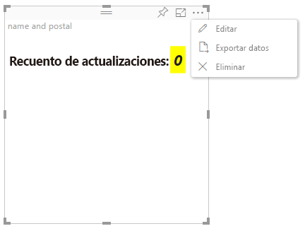

# Modo de edición avanzada

Los objetos visuales que requieren controles de interfaz de usuario avanzados pueden declarar la compatibilidad con el modo de edición avanzada.
Si se admite, en el modo de edición de informes, aparecerá un botón `Edit` en el menú del objeto visual.
Al hacer clic en el botón `Edit`, EditMode se establece en `Advanced`.
El objeto visual puede usar la marca EditMode para determinar si debe mostrar estos controles de interfaz de usuario.

De forma predeterminada, el objeto visual no admite el modo de edición avanzada.
Si se requiere otro comportamiento, se debe indicar de forma explícita en el archivo `capabilities.json` del objeto visual, mediante el establecimiento de la propiedad `advancedEditModeSupport`.

Los valores posibles son los siguientes:

- 0: NotSupported

- 1: SupportedNoAction

- 2: SupportedInFocus

## Acceso al modo de edición avanzada

El botón `Edit` será visible si:

 1: La propiedad `advancedEditModeSupport` de capabilities.json está establecida en `SupportedNoAction` o `SupportedInFocus`.

 2: El objeto visual se ve en el modo de edición de informes.

Si falta la propiedad `advancedEditModeSupport` en capabilities.json o está establecida en `NotSupported`, el botón "Editar" desaparecerá.

Cuando el usuario hace clic en `Edit`, el objeto visual obtendrá una llamada a update() con la propiedad EditMode establecida en `Advanced`.
Según el valor establecido en las funciones, se producirán las acciones siguientes:

* `SupportedNoAction`: el host no realiza más acciones.
* `SupportedInFocus`: el host muestra el objeto visual en modo de enfoque.

## Salida del modo de edición avanzada

El botón `Back to report` será visible si:

1: la propiedad `advancedEditModeSupport` de capabilities.json está establecida en `SupportedInFocus`.
