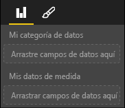

# <a name="capabilities-and-properties-of-power-bi-visuals"></a>Funcionalidades y propiedades de objetos visuales de Power BI 

Usará las funcionalidades para proporcionar información al host sobre el objeto visual. Todas las propiedades del modelo de funcionalidades son `optional`.

Los objetos raíz de las funcionalidades de un objeto visual son `dataRoles`, `dataViewMappings`, etc.

```json
{
    "dataRoles": [ ... ],
    "dataViewMappings": [ ... ],
    "objects":  { ... },
    "supportsHighlight": true|false,
    "advancedEditModeSupport": 0|1|2,
    "sorting": { ... }
}

```

## <a name="define-the-data-fields-that-your-visual-expects-dataroles"></a>Definición de los campos de datos que espera el objeto visual: dataRoles

Para definir los campos que se pueden enlazar con los datos, use `dataRoles`. `dataRoles` toma una matriz de objetos `DataViewRole` que define todas las propiedades necesarias.

### <a name="properties"></a>Propiedades

* **name**: nombre interno de este campo de datos (tiene que ser único).
* **kind**: tipo de campo:
    * `Grouping`: valores discretos que se usan para agrupar campos de medida.
    * `Measure`: valores de datos numéricos.
    * `GroupingOrMeasure`: valores que se pueden usar como una agrupación o una medida.
* **displayName**: nombre que se muestra al usuario en el panel **Propiedades**.
* **description**: descripción breve del campo (opcional).
* **requiredTypes**: tipo de datos necesario para este rol de datos. Los valores que no coinciden se establecen en null (opcional).
* **preferredTypes**: tipo de datos preferido para este rol de datos (opcional).

### <a name="valid-data-types-in-requiredtypes-and-preferredtypes"></a>Tipos de datos válidos en requiredTypes y preferredTypes

* **bool**: valor booleano.
* **integer**: valor entero (número entero).
* **numeric**: valor numérico.
* **text**: valor de texto.
* **geography**: datos geográficos.

### <a name="example"></a>Ejemplo

```json
"dataRoles": [
    {
        "displayName": "My Category Data",
        "name": "myCategory",
        "kind": "Grouping",
        "requiredTypes": [
            {
                "text": true
            },
            {
                "numeric": true
            },
            {
                "integer": true
            }
        ],
        "preferredTypes": [
            {
                "text": true
            }
        ]
    },
    {
        "displayName": "My Measure Data",
        "name": "myMeasure",
        "kind": "Measure",
        "requiredTypes": [
            {
                "integer": true
            },
            {
                "numeric": true
            }
        ],
        "preferredTypes": [
            {
                "integer": true
            }
        ]
    },
    {
        "displayNameKey": "Visual_Location",
        "name": "Locations",
        "kind": "Measure",
        "displayName": "Locations",
        "requiredTypes": [
            {
                "geography": {
                    "address": true
                }
            },
            {
                "geography": {
                    "city": true
                }
            },
            {
                "geography": {
                    "continent": true
                }
            },
            {
                "geography": {
                    "country": true
                }
            },
            {
                "geography": {
                    "county": true
                }
            },
            {
                "geography": {
                    "place": true
                }
            },
            {
                "geography": {
                    "postalCode": true
                }
            },
            {
                "geography": {
                    "region": true
                }
            },
            {
                "geography": {
                    "stateOrProvince": true
                }
            }
        ]
    }
]
```

Los roles de datos anteriores crearían los campos que se muestran en la siguiente imagen:



## <a name="define-how-you-want-the-data-mapped-dataviewmappings"></a>Definición de la forma en que se quieren asignar los datos: dataViewMappings

Una propiedad DataViewMappings describe cómo se relacionan los roles de datos entre sí y le permite especificar requisitos condicionales para estos.

La mayoría de los objetos visuales proporcionan una sola asignación, pero puede proporcionar varios elementos dataViewMappings. Cada asignación válida genera una vista de datos. 

```json
"dataViewMappings": [
    {
        "conditions": [ ... ],
        "categorical": { ... },
        "table": { ... },
        "single": { ... },
        "matrix": { ... }
    }
]
```

Para obtener más información, consulte [Información sobre las asignaciones de vistas de datos en objetos visuales de Power BI](dataview-mappings.md).

## <a name="define-property-pane-options-objects"></a>Definición de las opciones del panel de propiedades: objetos

Los objetos describen propiedades personalizables que están asociadas al objeto visual. Cada objeto puede tener varias propiedades y cada propiedad tiene un tipo asociado. Los tipos hacen referencia a lo que será la propiedad. 

```json
"objects": {
    "myCustomObject": {
        "displayName": "My Object Name",
        "properties": { ... }
    }
}
```

Para obtener más información, vea [Objetos y propiedades de objetos visuales de Power BI](objects-properties.md).

## <a name="handle-partial-highlighting-supportshighlight"></a>Control del resaltado parcial: supportsHighlight

De forma predeterminada, este valor se establece en `false`, lo que significa que los valores se filtran automáticamente cuando se selecciona algo en la página. Este filtrado automático, a su vez, actualiza el objeto visual para mostrar solo el valor seleccionado. Si quiere mostrar todos los datos, pero solo resaltar los elementos seleccionados, necesita establecer `supportsHighlight` en `true` en el archivo *capabilities.json*.

Para obtener más información, consulte [Resaltado de puntos de datos en objetos visuales de Power BI](highlight.md).

## <a name="handle-advanced-edit-mode-advancededitmodesupport"></a>Control del modo de edición avanzada: advancedEditModeSupport

Un objeto visual puede declarar su compatibilidad con el modo de edición avanzada. De forma predeterminada, un objeto visual no admite el modo de edición avanzada, a menos que se indique lo contrario en el archivo *capabilities.json*.

Para obtener más información, consulte [Modo de edición avanzada en objetos visuales de Power BI](advanced-edit-mode.md).

## <a name="data-sorting-options-for-visual-sorting"></a>Opciones de ordenación de datos para objetos visuales: ordenación

Un objeto visual puede definir su comportamiento de ordenación mediante sus funciones. De forma predeterminada, un objeto visual no permite que se modifique su criterio de ordenación, a menos que se indique lo contrario en el archivo *capabilities.json*.

Para obtener más información, consulte [Opciones de ordenación para objetos visuales de Power BI](sort-options.md).
