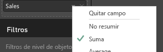
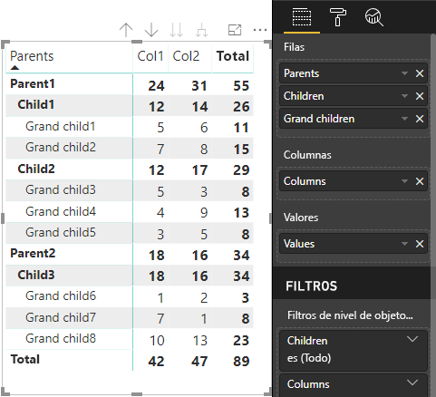

# <a name="understand-data-view-mapping-in-power-bi-visuals"></a>Información sobre las asignaciones de vistas de datos en objetos visuales de Power BI

En este artículo se explica la asignación de vista de datos, se describe cómo se relacionan los roles de datos entre sí y le permite especificar requisitos condicionales para estos. En el artículo también se describe cada tipo de `dataMappings`.

Cada asignación válida genera una vista de datos, pero actualmente solo se permite ejecutar una consulta por objeto visual. Normalmente, solo obtiene una vista de datos, pero puede proporcionar varias asignaciones de datos en determinadas condiciones, lo que permite lo siguiente:

```json
"dataViewMappings": [
    {
        "conditions": [ ... ],
        "categorical": { ... },
        "single": { ... },
        "table": { ... },
        "matrix": { ... }
    }
]
```

Power BI solo creará una asignación a una vista de datos si la asignación válida se rellena en `dataViewMappings`.

En otras palabras, `categorical` podría definirse en `dataViewMappings`, pero otras asignaciones, como `table` o `single`, podrían no estar definidas. Por ejemplo:

```json
"dataViewMappings": [
    {
        "categorical": { ... }
    }
]
```

Power BI genera una vista de datos con una sola asignación `categorical`, y `table` y otras asignaciones no están definidas:

```javascript
{
    "categorical": {
        "categories": [ ... ],
        "values": [ ... ]
    },
    "metadata": { ... }
}
```

## <a name="conditions"></a>Condiciones

En esta sección se describen las condiciones de una asignación de datos específica. Puede proporcionar varios conjuntos de condiciones y, si los datos coinciden con uno de los conjuntos de condiciones descritos, el objeto visual acepta los datos como válidos.

Actualmente, se puede especificar un valor mínimo y máximo para cada campo. El valor representa el número de campos que pueden estar enlazados a ese rol de datos. 

> [!NOTE]
> Si se omite un rol de datos en la condición, puede tener cualquier número de campos.

### <a name="example-1"></a>Ejemplo 1

Puede arrastrar varios campos a cada rol de datos. En este ejemplo, limitará la categoría a un campo de datos y la medida a dos campos de datos.

```json
"conditions": [
    { "category": { "max": 1 }, "y": { "max": 2 } },
]
```

### <a name="example-2"></a>Ejemplo 2

En este ejemplo, se necesita una de estas dos condiciones:
* Exactamente un campo de datos de categoría y exactamente dos medidas.
* Exactamente dos categorías y exactamente una medida.

```json
"conditions": [
    { "category": { "min": 1, "max": 1 }, "measure": { "min": 2, "max": 2 } },
    { "category": { "min": 2, "max": 2 }, "measure": { "min": 1, "max": 1 } }
]
```

## <a name="single-data-mapping"></a>Asignación de datos única

La asignación de datos única es la forma más simple de asignación de datos. Admite un solo campo de medida y proporciona el total. Si el campo es numérico, proporciona la suma. De lo contrario, proporciona un recuento de valores únicos.

Para usar la asignación de datos única, es necesario definir el nombre del rol de datos que quiera asignar. Esta asignación solo funciona con un único campo de medida. Si se asigna un segundo campo, no se genera ninguna vista de datos, por lo que también es recomendable incluir una condición que limite los datos a un solo campo.

> [!NOTE]
> Esta asignación de datos no se puede usar con ninguna otra asignación de datos. Su objetivo es reducir los datos a un único valor numérico.

### <a name="example-3"></a>Ejemplo 3

```json
{
    "dataRoles": [
        {
            "displayName": "Y",
            "name": "Y",
            "kind": "Measure"
        }
    ],
    "dataViewMappings": [
        {
            "conditions": [
                {
                    "Y": {
                        "max": 1
                    }
                }
            ],
            "single": {
                "role": "Y"
            }
        }
    ]
}
```

La vista de datos resultante sigue conteniendo los otros tipos (tabla, categórico, etc.), pero cada asignación solo contiene el valor único. El procedimiento recomendado es acceder solo al valor único.

```JSON
{
    "dataView": [
        {
            "metadata": null,
            "categorical": null,
            "matrix": null,
            "table": null,
            "tree": null,
            "single": {
                "value": 94163140.3560001
            }
        }
    ]
}
```

Ejemplo de código para procesar una asignación de vista de datos simple

```typescript
"use strict";
import powerbi from "powerbi-visuals-api";
import DataView = powerbi.DataView;
import DataViewSingle = powerbi.DataViewSingle;
// standart imports
// ...

export class Visual implements IVisual {
    private target: HTMLElement;
    private host: IVisualHost;
    private valueText: HTMLParagraphElement;

    constructor(options: VisualConstructorOptions) {
        // constructor body
        this.target = options.element;
        this.host = options.host;
        this.valueText = document.createElement("p");
        this.target.appendChild(this.valueText);
        // ...
    }

    public update(options: VisualUpdateOptions) {
        const dataView: DataView = options.dataViews[0];
        const singleDataView: DataViewSingle = dataView.single;

        if (!singleDataView ||
            !singleDataView.value ) {
            return
        }

        this.valueText.innerText = singleDataView.value.toString();
    }
}
```

Como resultado, el objeto visual muestra un valor único de Power BI:


## <a name="categorical-data-mapping"></a>Asignación de datos categóricos

La asignación de datos categóricos se usa para obtener una o dos agrupaciones de datos independientes.

### <a name="example-4"></a>Ejemplo 4

Esta es la definición del ejemplo anterior de los roles de datos:

```json
"dataRole":[
    {
        "displayName": "Category",
        "name": "category",
        "kind": "Grouping"
    },
    {
        "displayName": "Y Axis",
        "name": "measure",
        "kind": "Measure"
    }
]
```

Esta es la asignación:

```json
"dataViewMappings": {
    "categorical": {
        "categories": {
            "for": { "in": "category" }
        },
        "values": {
            "select": [
                { "bind": { "to": "measure" } }
            ]
        }
    }
}
```

Es un ejemplo sencillo. Dice lo siguiente: "Quiero asignar mi rol de datos `category` para que, en todos los campos que arrastre a `category`, sus datos se asignen a `categorical.categories`. Además, también quiero asignar mi rol de datos `measure` a `categorical.values`".

* **for...in**: quiero que se incluyan en la consulta de datos todos los elementos de este rol de datos.
* **bind...to**: produce el mismo resultado que *for...in*, pero espera que el rol de datos tenga una condición que lo restrinja a un único campo.

### <a name="example-5"></a>Ejemplo 5

En este ejemplo, se usan los dos primeros roles de datos del ejemplo anterior y, además, se definen `grouping` y `measure2`.

```json
"dataRole":[
    {
        "displayName": "Category",
        "name": "category",
        "kind": "Grouping"
    },
    {
        "displayName": "Y Axis",
        "name": "measure",
        "kind": "Measure"
    },
    {
        "displayName": "Grouping with",
        "name": "grouping",
        "kind": "Grouping"
    },
    {
        "displayName": "X Axis",
        "name": "measure2",
        "kind": "Grouping"
    }
]
```

Esta es la asignación:

```json
"dataViewMappings":{
    "categorical": {
        "categories": {
            "for": { "in": "category" }
        },
        "values": {
            "group": {
                "by": "grouping",
                "select":[
                    { "bind": { "to": "measure" } },
                    { "bind": { "to": "measure2" } }
                ]
            }
        }
    }
}
```

Aquí, la diferencia es la forma en que asignamos valores categóricos. Decimos lo siguiente: "Quiero asignar los roles de datos `measure` y `measure2` para que se agrupen según el rol de datos `grouping`".

### <a name="example-6"></a>Ejemplo 6

Estos son los roles de datos:

```json
"dataRoles": [
    {
        "displayName": "Categories",
        "name": "category",
        "kind": "Grouping"
    },
    {
        "displayName": "Measures",
        "name": "measure",
        "kind": "Measure"
    },
    {
        "displayName": "Series",
        "name": "series",
        "kind": "Measure"
    }
]
```

Esta es la asignación de vista de datos:

```json
"dataViewMappings": [
    {
        "categorical": {
            "categories": {
                "for": {
                    "in": "category"
                }
            },
            "values": {
                "group": {
                    "by": "series",
                    "select": [{
                            "for": {
                                "in": "measure"
                            }
                        }
                    ]
                }
            }
        }
    }
]
```

La vista de datos categóricos podrían visualizarse de esta forma:

| Categórica |  |  | | | |
|-----|-----|------|------|------|------|
| | Año | 2013 | 2014 | 2015 | 2016 |
| País | | |
| EE. UU. | | x | x | 650 | 350 |
| Canadá | | x | 630 | 490 | x |
| México | | 645 | x | x | x |
| Reino Unido | | x | x | 831 | x |

Power BI lo genera como la vista de datos categóricos. Es el conjunto de categorías.

```JSON
{
    "categorical": {
        "categories": [
            {
                "source": {...},
                "values": [
                    "Canada",
                    "USA",
                    "UK",
                    "Mexico"
                ],
                "identity": [...],
                "identityFields": [...],
            }
        ]
    }
}
```

Cada categoría también se asigna a un conjunto de valores. Cada uno de estos valores se agrupa por series, que se expresan como años.

Por ejemplo, cada matriz de `values` representa datos de cada año.
Además, cada matriz de `values` tiene 4 valores (para Canadá, EE. UU., Reino Unido y México, respectivamente):

```JSON
{
    "values": [
        // Values for 2013 year
        {
            "source": {...},
            "values": [
                null, // Value for `Canada` category
                null, // Value for `USA` category
                null, // Value for `UK` category
                645 // Value for `Mexico` category
            ],
            "identity": [...],
        },
        // Values for 2014 year
        {
            "source": {...},
            "values": [
                630, // Value for `Canada` category
                null, // Value for `USA` category
                null, // Value for `UK` category
                null // Value for `Mexico` category
            ],
            "identity": [...],
        },
        // Values for 2015 year
        {
            "source": {...},
            "values": [
                490, // Value for `Canada` category
                650, // Value for `USA` category
                831, // Value for `UK` category
                null // Value for `Mexico` category
            ],
            "identity": [...],
        },
        // Values for 2016 year
        {
            "source": {...},
            "values": [
                null, // Value for `Canada` category
                350, // Value for `USA` category
                null, // Value for `UK` category
                null // Value for `Mexico` category
            ],
            "identity": [...],
        }
    ]
}
```

A continuación se describe el ejemplo de código para procesar una asignación de vistas de datos categóricas. En el ejemplo se crea la estructura jerárquica `Country => Year => Value`

```typescript
"use strict";
import powerbi from "powerbi-visuals-api";
import DataView = powerbi.DataView;
import DataViewDataViewCategoricalSingle = powerbi.DataViewCategorical;
import DataViewValueColumnGroup = powerbi.DataViewValueColumnGroup;
import PrimitiveValue = powerbi.PrimitiveValue;
// standart imports
// ...

export class Visual implements IVisual {
    private target: HTMLElement;
    private host: IVisualHost;
    private categories: HTMLElement;

    constructor(options: VisualConstructorOptions) {
        // constructor body
        this.target = options.element;
        this.host = options.host;
        this.categories = document.createElement("pre");
        this.target.appendChild(this.categories);
        // ...
    }

    public update(options: VisualUpdateOptions) {
        const dataView: DataView = options.dataViews[0];
        const categoricalDataView: DataViewCategorical = dataView.categorical;

        if (!categoricalDataView ||
            !categoricalDataView.categories ||
            !categoricalDataView.categories[0] ||
            !categoricalDataView.values) {
            return;
        }

        // Categories have only one column in data buckets
        // If you want to support several columns of categories data bucket, you should iterate categoricalDataView.categories array.
        const categoryFieldIndex = 0;
        // Measure has only one column in data buckets.
        // If you want to support several columns on data bucket, you should iterate years.values array in map function
        const measureFieldIndex = 0;
        let categories: PrimitiveValue[] = categoricalDataView.categories[categoryFieldIndex].values;
        let values: DataViewValueColumnGroup[] = categoricalDataView.values.grouped();

        let data = {};
        // iterate categories/countries
        categories.map((category: PrimitiveValue, categoryIndex: number) => {
            data[category.toString()] = {};
            // iterate series/years
            values.map((years: DataViewValueColumnGroup) => {
                if (!data[category.toString()][years.name] && years.values[measureFieldIndex].values[categoryIndex]) {
                    data[category.toString()][years.name] = []
                }
                if (years.values[0].values[categoryIndex]) {
                    data[category.toString()][years.name].push(years.values[measureFieldIndex].values[categoryIndex]);
                }
            });
        });

        this.categories.innerText = JSON.stringify(data, null, 6);
        console.log(data);
    }
}
```

El resultado del objeto visual es el siguiente:


## <a name="table-data-mapping"></a>Asignación de datos de tabla

La vista de datos de tabla es una asignación de datos sencilla. Básicamente, es una lista de puntos de datos donde se pueden agregar puntos de datos numéricos.

### <a name="example-7"></a>Ejemplo 7

Con las funciones especificadas:

```json
"dataRoles": [
    {
        "displayName": "Column",
        "name": "column",
        "kind": "Measure"
    },
    {
        "displayName": "Value",
        "name": "value",
        "kind": "Measure"
    }
]
```

```json
"dataViewMappings": [
    {
        "table": {
            "rows": {
                "select": [
                    {
                        "for": {
                            "in": "column"
                        }
                    },
                    {
                        "for": {
                            "in": "value"
                        }
                    }
                ]
            }
        }
    }
]
```

Puede visualizar la vista de datos de tabla como se muestra a continuación:  

Ejemplo de datos:

| País| Año | Ventas |
|-----|-----|------|
| EE. UU. | 2016 | 100 |
| EE. UU. | 2015 | 50 |
| Canadá | 2015 | 200 |
| Canadá | 2015 | 50 |
| México | 2013 | 300 |
| Reino Unido | 2014 | 150 |
| EE. UU. | 2015 | 75 |

Enlace de datos:


Power BI muestra los datos como la vista de datos de tabla. No debe asumir que los datos están ordenados.

```JSON
{
    "table" : {
        "columns": [...],
        "rows": [
            [
                "Canada",
                2014,
                630
            ],
            [
                "Canada",
                2015,
                490
            ],
            [
                "Mexico",
                2013,
                645
            ],
            [
                "UK",
                2014,
                831
            ],
            [
                "USA",
                2015,
                650
            ],
            [
                "USA",
                2016,
                350
            ]
        ]
    }
}
```

Puede agregar los datos si selecciona el campo que quiera y después selecciona Suma.  



Ejemplo de código para procesar una asignación de vista de datos de tabla.

```typescript
"use strict";
import "./../style/visual.less";
import powerbi from "powerbi-visuals-api";
// ...
import DataViewMetadataColumn = powerbi.DataViewMetadataColumn;
import DataViewTable = powerbi.DataViewTable;
import DataViewTableRow = powerbi.DataViewTableRow;
import PrimitiveValue = powerbi.PrimitiveValue;
// other imports
// ...

export class Visual implements IVisual {
    private target: HTMLElement;
    private host: IVisualHost;
    private table: HTMLParagraphElement;

    constructor(options: VisualConstructorOptions) {
        // constructor body
        this.target = options.element;
        this.host = options.host;
        this.table = document.createElement("table");
        this.target.appendChild(this.table);
        // ...
    }

    public update(options: VisualUpdateOptions) {
        const dataView: DataView = options.dataViews[0];
        const tableDataView: DataViewTable = dataView.table;

        if (!tableDataView) {
            return
        }
        while(this.table.firstChild) {
            this.table.removeChild(this.table.firstChild);
        }

        //draw header
        const tableHeader = document.createElement("th");
        tableDataView.columns.forEach((column: DataViewMetadataColumn) => {
            const tableHeaderColumn = document.createElement("td");
            tableHeaderColumn.innerText = column.displayName
            tableHeader.appendChild(tableHeaderColumn);
        });
        this.table.appendChild(tableHeader);

        //draw rows
        tableDataView.rows.forEach((row: DataViewTableRow) => {
            const tableRow = document.createElement("tr");
            row.forEach((columnValue: PrimitiveValue) => {
                const cell = document.createElement("td");
                cell.innerText = columnValue.toString();
                tableRow.appendChild(cell);
            })
            this.table.appendChild(tableRow);
        });
    }
}
```

El archivo de estilos de objetos visuales `style/visual.less` contiene el diseño de la tabla:

```less
table {
    display: flex;
    flex-direction: column;
}

tr, th {
    display: flex;
    flex: 1;
}

td {
    flex: 1;
    border: 1px solid black;
}
```


## <a name="matrix-data-mapping"></a>Asignación de datos de matriz

La asignación de datos de matriz es similar a la asignación de datos de tabla, pero las filas se presentan jerárquicamente. Cualquiera de los valores de los roles de datos se puede usar como un valor de encabezado de columna.

```json
{
    "dataRoles": [
        {
            "name": "Category",
            "displayName": "Category",
            "displayNameKey": "Visual_Category",
            "kind": "Grouping"
        },
        {
            "name": "Column",
            "displayName": "Column",
            "displayNameKey": "Visual_Column",
            "kind": "Grouping"
        },
        {
            "name": "Measure",
            "displayName": "Measure",
            "displayNameKey": "Visual_Values",
            "kind": "Measure"
        }
    ],
    "dataViewMappings": [
        {
            "matrix": {
                "rows": {
                    "for": {
                        "in": "Category"
                    }
                },
                "columns": {
                    "for": {
                        "in": "Column"
                    }
                },
                "values": {
                    "select": [
                        {
                            "for": {
                                "in": "Measure"
                            }
                        }
                    ]
                }
            }
        }
    ]
}
```

Power BI crea una estructura de datos jerárquica. La raíz de la jerarquía de árbol incluye los datos de la columna **Elementos principales** del rol de datos `Category`, con elementos secundarios de la columna **Elementos secundarios** de la tabla de roles de datos.

Conjunto de datos:

| Elementos principales | Elementos secundarios | Elementos descendientes del secundario | Columnas | Valores |
|-----|-----|------|-------|-------|
| Principal1 | Secundario1 | Subelemento secundario1 | Col1 | 5 |
| Principal1 | Secundario1 | Subelemento secundario1 | Col2 | 6 |
| Principal1 | Secundario1 | Subelemento secundario2 | Col1 | 7 |
| Principal1 | Secundario1 | Subelemento secundario2 | Col2 | 8 |
| Principal1 | Secundario2 | Subelemento secundario3 | Col1 | 5 |
| Principal1 | Secundario2 | Subelemento secundario3 | Col2 | 3 |
| Principal1 | Secundario2 | Subelemento secundario4 | Col1 | 4 |
| Principal1 | Secundario2 | Subelemento secundario4 | Col2 | 9 |
| Principal1 | Secundario2 | Subelemento secundario5 | Col1 | 3 |
| Principal1 | Secundario2 | Subelemento secundario5 | Col2 | 5 |
| Principal2 | Secundario3 | Subelemento secundario6 | Col1 | 1 |
| Principal2 | Secundario3 | Subelemento secundario6 | Col2 | 2 |
| Principal2 | Secundario3 | Subelemento secundario7 | Col1 | 7 |
| Principal2 | Secundario3 | Subelemento secundario7 | Col2 | 1 |
| Principal2 | Secundario3 | Subelemento secundario8 | Col1 | 10 |
| Principal2 | Secundario3 | Subelemento secundario8 | Col2 | 13 |

El objeto visual de la matriz principal de Power BI representa los datos como una tabla.



El objeto visual obtiene su estructura de datos tal y como se describe en el código siguiente (aquí solo se muestran las dos primeras filas de la tabla):

```json
{
    "metadata": {...},
    "matrix": {
        "rows": {
            "levels": [...],
            "root": {
                "childIdentityFields": [...],
                "children": [
                    {
                        "level": 0,
                        "levelValues": [...],
                        "value": "Parent1",
                        "identity": {...},
                        "childIdentityFields": [...],
                        "children": [
                            {
                                "level": 1,
                                "levelValues": [...],
                                "value": "Child1",
                                "identity": {...},
                                "childIdentityFields": [...],
                                "children": [
                                    {
                                        "level": 2,
                                        "levelValues": [...],
                                        "value": "Grand child1",
                                        "identity": {...},
                                        "values": {
                                            "0": {
                                                "value": 5 // value for Col1
                                            },
                                            "1": {
                                                "value": 6 // value for Col2
                                            }
                                        }
                                    },
                                    ...
                                ]
                            },
                            ...
                        ]
                    },
                    ...
                ]
            }
        },
        "columns": {
            "levels": [...],
            "root": {
                "childIdentityFields": [...],
                "children": [
                    {
                        "level": 0,
                        "levelValues": [...],
                        "value": "Col1",
                        "identity": {...}
                    },
                    {
                        "level": 0,
                        "levelValues": [...],
                        "value": "Col2",
                        "identity": {...}
                    },
                    ...
                ]
            }
        },
        "valueSources": [...]
    }
}
```

## <a name="data-reduction-algorithm"></a>Algoritmo de reducción de datos

Para controlar la cantidad de datos que se van a recibir en la vista de datos, puede aplicar un algoritmo de reducción de datos.

De manera predeterminada, todos los objetos visuales de Power BI tienen aplicado el algoritmo de reducción de datos principal con el valor de *count* establecido en 1000 puntos de datos. Esto equivale a establecer las siguientes propiedades en el archivo *capabilities.json*:

```json
"dataReductionAlgorithm": {
    "top": {
        "count": 1000
    }
}
```

Puede modificar el valor de *count* por cualquier valor entero hasta 30 000. Los objetos visuales de Power BI basados en R admiten hasta 150 000 filas.

## <a name="data-reduction-algorithm-types"></a>Tipos de algoritmos de reducción de datos

Hay cuatro tipos de valores del algoritmo de reducción de datos:

* `top`: si quiere limitar los datos a los valores obtenidos de la parte superior del conjunto de datos. Los primeros valores superiores de *count* se obtendrán del conjunto de datos.
* `bottom`: si quiere limitar los datos a valores obtenidos de la parte inferior del conjunto de datos. Los últimos valores de "count" se obtendrán del conjunto de datos.
* `sample`: reduzca el conjunto de datos mediante un sencillo algoritmo de muestreo limitado a un número de elementos de *count*. Esto significa que se incluyen el primer y último elemento, y un número de elementos de *count* que tienen intervalos iguales entre ellos.
Por ejemplo, si tiene un conjunto de datos [0, 1, 2 … 100] y un valor de *count* de 9, recibirá los valores [0, 10, 20 ... 100].
* `window`: carga una *ventana* de puntos de datos que contiene elementos de *count*. Actualmente, `top` y `window` son equivalentes. Estamos trabajando para admitir totalmente una configuración basada en ventanas.

## <a name="data-reduction-algorithm-usage"></a>Uso de algoritmos de reducción de datos

El algoritmo de reducción de datos se puede usar en una asignación de vista de datos de matriz, de tabla o categóricos.

Puede establecer el algoritmo en `categories` o en una sección de grupo de `values` para la asignación de datos categóricos.

### <a name="example-8"></a>Ejemplo 8

```json
"dataViewMappings": {
    "categorical": {
        "categories": {
            "for": { "in": "category" },
            "dataReductionAlgorithm": {
                "window": {
                    "count": 300
                }
            }  
        },
        "values": {
            "group": {
                "by": "series",
                "select": [{
                        "for": {
                            "in": "measure"
                        }
                    }
                ],
                "dataReductionAlgorithm": {
                    "top": {
                        "count": 100
                    }
                }  
            }
        }
    }
}
```

Puede aplicar el algoritmo de reducción de datos a la sección `rows` de la tabla de asignación de vistas de datos.

### <a name="example-9"></a>Ejemplo 9

```json
"dataViewMappings": [
    {
        "table": {
            "rows": {
                "for": {
                    "in": "values"
                },
                "dataReductionAlgorithm": {
                    "top": {
                        "count": 2000
                    }
                }
            }
        }
    }
]
```

Puede aplicar el algoritmo de reducción de datos a las secciones `rows` y `columns` de la matriz de asignación de vistas de datos.

## <a name="next-steps"></a>Pasos siguientes

Lea cómo [agregar compatibilidad con la exploración en profundidad para las asignaciones de vistas de datos en los objetos visuales de Power BI](drill-down-support.md).
