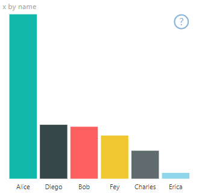
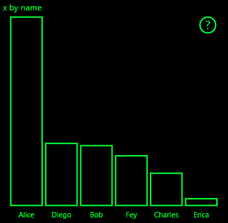
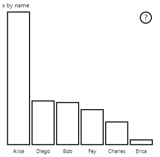

# <a name="high-contrast-mode-support-in-power-bi-visuals"></a>Compatibilidad con el modo de contraste alto en objetos visuales de Power BI

La configuración de *contraste alto* de Windows mejora la visualización del texto y las aplicaciones al mostrar colores más definidos. En este artículo se explica cómo agregar compatibilidad con el modo de contraste alto a objetos visuales de Power BI. Para obtener más información, consulte [Compatibilidad con el contraste alto en Power BI](https://powerbi.microsoft.com/blog/power-bi-desktop-june-2018-feature-summary/#highContrast).

Para ver una implementación de la compatibilidad con el contraste alto, vaya al [repositorio de objetos visuales PowerBI-visuals-sampleBarChart](https://github.com/Microsoft/PowerBI-visuals-sampleBarChart/commit/61011c82b66ca0d3321868f1d089c65101ca42e6).

## <a name="on-initialization"></a>En la inicialización

El miembro de colorPalette de `options.host` tiene varias propiedades para el modo de contraste alto. Use estas propiedades para determinar si el modo de contraste alto está activo y, de ser así, qué colores usar.

### <a name="detect-that-power-bi-is-in-high-contrast-mode"></a>Detectar si Power BI está en el modo de contraste alto

Si `host.colorPalette.isHighContrast` es `true`, se activará el modo de contraste alto y, en consecuencia, se dibujará el objeto visual.

### <a name="get-high-contrast-colors"></a>Obtener colores de contraste alto

En el modo de contraste alto, el objeto visual tiene que limitarse a los siguientes valores:

* El color de **primer plano** se usa para dibujar cualquier línea, icono, texto y contorno o relleno de formas.
* El color de **fondo** se usa para el fondo, y como color de relleno de las formas con contorno.
* El color de **primer plano: seleccionado** se usa para indicar un elemento seleccionado o activo.
* El color de los **hipervínculos** solo se usa para el texto de los hipervínculos.

> [!NOTE]
> Si necesita un color secundario, el color de primer plano puede usarse con cierta opacidad (los objetos visuales nativos de Power BI usan un 40 % de opacidad). Use esta opción con moderación para asegurarse de que los detalles visuales puedan verse fácilmente.

Durante la inicialización, puede almacenar los siguientes valores:

```typescript
private isHighContrast: boolean;

private foregroundColor: string;
private backgroundColor: string;
private foregroundSelectedColor: string;
private hyperlinkColor: string;
//...

constructor(options: VisualConstructorOptions) {
    this.host = options.host;
    let colorPalette: ISandboxExtendedColorPalette = host.colorPalette;
    //...
    this.isHighContrast = colorPalette.isHighContrast;
    if (this.isHighContrast) {
        this.foregroundColor = colorPalette.foreground.value;
        this.backgroundColor = colorPalette.background.value;
        this.foregroundSelectedColor = colorPalette.foregroundSelected.value;
        this.hyperlinkColor = colorPalette.hyperlink.value;
    }
```

O bien puede guardar el objeto `host` durante la inicialización y acceder a las propiedades de `colorPalette` relevantes durante la actualización.

## <a name="on-update"></a>Al actualizar

Las implementaciones específicas de la compatibilidad con contraste alto varían según el objeto visual y dependen de los detalles del diseño gráfico. Para asegurarse de que los detalles importantes puedan distinguirse fácilmente con los colores limitados, el modo de contraste alto suele necesitar un diseño ligeramente distinto al del modo predeterminado.

Los objetos visuales nativos de Power BI siguen estas normas:

* Todos los puntos de datos usan el mismo color (primer plano).
* Todo el texto, los ejes, las flechas, las líneas, etc. usan el color de primer plano.
* Las formas gruesas se dibujan como contornos, con trazos gruesos (como mínimo, de dos píxeles) y relleno del color de fondo.
* Si los puntos de datos son relevantes, se distinguen mediante varias formas de marcadores. Las líneas de datos se distinguen mediante el uso de distintas líneas discontinuas.
* Al resaltar un elemento de datos, el resto de los elementos cambian su opacidad a 40 %.
* Para las segmentaciones, los elementos de filtro activos usan el color seleccionado del primer plano.

En el siguiente gráfico de barras de ejemplo, todas las barras se dibujan con un contorno de primer plano de dos píxeles de grosor y con relleno de fondo. Compare el aspecto con los colores predeterminados y con un par de temas de contraste alto:





En la siguiente sección se muestra un lugar de la función `visualTransform` que se ha cambiado para admitir el contraste alto. Se le llama como parte de la representación durante la actualización.

### <a name="before"></a>Antes

```typescript
for (let i = 0, len = Math.max(category.values.length, dataValue.values.length); i < len; i++) {
    let defaultColor: Fill = {
        solid: {
            color: colorPalette.getColor(category.values[i] + '').value
        }
    };

    barChartDataPoints.push({
        category: category.values[i] + '',
        value: dataValue.values[i],
        color: getCategoricalObjectValue<Fill>(category, i, 'colorSelector', 'fill', defaultColor).solid.color,
        selectionId: host.createSelectionIdBuilder()
            .withCategory(category, i)
            .createSelectionId()
    });
}
```

### <a name="after"></a>Después

```typescript
for (let i = 0, len = Math.max(category.values.length, dataValue.values.length); i < len; i++) {
    const color: string = getColumnColorByIndex(category, i, colorPalette);

    const selectionId: ISelectionId = host.createSelectionIdBuilder()
        .withCategory(category, i)
        .createSelectionId();

    barChartDataPoints.push({
        color,
        strokeColor,
        strokeWidth,
        selectionId,
        value: dataValue.values[i],
        category: `${category.values[i]}`,
    });
}

//...

function getColumnColorByIndex(
    category: DataViewCategoryColumn,
    index: number,
    colorPalette: ISandboxExtendedColorPalette,
): string {
    if (colorPalette.isHighContrast) {
        return colorPalette.background.value;
    }

    const defaultColor: Fill = {
        solid: {
            color: colorPalette.getColor(`${category.values[index]}`).value,
        }
    };

    return getCategoricalObjectValue<Fill>(category, index, 'colorSelector', 'fill', defaultColor).solid.color;
}
```
