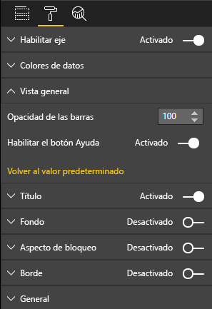

# <a name="create-a-launch-url"></a>Creación de una URL de inicio

Al crear una URL de inicio, puede abrir una nueva pestaña (o ventana) del explorador mediante la delegación del trabajo real a Power BI.

## <a name="sample"></a>Ejemplo

```typescript
   this.host.launchUrl('https://powerbi.microsoft.com');
```

## <a name="usage"></a>Usage (Uso)

Use la llamada API `host.launchUrl()`, y pase la dirección URL de destino como argumento de cadena:

```typescript
this.host.launchUrl('http://some.link.net');
```

## <a name="restrictions"></a>Restricciones

* Use solo rutas de acceso absolutas, no relativas. Por ejemplo, use una ruta de acceso absoluta como `http://some.link.net/subfolder/page.html`. La ruta de acceso relativa `/page.html` no se abrirá.

* Actualmente, solo se admiten los protocolos *HTTP* y *HTTPS*. Evite *FTP*, *MAILTO*, etc.

## <a name="best-practices"></a>Procedimientos recomendados

* Normalmente, es mejor abrir un vínculo solo como respuesta a una acción explícita del usuario. Los usuarios deben entender fácilmente que al hacer clic en el vínculo o el botón se abrirá una pestaña nueva. Desencadenar una llamada a `launchUrl()` sin la acción de un usuario, o como un efecto secundario de otra acción, puede ser confuso o frustrante para el usuario.

* Si el vínculo no es fundamental para el funcionamiento correcto del objeto visual, le recomendamos que proporcione al autor del informe una manera de deshabilitar y ocultar el vínculo. Esta recomendación es especialmente relevante para los casos de uso especiales de Power BI, como insertar un informe en una aplicación de terceros o publicarlo en la web.

* Evite activar una llamada a `launchUrl()` desde dentro de un bucle, la función `update` del objeto visual o cualquier otro código que se repita con frecuencia.

## <a name="a-step-by-step-example"></a>Ejemplo paso a paso

### <a name="add-a-link-launching-element"></a>Adición de un elemento de inicio de vínculo

Las líneas siguientes se han agregado a la función `constructor` del objeto visual:

```typescript
    this.helpLinkElement = this.createHelpLinkElement();
    options.element.appendChild(this.helpLinkElement);
```

Se ha agregado una función privada que crea y adjunta el elemento delimitador:

```typescript
private createHelpLinkElement(): Element {
    let linkElement = document.createElement("a");
    linkElement.textContent = "?";
    linkElement.setAttribute("title", "Open documentation");
    linkElement.setAttribute("class", "helpLink");
    linkElement.addEventListener("click", () => {
        this.host.launchUrl("https://docs.microsoft.com/power-bi/developer/custom-visual-develop-tutorial");
    });
    return linkElement;
};
```

Por último, una entrada del archivo *visual.less* define el estilo del elemento de vínculo:

```less
.helpLink {
    position: absolute;
    top: 0px;
    right: 12px;
    display: block;
    width: 20px;
    height: 20px;
    border: 2px solid #80B0E0;
    border-radius: 20px;
    color: #80B0E0;
    text-align: center;
    font-size: 16px;
    line-height: 20px;
    background-color: #FFFFFF;
    transition: all 900ms ease;

    &:hover {
        background-color: #DDEEFF;
        color: #5080B0;
        border-color: #5080B0;
        transition: all 250ms ease;
    }

    &.hidden {
        display: none;
    }
}
```

### <a name="add-a-toggling-mechanism"></a>Adición de un mecanismo de alternancia

Para agregar un mecanismo de alternancia, debe agregar un objeto estático para que el autor del informe pueda alternar la visibilidad del elemento de vínculo. (El valor predeterminado se establece en *hidden*). Para obtener más información, vea el [tutorial sobre objetos estáticos](https://microsoft.github.io/PowerBI-visuals/docs/concepts/objects-and-properties).

Se ha agregado un objeto estático booleano `showHelpLink` a la entrada de objetos del archivo *capabilities.json*, tal como se muestra en el siguiente código:

```typescript
"objects": {
    "generalView": {
            "displayName": "General View",
            "properties":
                "showHelpLink": {
                    "displayName": "Show Help Button",
                    "type": {
                        "bool": true
                    }
                }
            }
        }
    }
```



Y, en la función `update` del objeto visual, se han agregado las líneas siguientes:

```typescript
if (settings.generalView.showHelpLink) {
    this.helpLinkElement.classList.remove("hidden");
} else {
    this.helpLinkElement.classList.add("hidden");
}
```

La clase *hidden* se define en el archivo *visual.less* para controlar la presentación del elemento.
