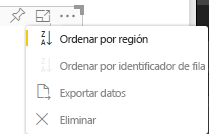

# <a name="sorting-options-for-power-bi-visuals"></a>Opciones de ordenación para objetos visuales de Power BI

En este artículo se describe cómo las opciones de *ordenación* especifican el comportamiento de ordenación de los objetos visuales de Power BI. 

La funcionalidad de ordenación requiere uno de los siguientes parámetros.

## <a name="default-sorting"></a>Ordenación predeterminada

La opción `default` es la forma más simple. Permite ordenar los datos presentados en la sección “DataMappings”. La opción permite ordenar las asignaciones de datos por el usuario y especifica la dirección de ordenación.

```json
    "sorting": {
        "default": {   }
    }
```



## <a name="implicit-sorting"></a>Ordenación implícita

La ordenación implícita ordena con el parámetro de matriz `clauses`, que describe la ordenación de cada rol de datos. `implicit` significa que el usuario del objeto visual no puede cambiar el criterio de ordenación. Power BI no muestra las opciones de ordenación en el menú del objeto visual, pero sí que ordena los datos según la configuración especificada.

Los parámetros de `clauses` pueden contener varios objetos con dos parámetros:

- `role`: determina `DataMapping` para la ordenación.
- `direction`: determina la dirección de ordenación (1 = ascendente; 2 = descendente).

```json
    "sorting": {
        "implicit": {
            "clauses": [
                {
                    "role": "category",
                    "direction": 1
                },
                {
                    "role": "measure",
                    "direction": 2
                }
            ]
        }
    }
```

## <a name="custom-sorting"></a>Ordenación personalizada

La ordenación personalizada implica que el desarrollador administra la ordenación en el código del objeto visual.
