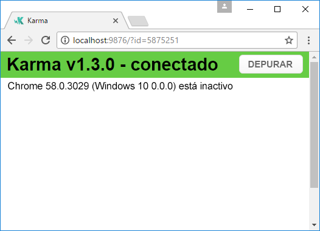
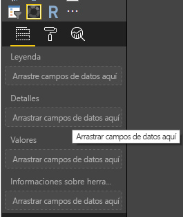
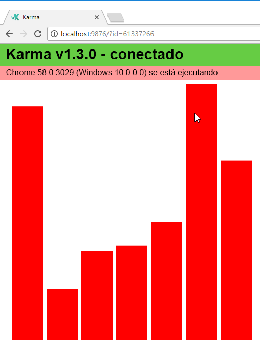
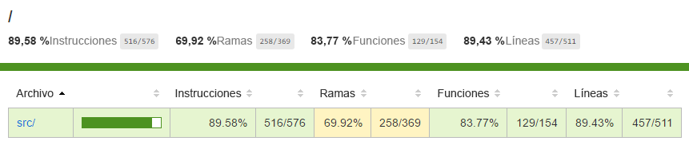
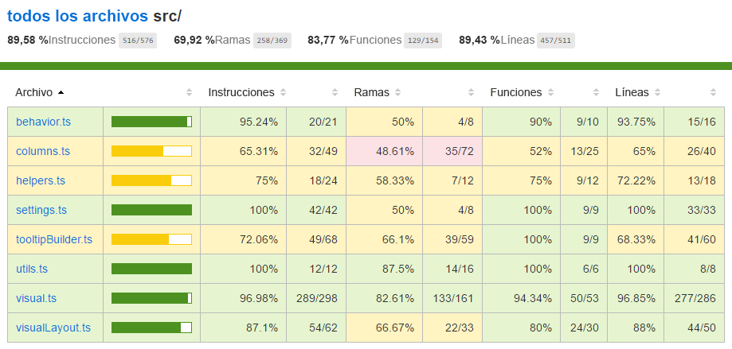

# <a name="tutorial-add-unit-tests-for-power-bi-visual-projects"></a>Tutorial: Adición de pruebas unitarias en proyectos de objetos visuales de Power BI

En este artículo se describen los conceptos básicos de la escritura de pruebas unitarias para los objetos visuales de Power BI, y se indica cómo hacer lo siguiente:

* Configurar el marco de pruebas de ejecutor de pruebas de JavaScript de Karma, Jasmine.
* Usar el paquete powerbi-visuals-utils-testutils.
* Usar objetos ficticios y emulaciones para ayudar a simplificar las pruebas unitarias de objetos visuales de Power BI.

## <a name="prerequisites"></a>Requisitos previos

* Un proyecto de objetos visuales de Power BI instalado.
* Un entorno de Node.js configurado.

## <a name="install-and-configure-the-karma-javascript-test-runner-and-jasmine"></a>Instalación y configuración del ejecutor de pruebas de JavaScript de Karma y Jasmine

Agregue las bibliotecas necesarias al archivo *package.json* en la sección `devDependencies`:

```json
"@babel/polyfill": "^7.2.5",
"@types/d3": "5.5.0",
"@types/jasmine": "2.5.37",
"@types/jasmine-jquery": "1.5.28",
"@types/jquery": "2.0.41",
"@types/karma": "3.0.0",
"@types/lodash-es": "4.17.1",
"coveralls": "3.0.2",
"istanbul-instrumenter-loader": "^3.0.1",
"jasmine": "2.5.2",
"jasmine-core": "2.5.2",
"jasmine-jquery": "2.1.1",
"jquery": "3.1.1",
"karma": "3.1.1",
"karma-chrome-launcher": "2.2.0",
"karma-coverage": "1.1.2",
"karma-coverage-istanbul-reporter": "^2.0.4",
"karma-jasmine": "2.0.1",
"karma-junit-reporter": "^1.2.0",
"karma-sourcemap-loader": "^0.3.7",
"karma-typescript": "^3.0.13",
"karma-typescript-preprocessor": "0.4.0",
"karma-webpack": "3.0.5",
"puppeteer": "1.17.0",
"style-loader": "0.23.1",
"ts-loader": "5.3.0",
"ts-node": "7.0.1",
"tslint": "^5.12.0",
"webpack": "4.26.0"
```

Para obtener más información sobre el paquete, consulte la descripción en:

Guarde el archivo *package.json* y, en la ubicación `package.json`, ejecute el siguiente comando:

```cmd
npm install
```

El administrador de paquetes instala todos los paquetes nuevos que se han agregado a *package.json*.

Para ejecutar pruebas unitarias, configure el ejecutor de pruebas y la configuración `webpack`.

El siguiente código es un ejemplo del archivo *test.webpack.config.js*:

```typescript
const path = require('path');
const webpack = require("webpack");

module.exports = {
    devtool: 'source-map',
    mode: 'development',
    optimization : {
        concatenateModules: false,
        minimize: false
    },
    module: {
        rules: [
            {
                test: /\.tsx?$/,
                use: 'ts-loader',
                exclude: /node_modules/
            },
            {
                test: /\.json$/,
                loader: 'json-loader'
            },
            {
                test: /\.tsx?$/i,
                enforce: 'post',
                include: /(src)/,
                exclude: /(node_modules|resources\/js\/vendor)/,
                loader: 'istanbul-instrumenter-loader',
                options: { esModules: true }
            },
            {
                test: /\.less$/,
                use: [
                    {
                        loader: 'style-loader'
                    },
                    {
                        loader: 'css-loader'
                    },
                    {
                        loader: 'less-loader',
                        options: {
                            paths: [path.resolve(__dirname, 'node_modules')]
                        }
                    }
                ]
            }
        ]
    },
    externals: {
        "powerbi-visuals-api": '{}'
    },
    resolve: {
        extensions: ['.tsx', '.ts', '.js', '.css']
    },
    output: {
        path: path.resolve(__dirname, ".tmp/test")
    },
    plugins: [
        new webpack.ProvidePlugin({
            'powerbi-visuals-api': null
        })
    ]
};
```

El siguiente código es un ejemplo del archivo *karma.conf.ts*:

```typescript
"use strict";

const webpackConfig = require("./test.webpack.config.js");
const tsconfig = require("./test.tsconfig.json");
const path = require("path");

const testRecursivePath = "test/visualTest.ts";
const srcOriginalRecursivePath = "src/**/*.ts";
const coverageFolder = "coverage";

process.env.CHROME_BIN = require("puppeteer").executablePath();

import { Config, ConfigOptions } from "karma";

module.exports = (config: Config) => {
    config.set(<ConfigOptions>{
        mode: "development",
        browserNoActivityTimeout: 100000,
        browsers: ["ChromeHeadless"], // or Chrome to use locally installed Chrome browser
        colors: true,
        frameworks: ["jasmine"],
        reporters: [
            "progress",
            "junit",
            "coverage-istanbul"
        ],
        junitReporter: {
            outputDir: path.join(__dirname, coverageFolder),
            outputFile: "TESTS-report.xml",
            useBrowserName: false
        },
        singleRun: true,
        plugins: [
            "karma-coverage",
            "karma-typescript",
            "karma-webpack",
            "karma-jasmine",
            "karma-sourcemap-loader",
            "karma-chrome-launcher",
            "karma-junit-reporter",
            "karma-coverage-istanbul-reporter"
        ],
        files: [
            "node_modules/jquery/dist/jquery.min.js",
            "node_modules/jasmine-jquery/lib/jasmine-jquery.js",
            {
                pattern: './capabilities.json',
                watched: false,
                served: true,
                included: false
            },
            testRecursivePath,
            {
                pattern: srcOriginalRecursivePath,
                included: false,
                served: true
            }
        ],
        preprocessors: {
            [testRecursivePath]: ["webpack", "coverage"]
        },
        typescriptPreprocessor: {
            options: tsconfig.compilerOptions
        },
        coverageIstanbulReporter: {
            reports: ["html", "lcovonly", "text-summary", "cobertura"],
            dir: path.join(__dirname, coverageFolder),
            'report-config': {
                html: {
                    subdir: 'html-report'
                }
            },
            combineBrowserReports: true,
            fixWebpackSourcePaths: true,
            verbose: false
        },
        coverageReporter: {
            dir: path.join(__dirname, coverageFolder),
            reporters: [
                // reporters not supporting the `file` property
                { type: 'html', subdir: 'html-report' },
                { type: 'lcov', subdir: 'lcov' },
                // reporters supporting the `file` property, use `subdir` to directly
                // output them in the `dir` directory
                { type: 'cobertura', subdir: '.', file: 'cobertura-coverage.xml' },
                { type: 'lcovonly', subdir: '.', file: 'report-lcovonly.txt' },
                { type: 'text-summary', subdir: '.', file: 'text-summary.txt' },
            ]
        },
        mime: {
            "text/x-typescript": ["ts", "tsx"]
        },
        webpack: webpackConfig,
        webpackMiddleware: {
            stats: "errors-only"
        }
    });
};
```

Si es necesario, puede modificar esta configuración.

El código de *karma.conf.js* contiene la siguiente variable:

* `recursivePathToTests`: busca el código de prueba.

* `srcRecursivePath`: busca el código JavaScript de salida después de la compilación.

* `srcCssRecursivePath`: busca el CSS de salida después de compilar el archivo LESS con estilos.

* `srcOriginalRecursivePath`: busca el código fuente del objeto visual.

* `coverageFolder`: determina dónde se creará el informe de cobertura.

El archivo de configuración incluye las siguientes propiedades:

* `singleRun: true`: las pruebas se ejecutan en un sistema de integración continua (CI) o se pueden ejecutar una vez. Puede cambiar la configuración a *false* para depurar las pruebas. Karma mantiene el explorador en ejecución para que pueda usar la consola para la depuración.

* `files: [...]`: en esta matriz, puede especificar los archivos que se van a cargar en el explorador. Normalmente, hay archivos de código fuente, casos de prueba y bibliotecas (Jasmine y utilidades de prueba). Puede agregar archivos adicionales a la lista, según sea necesario.

* `preprocessors`: en esta sección, se configuran las acciones que se ejecutan antes de que se ejecuten las pruebas unitarias. Se encargan de precompilar el TypeScript para JavaScript, preparar los archivos del mapa de origen y generar el informe de cobertura de código. Puede deshabilitar `coverage` al depurar las pruebas. La cobertura genera código adicional para comprobar el código de la cobertura de la prueba, lo que complica las pruebas de depuración.

Para obtener descripciones de todas las configuraciones de Karma, vaya a la página del [archivo de configuración de Karma](https://karma-runner.github.io/1.0/config/configuration-file.html).

Para su comodidad, puede agregar un comando de prueba en `scripts`:

```json
{
    "scripts": {
        "pbiviz": "pbiviz",
        "start": "pbiviz start",
        "typings":"node node_modules/typings/dist/bin.js i",
        "lint": "tslint -r \"node_modules/tslint-microsoft-contrib\"  \"+(src|test)/**/*.ts\"",
        "pretest": "pbiviz package --resources --no-minify --no-pbiviz --no-plugin",
        "test": "karma start"
    }
    ...
}
```

Ya puede empezar a escribir las pruebas unitarias.

## <a name="check-the-dom-element-of-the-visual"></a>Comprobación del elemento DOM del objeto visual

Para probar el objeto visual, primero hay que crear una instancia de objeto visual.

### <a name="create-a-visual-instance-builder"></a>Creación de un generador de instancias de objeto visual

Agregue un archivo *visualBuilder.ts* a la carpeta *test* con el siguiente código:

```typescript
import {
    VisualBuilderBase
} from "powerbi-visuals-utils-testutils";

import {
    BarChart as VisualClass
} from "../src/visual";

import  powerbi from "powerbi-visuals-api";
import VisualConstructorOptions = powerbi.extensibility.visual.VisualConstructorOptions;

export class BarChartBuilder extends VisualBuilderBase<VisualClass> {
    constructor(width: number, height: number) {
        super(width, height);
    }

    protected build(options: VisualConstructorOptions) {
        return new VisualClass(options);
    }

    public get mainElement() {
        return this.element.children("svg.barChart");
    }
}
```

Hay un método `build` para crear una instancia del objeto visual. `mainElement` es un método get, que devuelve una instancia del elemento de Document Object Model (DOM) "root" del objeto visual. El captador es opcional, pero facilita la escritura de la prueba unitaria.

Ya tiene una compilación de una instancia de su objeto visual. Vamos a escribir el caso de prueba. El caso de prueba examina los elementos SVG que se crean cuando se muestra el objeto visual.

### <a name="create-a-typescript-file-to-write-test-cases"></a>Creación de un archivo TypeScript para escribir casos de prueba

Agregue un archivo *visualTest.ts* para los casos de prueba mediante el código siguiente:

```typescript
import powerbi from "powerbi-visuals-api";

import { BarChartBuilder } from "./VisualBuilder";

import {
    BarChart as VisualClass
} from "../src/visual";

import VisualBuilder = powerbi.extensibility.visual.test.BarChartBuilder;

describe("BarChart", () => {
    let visualBuilder: VisualBuilder;
    let dataView: DataView;

    beforeEach(() => {
        visualBuilder = new VisualBuilder(500, 500);
    });

    it("root DOM element is created", () => {
        expect(visualBuilder.mainElement).toBeInDOM();
    });
});
```

Se llama a varios métodos:

* [`describe`](https://jasmine.github.io/api/2.6/global.html#describe): describe un caso de prueba. En el contexto del marco de Jasmine, se suele describir un conjunto o un grupo de especificaciones.

* `beforeEach`: se le llama antes de cada llamada al método `it`, que se define en el método [`describe`](https://jasmine.github.io/api/2.6/global.html#beforeEach).

* [`it`](https://jasmine.github.io/api/2.6/global.html#it): define una especificación única. El método `it` debe contener uno o varios `expectations`.

* [`expect`](https://jasmine.github.io/api/2.6/global.html#expect): crea una expectativa para una especificación. Una especificación se realiza correctamente si se superan todas las expectativas sin errores.

* `toBeInDOM`: uno de los métodos de *buscadores de coincidencias*. Para obtener más información sobre los buscadores de coincidencias, vea [Jasmine Namespace: matchers](https://jasmine.github.io/api/2.6/matchers.html) (Espacio de nombres de Jasmine: buscadores de coincidencias).

Para obtener más información sobre Jasmine, consulte la [página de documentación del marco de Jasmine](https://jasmine.github.io/).

### <a name="launch-unit-tests"></a>Inicio de pruebas unitarias

Esta prueba comprueba que se ha creado el elemento SVG raíz de los objetos visuales. Para ejecutar la prueba unitaria, escriba el siguiente comando en la herramienta de línea de comandos:

```cmd
npm run test
```

`karma.js` ejecuta el caso de prueba en el explorador Chrome.



> [!NOTE]
> Debe instalar Google Chrome de forma local.

En la ventana de la línea de comandos, obtendrá el siguiente resultado:

```cmd
> karma start

23 05 2017 12:24:26.842:WARN [watcher]: Pattern "E:/WORKSPACE/PowerBI/PowerBI-visuals-sampleBarChart/data/*.csv" does not match any file.
23 05 2017 12:24:30.836:WARN [karma]: No captured browser, open http://localhost:9876/
23 05 2017 12:24:30.849:INFO [karma]: Karma v1.3.0 server started at http://localhost:9876/
23 05 2017 12:24:30.850:INFO [launcher]: Launching browser Chrome with unlimited concurrency
23 05 2017 12:24:31.059:INFO [launcher]: Starting browser Chrome
23 05 2017 12:24:33.160:INFO [Chrome 58.0.3029 (Windows 10 0.0.0)]: Connected on socket /#2meR6hjXFmsE_fjiAAAA with id 5875251
Chrome 58.0.3029 (Windows 10 0.0.0): Executed 1 of 1 SUCCESS (0.194 secs / 0.011 secs)

=============================== Coverage summary ===============================
Statements   : 27.43% ( 65/237 )
Branches     : 19.84% ( 25/126 )
Functions    : 43.86% ( 25/57 )
Lines        : 20.85% ( 44/211 )
================================================================================
```

### <a name="how-to-add-static-data-for-unit-tests"></a>Cómo agregar datos estáticos para pruebas unitarias

Cree el archivo *visualData.ts* en la carpeta *test* con el siguiente código:

```typescript
import powerbi from "powerbi-visuals-api";
import DataView = powerbi.DataView;

import {
    testDataViewBuilder,
    getRandomNumbers
} from "powerbi-visuals-utils-testutils";

export class SampleBarChartDataBuilder extends TestDataViewBuilder {
    public static CategoryColumn: string = "category";
    public static MeasureColumn: string = "measure";

    public constructor() {
        super();
        ...
    }

    public getDataView(columnNames?: string[]): DataView {
        let dateView: any = this.createCategoricalDataViewBuilder([
            ...
        ],
        [
            ...
        ], columnNames).build();

        // there's client side computed maxValue
        let maxLocal = 0;
        this.valuesMeasure.forEach((item) => {
                if (item > maxLocal) {
                    maxLocal = item;
                }
        });
        (<any>dataView).categorical.values[0].maxLocal = maxLocal;
    }
}
```

La clase `SampleBarChartDataBuilder` amplía `TestDataViewBuilder` e implementa el método abstracto `getDataView`.

Al colocar datos en cubos de campos de datos, Power BI genera un objeto `dataview` categórico basado en los datos.



En las pruebas unitarias, no tiene funciones principales de Power BI para reproducir los datos, pero debe asignar los datos estáticos al objeto `dataview` categórico. La clase `TestDataViewBuilder` puede ayudarle a asignarlos.

Para obtener más información sobre la asignación de vistas de datos, vea [DataViewMappings](https://github.com/Microsoft/PowerBI-visuals/blob/master/Capabilities/DataViewMappings.md).

En el método `getDataView`, llame al método `createCategoricalDataViewBuilder` con los datos.

En el archivo [capabilities.json](https://github.com/Microsoft/PowerBI-visuals-sampleBarChart/blob/master/capabilities.json#L2) del objeto visual `sampleBarChart`, tenemos objetos dataRoles y dataViewMapping:

```json
"dataRoles": [
    {
        "displayName": "Category Data",
        "name": "category",
        "kind": "Grouping"
    },
    {
        "displayName": "Measure Data",
        "name": "measure",
        "kind": "Measure"
    }
],
"dataViewMappings": [
    {
        "conditions": [
            {
                "category": {
                    "max": 1
                },
                "measure": {
                    "max": 1
                }
            }
        ],
        "categorical": {
            "categories": {
                "for": {
                    "in": "category"
                }
            },
            "values": {
                "select": [
                    {
                        "bind": {
                            "to": "measure"
                        }
                    }
                ]
            }
        }
    }
],
```

Para generar la misma asignación, debe establecer los siguientes parámetros en el método `createCategoricalDataViewBuilder`:

```typescript
([
    {
        source: {
            displayName: "Category",
            queryName: SampleBarChartData.ColumnCategory,
            type: ValueType.fromDescriptor({ text: true }),
            roles: {
                Category: true
            },
        },
        values: this.valuesCategory
    }
],
[
    {
        source: {
            displayName: "Measure",
            isMeasure: true,
            queryName: SampleBarChartData.MeasureColumn,
            type: ValueType.fromDescriptor({ numeric: true }),
            roles: {
                Measure: true
            },
        },
        values: this.valuesMeasure
    },
], columnNames)
```

Donde `this.valuesCategory` es una matriz de categorías:

```ts
public valuesCategory: string[] = ["Monday", "Tuesday", "Wednesday", "Thursday", "Friday", "Saturday", "Sunday"];
```

Y `this.valuesMeasure` es una matriz de medida para cada categoría:

```ts
public valuesMeasure: number[] = [742731.43, 162066.43, 283085.78, 300263.49, 376074.57, 814724.34, 570921.34];
```

Ahora puede usar la clase `SampleBarChartDataBuilder` en la prueba unitaria.

La clase `ValueType` se define en el paquete powerbi-visuals-utils-testutils. Y el método `createCategoricalDataViewBuilder` requiere la biblioteca `lodash`.

Agregue estos paquetes a las dependencias.

En`package.json`, en la sección `devDependencies`

```json
"lodash-es": "4.17.1",
"powerbi-visuals-utils-testutils": "2.2.0"
```

Llamar a

```cmd
npm install
```

para instalar la biblioteca `lodash-es`.

Ahora puede volver a ejecutar la prueba unitaria. Debe obtener el siguiente resultado:

```cmd
> karma start

23 05 2017 16:19:54.318:WARN [watcher]: Pattern "E:/WORKSPACE/PowerBI/PowerBI-visuals-sampleBarChart/data/*.csv" does not match any file.
23 05 2017 16:19:58.333:WARN [karma]: No captured browser, open http://localhost:9876/
23 05 2017 16:19:58.346:INFO [karma]: Karma v1.3.0 server started at http://localhost:9876/
23 05 2017 16:19:58.346:INFO [launcher]: Launching browser Chrome with unlimited concurrency
23 05 2017 16:19:58.394:INFO [launcher]: Starting browser Chrome
23 05 2017 16:19:59.873:INFO [Chrome 58.0.3029 (Windows 10 0.0.0)]: Connected on socket /#NcNTAGH9hWfGMCuEAAAA with id 3551106
Chrome 58.0.3029 (Windows 10 0.0.0): Executed 1 of 1 SUCCESS (1.266 secs / 1.052 secs)

=============================== Coverage summary ===============================
Statements   : 56.72% ( 135/238 )
Branches     : 32.54% ( 41/126 )
Functions    : 66.67% ( 38/57 )
Lines        : 52.83% ( 112/212 )
================================================================================
```

El objeto visual se abre en el explorador Chrome, como se muestra a continuación:



En el resumen se muestra que la cobertura ha aumentado. Para obtener más información sobre la cobertura de código actual, abra `coverage\index.html`.



O examine el ámbito en la carpeta `src`:



En el ámbito del archivo, puede ver el código fuente. Las utilidades de `Coverage` resaltan la fila en rojo si no se ha ejecutado un código determinado durante las pruebas unitarias.


> [!IMPORTANT]
> La cobertura de código no implica que tenga una buena cobertura de funcionalidad del objeto visual. Una prueba unitaria simple proporciona más del 96 % de la cobertura en `src\visual.ts`.

## <a name="next-steps"></a>Pasos siguientes

Cuando el objeto visual esté listo, puede enviarlo a publicación. Para más información, consulte [Publicación de objetos visuales de Power BI en AppSource](../office-store.md).
