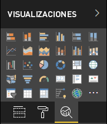

# <a name="power-bi-visual-project-structure"></a>Estructura de proyecto de objeto visual de Power BI

La mejor manera de empezar a crear un objeto visual de Power BI es usar la herramienta [pbiviz](https://www.npmjs.com/package/powerbi-visuals-tools) de objetos visuales de Power BI.

Para crear un objeto visual, vaya al directorio en el que quiere que resida el objeto visual de Power BI y ejecute el comando:

`pbiviz new <visual project name>`

Al ejecutar este comando se crea una carpeta de objetos visuales de Power BI que contiene los archivos siguientes:

```markdown
project
├───.vscode
│   ├───launch.json
│   └───settings.json
├───assets
│   └───icon.png
├───node_modules
├───src
│   ├───settings.ts
│   └───visual.ts
├───style
│   └───visual.less
├───capabilities.json
├───package-lock.json
├───package.json
├───pbiviz.json
├───tsconfig.json
└───tslint.json
```

## <a name="folder-and-file-description"></a>Descripción de archivos y carpetas

En esta sección se proporciona información sobre cada carpeta y archivo del directorio que crea la herramienta **pbiciz** de objetos visuales de Power BI.  

### <a name="vscode"></a>.vscode

Esta carpeta contiene la configuración del proyecto de código de VS.

Para configurar el área de trabajo, edite el archivo `.vscode/settings.json`.

Para más información, consulte [Configuración de usuarios y áreas de trabajo](https://code.visualstudio.com/docs/getstarted/settings).

### <a name="assets"></a>recursos

Esta carpeta contiene el archivo `icon.png`.

La herramienta de objetos visuales de Power BI usa este archivo como el nuevo icono de objetos visuales de Power BI en el panel de visualización de Power BI.

<!---  --->

### <a name="src"></a>src

Esta carpeta contiene el código fuente del objeto visual.

En esta carpeta, la herramienta de objetos visuales de Power BI crea los siguientes archivos:
* `visual.ts`: el código fuente principal del objeto visual.
* `settings.ts`: el código de la configuración del objeto visual. Las clases del archivo proporcionan una interfaz para definir las [propiedades del objeto visual](./objects-properties.md#properties).

### <a name="style"></a>estilo

Esta carpeta contiene el archivo `visual.less`, que incluye los estilos del objeto visual.

### <a name="capabilitiesjson"></a>capabilities.json

Este archivo contiene las propiedades y la configuración principales (o [funcionalidades](./capabilities.md)) del objeto visual. Permite que el objeto visual declare características, objetos, propiedades y [asignaciones de vistas de datos](./dataview-mappings.md) admitidos.

### <a name="package-lockjson"></a>package-lock.json

Este archivo se genera automáticamente para las operaciones donde *npm* modifica el árbol `node_modules` o el archivo `package.json`.

Para más información sobre este archivo, consulte la documentación oficial de [npm-package-lock.json](https://docs.npmjs.com/files/package-lock.json).

### <a name="packagejson"></a>package.json

Este archivo describe el paquete del proyecto. Contiene información sobre el proyecto, como los autores, la descripción y las dependencias del proyecto.

Para más información sobre este archivo, consulte la documentación oficial de [npm-package.json](https://docs.npmjs.com/files/package.json.html).

### <a name="pbivizjson"></a>pbiviz.json

Este archivo contiene los metadatos del objeto visual.

Para ver un archivo `pbiviz.json` de ejemplo con comentarios que describen las entradas de metadatos, consulte la sección de [entradas de metadatos](#metadata-entries).

### <a name="tsconfigjson"></a>tsconfig.json

Un archivo de configuración para [TypeScript](https://www.typescriptlang.org/docs/handbook/tsconfig-json.html).

Este archivo debe contener la ruta de acceso al archivo **\*.ts** donde está ubicada la clase principal del objeto visual, como se especifica en la propiedad `visualClassName` del archivo `pbiviz.json`.

### <a name="tslintjson"></a>tslint.json

El archivo contiene la [configuración de TSLint](https://palantir.github.io/tslint/usage/configuration/).

## <a name="metadata-entries"></a>Entradas de metadatos

En los comentarios del siguiente título de código del archivo `pbiviz.json` se describen las entradas de metadatos.

> [!NOTE]
> * A partir de la versión 3.x.x de la herramienta **pbiciz**, no se admite `externalJS`.
> * Para permitir la localización, [agregue la configuración regional de Power BI al objeto visual](./localization.md).

```json
{
  "visual": {
     // The visual's internal name.
    "name": "<visual project name>",

    // The visual's display name.
    "displayName": "<visual project name>",

    // The visual's unique ID.
    "guid": "<visual project name>23D8B823CF134D3AA7CC0A5D63B20B7F",

    // The name of the visual's main class. Power BI creates the instance of this class to start using the visual in a Power BI report.
    "visualClassName": "Visual",

    // The visual's version number.
    "version": "1.0.0",
    
    // The visual's description (optional)
    "description": "",

    // A URL linking to the visual's support page (optional).
    "supportUrl": "",

    // A link to the source code available from GitHub (optional).
    "gitHubUrl": ""
  },
  // The version of the Power BI API the visual is using.
  "apiVersion": "2.6.0",

  // The name of the visual's author and email.
  "author": { "name": "", "email": "" },

  // 'icon' holds the path to the icon file in the assets folder; the visual's display icon.
  "assets": { "icon": "assets/icon.png" },

  // Contains the paths for JS libraries used in the visual.
  // Note: externalJS' isn't used in the Power BI visuals tool version 3.x.x or higher.
  "externalJS": null,

  // The path to the 'visual.less' style file.
  "style": "style/visual.less",

  // The path to the `capabilities.json` file.
  "capabilities": "capabilities.json",

  // The path to the `dependencies.json` file which contains information about R packages used in R based visuals.
  "dependencies": null,

  // An array of paths to files with localizations.
  "stringResources": []
}
```

## <a name="next-steps"></a>Pasos siguientes

* Para comprender las interacciones entre objeto visual, un usuario y Power BI, consulte [Concepto sobre los objetos visuales de Power BI](./power-bi-visuals-concept.md).

* Comience a desarrollar sus propios objetos visuales de Power BI desde cero mediante la [guía paso a paso](./custom-visual-develop-tutorial.md).