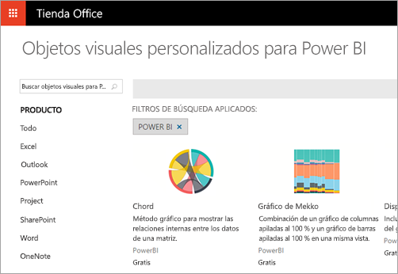
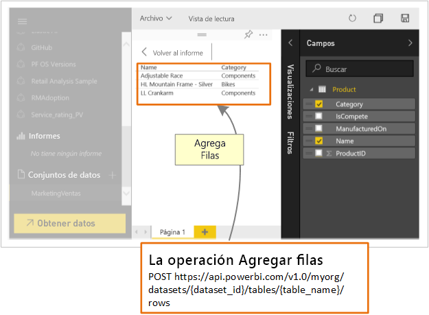

# ¿Qué pueden hacer los desarrolladores con Power BI?

Los desarrolladores tienen distintas opciones para tratar de incluir contenido de Power BI en las aplicaciones. Estas opciones incluyen **inserciones con Power BI**, **objetos visuales personalizados** e **inserciones de datos en Power BI**.

## Inserción
El servicio Power BI (SaaS) y el servicio Power BI Embedded en Azure (PaaS) tienen las API para insertar los paneles e informes. Esto significa que dispondrá de un conjunto de funcionalidades y acceso a las últimas características de Power BI (como paneles, puertas de enlace y áreas de trabajo de la aplicación) para insertar el contenido.

## Desarrollo de objetos visuales personalizados
Los objetos visuales personalizados le permiten crear sus propios objetos visuales para su uso en informes de Power BI. Los objetos visuales personalizados se escriben con TypeScript, que es un superconjunto de JavaScript. TypeScript es compatible con algunas características avanzadas y un acceso anticipado a la funcionalidad de ES6/ES7. La aplicación de estilos de objeto visual se administra mediante hojas de estilo en cascada (css). Para su comodidad, usamos el precompilador Less, que admite algunas características avanzadas (por ejemplo, el anidamiento, variables, condiciones, bucles, etc.). Si no quiere usar ninguna de estas características, puede escribir css plano en el archivo de Less.

## Insertar datos en Power BI
Puede usar la API de Power BI para insertar datos en un conjunto de datos. Esto le permite agregar una fila a una tabla dentro de un conjunto de datos. Luego, los nuevos datos se pueden reflejar en iconos en un panel y dentro de los objetos visuales de su informe.

## Pasos siguientes
[Inserción con Power BI](embedding.md)  
[Publicación de objetos visuales personalizados en la Tienda Office](office-store.md)  
[Insertar datos en un panel](walkthrough-push-data.md)
