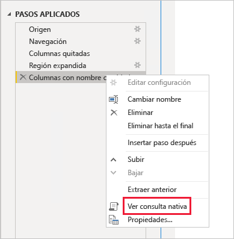
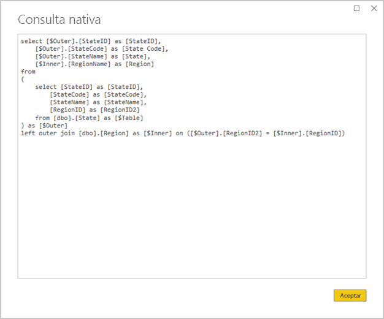
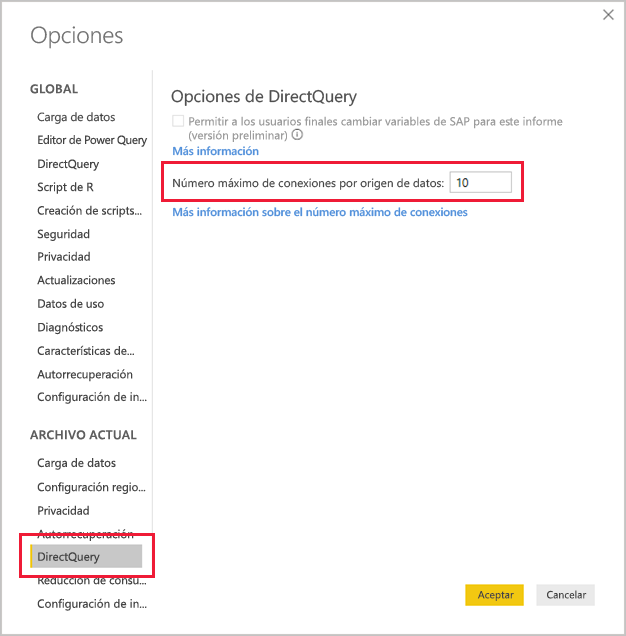

# <a name="directquery-model-guidance-in-power-bi-desktop"></a>Instrucciones del modelo de DirectQuery en Power BI Desktop

Este artículo está destinado a los modeladores de datos que desarrollan modelos de DirectQuery de Power BI, desarrollados mediante Power BI Desktop o el servicio Power BI. Describe los casos de uso, las limitaciones y la guía de DirectQuery. Específicamente, la guía está diseñada para ayudarle a determinar si DirectQuery es el modo adecuado para el modelo y para mejorar el rendimiento de los informes basados en modelos de DirectQuery. Este artículo se aplica a los modelos de DirectQuery hospedados en el servicio Power BI o en Power BI Report Server.

Este artículo no pretende proporcionar una explicación completa sobre el diseño del modelo de DirectQuery. Para obtener una introducción, consulte el artículo [Modelos de DirectQuery en Power BI Desktop](../desktop-directquery-about.md). Para obtener una explicación más detallada, consulte directamente las notas del producto en [DirectQuery en SQL Server 2016 Analysis Services](https://download.microsoft.com/download/F/6/F/F6FBC1FC-F956-49A1-80CD-2941C3B6E417/DirectQuery%20in%20Analysis%20Services%20-%20Whitepaper.pdf). Tenga en cuenta que en las notas del producto se describe el uso de DirectQuery en SQL Server Analysis Services. Sin embargo, gran parte del contenido es aplicable a los modelos de DirectQuery de Power BI.

En este artículo no se describen directamente los modelos compuestos. Un modelo compuesto contendrá al menos un origen de DirectQuery y, posiblemente, más. Las instrucciones descritas en este artículo siguen siendo adecuadas, al menos en parte, en el diseño del modelo compuesto. Pero las implicaciones de combinar tablas de importación con tablas de DirectQuery no están en el ámbito de este artículo. Para más información, consulte [Usar modelos compuestos en Power BI Desktop](../desktop-composite-models.md).

Es importante comprender que los modelos de DirectQuery imponen otra carga de trabajo en el entorno de Power BI (servicio Power BI o Power BI Report Server) y también en los orígenes de datos subyacentes. Si determina que DirectQuery es el enfoque de diseño adecuado, se recomienda que incorpore a las personas adecuadas al proyecto. A menudo vemos que una implementación correcta del modelo de DirectQuery es el resultado de un equipo de profesionales de TI que trabaja en estrecha colaboración. Normalmente, el equipo se compone de desarrolladores de modelos y administradores de las bases de datos de origen. También puede implicar a los arquitectos de datos y a los desarrolladores de almacenamiento de datos y ETL. A menudo, es necesario aplicar optimizaciones directamente al origen de datos para lograr buenos resultados de rendimiento.

## <a name="design-in-power-bi-desktop"></a>Diseño en Power BI Desktop

Los orígenes de datos de Azure SQL Data Warehouse y Azure HDInsight Spark se pueden conectar directamente, sin necesidad de utilizar Power BI Desktop. Esto se consigue en el servicio Power BI mediante la "Obtención de datos" y la elección del icono de bases de datos. Para más información, vea [Azure SQL Data Warehouse con DirectQuery](../service-azure-sql-data-warehouse-with-direct-connect.md).

Aunque la conexión directa es conveniente, no se recomienda usar este enfoque. La razón principal es que no es posible actualizar la estructura del modelo en caso de que el esquema del origen de datos subyacente cambie.

Se recomienda usar Power BI Desktop para crear y administrar todos los modelos de DirectQuery. Este enfoque proporciona un control completo para definir el modelo que necesita, incluido el uso de las características admitidas, como jerarquías, columnas calculadas, medidas, etc. También le permitirá revisar el diseño del modelo si cambia el esquema del origen de datos subyacente.

## <a name="optimize-data-source-performance"></a>Optimización del rendimiento del origen de datos

El origen de base de datos relacional se puede optimizar de varias maneras, como se describe en la lista con viñetas siguiente.

> [!NOTE]
> Somos conscientes de que no todos los modeladores tienen los permisos o las aptitudes necesarias para optimizar una base de datos relacional. Aunque es la capa preferida para preparar los datos para un modelo de DirectQuery, también se pueden lograr algunas optimizaciones en el diseño del modelo sin modificar la base de datos de origen. Sin embargo, a menudo se logran mejores resultados de optimización con la aplicación de optimizaciones a la base de datos de origen.

- **Asegúrese de que se ha completado la integridad de los datos:** es especialmente importante que las tablas de tipo dimensión contengan una columna de valores únicos (clave de dimensión) que se asigna a las tablas de tipo hechos. También es importante que las columnas de dimensión de tipo hechos contengan valores de clave de dimensión válidos. Permitirán configurar relaciones de modelo más eficaces que esperan valores coincidentes en ambos lados de las relaciones. Cuando los datos de origen no tienen integridad, se recomienda agregar un registro de dimensión "desconocido" para reparar los datos de forma eficaz. Por ejemplo, puede agregar una fila a la tabla **Product** para que represente un producto desconocido y, a continuación, asignarle una clave fuera del intervalo, como -1. Si las filas de la tabla **Ventas** contienen un valor de clave de producto que falta, sustitúyalas por -1. Esto garantizará que cada valor de clave de producto de la tabla **Ventas** tiene una fila correspondiente en la tabla **Producto**.
- **Adición de índices:** defina los índices adecuados, en tablas o vistas, para posibilitar una recuperación eficaz de los datos para el filtrado y la agrupación visual esperada del informe. Para orígenes de SQL Server, Azure SQL Database o Azure SQL Data Warehouse, vea [Guía de diseño y arquitectura de índices de SQL Server](/sql/relational-databases/sql-server-index-design-guide?view=sql-server-2017) para obtener información útil sobre instrucciones de diseño de índices. Para orígenes volátiles de SQL Server o Azure SQL Database, vea [Introducción al almacén de columnas para el análisis operativo en tiempo real](/sql/relational-databases/indexes/get-started-with-columnstore-for-real-time-operational-analytics?view=sql-server-2017).
- **Diseño de tablas distribuidas:** en el caso de los orígenes de Azure SQL Data Warehouse, que aprovechan la arquitectura de procesamiento paralelo masivo (MPP), considere la posibilidad de configurar tablas de tipo hechos grandes como tablas distribuidas por hash y tablas de tipo dimensión para replicar en todos los nodos de proceso. Para más información, vea [Instrucciones para el diseño de tablas distribuidas en Azure SQL Data Warehouse](/azure/sql-data-warehouse/sql-data-warehouse-tables-distribute#what-is-a-distributed-table).
- **Asegúrese de que se materializan las transformaciones de datos necesarias:** para orígenes de bases de datos relacionales de SQL Server (y otros orígenes de bases de datos relacionales), se pueden agregar columnas calculadas a las tablas. Estas columnas se basan en una expresión, como **Cantidad** multiplicado por **PrecioUnitario**. Las columnas calculadas se pueden guardar (materializar) y, al igual que las columnas normales, en ocasiones se pueden indexar. Para más información, vea [Índices en columnas calculadas](/sql/relational-databases/indexes/indexes-on-computed-columns?view=sql-server-2017).

    Considere también el uso de vistas indexadas, que pueden agregar previamente los datos de la tabla de hechos con un nivel de detalle más alto. Por ejemplo, si la tabla **Ventas** almacena datos en el nivel de línea de pedido, puede crear una vista para resumir estos datos. La vista se podría basar en una instrucción SELECT que agrupa los datos de la tabla **Ventas** por fecha (en el nivel de mes), cliente y producto, y resume los valores de medida como ventas, cantidad, etc. A continuación, se puede indexar la vista. Para orígenes de SQL Server o Azure SQL Database, vea [Creación de vistas indexadas](/sql/relational-databases/views/create-indexed-views?view=sql-server-2017).
- **Materializar una tabla de fechas:** un requisito común de modelado implica la adición de una tabla de fechas para admitir el filtrado basado en el tiempo. Para admitir los filtros basados en el tiempo conocidos de la organización, cree una tabla en la base de datos de origen y asegúrese de que se carga con un intervalo de fechas que abarcan las fechas de la tabla de hechos. Asegúrese también de que incluye columnas para períodos de tiempo útiles, como año, trimestre, mes, semana, etc.

## <a name="optimize-model-design"></a>Optimización del diseño del modelo

Un modelo de DirectQuery se puede optimizar de muchas maneras, como se describe en la lista con viñetas siguiente.

- **Evitar consultas complejas de Power Query:** se puede lograr un diseño de modelo eficaz mediante la eliminación de la necesidad de que las consultas de Power Query apliquen transformaciones. Esto significa que cada consulta se asigna a una sola tabla o vista del origen de base de datos relacional. Puede obtener una vista previa de una representación de la instrucción de la consulta SQL real correspondiente a un paso aplicado de Power Query; para ello, seleccione la opción **Ver consulta nativa**.

    
    
    

- **Examinar el uso de las columnas calculadas y los cambios de tipo de datos:** los modelos de DirectQuery admiten la adición de cálculos y pasos de Power Query para convertir tipos de datos. Sin embargo, a menudo se consigue un mejor rendimiento al materializar los resultados de la transformación en el origen de base de datos relacional, siempre que sea posible.
- **No usar el filtrado de fechas relativas de Power Query:** es posible definir el filtrado de fechas relativas en una consulta de Power Query. Por ejemplo, para recuperar los pedidos de ventas creados en el último año (con respecto a la fecha de hoy). Este tipo de filtro se traduce en una consulta nativa ineficaz, como se indica a continuación:

    ```SQL
    …
    from [dbo].[Sales] as [_]
    where [_].[OrderDate] >= convert(datetime2, '2018-01-01 00:00:00') and [_].[OrderDate] < convert(datetime2, '2019-01-01 00:00:00'))  
    ```
    
    Un enfoque de diseño mejor consiste en incluir columnas de tiempo relativas en la tabla de fechas. Estas columnas almacenan valores de desplazamiento en relación con la fecha actual. Por ejemplo, en la columna **RelativeYear** (Año relativo), el valor cero representa el año actual, -1 representa el año anterior, etc. Es preferible que la columna **RelativeYear** se materialice en la tabla de fechas. Aunque es menos eficaz, también se podría agregar como una columna calculada del modelo, en función de la expresión con las funciones de DAX [TODAY](/dax/today-function-dax) y [DATE](/dax/date-function-dax).

- **Simplificar las medidas:** al menos inicialmente, se recomienda limitar las medidas a agregados simples. Las funciones de agregado incluyen SUM, COUNT, MIN, MAX y AVERAGE. Después, si las medidas tienen la suficiente capacidad de respuesta, puede experimentar con medidas más complejas, pero se debe prestar atención al rendimiento de cada una. Aunque la función DAX [CALCULATE](/dax/calculate-function-dax) se puede usar para generar expresiones de medida sofisticadas que manipulan el contexto del filtro, pueden generar consultas nativas costosas que no tienen buen rendimiento.
- **Evitar relaciones en las columnas calculadas:** las relaciones del modelo solo pueden relacionar una sola columna de una tabla con una sola columna de otra tabla. Sin embargo, a veces es necesario relacionar las tablas mediante el uso de varias columnas. Por ejemplo, las tablas **Ventas** y **Geografía** se relacionan con dos columnas: **País** y **Ciudad**. Para crear una relación entre las tablas, se requiere una sola columna y, en la tabla **Geografía**, la columna debe contener valores únicos. La concatenación del país y la ciudad con un guión separador podría conseguir este resultado.

    La columna combinada se puede crear con una columna personalizada de Power Query o bien en el modelo como una columna calculada. Pero se debe evitar, ya que la expresión de cálculo se insertará en las consultas de origen. No solo es ineficaz, sino que normalmente impide el uso de índices. En su lugar, agregue columnas materializadas en el origen de base de datos relacional y considere la posibilidad de indexarlas. También puede considerar la posibilidad de agregar columnas de clave suplente a las tablas de tipo dimensión, que es una práctica común en los diseños de almacenamientos de datos relacionales.
    
    Hay una excepción a esta guía y se refiere al uso de la función de DAX [COMBINEVALUES](/dax/combinevalues-function-dax). El propósito de esta función es admitir relaciones de varias columnas en el modelo. En lugar de generar una expresión que la relación utilizará, genera un predicado de combinación SQL de varias columnas.
- **Evitar las relaciones en columnas de "identificador único":** Power BI no admite de forma nativa el tipo de datos de identificador único (GUID). Al definir una relación entre columnas de este tipo, Power BI generará una consulta de origen con una combinación que implica una conversión. Esta conversión de datos en tiempo de consulta suele provocar un rendimiento deficiente. Hasta que este caso se optimice, la única solución es materializar columnas de un tipo de datos alternativo en la base de datos subyacente.
- **Ocultar la columna del lado uno de las relaciones:** se debe ocultar la columna del lado uno de una relación. (Normalmente, es la columna de clave principal de las tablas de tipo de dimensión). Cuando está oculta, no está disponible en el panel **Campos** y, por tanto, no se puede usar para configurar un objeto visual. La columna del lado varios puede estar visible si resulta útil para agrupar o filtrar los informes por los valores de columna. Por ejemplo, considere un modelo en el que existe una relación entre las tablas **Ventas** y **Producto**. Las columnas de la relación contienen valores de SKU (Unidades de stock) del producto. Si se debe agregar el valor de SKU del producto a los objetos visuales, debe ser visible solo en la tabla **Ventas**. Cuando esta columna se usa para filtrar o agrupar en un objeto visual, Power BI generará una consulta que no necesita combinar las tablas **Ventas** y **Producto**.
- **Establecer relaciones para aplicar la integridad:** la propiedad **Asumir integridad referencial** de las relaciones de DirectQuery determina si Power BI generará consultas del origen mediante una combinación interna en lugar de una combinación externa. Normalmente, esto mejora el rendimiento de las consultas, aunque depende de los detalles específicos del origen de base de datos relacional. Para más información, vea [Configuración de Asumir integridad referencial en Power BI Desktop](../desktop-assume-referential-integrity.md).
- **Evitar el uso del filtrado de relaciones bidireccional:** El uso del filtrado de relaciones bidireccional puede conducir a instrucciones de consulta que no tienen buen rendimiento. Use esta característica de la relación solo cuando sea necesario, como es habitual al implementar una relación de varios a varios en una tabla puente. Para más información, vea [Relaciones con una cardinalidad de varios a varios en Power BI Desktop](../desktop-many-to-many-relationships.md).
- **Limitar las consultas paralelas:** puede establecer el número máximo de conexiones que abre DirectQuery para cada origen de datos subyacente. Controla el número de consultas que se envían de forma simultánea al origen de datos.

    
    
    La configuración solo está habilitada cuando hay al menos un origen de DirectQuery en el modelo. El valor se aplica a todos los orígenes de DirectQuery y a los nuevos orígenes de DirectQuery agregados al modelo.

    El aumento del valor de **Conexiones máximas por origen de datos** garantiza que se puedan enviar más consultas (hasta el número máximo especificado) al origen de datos subyacente, lo que resulta útil cuando hay muchos objetos visuales en una sola página o bien cuando muchos usuarios acceden a un informe al mismo tiempo. Una vez alcanzado el número máximo de conexiones, las consultas siguientes se ponen en cola hasta que haya disponible una conexión. El aumento de este límite tiene como resultado más carga en el origen de datos subyacente, por lo que la configuración no garantiza que mejore el rendimiento general.
    
    Cuando el modelo se publica en Power BI, el número máximo de consultas simultáneas enviadas al origen de datos subyacente también depende del entorno. Los distintos entornos (como Power BI, Power BI Premium o Power BI Report Server) pueden imponer diferentes restricciones de rendimiento. Para más información sobre las limitaciones de los recursos de capacidad Premium de Power BI, vea [Implementación y administración de capacidades Premium de Power BI](https://docs.microsoft.com/power-bi/whitepaper-powerbi-premium-deployment).

## <a name="optimize-report-designs"></a>Optimización de los diseños de informes

Los informes basados en un conjunto de datos de DirectQuery se pueden optimizar de muchas maneras, como se describe en la lista con viñetas siguiente.

- **Habilitar técnicas de reducción de consultas:** en _Opciones y configuración_ de Power BI Desktop se incluye una página Reducción de consulta. Esta página tiene tres opciones útiles. Se puede deshabilitar el resaltado cruzado y el filtrado cruzado de forma predeterminada, aunque esto se puede invalidar mediante la edición de interacciones. También es posible mostrar un botón Aplicar en las segmentaciones y los filtros. Las opciones de segmentación o filtro no se aplicarán hasta que el usuario del informe haga clic en el botón. Si habilita estas opciones, se recomienda que lo haga al crear el informe por primera vez.

    
    
- **Aplique primero los filtros:** al diseñar los informes por primera vez, se recomienda aplicar los filtros correspondientes (en el nivel de informe, página u objeto visual) antes de asignar campos a los campos del objeto visual. Por ejemplo, en lugar de arrastrar las medidas **País** y **Ventas** y, a continuación, filtrar por un año determinado, aplique primero el filtro en el campo **Año**. Se debe a que cada paso de la creación de un objeto visual enviará una consulta y, aunque es posible realizar otro cambio antes de que se complete la primera consulta, se crea una carga innecesaria en el origen de datos subyacente. Al aplicar los filtros al principio, normalmente las consultas intermedias se convierten en menos costosas y más rápidas. Además, si no se aplican los filtros temprano, se puede superar el límite de un millón de filas, como se ha descrito antes.
- **Limite la cantidad de objetos visuales de una página:** Cuando se abre una página del informe (y cuando se aplican los filtros de la página), se actualizan todos los objetos visuales de dicha página. Sin embargo, hay un límite en el número de consultas que se pueden enviar en paralelo, impuestas por el entorno de Power BI y la configuración **Conexiones máximas por origen de datos** del modelo, como se ha descrito anteriormente. Por lo tanto, a medida que aumenta el número de objetos visuales de la página, es más probable que se actualicen en serie. Esto aumenta el tiempo necesario para actualizar toda la página y también la posibilidad de que los objetos visuales puedan mostrar resultados incoherentes (para orígenes de datos volátiles). Por estos motivos, se recomienda limitar el número de objetos visuales de cualquier página y, en su lugar, tener páginas más sencillas. El reemplazo de varios objetos visuales de tarjeta por un solo objeto visual de tarjeta de varias filas puede lograr un diseño de página similar.
- **Desactivar la interacción entre objetos visuales:** las interacciones de resaltado cruzado y de filtrado cruzado requieren el envío de consultas al origen subyacente. A menos que estas interacciones sean necesarias, se recomienda que se desactiven si el tiempo que se tarda en responder a las selecciones de los usuarios es demasiado largo. Estas interacciones se pueden desactivar, ya sea para todo el informe (como se ha descrito antes para las opciones de reducción de consulta), o bien caso por caso. Para más información, vea [Aplicación de un filtro cruzado entre objetos visuales de un informe de Power BI](../consumer/end-user-interactions.md).

Además de la lista anterior de técnicas de optimización, cada una de las funcionalidades de informes siguientes puede contribuir a los problemas de rendimiento:

- **Filtros de medidas:** los objetos visuales que contienen medidas (o agregados de columnas) pueden tener filtros aplicados a dichas medidas. Por ejemplo, el objeto visual siguiente muestra **Sales** (Ventas) por **Category** (Categoría), pero solo para aquellas categorías con más de 15 millones de dolares de ventas.

    
    
    
    Esto puede dar lugar a que se envíen dos consultas al origen subyacente:
    
    - La primera consulta recuperará las categorías que cumplen la condición (Ventas > 15 millones de dolares)
    - La segunda consulta recuperará los datos necesarios para el objeto visual, agregando las categorías que cumplen la condición a la cláusula WHERE
    
    Por lo general tiene un buen rendimiento si existen cientos o miles de categorías, como en este ejemplo. Pero el rendimiento se puede degradar si el número de categorías es mucho mayor (y, de hecho, la consulta generará un error si hay más de un millón de categorías que cumplen la condición, debido al límite de un millón de filas descrito antes).
- **Filtros TopN:** se pueden definir filtros avanzados para filtrar solo los N valores superiores (o inferiores) clasificados por una medida. Por ejemplo, para mostrar solo las cinco categorías principales del objeto visual anterior. Como sucede con los filtros de medida, esto también da lugar a que se envíen dos consultas al origen de datos subyacente. Sin embargo, la primera consulta devolverá todas las categorías del origen subyacente y, luego, se determinan los N valores principales según los resultados devueltos. En función de la cardinalidad de la columna en cuestión, esto puede generar problemas de rendimiento (o errores de consulta debido al límite de un millón de filas).
- **Mediana:** Por lo general, cualquier agregación (SUM, COUNT, DISTINCT, etc.) se envía al origen subyacente. Pero esto no sucede con Mediana, ya que habitualmente este agregado no es compatible con el origen subyacente. En tales casos, los datos detallados se recuperan del origen subyacente y Power BI evalúa la mediana a partir de los resultados devueltos. Es correcto cuando la mediana se va a calcular sobre un número relativamente pequeño de resultados, pero se producirán problemas de rendimiento (o errores en la consulta debido al límite de un millón de filas) si la cardinalidad es grande. Por ejemplo, la mediana de la población de un país podría ser razonable, pero la mediana del precio de ventas podría no serlo.
- **Segmentaciones de selección múltiple:** permitir la selección múltiple en segmentaciones y filtros puede causar problemas de rendimiento. Esto se debe a que, a medida que el usuario selecciona elementos adicionales de la segmentación (por ejemplo, al crear los diez productos que le interesan), cada nueva selección genera el envío de una nueva consulta al origen subyacente. Aunque el usuario pueda seleccionar el elemento siguiente antes de que se complete la consulta, el resultado es una carga adicional en el origen subyacente. Esta situación se puede evitar si se muestra el botón Aplicar, tal como se ha descrito anteriormente en las técnicas de reducción de consultas.
- **Totales visuales:** de forma predeterminada, las tablas y matrices muestran los totales y subtotales. En muchos casos, se deben enviar consultas adicionales al origen subyacente para obtener los valores de los totales. Esto se aplica cada vez que se usan los agregados Count, Distinct o Median, y en todos los casos en los que se usa DirectQuery en SAP HANA o SAP Business Warehouse. Estos totales deben desactivarse (mediante el panel Formato) si no son necesarios.

## <a name="convert-to-a-composite-model"></a>Conversión a un modelo compuesto

Las ventajas de los modelos de importación y de DirectQuery se pueden combinar en un único modelo mediante la configuración del modo de almacenamiento de las tablas del modelo. El modo de almacenamiento de las tablas puede ser Importar, DirectQuery o ambos, conocido como Dual. Cuando un modelo contiene tablas con modos de almacenamiento diferentes, se conoce como modelo compuesto. Para más información, consulte [Usar modelos compuestos en Power BI Desktop](../desktop-composite-models.md).

Hay muchas mejoras funcionales y de rendimiento que se pueden lograr mediante la conversión de un modelo de DirectQuery en un modelo compuesto. Un modelo compuesto puede integrar más de un origen de DirectQuery y también puede incluir agregaciones. Las tablas de agregación se pueden agregar a las tablas de DirectQuery para importar una representación resumida de la tabla. Pueden conseguir importantes mejoras de rendimiento cuando los objetos visuales consultan agregados de nivel superior. Para más información, vea [Agregaciones en Power BI Desktop](../desktop-aggregations.md).

## <a name="educate-users"></a>Educación de los usuarios

Es importante educar a los usuarios sobre cómo trabajar de forma eficaz con los informes basados en conjuntos de datos de DirectQuery. Los autores de informes deben instruirse en el contenido que se describe en [Optimización de los diseños de informes](#optimize-report-designs section).

Se recomienda educar a los consumidores del informe sobre los informes que se basan en conjuntos de datos de DirectQuery. Puede resultarles útil comprender la arquitectura de datos general, incluidas las limitaciones pertinentes que se describen en este artículo. Hágales saber que las respuestas de actualización y el filtrado interactivo pueden ser lentos en ocasiones. Cuando los usuarios de los informes entienden por qué se produce la degradación en el rendimiento, es menos probable que pierdan confianza en los informes y los datos.

Al entregar informes sobre orígenes de datos volátiles, asegúrese de educar a los usuarios de los informes sobre el uso del botón Actualizar. Indíqueles que también podrían ver resultados incoherentes y que una actualización del informe puede resolver las incoherencias de la página del informe.

## <a name="next-steps"></a>Pasos siguientes

Para más información acerca de DirectQuery, revise los siguientes recursos:

- [Modelos de DirectQuery en Power BI Desktop](../desktop-directquery-about.md)
- [Usar DirectQuery en Power BI Desktop](../desktop-use-directquery.md)
- [Solución de problemas del modelo de DirectQuery en Power BI Desktop](../desktop-directquery-troubleshoot.md)
- ¿Tiene alguna pregunta? [Pruebe a preguntar a la comunidad de Power BI](https://community.powerbi.com/)
