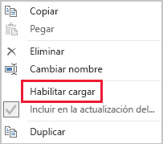

# Técnicas de reducción de datos para modelos de importación

Este artículo va dirigido a los modeladores de datos de Power BI Desktop que desarrollan modelos de importación. En él se explican distintas técnicas para ayudar a reducir los datos cargados en los modelos de importación.

Los modelos de importación se cargan con datos comprimidos y optimizados y luego se almacenan en disco mediante el motor de almacenamiento VertiPaq. Cuando los datos de origen se cargan en la memoria, es posible ver una compresión por 10, por lo que es razonable esperar que 10 GB de datos de origen se puedan comprimir a un tamaño de aproximadamente 1 GB. Además, cuando se guardan en el disco, se puede lograr una reducción adicional del 20 %.

A pesar de la eficacia lograda por el motor de almacenamiento VertiPaq, es importante intentar minimizar los datos que se van a cargar en los modelos. Esto es especialmente así en el caso de los modelos de gran tamaño, o de los modelos que se prevé que vayan a crecer hasta alcanzar un gran tamaño con el tiempo. Los cuatro motivos de peso incluyen:

- Es posible que la capacidad no admita tamaños de modelo más grandes. La capacidad compartida puede hospedar modelos de hasta 1 GB de tamaño, mientras que las capacidades Premium pueden hospedar modelos de hasta 13 GB de tamaño. Para obtener más información, lea el artículo [Compatibilidad de Power BI Premium con conjuntos de datos grandes](../service-premium-large-datasets.md).
- Los tamaños de modelo más pequeños reducen la contención de los recursos de capacidad, en particular, memoria. Esto permite que se carguen más modelos de forma simultánea durante períodos de tiempo más largos, lo que da lugar a tasas de expulsión inferiores. Para obtener más información, lea el tema [Cómo funcionan las capacidades](../whitepaper-powerbi-premium-deployment.md#how-capacities-function) de las notas del producto [Implementación y administración de capacidades de Power BI Premium](../whitepaper-powerbi-premium-deployment.md).
- Los modelos más pequeños logran una actualización de datos más rápida, lo que da lugar a informes de latencia inferiores, mayor rendimiento de actualización de conjuntos de datos y menos presión sobre el sistema de origen y los recursos de capacidad.
- Los recuentos de filas de tablas más pequeños pueden dar lugar a evaluaciones de cálculo más rápidas, lo que puede proporcionar un mejor rendimiento general de las consultas.

En este artículo se habla de siete técnicas diferentes de reducción de datos. Estas incluyen:

- [Quitar columnas innecesarias](#remove-unnecessary-columns)
- [Quitar filas innecesarias](#remove-unnecessary-rows)
- [Agrupar y resumir](#group-by-and-summarize)
- [Optimizar tipos de datos de columna](#optimize-column-data-types)
- [Preferencia de columnas personalizadas](#preference-for-custom-columns)
- [Deshabilitar la carga de consultas de Power Query](#disable-power-query-query-load)
- [Cambiar al modo mixto](#switch-to-mixed-mode)

## Quitar columnas innecesarias

Las columnas de las tablas del modelo tienen dos propósitos principales:

- **Creación de informes**, para lograr diseños de informe que filtren, agrupen y resuman los datos del modelo correctamente
- **Estructura del modelo**, al admitir relaciones del modelo, cálculos del modelo, roles de seguridad e incluso formato de colores de datos

Las columnas que no sirvan para estos propósitos probablemente se quiten. La eliminación de columnas se conoce como _filtrado vertical_.

Se recomienda diseñar modelos que tengan exactamente el número correcto de columnas en función de los requisitos conocidos de creación de informes. Desde luego, estos requisitos pueden cambiar con el tiempo, pero tenga en cuenta que es más fácil agregar columnas más adelante que quitarlas. La eliminación de columnas podría romper los informes o la estructura del modelo.

## Quitar filas innecesarias

Las tablas del modelo se deben cargar con el menor número de filas posible. Esto se puede conseguir si se cargan conjuntos de filas filtrados en tablas del modelo por dos motivos diferentes: para filtrar por entidad o por tiempo. La eliminación de filas se conoce como _filtrado horizontal_.

El **filtrado por entidad** implica cargar un subconjunto de datos de origen en el modelo. Por ejemplo, en lugar de cargar datos de ventas de todas las regiones de ventas, solo se cargan los de una región. Este enfoque de diseño da lugar a muchos modelos más pequeños, y también puede eliminar la necesidad de definir seguridad de nivel de fila (pero exige la concesión de permisos específicos de conjunto de datos en el servicio Power BI y la creación de informes "duplicados" que se conectan a cada conjunto de datos). Puede aprovechar los parámetros de Power Query y los archivos de plantilla de Power BI para simplificar la administración y la publicación. Para obtener más información, lea la entrada de blog [Información detallada sobre los parámetros de consulta y las plantillas de Power BI](https://powerbi.microsoft.com/blog/deep-dive-into-query-parameters-and-power-bi-templates/).

El **filtrado por tiempo** implica limitar la cantidad de _historial de datos_ que se carga en las tablas de tipo de hechos (y limitar las filas de fecha cargadas en las tablas de fecha del modelo). Se sugiere no cargar automáticamente todo el historial disponible, a menos que se trate de un requisito conocido de creación de informes. Resulta útil entender que los filtros de Power Query basados en tiempo se pueden parametrizar e incluso definir para que usen períodos de tiempo relativos (con respecto a la fecha de actualización, por ejemplo, los cinco últimos años). Además, tenga en cuenta que los cambios retrospectivos en los filtros de tiempo no interrumpen los informes; solo dan lugar a menos (o más) historial de datos disponible en los informes.

## Agrupar y resumir

Quizás la técnica más eficaz para reducir el tamaño de un modelo es cargar datos resumidos previamente. Esta técnica se puede usar para disminuir el nivel de detalle de las tablas de tipo de hechos. La desventaja es la pérdida de detalle.

Por ejemplo, una tabla de hechos de ventas de origen almacena una fila por línea de pedido. Se puede lograr una reducción considerable de los datos si se resumen todas las métricas de ventas, al agrupar por fecha, cliente y producto. Por tanto, piense que se puede lograr una reducción de datos aún mayor mediante la agrupación por fecha _en el nivel de mes_. Con esto se puede conseguir una reducción del 99 % del tamaño del modelo, aunque ya no es posible crear informes en el nivel de día ni en el nivel de pedido individual. La decisión de resumir los datos de tipo de hechos siempre conlleva ventajas y desventajas. Estas podrían mitigarse mediante un diseño de modelo mixto, que se trata más adelante en el tema [Cambiar al modo mixto](#switch-to-mixed-mode).

## Optimizar tipos de datos de columna

El motor de almacenamiento VertiPaq usa estructuras de datos independientes para cada columna. Por diseño, estas estructuras de datos logran las mayores optimizaciones con los datos de columna numéricos, que usan codificación de valores. Pero los datos de texto y otros no numéricos usan codificación hash. Esto exige que el motor de almacenamiento asigne un identificador numérico a cada valor de texto único incluido en la columna. Así, es el identificador numérico el que después se almacena en la estructura de datos, lo que exige una búsqueda hash durante el almacenamiento y la consulta.

En algunas instancias específicas, puede convertir los datos de texto de origen en valores numéricos. Por ejemplo, un número de pedido de ventas puede llevar siempre como prefijo un valor de texto (como "SO123456"). Se puede quitar el prefijo y el valor de número de pedido convertirse en número entero. En el caso de las tablas de gran tamaño, esto puede dar lugar a una reducción considerable de datos, especialmente si la columna contiene valores de cardinalidad únicos o elevados.

En este ejemplo, se recomienda establecer la propiedad de columna Resumen predeterminado en "No resumir". Esto ayuda a minimizar el resumen inadecuado de los valores de número de pedido.

## Preferencia de columnas personalizadas

El motor de almacenamiento VertiPaq almacena las columnas calculadas del modelo (definidas en DAX) lo mismo que las columnas normales cuyo origen es Power Query. Pero las estructuras de datos se almacenan de forma ligeramente distinta y, normalmente, se consigue una compresión menos eficaz. Además, se compilan una vez que se cargan todas las tablas de Power Query, lo que puede dar lugar a tiempos de actualización de datos prolongados. Por lo tanto, resulta menos eficaz agregar columnas de tabla como columnas _calculadas_ que como columnas _calculadas_ de Power Query (definidas en M).

La preferencia debería ser crear columnas personalizadas en Power Query. Cuando el origen es una base de datos, se puede lograr una mayor eficacia de carga de dos maneras. El cálculo se puede definir en la instrucción SQL (mediante el lenguaje de consulta nativo del proveedor), o bien se puede materializar como una columna en el origen de datos.

Pero, en algunos casos, las columnas calculadas del modelo pueden ser la mejor opción. Este es el caso cuando la fórmula implica evaluar medidas o requiere una funcionalidad de modelado específica que solo se admite en las funciones DAX. Para obtener información sobre un ejemplo de este tipo, vea el artículo [Descripción de las funciones para jerarquías de elemento primario y secundario en DAX](/dax/understanding-functions-for-parent-child-hierarchies-in-dax).

## Deshabilitar la carga de consultas de Power Query

Las consultas de Power Query diseñadas para permitir la integración de datos con otras consultas no deben cargarse en el modelo. Para evitar la carga de la consulta en el modelo, asegúrese de deshabilitar la carga de consultas en estas instancias.

## Cambiar al modo mixto

En Power BI Desktop, un diseño de modo mixto genera un modelo compuesto. Básicamente, permite determinar el modo de almacenamiento _de cada tabla_. Por lo tanto, cada tabla puede tener su propiedad Modo de almacenamiento establecida en Importar o DirectQuery (Dual es otra opción).

Una técnica eficaz para reducir el tamaño del modelo consiste en establecer la propiedad Modo de almacenamiento de las tablas de tipo de hechos mayores en DirectQuery. Piense que este enfoque de diseño podría funcionar bien con el tema [Agrupar y resumir](#group-by-and-summarize) presentado anteriormente. Por ejemplo, los datos de ventas resumidos se podrían usar para lograr informes de "resumen" de alto rendimiento. Una página de obtención de detalles podría mostrar las ventas pormenorizadas de un contexto de filtrado (y delimitación) específico y mostrar todos los pedidos de ventas en contexto. En este ejemplo, la página de obtención de detalles incluiría objetos visuales basados en una tabla de DirectQuery para recuperar los datos de pedidos de ventas.

Pero hay muchas implicaciones de seguridad y rendimiento relacionadas con los modelos compuestos. Para obtener más información, lea el artículo [Usar modelos compuestos en Power BI Desktop](../desktop-composite-models.md).

## Pasos siguientes

Para obtener más información sobre el diseño del modelo de importación de Power BI, vea los siguientes artículos:

- [Usar modelos compuestos en Power BI Desktop](../desktop-composite-models.md)
- [Modo de almacenamiento en Power BI Desktop](../desktop-storage-mode.md)
