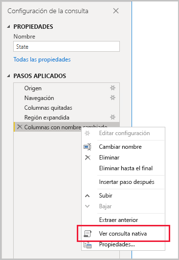
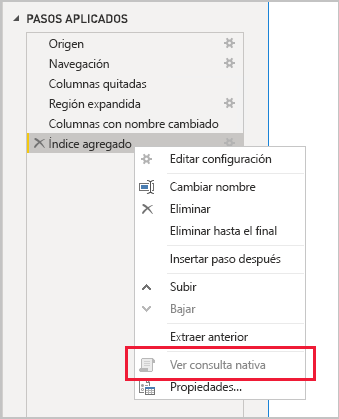

# <a name="the-importance-of-query-folding"></a>La importancia del plegado de consultas

Este artículo se dirige a los modeladores de datos que desarrollan modelos en Power BI Desktop. Describe qué es el plegado de consultas y por qué es importante. También se describen los orígenes de datos y las transformaciones que pueden lograr el plegado de consultas y cómo determinar si las consultas de Power Query se pueden plegar, ya sea total o parcialmente. Por último, proporciona una guía de procedimientos recomendados sobre cuándo y cómo lograr el plegado de consultas.

## <a name="background"></a>Fondo

El plegado de consultas es la capacidad de una consulta de Power Query de generar una instrucción de consulta única para recuperar y transformar los datos de origen. El motor de mashup de Power Query se esfuerza en lograr el plegado de consultas siempre que sea posible, ya que resulta la ruta más eficaz para conectar una tabla del modelo de Power BI a su origen de datos subyacente.

El plegado de consultas es un tema importante para el modelado de datos por varios motivos:

- **Tablas del modelo de importación:** la actualización de datos se realizará de forma eficaz para las tablas del modelo de importación, en términos de uso de recursos y duración de la actualización
- **Tablas del modo de almacenamiento DirectQuery y Dual:** todas las tablas del modo de almacenamiento DirectQuery y Dual deben basarse en una consulta de Power Query que se pueda plegar
- **Actualización incremental:** La actualización incremental de los datos será eficaz, en términos de uso de recursos y duración de la actualización. De hecho, la ventana de configuración de la actualización incremental le notificará con una advertencia en caso de que se determine que no se puede lograr el plegado de consultas de la tabla. Si no se logra, se pierde el objetivo de la actualización incremental. A continuación, el motor de mashup tendría que recuperar todas las filas de origen y, después, aplicar filtros para determinar los cambios incrementales.

El plegado de consultas se puede realizar para una consulta de Power Query completa o para un subconjunto de sus pasos. Cuando no se puede lograr el plegado de consultas, ya sea parcial o totalmente, el motor de mashup de Power Query de Power BI debe compensar mediante el procesamiento de las transformaciones de datos. Esto podría implicar la recuperación de los resultados de la consulta de origen, que es muy intensivo y lento para grandes conjuntos de datos.

Se recomienda que los modeladores de datos se esfuercen por lograr la eficacia en sus diseños del modelo de importación y se aseguren de que el plegado de consultas se produce siempre que sea posible.

## <a name="sources-that-support-query-folding"></a>Orígenes que admiten el plegado de consultas

La mayoría de los orígenes de datos que tienen el concepto de lenguaje de consulta admiten el plegado de consultas. Entre ellos se incluyen bases de datos relacionales, fuentes de OData (incluidas las listas de SharePoint), Exchange y Active Directory. Sin embargo, los orígenes de datos como los archivos planos, blobs y web normalmente no lo hacen.

## <a name="transformations-that-can-achieve-query-folding"></a>Transformaciones que pueden lograr el plegado de consultas

Las transformaciones de orígenes de datos relacionales que se pueden plegar son aquellas que se pueden escribir como una única instrucción SELECT. Una instrucción SELECT se puede construir con las cláusulas WHERE, GROUP BY y JOIN apropiadas. También puede contener expresiones de columna (cálculos) que usan funciones integradas comunes admitidas por las bases de datos SQL.

Por lo general, la siguiente lista con viñetas describe las transformaciones que pueden lograr el plegado de consultas.

- Eliminar columnas
- Cambiar el nombre de las columnas (alias de columna de la instrucción SELECT)
- Filtrar filas, con valores estáticos o parámetros de Power Query (predicados de la cláusula WHERE)
- Agrupar y resumir (cláusula GROUP BY)
- Expandir columnas de registro (columnas de clave externa de origen) para lograr una combinación de dos tablas de origen (cláusula JOIN)
- Combinación no aproximada de consultas que se pueden plegar basadas en el mismo origen (cláusula JOIN)
- Anexar consultas que se pueden plegar basadas en el mismo origen (operador UNION ALL)
- Agregar columnas personalizadas con _lógica simple_ (expresiones de columna de la instrucción SELECT). La lógica simple implica operaciones poco complicadas, posiblemente incluyendo el uso de funciones M que tienen funciones equivalentes en el origen de datos SQL, como las matemáticas o las funciones de manipulación de texto. Por ejemplo, las expresiones siguientes devuelven el componente del año del valor de la columna **OrderDate** (Fecha del pedido) (para devolver un valor numérico).

    ```powerquery-m
    Date.Year([OrderDate])
    ```

- Dinamizar y anular dinamización (operadores PIVOT y UNPIVOT)

## <a name="transformations-that-prevent-query-folding"></a>Transformaciones que impiden el plegado de consultas

Por lo general, la siguiente lista con viñetas describe las transformaciones que impiden el plegado de consultas. No pretende ser una lista exhaustiva.

- Combinación de consultas basadas en orígenes diferentes
- Anexar consultas (union) basadas en orígenes diferentes
- Agregar columnas personalizadas con _lógica compleja_. La lógica compleja implica el uso de las funciones M que no tienen funciones equivalentes en el origen de datos. Por ejemplo, las siguientes expresiones dan formato al valor de la columna **OrderDate** (Fecha del pedido) (para devolver un valor de texto).

    ```powerquery-m
    Date.ToText([OrderDate], "yyyy")
    ```

- Agregar columnas de índice
- Cambiar el tipo de datos de una columna

Tenga en cuenta que cuando una consulta de Power Query abarca varios orígenes de datos, la incompatibilidad de los niveles de privacidad del origen de datos puede impedir que se realice el plegado de consultas. Para más información, consulte el artículo [Niveles de privacidad de Power BI Desktop](../desktop-privacy-levels.md).

## <a name="determine-when-a-query-can-be-folded"></a>Determinar cuándo se puede plegar una consulta

En la ventana del editor de Power Query, es posible determinar cuándo se puede plegar una consulta de Power Query. En el panel **Configuración de la consulta**, al hacer clic con el botón derecho en el último paso aplicado, si la opción **Ver consulta nativa** está habilitada (no atenuada), la consulta se puede plegar.



Para ver la consulta plegada, continúe y seleccione la opción **Ver consulta nativa**. A continuación, se le presentará la consulta nativa que usará Power Query para los datos de origen.


Si la opción **Ver consulta nativa** no está habilitada (atenuada), es una prueba de que no se pueden plegar todos los pasos de la consulta. Sin embargo, podría significar que se puede plegar un subconjunto de pasos. Retrocediendo al último paso, puede comprobar cada paso para ver si se habilita la opción **Ver consulta nativa**. Si este es el caso, ha aprendido a partir de dónde, en la secuencia de pasos, ya no se puede conseguir el plegado de consultas.



## <a name="best-practice-guidance"></a>Guía de procedimientos recomendados

En resumen, para una tabla del modo de almacenamiento DirectQuery o Dual, la consulta de Power Query debe lograr el plegado de consultas. En el caso de una tabla de importación basada en un origen relacional y cuando se puede construir una sola instrucción SELECT, el _mejor rendimiento de la actualización de datos_ se consigue asegurándose de que se produce el plegado de consultas. Si aún es necesario que el motor de mashup procese transformaciones, debe procurar minimizar el trabajo que este tenga que hacer, especialmente en el caso de grandes conjuntos de datos.

La siguiente lista con viñetas proporciona una guía de procedimientos recomendados.

- **Delegar todo el procesamiento que sea posible en el origen de datos:** cuando no se pueden plegar todos los pasos de una consulta de Power Query, descubra qué paso impide el plegado de consultas. Cuando sea posible, desplace los pasos posteriores hacia atrás en la secuencia, para que se puedan factorizar en el plegado de consultas. Tenga en cuenta que el motor de mashup de Power Query puede ser lo suficientemente inteligente como para volver a ordenar los pasos de la consulta al generar la consulta de origen.

En el caso de un origen de datos relacional, si el paso que impide el plegado de consultas se puede lograr con una sola instrucción SELECT o dentro de la lógica de procedimiento de un procedimiento almacenado, considere la posibilidad de usar una instrucción de consulta nativa, como se describe a continuación.

- **Usar una consulta SQL nativa:** cuando una consulta de Power Query recupera datos de un origen relacional, es posible usar una consulta SQL nativa. En realidad, la consulta puede ser cualquier instrucción válida, incluida la ejecución de un procedimiento almacenado. Si la instrucción genera varios conjuntos de resultados, solo se devolverá el primero. Los parámetros se pueden declarar en la instrucción y se recomienda usar la función M [Value.NativeQuery](/powerquery-m/value-nativequery) para pasar valores de parámetro de manera segura y cómoda. Es importante comprender que el motor de mashup de Power Query no puede plegar pasos de consulta posteriores, por lo que es importante incluir toda la lógica de transformación (o toda la posible) en la instrucción de consulta nativa.

    Existen dos consideraciones importantes que deben tenerse en cuenta al usar consultas SQL nativas:

    - En el caso de una tabla del modelo de DirectQuery, la consulta debe ser una instrucción SELECT y no puede usar expresiones de tabla comunes (CTE) ni un procedimiento almacenado.
    - La actualización incremental no puede aprovechar una consulta SQL nativa y, por tanto, obliga a que el motor de mashup de Power Query recupere todas las filas de origen y, a continuación, aplique filtros para determinar los cambios incrementales.

    > [!IMPORTANT]
    > Una consulta nativa puede hacer más que recuperar datos. Se puede ejecutar cualquier instrucción válida (y posiblemente varias veces), incluida una que modifica o elimina datos. Es importante aplicar el principio de privilegios mínimos para asegurarse de que la cuenta usada para acceder a la base de datos solo tiene permiso de lectura en los datos necesarios.

- **Preparar y transformar los datos en el origen:** Si se identifica que no se pueden plegar determinados pasos de la consulta de Power Query, es posible que se puedan aplicar las transformaciones en el origen de datos. Esto se puede lograr mediante la escritura de una vista de base de datos que transforme lógicamente los datos de origen o bien mediante la preparación física y la materialización de los datos, antes de que los consulte Power BI. Un almacenamiento de datos relacional es un excelente ejemplo de datos preparados, normalmente compuesto por orígenes de datos de la organización integrados previamente.

## <a name="next-steps"></a>Pasos siguientes

Para más información acerca del plegado de consultas y los temas relacionados, consulte los siguientes recursos:

- [Usar modelos compuestos en Power BI Desktop](../desktop-composite-models.md)
- [Actualizaciones incrementales en Power BI Premium](../service-premium-incremental-refresh.md)
- [Uso de Table.View para implementar el plegado de consultas](/power-query/handlingqueryfolding)
- ¿Tiene alguna pregunta? [Pruebe a preguntar a la comunidad de Power BI](https://community.powerbi.com/)
