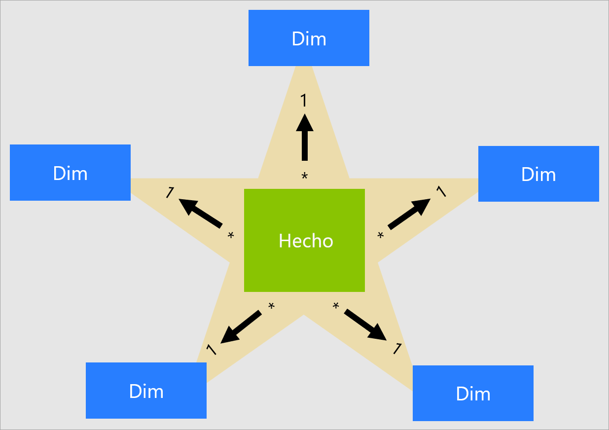
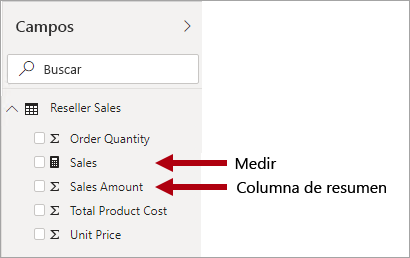
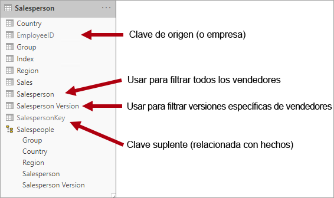
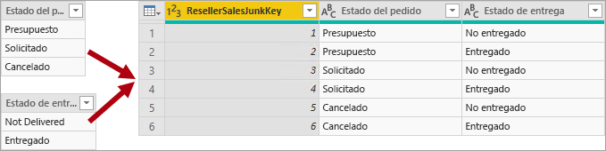
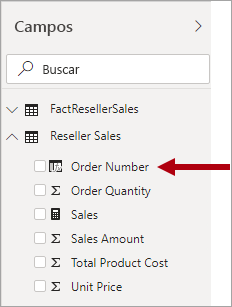

# Descripción de un esquema de estrella e importancia para Power BI

Este artículo va dirigido a los modeladores de datos de Power BI Desktop. En él se describe el diseño de un esquema de estrella y su importancia para desarrollar modelos de datos de Power BI optimizados para el rendimiento y la facilidad de uso.

Este artículo no pretende proporcionar una explicación completa del diseño del esquema de estrella. Para obtener más detalles, vaya directamente el contenido publicado, como **The Data Warehouse Toolkit: The Complete Guide to Dimensional Modeling** (El kit de herramientas del almacenamiento de datos: guía completa del modelado dimensional) (2ª edición, 2002) de Ralph Kimball et al.

## Información general del esquema de estrella

El **esquema de estrella** es un enfoque de modelado maduro ampliamente adoptado por los almacenes de datos relacionales. Requiere que los modeladores clasifiquen las tablas del modelo como _dimensiones_ o _hechos_.

Las **tablas de dimensiones** describen entidades empresariales, las "cosas" que se modelan. Las entidades pueden incluir productos, personas, lugares y conceptos, incluido el propio tiempo. La tabla más coherente de un esquema de estrella es una tabla de dimensiones de fecha. Una tabla de dimensiones contiene una columna (o columnas) de clave que actúa como identificador único y columnas descriptivas.

Las **tablas de hechos** almacenan observaciones o eventos. Pueden ser pedidos de ventas, existencias, tasas de cambio, temperaturas, etc. Una tabla de hechos contiene columnas de clave de dimensiones relacionadas con las tablas de dimensiones y columnas de medida numéricas. Las columnas de clave de dimensiones determinan la _dimensionalidad_ de una tabla de hechos, mientras que los valores de clave de dimensiones determinan la _granularidad_ de una tabla de hechos. Por ejemplo, imagine una tabla de hechos diseñada para almacenar objetivos de ventas que tiene dos columnas de clave de dimensiones **Date** y **ProductKey**. Resulta fácil comprender que la tabla tiene dos dimensiones. Pero la granularidad no se puede determinar sin tener en cuenta los valores de clave de dimensiones. En este ejemplo, imagine que los valores almacenados en la columna **Date** son el primer día de cada mes. En este caso, la granularidad está en el nivel mes-producto.

Normalmente, las tablas de dimensiones contienen un número relativamente pequeño de filas. Por el contrario, las tablas de hechos pueden contener un gran número de filas y seguir creciendo con el tiempo.

## Relevancia del esquema de estrella para los modelos de Power BI

El diseño de esquema de estrella y muchos conceptos relacionados presentados en este artículo son muy importantes para desarrollar modelos de Power BI optimizados para el rendimiento y la facilidad de uso.

Tenga en cuenta que cada objeto visual de informe de Power BI genera una consulta que se envía al modelo de Power BI (lo que el servicio Power BI denomina un conjunto de datos). Estas consultas se usan para filtrar, agrupar y resumir los datos del modelo. Por tanto, un modelo bien diseñado es aquel que proporciona tablas para filtrar y agrupar y tablas para resumir. Esto se ajusta bien a los principios de diseño de los esquemas de estrella:

- Las tablas de dimensiones admiten el _filtrado_ y la _agrupación_
- Las tablas de hechos admiten el _resumen_

Aunque no hay ninguna propiedad de tabla que los modeladores establezcan para configurar el tipo de tabla (dimensiones o hechos), este viene determinado por las relaciones del modelo. Una relación de modelo establece una ruta de propagación de filtros entre dos tablas, mientras que la propiedad **Cardinalidad** de la relación es la que determina el tipo de tabla. Una cardinalidad de relación común es "uno a varios" o su inversa "varios a uno". El "uno" es siempre una tabla de tipo de dimensiones, mientras que el "varios" siempre es una tabla de tipo de hechos.

Un diseño de modelo bien estructurado debe incluir tablas de tipo de dimensiones o de tipo de hechos. Debe evitar mezclar los dos tipos en una sola tabla. También se recomienda intentar ofrecer el número correcto de tablas con las relaciones adecuadas aplicadas. Además, es importante que las tablas de tipo de hechos siempre carguen datos en un nivel de detalle coherente.

Por último, es importante entender que un diseño óptimo del modelo es en parte ciencia y en parte arte. A veces, puede interrumpir con buena orientación cuando tenga sentido hacerlo.

Hay muchos conceptos adicionales relacionados con el diseño de esquemas de estrella que se pueden aplicar a un modelo de Power BI. Estas incluyen:

- [Medidas](#measures)
- [Claves suplentes](#surrogate-keys)
- [Dimensiones de copo de nieve](#snowflake-dimensions)
- [Dimensiones realizadoras de roles](#role-playing-dimensions)
- [Dimensiones de variación lenta](#slowly-changing-dimensions)
- [Dimensiones no deseadas](#junk-dimensions)
- [Dimensiones degeneradas](#degenerate-dimensions)
- [Tablas de hechos sin hechos](#factless-fact-tables)

## Medidas

En el diseño de esquemas de estrella, una **medida** es una columna de tabla de hechos que almacena valores que se van a resumir.

En un modelo de Power BI, una **medida** tiene otra definición, aunque similar. Es una fórmula escrita en [Expresiones de análisis de datos (DAX)](https://docs.microsoft.com/dax/data-analysis-expressions-dax-reference) que permite resumir. Las expresiones de medida suelen aprovechar funciones de agregación de DAX como SUM, MIN, MAX, AVERAGE, etc. para generar un resultado de valor escalar en tiempo de consulta (los valores nunca se almacenan en el modelo). La expresión de medida puede abarcar desde agregaciones de columnas simples hasta fórmulas más sofisticadas que invalidan las propagaciones de contexto o de relación de filtrado. Para obtener más información, lea el artículo [Aspectos básicos de DAX en Power BI Desktop](https://docs.microsoft.com/power-bi/desktop-quickstart-learn-dax-basics).

Es importante comprender que los modelos de Power BI admiten un segundo método para lograr el resumen. Cualquier columna (y, normalmente, las columnas numéricas) se puede resumir mediante un informe visual o Preguntas y respuestas. Esto resulta cómodo para el desarrollador de modelos, ya que en muchas instancias no es necesario crear medidas. Por ejemplo, la columna de ventas **Importe de venta** del distribuidor Adventure Works podría resumirse de varias maneras (suma, recuento, media, mediana, mín., máx., etc.), sin necesidad de crear una medida para cada tipo de agregación posible.

Pero hay dos razones de peso para crear medidas, incluso para resúmenes simples de nivel de columna:

- Si sabe que los autores de informes van a consultar el modelo mediante [Expresiones multidimensionales (MDX)](https://docs.microsoft.com/sql/analysis-services/multidimensional-models/mdx/mdx-query-the-basic-query?view=sql-server-2017), el modelo debe incluir medidas. MDX no puede lograr un resumen de valores de columna. Esto es muy importante cuando un conjunto de datos de Power BI se consulta mediante MDX, y es lo que ocurre cuando se usa [Analizar en Excel](https://docs.microsoft.com/power-bi/service-analyze-in-excel) (las tablas dinámicas emiten consultas MDX).
- Si necesita asegurarse de que los autores de informes solo puedan resumir columnas de determinadas maneras. Por ejemplo, la columna de ventas **Precio unitario** del distribuidor (que representa una tarifa por unidad) se puede resumir, pero solo mediante funciones de agregación específicas. Nunca se debe sumar, pero es adecuado resumir mediante otras funciones de agregación (mín., máx., media, etc.). En esta instancia, el modelador puede ocultar la columna **Precio unitario** y crear medidas para todas las funciones de agregación apropiadas.

Tenga en cuenta que este enfoque de diseño funciona bien con los informes creados en el servicio Power BI y con Preguntas y respuestas. Pero las conexiones dinámicas de Power BI Desktop permiten a los autores de informes mostrar los campos ocultos del panel **Campos**, lo que puede dar lugar a la elusión de este enfoque de diseño.

## Claves suplentes

Una **clave suplente** es un identificador único que se agrega a una tabla para admitir el modelado de esquemas de estrella. Por definición, no se define ni se almacena en los datos de origen. Normalmente, las claves suplentes se agregan a las tablas de dimensiones del almacén de datos relacionales para proporcionar un identificador único para cada fila de la tabla de dimensiones.

Las relaciones del modelo de Power BI se basan en una sola columna única de una tabla, que propaga los filtros a una sola columna de otra tabla. Cuando una tabla de tipo de dimensiones del modelo no incluye una sola columna única, debe agregar un identificador único para que se convierta en el "uno" de una relación. En Power BI Desktop, puede lograrlo fácilmente si crea una [columna de índice de Power Query](https://docs.microsoft.com/powerquery-m/table-addindexcolumn).

Debe combinar esta consulta con la consulta "varios" para poder agregarle también la columna de índice. Al cargar estas consultas en el modelo, puede crear una relación uno a varios entre las tablas del modelo.

## Dimensiones de copo de nieve

Una **dimensión de copo de nieve** es un conjunto de tablas normalizadas para una sola entidad de negocio. Por ejemplo, Adventure Works clasifica los productos por categoría y subcategoría. Las categorías se asignan a subcategorías y, a su vez, los productos se asignan a subcategorías. En el almacén de datos relacionales de Adventure Works, la dimensión de producto se normaliza y se almacena en tres tablas relacionadas: **DimProductCategory**, **DimProductSubcategory** y **DimProduct**.

Si usa su imaginación, puede imaginarse las tablas normalizadas colocadas hacia fuera de la tabla de hechos, formando un diseño de copo de nieve.

En Power BI Desktop, puede optar por imitar un diseño de dimensiones de copo de nieve (quizás porque los datos de origen lo hacen) o integrar (desnormalizar) las tablas de origen en una sola tabla del modelo. Por lo general, las ventajas de una sola tabla del modelo compensan las ventajas de varias tablas del modelo. La decisión óptima puede depender de los volúmenes de datos y de los requisitos de facilidad de uso del modelo.

Si elige imitar un diseño de dimensiones de copo de nieve:

- Power BI carga más tablas, lo que resulta menos eficaz desde el punto del vista del almacenamiento y el rendimiento. Estas tablas deben incluir columnas para admitir las relaciones del modelo, y esto puede dar lugar a un mayor tamaño del modelo.
- Las cadenas de propagación de filtros de relaciones más largas deben ser transversales, lo que probablemente sea menos eficaz que la aplicación de filtros a una sola tabla.
- El panel **Campos** presenta más tablas del modelo a los autores de informes, lo que puede dar lugar a una experiencia menos intuitiva, especialmente si las tablas de dimensiones de copo de nieve contienen solo una o dos columnas.
- No es posible crear una jerarquía que abarque las tablas.

Si elige integrar en una sola tabla del modelo, además puede definir una jerarquía que abarque el mayor y menor nivel de detalle de la dimensión. Posiblemente, el almacenamiento de datos desnormalizados redundantes pueda dar lugar a un mayor tamaño de almacenamiento del modelo, especialmente en el caso de tablas de dimensiones muy grandes.

## Dimensiones de variación lenta

Una **dimensión de variación lenta** (SCD) es aquella que administra correctamente el cambio de los miembros de la dimensión a lo largo del tiempo. Se aplica cuando los valores de la entidad empresarial cambian con el tiempo y de forma ad hoc. Un buen ejemplo de dimensión de variación _lenta_ es una dimensión de cliente, concretamente sus columnas de detalles de contacto, como la dirección de correo electrónico y el número de teléfono. Por el contrario, algunas dimensiones se consideran de variación _rápida_ si un atributo de dimensión cambia con frecuencia, como el precio de mercado de un artículo. El enfoque de diseño común en estas instancias es almacenar los valores de atributo de variación rápida en una medida de tabla de hechos.

La teoría de diseño de esquemas de estrella hace referencia a dos tipos de SCD comunes: Tipo 1 y tipo 2. Una tabla de tipo de dimensiones puede ser de tipo 1 o de tipo 2, o admitir ambos tipos simultáneamente para columnas diferentes.

### SCD de tipo 1

Una **SCD** de **tipo 1** siempre refleja los valores más recientes y, cuando se detectan cambios en los datos de origen, los datos de la tabla de dimensiones simplemente se sobrescriben. Este enfoque de diseño es común para las columnas que almacenan valores auxiliares, como la dirección de correo electrónico o el número de teléfono de un cliente. Cuando cambia la dirección de correo electrónico o el número de teléfono de un cliente, la tabla de dimensiones actualiza la fila del cliente con los nuevos valores. Es como si el cliente tuviera siempre esta información de contacto.

Una actualización no incremental de una tabla de tipo de dimensiones del modelo de Power BI logra el resultado de una SCD de tipo 1. Actualiza los datos de la tabla para garantizar que se carguen los valores más recientes.

### SCD de tipo 2

Una **SCD** de **tipo 2** admite el control de versiones de los miembros de la dimensión. Si el sistema de origen no almacena versiones, suele ser el proceso de carga de almacenamiento de datos el que detecta los cambios y administra de forma adecuada el cambio en una tabla de dimensiones. En este caso, la tabla de dimensiones debe usar una clave suplente para proporcionar una referencia única a una _versión_ del miembro de la dimensión. También incluye columnas que definen la validez del intervalo de fechas de la versión (por ejemplo, **StartDate** y **EndDate**) y, posiblemente, una columna de marca (por ejemplo, **IsCurrent**) para filtrar fácilmente por miembros de la dimensión actuales.

Por ejemplo, Adventure Works asigna vendedores a una región de ventas. Cuando un vendedor se reasigna a otra región, debe crearse una nueva versión del vendedor para asegurarse de que los hechos históricos sigan asociados a la región anterior. Para admitir un análisis histórico preciso de ventas por vendedor, la tabla de dimensiones debe almacenar versiones de vendedores y sus regiones asociadas. La tabla también debe incluir valores de fecha de inicio y finalización para definir la validez temporal. Las versiones actuales pueden definir una fecha de finalización vacía (o 31/12/9999), lo que indica que la fila es la versión actual. La tabla también debe definir una clave suplente, ya que la clave empresarial (en esta instancia, Id. de empleado) no es única.

Es importante comprender que si los datos de origen no almacenan versiones, debe usar un sistema intermedio (como un almacenamiento de datos) para detectar y almacenar los cambios. El proceso de carga de la tabla debe conservar los datos existentes y detectar los cambios. Cuando se detecta un cambio, el proceso de carga de la tabla debe hacer que expire la versión actual. Para ello, actualiza el valor **EndDate** e inserta una nueva versión con el valor **StartDate** que comienza a partir del valor **EndDate** anterior. Además, los hechos relacionados deben usar una búsqueda basada en tiempo para recuperar el valor de clave de dimensión pertinente para la fecha de los hechos. Un modelo de Power BI con Power Query no puede lograrlo. Pero puede cargar datos de una tabla de dimensiones SCD de tipo 2 previamente cargada.

El modelo de Power BI debe admitir la consulta de datos históricos de un miembro, independientemente del cambio, y de una versión del miembro, que representa un estado determinado del miembro en el tiempo. En el contexto de Adventure Works, esto permite consultar el vendedor independientemente de la región de ventas asignada, o una versión determinada del vendedor.

Para ello, la tabla de tipo de dimensiones del modelo de Power BI debe incluir una columna para filtrar el vendedor y otra para filtrar una versión específica del vendedor. Es importante que la columna de versión proporcione una descripción no ambigua, como "Michael Blythe (15/12/2008-26/06/2019)" o "Michael Blythe (actual)". También es importante educar a los autores y usuarios de informes sobre los aspectos básicos de la SCD de tipo 2 y cómo lograr diseños de informe adecuados mediante la aplicación de los filtros correctos.

También es un buen procedimiento de diseño incluir una jerarquía que permita a los objetos visuales obtener detalles hasta el nivel de versión.

## Dimensiones realizadoras de roles

Una **dimensión realizadora de roles** es una dimensión que puede filtrar datos relacionados de manera diferente. Por ejemplo, en Adventure Works, la tabla de dimensiones de fecha tiene tres relaciones con los hechos de ventas del distribuidor. Se puede usar la misma tabla de dimensiones para filtrar los hechos por fecha de pedido, fecha de envío o fecha de entrega.

En un almacenamiento de datos, el enfoque de diseño aceptado es definir una sola tabla de dimensiones de fecha. En tiempo de consulta, el "rol" de la dimensión de fecha se establece mediante la columna de hechos que se usa para combinar las tablas. Por ejemplo, al analizar las ventas por fecha de pedido, la combinación de tabla se relaciona con la columna de fecha de pedido de ventas del distribuidor.

En un modelo de Power BI, este diseño se puede imitar al crear varias relaciones entre dos tablas. En el ejemplo de Adventure Works, las tablas de fecha y ventas del distribuidor tendrían tres relaciones. Aunque esto es posible, es importante entender que solo puede haber una relación activa entre dos tablas del modelo de Power BI. Todas las demás relaciones se deben establecer en inactivas. El tener una única relación activa significa que hay una propagación de filtros predeterminada desde fecha a ventas del distribuidor. En esta instancia, la relación activa se establece en el filtro más común que usan los informes, que en Adventure Works es la relación de fecha de pedido.

La única forma de usar una relación inactiva es definir una expresión DAX que use la [función USERELATIONSHIP](https://docs.microsoft.com/dax/userelationship-function-dax). En el ejemplo, el desarrollador del modelo debe crear medidas para habilitar el análisis de las ventas del distribuidor por fecha de envío y fecha de entrega. Esto puede resultar tedioso, sobre todo si la tabla del distribuidor define muchas medidas. También crea aglomeración en el panel **Campos**, con una gran cantidad de medidas. También hay otras limitaciones:

- Si los autores de informes se basan en el resumen de columnas, en lugar de la definición de medidas, no pueden conseguir un resumen de las relaciones inactivas sin escribir una medida de nivel de informe. Las medidas de nivel de informe solo se pueden definir al crear informes en Power BI Desktop.
- Con solo una ruta de relación activa entre la fecha y las ventas del distribuidor, no es posible filtrar simultáneamente las ventas del distribuidor por diferentes tipos de fechas. Por ejemplo, no se puede generar un objeto visual que trace las ventas de fecha de pedido por ventas enviadas.

Para superar estas limitaciones, una técnica de modelado común de Power BI es crear una tabla de tipo de dimensiones para cada instancia realizadora de roles. Normalmente, las tablas de dimensiones adicionales se crean como [tablas calculadas](https://docs.microsoft.com/dax/calculatetable-function-dax) mediante DAX. Con las tablas calculadas, el modelo puede contener una tabla de **fecha**, una tabla de **fecha de envío** y una tabla de **fecha de entrega**, cada una con una relación única y activa con sus columnas respectivas de la tabla de ventas del distribuidor.

Este enfoque de diseño no requiere la definición de varias medidas para los distintos roles de fecha y permite el filtrado simultáneo mediante diferentes roles de fecha. Pero un precio menor que se paga con este enfoque de diseño es que existe duplicación de la tabla de dimensiones de fecha que da lugar a un mayor tamaño de almacenamiento del modelo. Dado que las tablas de tipo de dimensiones suelen almacenar menos filas que las tablas de tipo de hechos, esto no suele ser un problema.

Observe los siguientes procedimientos recomendados de diseño al crear tablas de tipo de dimensiones del modelo para cada rol:

- Asegúrese de que los nombres de columna sean autodescriptivos. Aunque es posible tener una columna **Año** en todas las tablas de fecha (los nombres de columna son únicos en su tabla), no se describe automáticamente mediante títulos visuales predeterminados. Considere la posibilidad de cambiar el nombre de las columnas de cada tabla de roles de dimensiones, de modo que la tabla de **fecha de envío** tenga una columna de año denominada **Año de envío**, etc.
- Cuando proceda, asegúrese de que las descripciones de la tabla proporcionen comentarios a los autores de informes (mediante la información sobre herramientas del panel **Campos**) sobre cómo se configura la propagación de filtros. Esta claridad es importante cuando el modelo contiene una tabla con nombre genérico, como **Fecha**, que se usa para filtrar muchas tablas de tipo de hechos. En el caso de que esta tabla tenga, por ejemplo, una relación activa con la columna de fecha de pedido de ventas del distribuidor, considere la posibilidad de proporcionar una descripción de la tabla como "Filtra las ventas del distribuidor por fecha de pedido".

## Dimensiones no deseadas

Una **dimensión no deseada** es útil cuando hay muchas dimensiones, especialmente si constan de pocos atributos (quizás uno) y si estos atributos tienen pocos valores. Los buenos candidatos incluyen columnas de estado de pedido o columnas demográficas de clientes (sexo, grupo de edad, etc.).

El objetivo de diseño de una dimensión no deseada es consolidar muchas dimensiones "pequeñas" en una sola dimensión a fin de reducir el tamaño de almacenamiento del modelo y, además, minimizar la aglomeración del panel **Campos** mediante la exposición de menos tablas del modelo.

Una tabla de dimensiones no deseadas es normalmente el producto cartesiano de todos los miembros de atributos de dimensiones, con una columna de clave suplente. La clave suplente proporciona una referencia única a cada fila de la tabla. Puede compilar la dimensión en un almacenamiento de datos o al usar Power Query para crear una consulta que realice [combinaciones de consulta externas completas](https://docs.microsoft.com/powerquery-m/table-join) y luego agregue una clave suplente (columna de índice).

Esta consulta se carga en el modelo como una tabla de tipo de dimensiones. También debe combinar esta consulta con la consulta de hechos, por lo que la columna de índice se carga en el modelo para admitir la creación de una relación de modelo "uno a varios".

## Dimensiones degeneradas

Una **dimensión degenerada** hace referencia a un atributo de la tabla de hechos necesario para el filtrado. En Adventure Works, el número de pedido de ventas del distribuidor es un buen ejemplo. En este caso, no tiene sentido diseñar un modelo para crear una tabla independiente que solo conste de esta columna, porque aumentaría el tamaño de almacenamiento del modelo y la aglomeración del panel **Campos**.

En el modelo de Power BI, puede ser adecuado agregar la columna de número de pedido de ventas a la tabla de tipo de hechos para permitir el filtrado o la agrupación por número de pedido de ventas. Esta es una excepción a la regla presentada anteriormente de que no se deben mezclar tipos de tabla (es decir, por lo general, las tablas del modelo deben ser de tipo de dimensiones o de tipo de hechos).

## Tablas de hechos sin hechos

Una tabla de **hechos sin hechos** no incluye ninguna columna de medida. Solo contiene claves de dimensión.

Una tabla de hechos sin hechos podría almacenar observaciones definidas por claves de dimensión. Por ejemplo, en una fecha y hora determinadas, un cliente concreto ha iniciado sesión en el sitio web. Puede definir una medida para contar las filas de la tabla de hechos sin hechos a fin de realizar un análisis de cuántos clientes han iniciado sesión y cuándo lo han hecho.

Un uso más atractivo de una tabla de hechos sin hechos es almacenar relaciones entre dimensiones, y es el enfoque de diseño de modelos de Power BI que se recomienda para definir relaciones de dimensión de varios a varios. En un diseño de relaciones de dimensión de varios a varios, la tabla de hechos sin hechos se conoce como _tabla de puente_.

Por ejemplo, imagine que los vendedores pueden asignarse a una _o más_ regiones de ventas. La tabla de puente se diseñaría como una tabla de hechos sin hechos de dos columnas: clave de vendedor y clave de región. Los valores duplicados se pueden almacenar en ambas columnas.

Este enfoque de diseño de varios a varios está bien documentado y se puede lograr sin una tabla de puente. Pero el enfoque de tabla de puente se considera el procedimiento recomendado al relacionar dos dimensiones. Para obtener más detalles, vea [Relaciones con una cardinalidad de varios a varios en Power BI Desktop](https://docs.microsoft.com/power-bi/desktop-many-to-many-relationships).

## Pasos siguientes

Para obtener más información sobre el diseño de esquemas de estrella o el diseño del modelo de Power BI, vea los siguientes artículos:

- [Artículo de la Wikipedia sobre el modelado dimensional](https://go.microsoft.com/fwlink/p/?linkid=246459)
- [Crear y administrar relaciones en Power BI Desktop](https://docs.microsoft.com/power-bi/desktop-create-and-manage-relationships)
- [Relaciones con una cardinalidad de varios a varios en Power BI Desktop](https://docs.microsoft.com/power-bi/desktop-many-to-many-relationships)
- [Experiencia de aprendizaje guiada de modelado](https://docs.microsoft.com/power-bi/guided-learning/modeling)