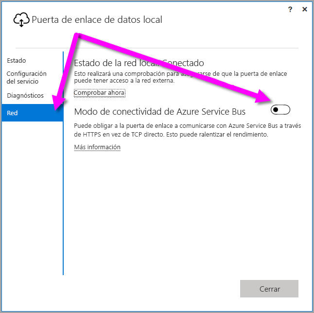
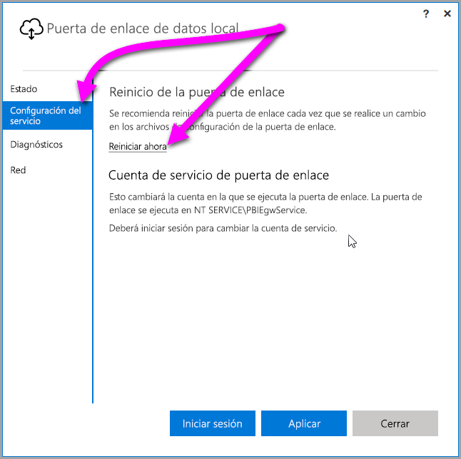

## <a name="sign-in-account"></a>Cuenta de inicio de sesión

Los usuarios inician sesión con una cuenta profesional o educativa. Esta cuenta es la **cuenta de la organización**. Si se suscribió a una oferta de Office 365 y no proporcionó la dirección de correo profesional real, se podría parecer a nancy@contoso.onmicrosoft.com. La cuenta se almacena en un inquilino de Azure Active Directory (AAD). En la mayoría de los casos, el UPN de la cuenta AAD coincidirá con la dirección de correo.

## <a name="windows-service-account"></a>Cuenta de servicio de Windows

La puerta de enlace de datos local está configurada para usar *NT SERVICE\PBIEgwService* para las credenciales de inicio de sesión del servicio de Windows. De forma predeterminada, tiene el derecho a iniciar como servicio, en el contexto de la máquina que va a instalar la puerta de enlace. La cuenta no es la misma cuenta que se usa para conectarse a orígenes de datos locales. La cuenta tampoco es la cuenta profesional o educativa con la que inicia sesión en servicios en la nube.

> [!NOTE]
> Si ha seleccionado el modo personal, configure la cuenta de servicio de Windows por separado.

Si tiene problemas de autenticación con el servidor proxy, pruebe a cambiar la cuenta de servicio de Windows por un usuario de dominio o una cuenta de servicio administrada. Para más información, consulte [Configuración de proxy](../service-gateway-proxy.md#changing-the-gateway-service-account-to-a-domain-user).

## <a name="ports"></a>Puertos

La puerta de enlace crea una conexión de salida a Azure Service Bus. Se comunica en los puertos de salida: TCP 443 (predeterminado), 5671, 5672 y de 9350 a 9354.  La puerta de enlace no requiere puertos de entrada.

Se recomienda añadir a la lista de permitidos de su firewall las direcciones IP de su región de datos. Puede descargar la [lista de direcciones IP de los centros de datos de Microsoft Azure](https://www.microsoft.com/download/details.aspx?id=41653), que se actualiza semanalmente. La puerta de enlace usará la dirección IP junto con el nombre de dominio completo (FQDN) para comunicarse con Azure Service Bus. Si fuerza a la puerta de enlace a comunicarse mediante HTTPS, usará estrictamente solo FQDN y no se producirá ninguna comunicación mediante direcciones IP.

> [!NOTE]
> Las direcciones IP que se muestran en la lista de direcciones IP del Centro de datos de Azure están en la notación CIDR. Por ejemplo, 10.0.0.0/24 no significa “de 10.0.0.0 a de 10.0.0.24”. Obtenga más información sobre la [notación CIDR](http://whatismyipaddress.com/cidr).

Aquí se muestra una lista de los nombres de dominio completos utilizados por la puerta de enlace.

| Nombres de dominio | Puertos de salida | Descripción |
| --- | --- | --- |
| *.download.microsoft.com |80 |HTTP usado para descargar al instalador. |
| *.powerbi.com |443 |HTTPS |
| *.analysis.windows.net |443 |HTTPS |
| *.login.windows.net |443 |HTTPS |
| *.servicebus.windows.net |5671-5672 |Advanced Message Queuing Protocol (AMQP) |
| *.servicebus.windows.net |443, 9350-9354 |Escuchas en Service Bus Relay sobre TCP (requiere el puerto 443 para la adquisición de tokens de Access Control) |
| *.frontend.clouddatahub.net |443 |HTTPS |
| *.core.windows.net |443 |HTTPS |
| login.microsoftonline.com |443 |HTTPS |
| *.msftncsi.com |443 |Se utiliza para probar la conectividad con Internet si el servicio Power BI no puede alcanzar la puerta de enlace. |
| *.microsoftonline-p.com |443 |Se utiliza para realizar la autenticación en función de la configuración. |

> [!NOTE]
> El tráfico que va a visualstudio.com o visualstudioonline.com es de información de la aplicación y no es necesaria para que funcione la puerta de enlace.

## <a name="forcing-https-communication-with-azure-service-bus"></a>Forzar la comunicación HTTPS con Azure Service Bus

Puede obligar a la puerta de enlace a comunicarse con Azure Service Bus a través de HTTPS en vez de TCP directo. El uso de HTTPS puede afectar al rendimiento. Para ello, modifique el archivo *Microsoft.PowerBI.DataMovement.Pipeline.GatewayCore.dll.config*, para lo que debe cambiar el valor de `AutoDetect` a `Https`, como se muestra en el fragmento de código que se encuentra inmediatamente después de este párrafo. Este archivo se encuentra, de forma predeterminada, en *C:\Archivos de programa\On-premises data gateway*.

```
<setting name="ServiceBusSystemConnectivityModeString" serializeAs="String">
    <value>Https</value>
</setting>
```

El valor del parámetro *ServiceBusSystemConnectivityModeString* distingue mayúsculas de minúsculas. Los valores válidos son *AutoDetect* y *Https*.

Como alternativa, puede forzar a la puerta de enlace a adoptar este comportamiento mediante la interfaz de usuario de la puerta de enlace. En la interfaz de usuario de la puerta de enlace, seleccione **Red** y cambie **Modo de conectividad de Azure Service Bus** a **Activado**.



Una vez cambiado, al seleccionar **Aplicar** (un botón solo aparece cuando se realiza un cambio), el *servicio de puerta de enlace Windows* se reinicia automáticamente, por lo que el cambio puede surtir efecto.

Para referencias futuras puede reiniciar el servicio de *puerta de enlace de Windows* desde el mismo cuadro de diálogo de la interfaz de usuario si selecciona **Configuración del servicio** y *Reiniciar ahora*.



## <a name="support-for-tls-12"></a>Compatibilidad con TLS 1.2

De forma predeterminada, la puerta de enlace de datos local usa la seguridad de capa de transporte (TLS) 1.2 para comunicarse con el servicio Power BI. Para asegurarse de que todo el tráfico de puerta de enlace usa TLS 1.2, es posible que deba agregar o modificar las siguientes claves del Registro en la máquina que ejecuta el servicio de puerta de enlace:

```
[HKEY_LOCAL_MACHINE\SOFTWARE\Microsoft\.NETFramework\v4.0.30319]"SchUseStrongCrypto"=dword:00000001
[HKEY_LOCAL_MACHINE\SOFTWARE\Wow6432Node\Microsoft\.NETFramework\v4.0.30319]"SchUseStrongCrypto"=dword:00000001
```

> [!NOTE]
> Agregar o modificar estas claves de registro permite aplicar el cambio a todas las aplicaciones. NET. Para más información acerca de los cambios del registro que afectan a TLS para otras aplicaciones, consulte [Configuración del registro de seguridad de la capa (TLS) de transporte](https://docs.microsoft.com/windows-server/security/tls/tls-registry-settings).

## <a name="how-to-restart-the-gateway"></a>Cómo reiniciar la puerta de enlace

La puerta de enlace se ejecuta como servicio de Windows. Se puede iniciar y detener como cualquier servicio de Windows. Así es cómo se puede hacer desde el símbolo del sistema.

1. En el equipo en el que se ejecuta la puerta de enlace, inicie un símbolo de sistema con permisos de administrador.
2. Use el siguiente comando para detener el servicio.
   
   net stop PBIEgwService
3. Use el siguiente comando para iniciar el servicio.
   
   net start PBIEgwService

