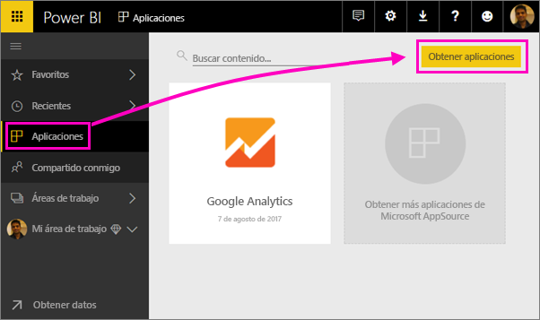
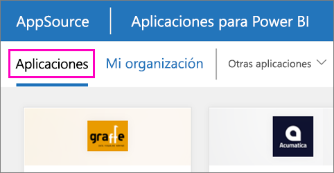

1. Seleccione **Aplicaciones** en el panel de navegación izquierdo > seleccione **Obtener aplicaciones** en la esquina superior derecha.
   
     
2. En AppSource, seleccione la pestaña **Aplicaciones** y busque el servicio que desea.
   
    

